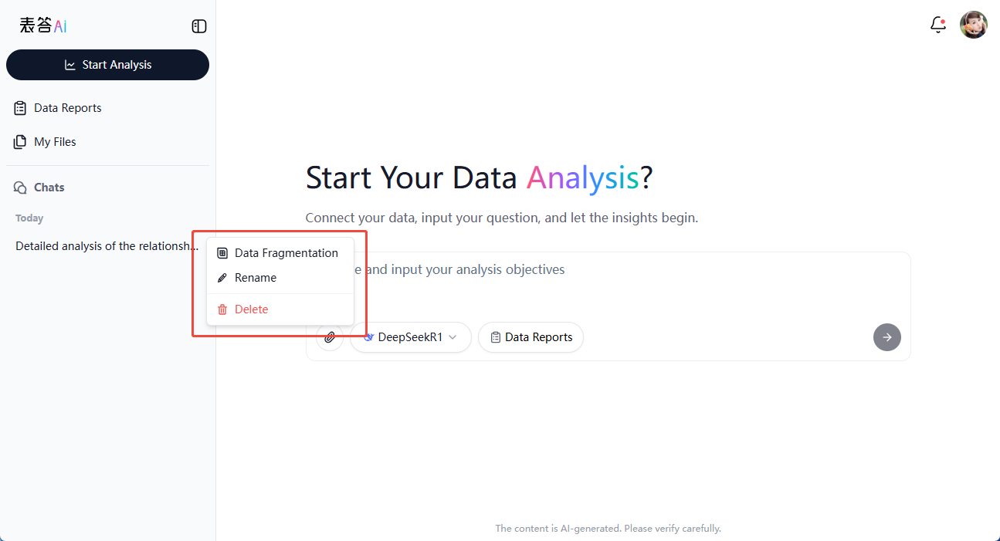

# Chat Management

When performing data analysis using Univer AI, users often need to engage in multiple conversations, review chat history, and switch or delete chats. The chat management feature helps you better organize and track your conversations. You can create new chats, view historical chats, rename or delete chats, and quickly jump to documents associated with current chats, improving your productivity.

## Feature Overview

The chat management features include:

- **Create New Chats**: Start a new chat anytime for fresh data analysis or discussion.
- **View Chat History**: Access past chats in the sidebar, with options to collapse or expand for easier navigation.
- **Jump to Associated Documents**: Quickly access Excel/CSV documents or Univer Sheets tied to specific historical chats.
- **Rename & Delete**: Rename chats for clarity or delete unnecessary chats along with their associated documents.

These features provide a flexible and efficient conversation management experience within Univer AI.

## Creating a New Chat

To start a new analysis or conversation with a new data source, you can create a chat through this method:

**Sidebar Creation**
- Open the sidebar and click on **"New Chat"** to initiate a new chat.
- The system automatically opens the chat interface for the new chat, where all subsequent interactions are saved.

> **Tip**: Creating new chats helps keep analysis clear and organized by separating different topics or data sets.

## Viewing Chat History

### Collapsing and Expanding Sidebar

- Collapse the sidebar to maximize workspace and focus on the current conversation.
- Expand the sidebar whenever you need to switch chats or review historical chats by clicking the collapse/expand button.

### Historical Chat List

- Upon expanding the sidebar, you will see the **Historical Chat List** ordered chronologically.
- Click on a chat title to view the corresponding conversation, context, and analysis results.

### Jumping to the Sheet Linked to the Current Conversation

- If a historical chat was linked to a Univer Sheet (for example, an analyzed Excel file), click the "More" button next to the chat name and select **"Sheets"** from the dropdown.
- This opens a dialog displaying all Univer Sheets from that conversation:
  - Click sheet names to jump directly to the chat displaying the sheet.
  - Download Univer Sheets.
  - Share Univer Sheets.

|Dropdown Univer Sheets|View all sheets in the chat|
|---|---|
||

## Managing Chats

### Rename Chats

- For clarity, rename chats if there are too many or their names are not descriptive enough.
- Locate the target chat in the historical chat list, click the "more" button next to it, and select **"Rename"**.

## Delete Chats

- To remove a chat, first ensure there is no critical data stored within the chat or associated documents.
- In the historical chat list, locate the target chat, click the more button, and select **"Delete"** to confirm removal.

> **Note**: Deletion is irreversible. All chat data and associated documents are permanently removed and cannot be recovered.

## FAQs

**1. Why can't I load chat history?**
- If your account has logged out or the network is unstable, chat history may fail to load. Ensure you're logged in and have stable internet connectivity.

**2. Can deleted chats be recovered?**
- Currently, deleted chats and associated documents are permanently removed and cannot be recovered. Always verify before deletion.

**3. How can I effectively organize chats?**
- Use meaningful chat names, such as "Customer Survey - Follow-up Plan" or "Sales Analysis - January 2025".
- Regularly review and delete irrelevant chats to keep your chat list concise.

Effectively utilizing chat management enables efficient organization and quick retrieval of your analytical tasks in [Univer AI](https://insight.univer.ai/).
