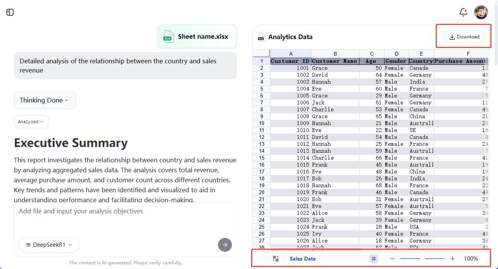

# File Preview

## Overview

Univer AI provides a powerful **File Preview** feature that helps you quickly view and analyze uploaded Excel or CSV data directly within your chat session. By automatically importing files into a **Univer Sheet**, you can easily switch between sheets, select cells, share data, and export results directly in the conversation window, greatly enhancing your data processing efficiency.

**Core Advantages:**  
- **One-click Import**: Excel files are automatically parsed and converted into Univer Sheets upon upload.  
- **Real-time Preview**: Preview spreadsheets directly within the chat window.  
- **Efficient Collaboration**: Supports easy sharing and downloading, simplifying team collaboration.  

## Upload Excel and Auto-import

To upload an Excel file within the [Univer AI](https://insight.univer.ai/) chat interface, follow these steps:

1. **Click the "＋" button**: Located at the bottom left corner of the chat input box, clicking this icon will open the upload menu.
2. **Select File**: Choose the Excel or CSV file from your local computer.
3. **Auto-parsing**: The system automatically parses the file, highlights its content, and creates a Univer Sheet displayed in the chat window.

Once uploaded, you will see a preview thumbnail in the chat bubble and a toolbar above it for further actions.

## Univer Sheet Binding with Current Session

Once an Excel file is uploaded and parsed into a Univer Sheet, the sheet becomes **exclusively bound** to your current chat session:

- **Single File, Multiple Uses**: You can repeatedly analyze the data without needing to upload again within the same session.
- **Independent Session Space**: When creating a new session, you can upload new files or continue working with previously uploaded ones.
- **Persistent Records**: As long as the session isn't deleted, the Univer Sheet content remains available, allowing you to revisit and re-analyze your data anytime.

## Preview Functionality Explained

After successful parsing, you'll see a preview interface similar to the image below in your chat window, equipped with various features to help you quickly navigate and analyze data.

### Cell Selection

- Use your **mouse** or **drag gestures** to select and highlight cells within the preview area for focused analysis.

### Download as Excel

- After analyzing your data, you can export the current worksheet as an Excel file at any time.
- Clicking the **"Download"** button packages the data into a `.xlsx` file, which is saved locally for archiving or offline viewing.

### Switch Sheets

- Excel files often contain multiple worksheets (Sheets).
- You can swiftly switch between sheets using the **Sheet list** at the bottom of the preview area.
- Selecting a different sheet updates the preview area instantly, displaying its content.

## FAQs

- **How does Univer AI handle large spreadsheets?**  
  Univer AI employs a high-performance parsing engine capable of handling spreadsheets with tens of thousands of rows. Extremely large files may require additional waiting time or splitting into smaller files for optimal performance.

## Try It Out!

That's it! Head over to [Univer AI](https://insight.univer.ai/) to experience the intelligent file preview and data analysis capabilities yourself. Upload your Excel data now to explore a new, smart way to preview and analyze your data effortlessly.
