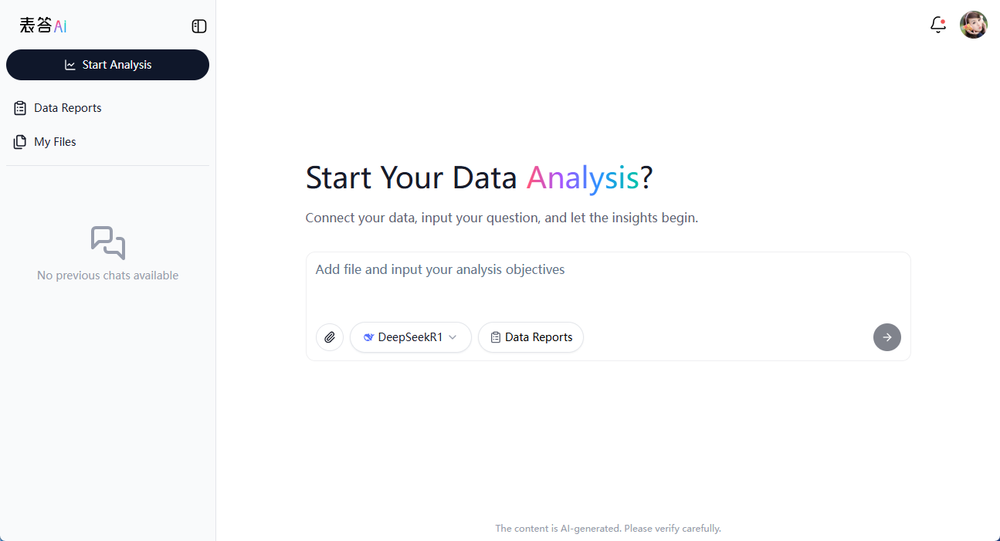
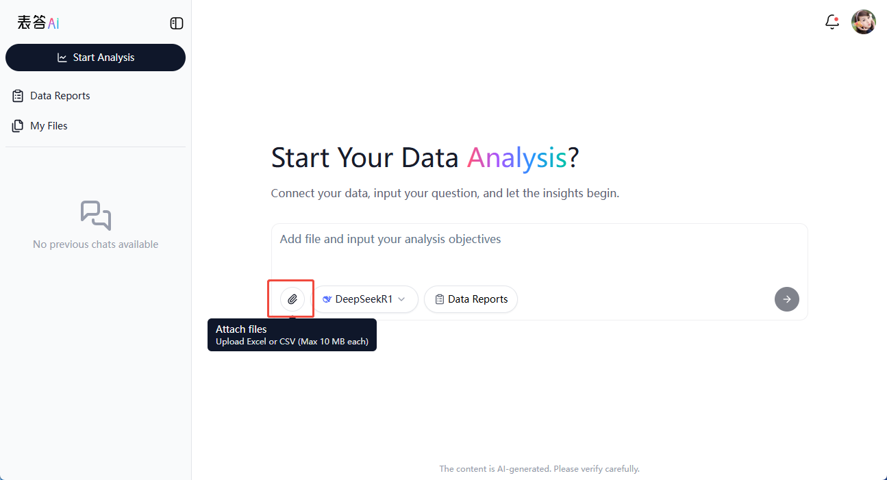
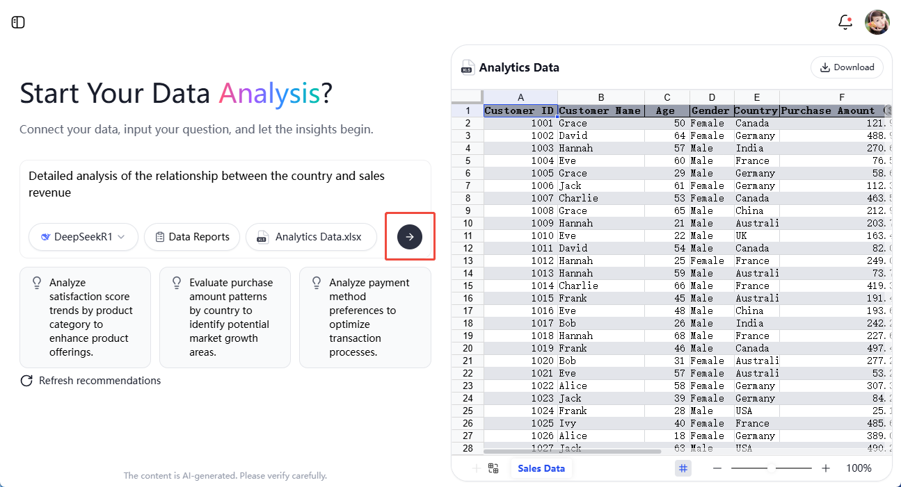
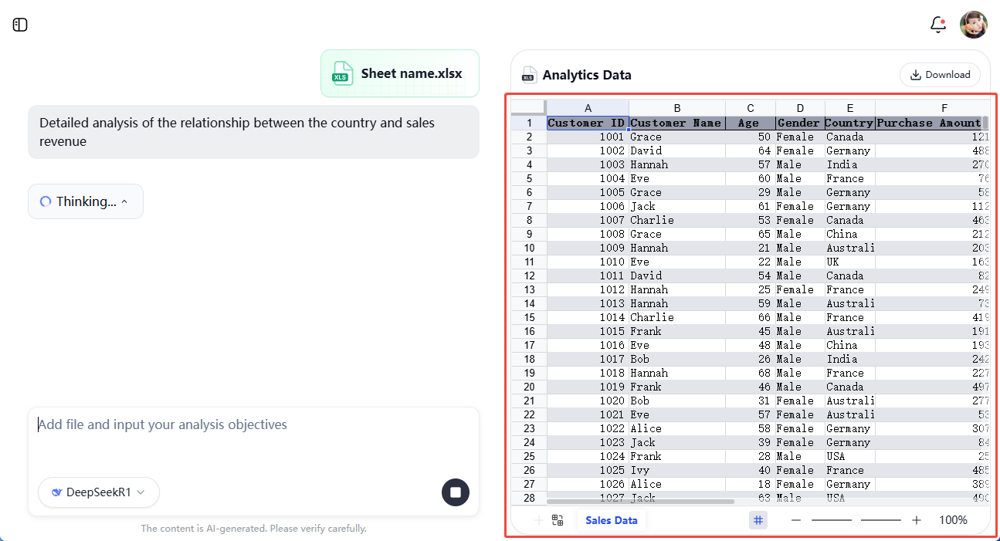
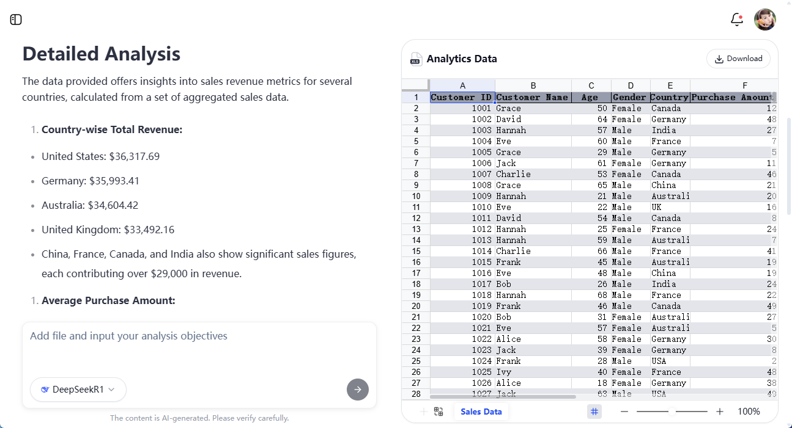
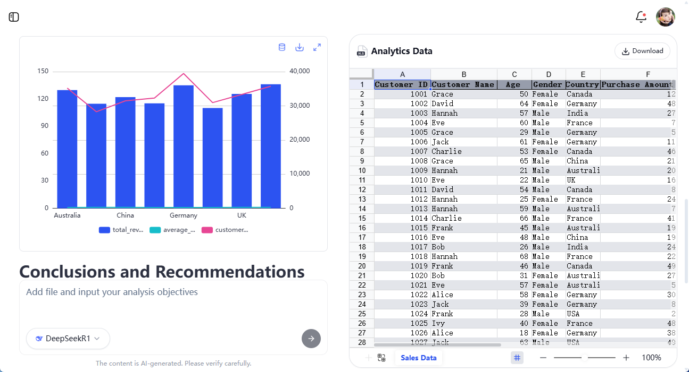
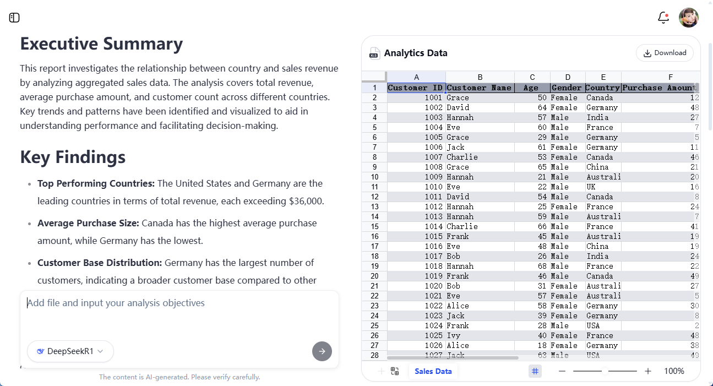

# Basic Usage

## Start a Conversation  

Visit [Insight](https://insight.univer.ai/) to access the Univer AI chat interface.

  

## Connecting a Data Source  

Click the **“+”** button at the bottom left of the chat input box to upload an **Excel** or **CSV** file as your data source.  

  

Univer AI will automatically analyze the table and suggest relevant prompts to help you explore your data. You can choose one of the suggested prompts, such as:  

- Study **regional product preferences** to optimize inventory.  
- Aggregate data by **age groups** to evaluate customer satisfaction.  

Alternatively, you can edit the prompt freely and click **"Send"** to start the analysis.  

  

## Data Analysis  

Once uploaded, Univer AI will highlight key data areas in your table for better visualization and focus.  

  

The system then provides a comprehensive multi-dimensional analysis, covering:  

- **Analysis Objectives** – Define the purpose of the analysis, such as identifying sales trends or improving customer relationship management.  
- **Data Results** – Generate essential data tables, such as sales trends and customer demographics.  
- **Data Visualization** – Create intuitive charts based on analytical results, such as trend graphs and user distribution charts.  
- **Analytical Insights** – Deliver key interpretations of the data, such as identifying peak sales periods and potential influencing factors.  
- **Strategy** – Provide actionable strategies to improve metrics, such as implementing targeted promotions or optimizing stock levels.  

| Analysis Objectives & Data Results | Data Visualization | Insights & Strategy |  
|---|---|---|  
|  |  |  |  

With Univer AI, data analysis becomes faster, clearer, and more insightful—empowering you to make smarter business decisions! 🚀  

Experience [Univer AI](https://insight.univer.ai/) now!
