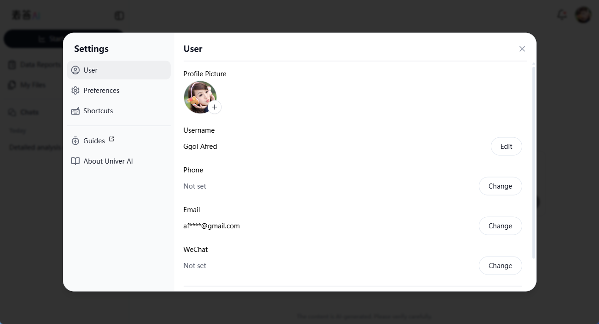

# User Personalization Settings

This guide provides detailed instructions on how to personalize your settings in Univer AI to enhance your user experience.

## Accessing Personalization Settings

Click the user avatar located at the top-right corner of the interface to open the settings menu.

## Switching Language

Univer AI supports switching between Simplified Chinese and English.

### Steps to Switch Languages

1. Click on the avatar at the top-right corner.
2. Hover your mouse over the "Language" option.
3. Select your preferred language (Simplified Chinese or English) from the expanded submenu.

After selection, the interface language will update immediately.

## Logging Out

To log out of your current account securely, follow these steps:

1. Click on the avatar at the top-right corner.
2. Select "Log Out" from the dropdown menu.

Once clicked, you'll return to the Univer AI homepage, and you'll need to log in again to regain access.

By following these steps, you can easily manage your personalized settings in Univer AI, making your data analysis experience more convenient and comfortable!
