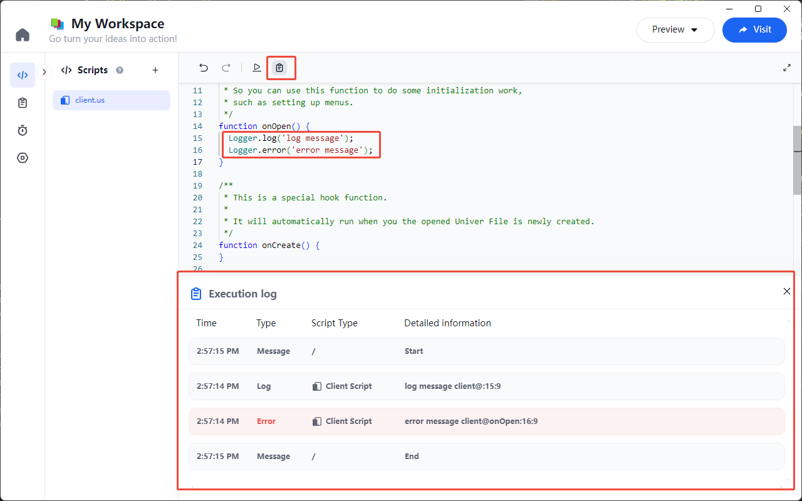
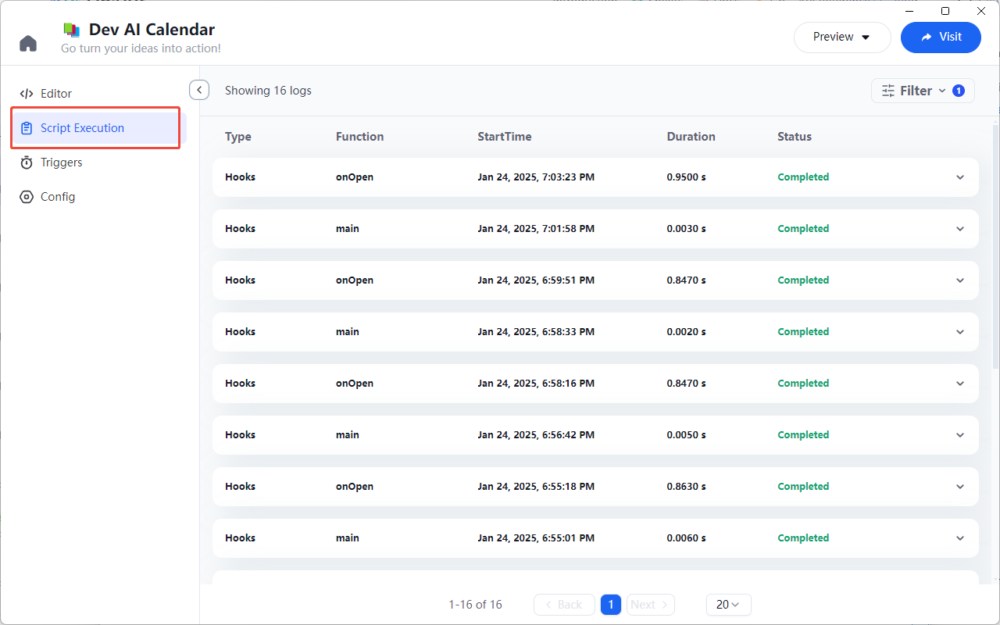
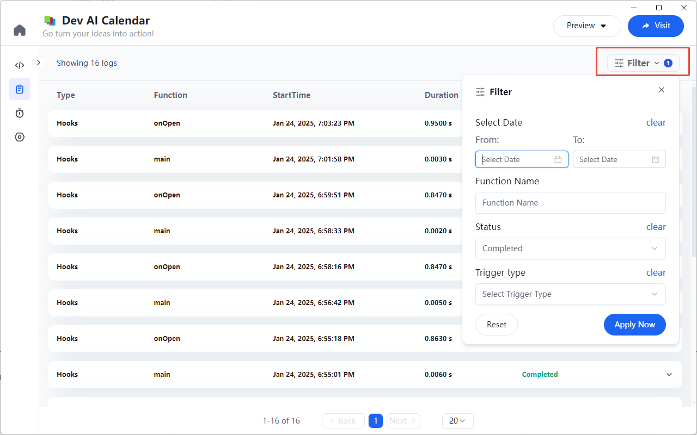

# Logs

Univer Go provides a log output feature during script execution, allowing users to view information about the execution process.

## Using the Logger Class

In your script, you can use the methods of the `Logger` class to output log information.

### Log Levels

There are two log levels: `Logger.log` and `Logger.error`.

- `Logger.log`: Outputs a normal log message.
- `Logger.error`: Outputs an error log message.

### Log Output

You can output log messages at any point during script execution.

For example, outputting logs in the `onOpen` function:
```js
function onOpen() {
  Logger.log('log message');
  Logger.error('error message');
}
```

After executing the script, the log panel will appear at the bottom of the editor.



## Log List

In addition to viewing logs in the editor, you can also check them in the log list on the left side of the Workspace.

In the log list, you can view information such as the log type, executed function, start time, duration, status, and more.



## Log Filter

If there are too many logs in the list, you can use the log filter feature to filter logs that meet specific conditions.

The log filter supports filtering by log time range, function name, execution status, trigger type, and other criteria.


