# Script

## Client Script

### How to Create

In the Workspace, click the `+` button, and select the `Client` script type to create a Client script.

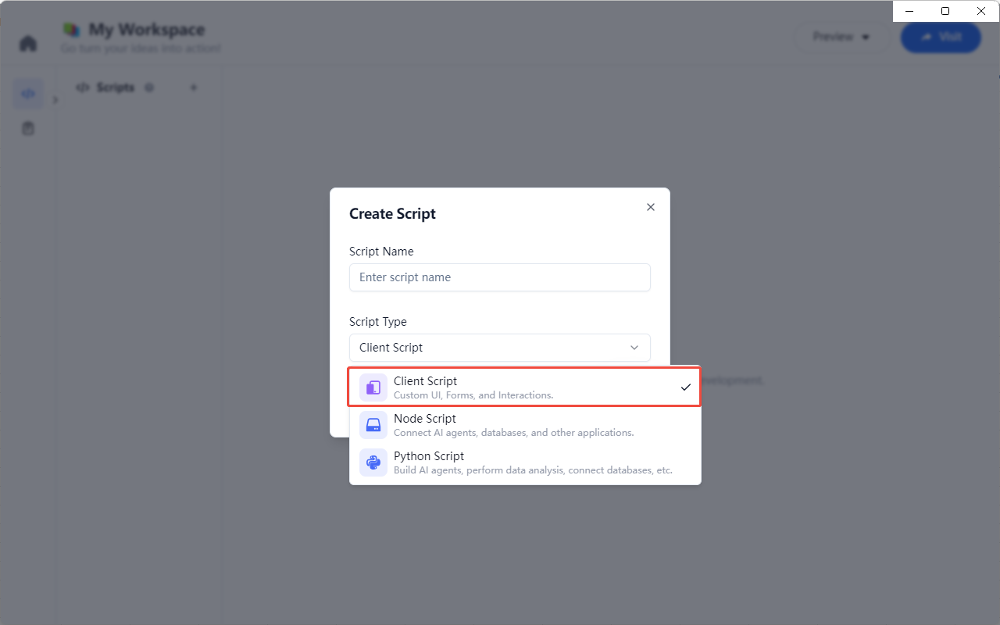

### How to Edit

Click the Client script to enter the editor. The editor supports JavaScript syntax highlighting, code suggestions, and other features.

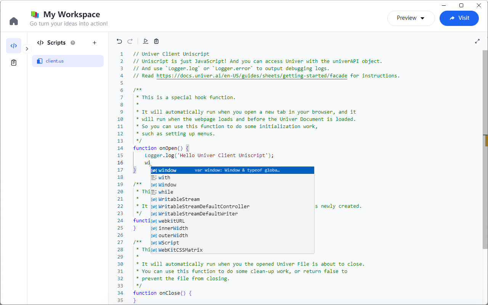

#### univerAPI
In the Client script, you can directly use the `univerAPI` object, which provides some common APIs, such as:

```js
function onOpen() {
  const workbook = univerAPI.getActiveWorkbook();
  const sheet = workbook.getActiveSheet();
}
```

For more API details, please refer to the [Univer Sheets API](/en-US/guides/sheets/features/core/sheet-api).

#### runOnServer

In the Client script, you can use the `runOnServer` method to call methods in the Server script and get the return values, for example:

```js
async function getServerData() {
  const answerData = await univerAPI.runOnServer('ai', 'gpt', `Extract subject from "What is the capital of China?"`);
  Logger.log('answer:', answerData);
}
```

The first parameter is the Server script name, the second is the method name in the Server script, and the third is the method parameter.

### How to Run

Once editing is complete, click the `Run` button in the top left corner of the editor to execute the Client script and print the output.

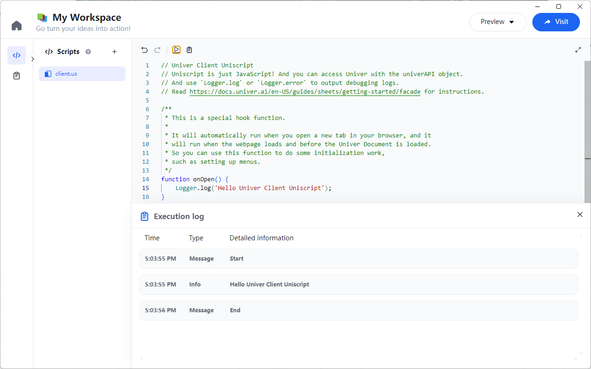

### Supports JSX Syntax

Client scripts support JSX syntax, allowing you to directly write JSX components within the Client script and register them on the page. For example:

```js
function onOpen() {
  // Register components to the corresponding SLOT
  // including CUSTOM_HEADER, CUSTOM_FOOTER, CUSTOM_LEFT, CUSTOM_RIGHT
  univerAPI.registerUIPart(
    univerAPI.Enum.BuiltInUIPart.CUSTOM_HEADER, 
    SpinComponent
  )
}

function SpinComponent() {
  // Get the antd component from the UI variable
  const Spin = univerAPI.UI.Spin;

  return <Spin />
}
```

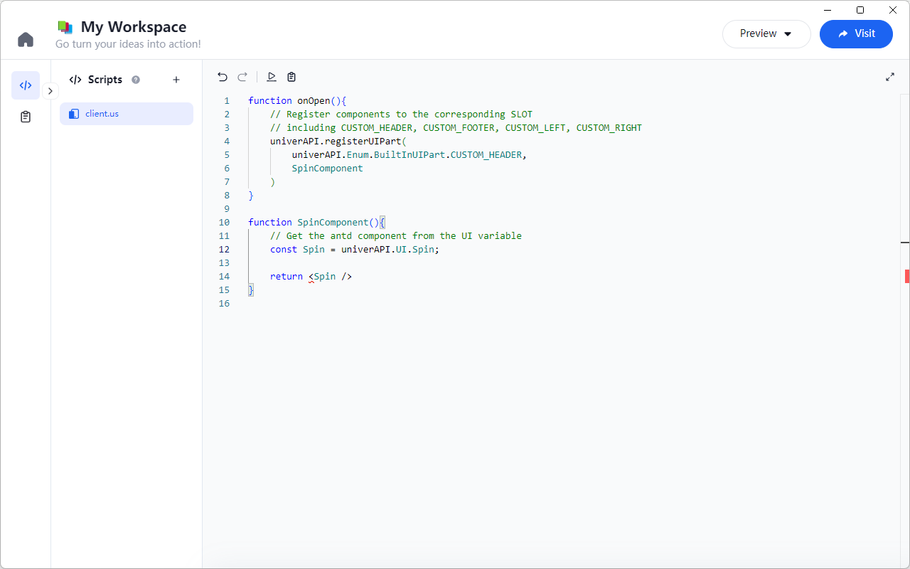

You will be able to see the registered component on the page (upper left corner).

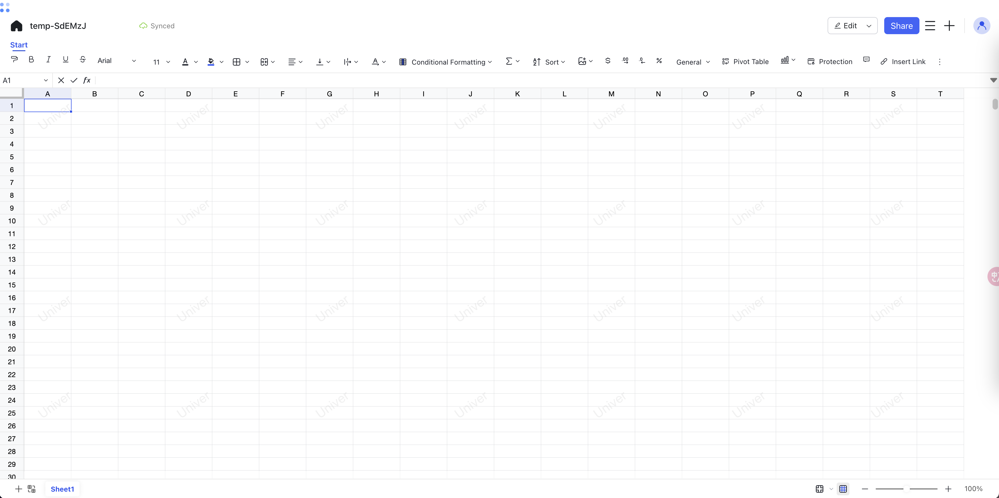

## Node Script

### How to Create

In the Workspace, click the `+` button, and select the `Node` script type to create a Node script.

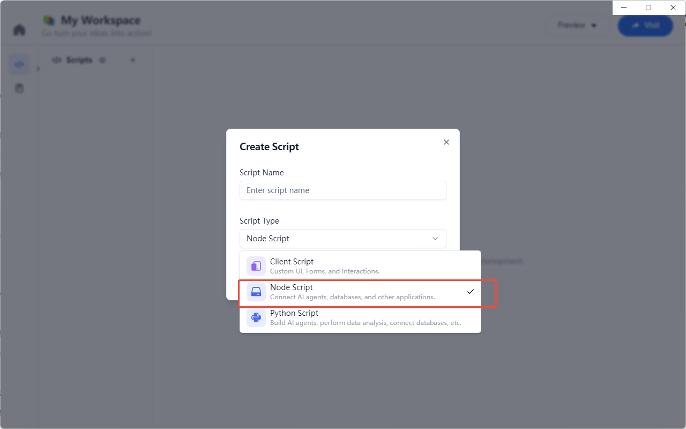

### How to Edit

Click the Node script to enter the editor. The editor supports Node.js syntax highlighting, code suggestions, and other features.

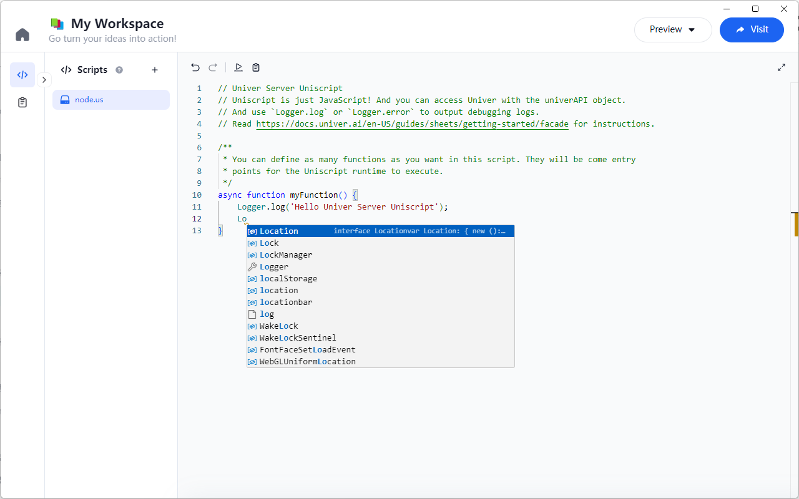

### How to Run

Once editing is complete, click the `Run` button in the top left corner of the editor to execute the Node script and print the output.

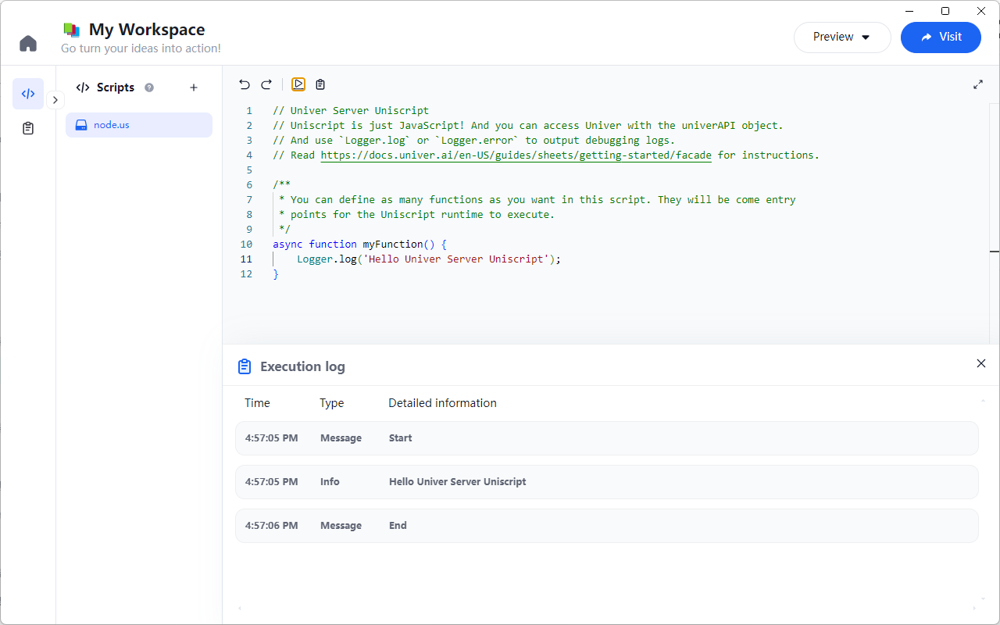

## Python Script

### How to Create

In the Workspace, click the `+` button, and select the `Python` script type to create a Python script.

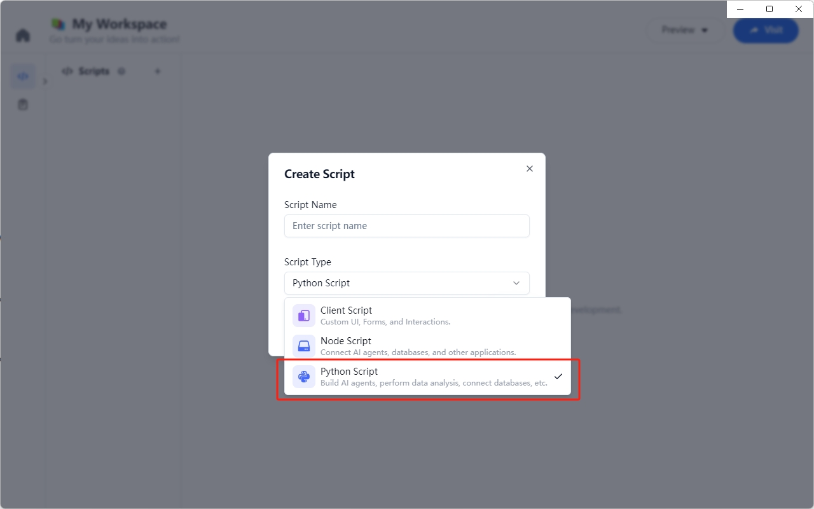

### How to Edit

Click the Python script to enter the editor. The editor supports Python syntax highlighting, code suggestions, and other features.

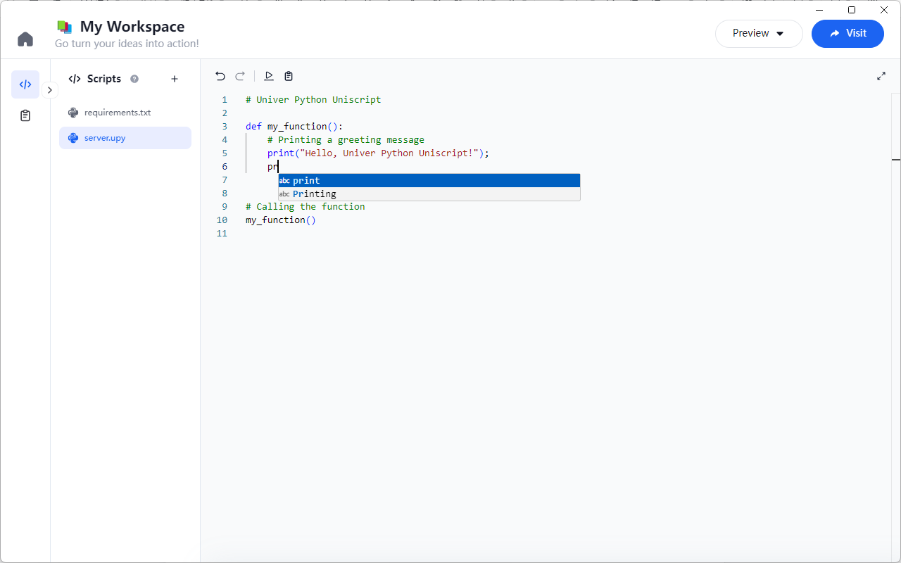

### How to Run

Once editing is complete, click the `Run` button in the top left corner of the editor to execute the Python script and print the output.

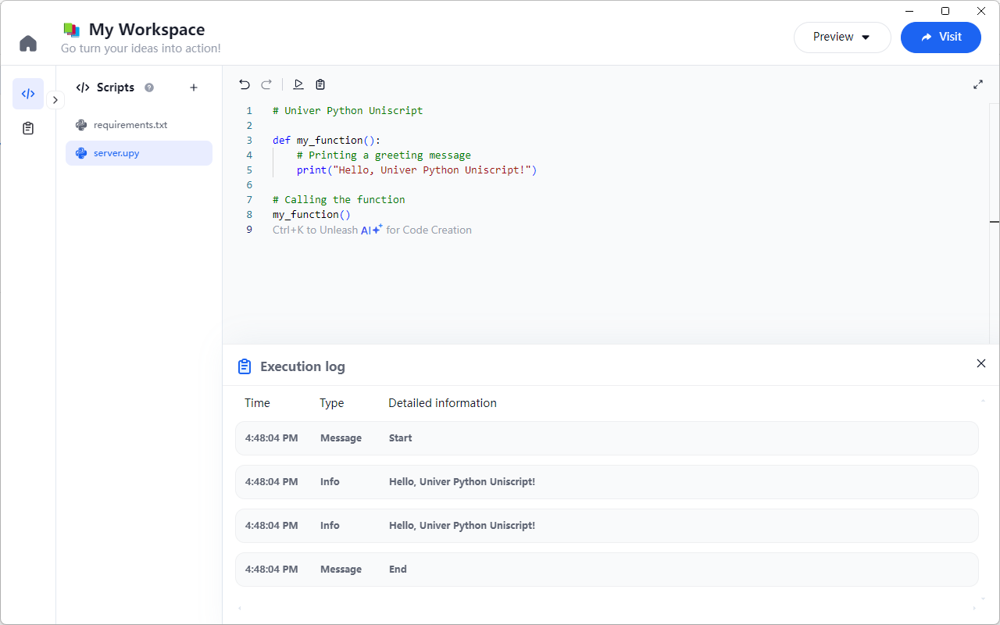
