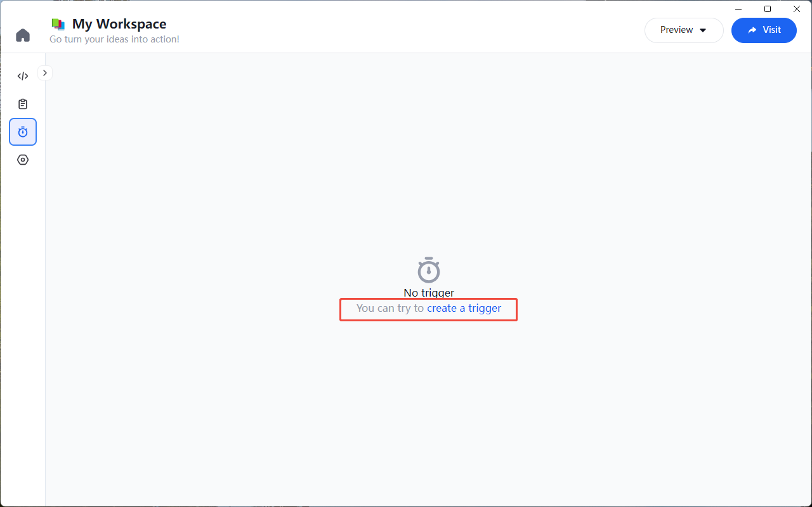
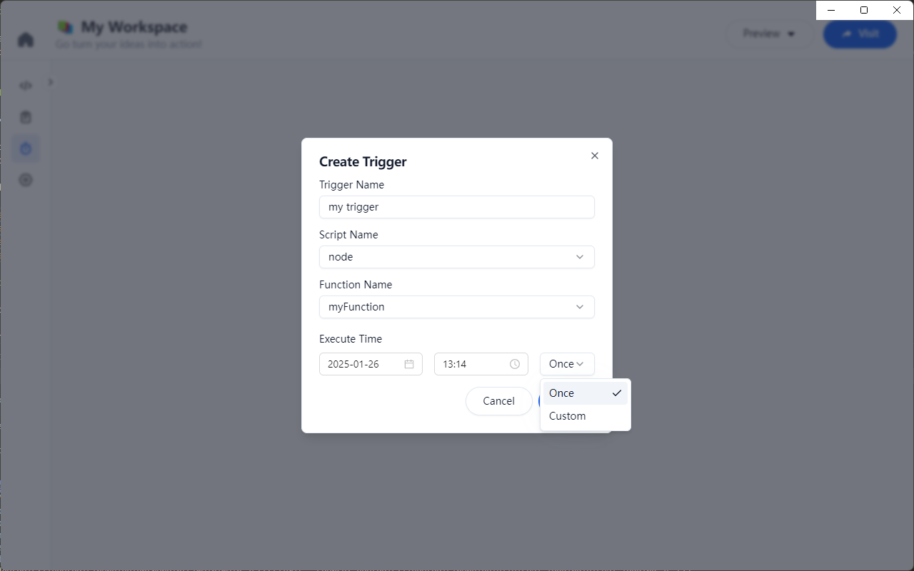
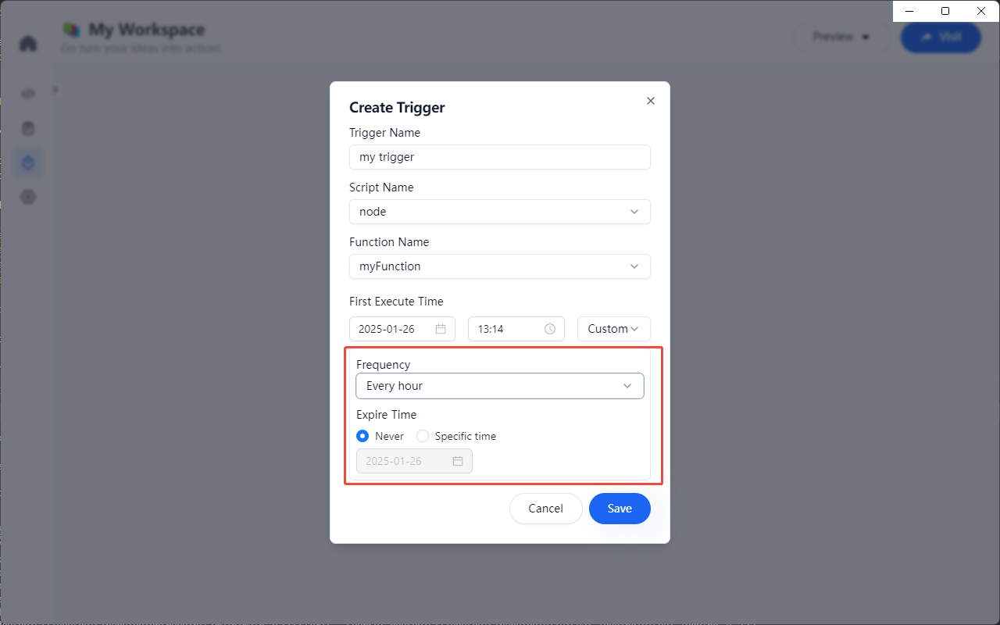
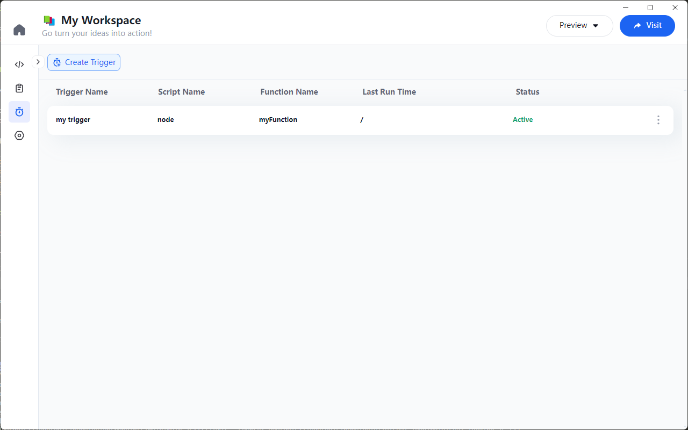
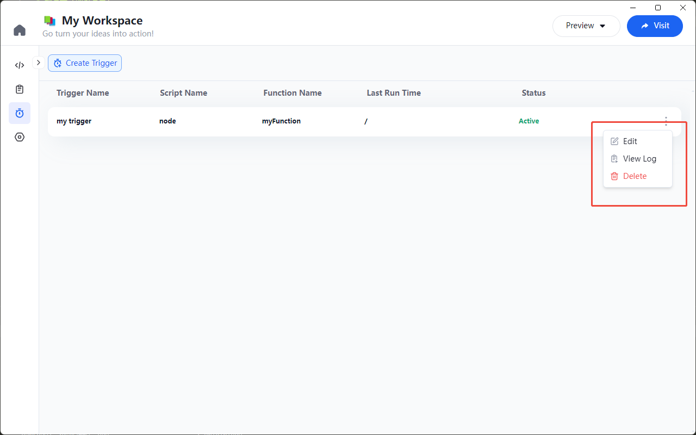

# Scheduler Trigger

Since Node Scripts are destroyed immediately after execution in the Node Runtime, we can configure scheduled tasks in Univer Go to trigger the execution of specific Uniscript functions. This enables functionalities such as scheduling report creation or email sending.

## Creating a Trigger

Click the "Trigger List" tab on the left side of the Workspace to enter the trigger list page. On this page, click the "Add Trigger" button to open the "Add Trigger" popup.

In the popup, fill in the trigger information:
- Enter the trigger name
- Choose the function from the Node Script in this Workspace
- Select the execution time, including a one-time trigger on a specific date or a recurring trigger at time intervals
    - For specific dates, you can choose to execute on a future date, down to the minute
    - For time intervals, you can configure the function to trigger at regular intervals (hourly, daily, weekly, monthly, yearly), and also set an expiration time
- You can save or cancel; the trigger will be created successfully after saving

| Trigger Information | Time Interval |
|---|---|
|  |  |

## Trigger List

On the trigger list page, you can view all triggers for the current Workspace, including the trigger name, script name, function name, last run time, run status, and more.

You can also edit, view execution logs, or delete triggers.

