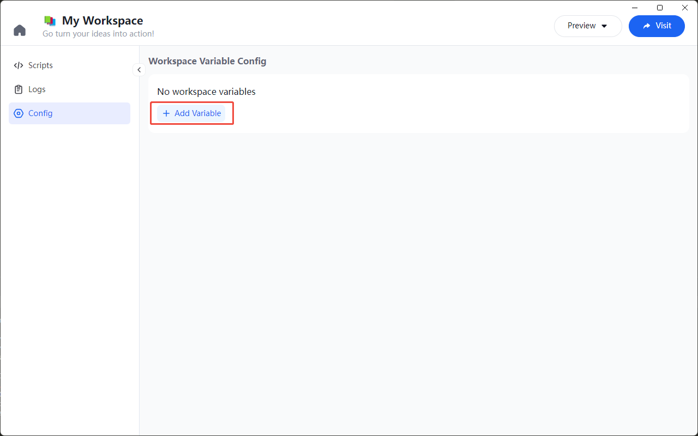
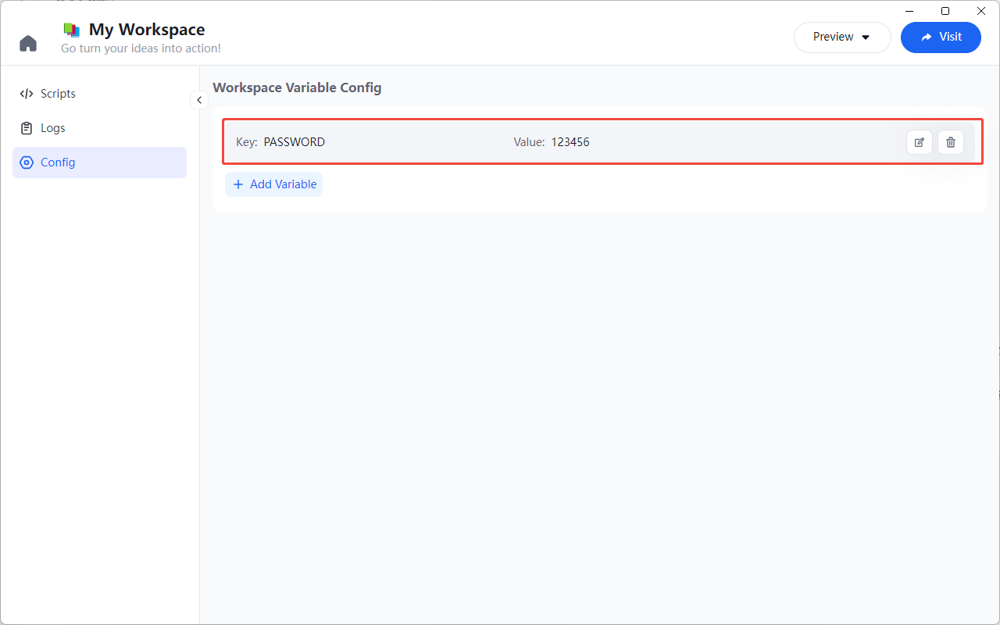
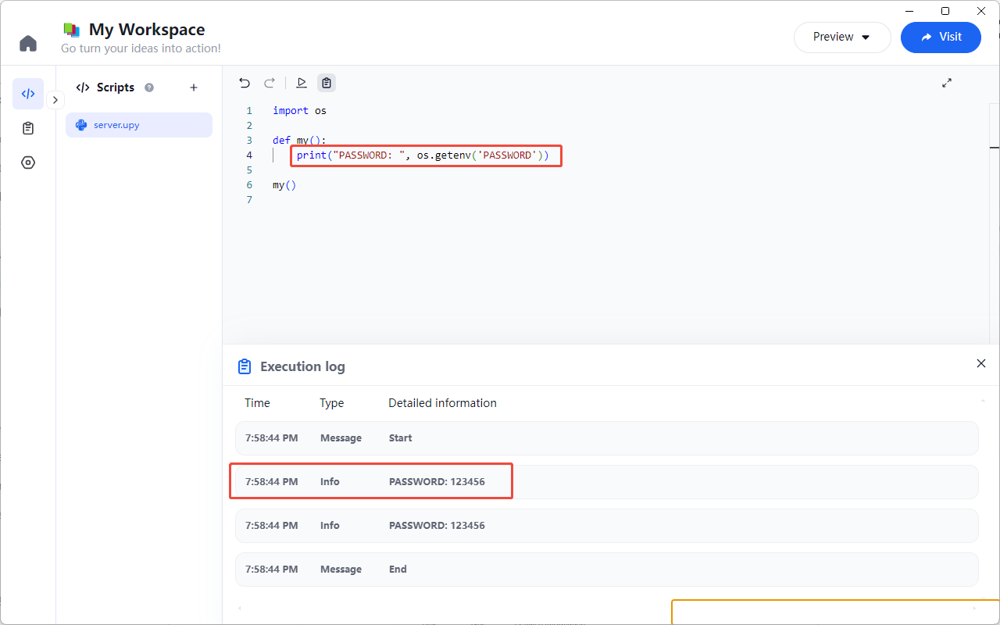

# Workspace Variable

For sensitive information such as database passwords, API keys, etc., users can set these values in workspace variables to ensure security. This prevents the information from being exposed in the script and allows it to be shared across different scripts.

## Add Workspace Variables

In the Workspace, click the "Config" tab on the left, show "Workspace Variable Config," and click the "Add Variable" button.



Enter the variable `Key` and `Value`, then click "Save" to successfully add the variable.


## Manage Workspace Variables

You can manage the workspace variables from the environment variables list page, including actions like editing and deleting.



## Use Workspace Variables

In a Python script, you can retrieve the workspace variable value using the `os.getenv` method. For example:

```python
import os

def my():
  print("PASSWORD: ", os.getenv('PASSWORD'))

my()
```



## Import Workspace Variables

In future versions, we will support importing workspace variables into scripts for user convenience. The following JSON format must be met:

```json
[
  {"scopeType": 1, "key": "key-name", "val": "Non-exportable values are left blank", "desc": "what's this, how to set"},
  {"scopeType": 1, "key": "another-key-name", "val": "Can have a default configuration value", "desc": "what's this, how to set"}
]
```
