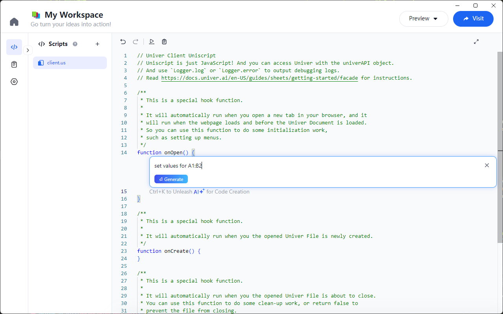
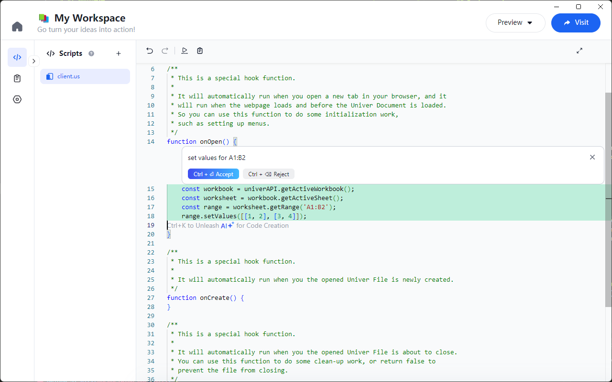

# AI Starter

When extending Univer applications, using the Univer API can be challenging, especially for developers who are unfamiliar with the API. Traditionally, we need to frequently refer to the official documentation to understand how to use the API correctly. To simplify the development process and improve efficiency, Univer Go introduces an AI-assisted feature to help developers quickly generate high-quality code.

## How to Use

In the editor, you can use a shortcut to bring up the AI dialog box. For Windows users, press `Ctrl + K`, and for macOS users, press `Command + K`. This will open a dialog box where you can input a description of the code you want to generate. For example, you could enter: "Set values for A1:B2" and then click the "Generate" button.



After a brief wait, the AI will generate the corresponding code based on your request. Here is an example of the code generated by AI:

```js
function setInitialValues() {
  const workbook = univerAPI.getActiveWorkbook();
  const sheet = workbook.getActiveSheet();
  const range = sheet.getRange('A1:B2');

  // Set values for the 2x2 range
  range.setValues([
    [1, 2],
    [3, 4]
  ]);
}
```

After reviewing the generated code and confirming its accuracy, click the "Accept" button to add it to your script.


