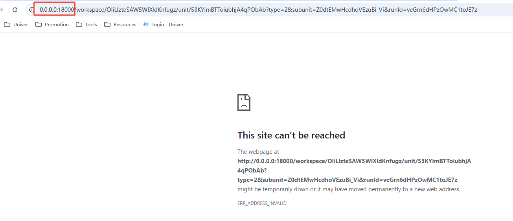
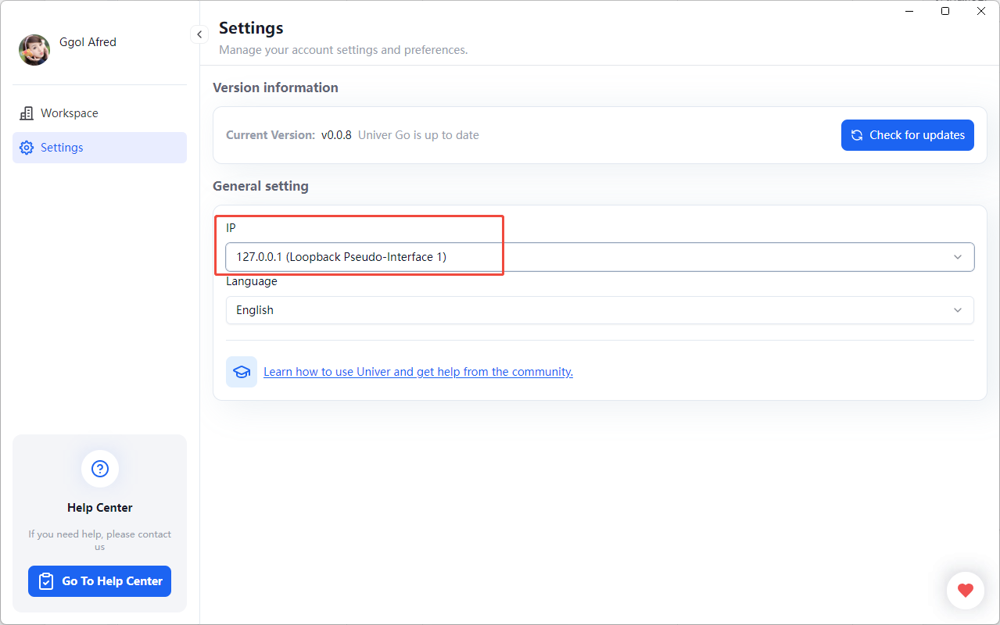

# Client Environment Issues

## Login fails with the message `Login failed Invalid session ticket`

  This may be caused by network proxies. Try disabling the proxy or VPN.

## Failed to create Workspace on Windows
    
  Solution steps:
  1. Uninstall Univer Go completely.
  2. Reinstall Univer Go to the User directory.
  3. Allow network access permissions.

## This site can't be reached

While previewing the workspace, you may encounter an issue where the address `http://0.0.0.0:18000/` is shown and the workspace is not accessible.

In this case, you need to reset the IP in the settings.

After resetting, you should be able to preview and access the workspace normally.
