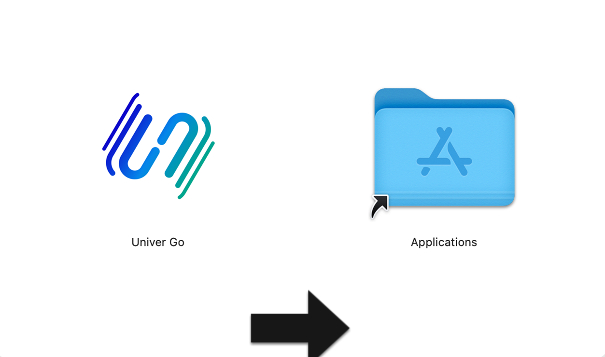
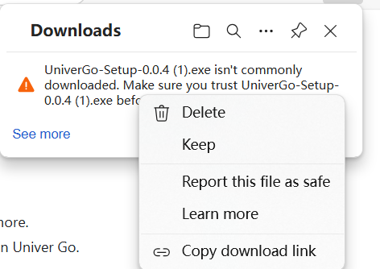
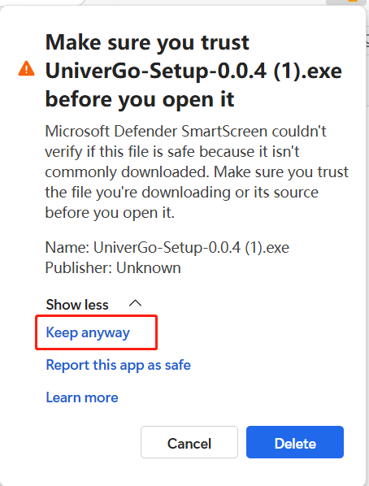
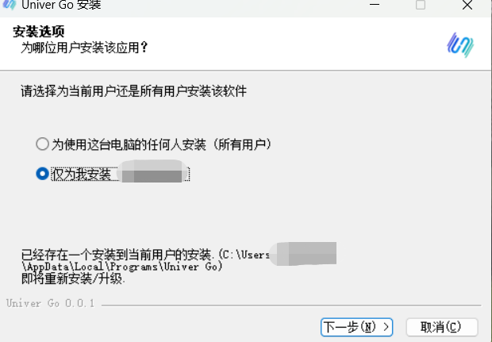
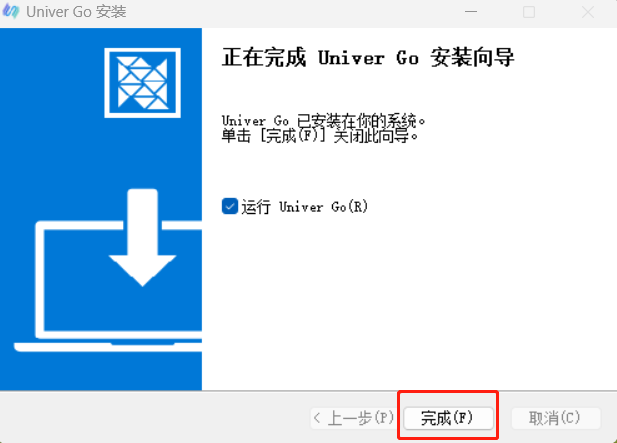

# Download & Installation

## Mac

### Step 1: Download the installer

1. Visit the [download link](https://go.univer.ai)
2. Click the download button to get the latest version of the installer.

### Step 2: Start the installation

1. Drag the downloaded package to install.
2. launch Univer Go to complete the installation.

| Drag to install |
|---|
|  |

## Windows

### Step 1: Download the installer

1. Visit the [download link](https://go.univer.ai)
2. Click the download button to get the latest version of the installer.
3. After downloading, right-click the file and click `Keep` in the menu. When the pop-up window pops up, click `Show less` and select `Keep anyway` to complete the download.
    
    | Keep | Keep anyway |
    |---|---|
    |  |  |

### Step 2: Start the installation

1. Open the downloaded installation file.
2. Double-click to run the installer and follow the on-screen instructions.
3. Choose the installation path (you can use the default path) and click "Next" to continue.
4. Wait for the installation to complete, and click "Finish" to run the software.

| Start installation | Installation completed |
|---|---|
|  |  |

> For a video tutorial on installing and using Univer Go on Windows, you can refer to [this video](https://youtu.be/Gvb8RKh-YXA).
