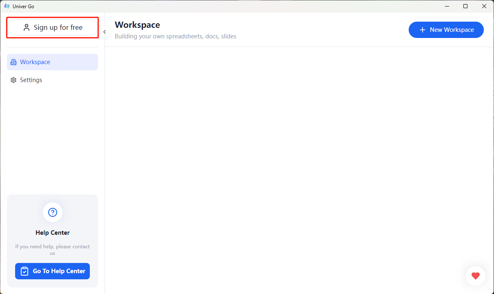
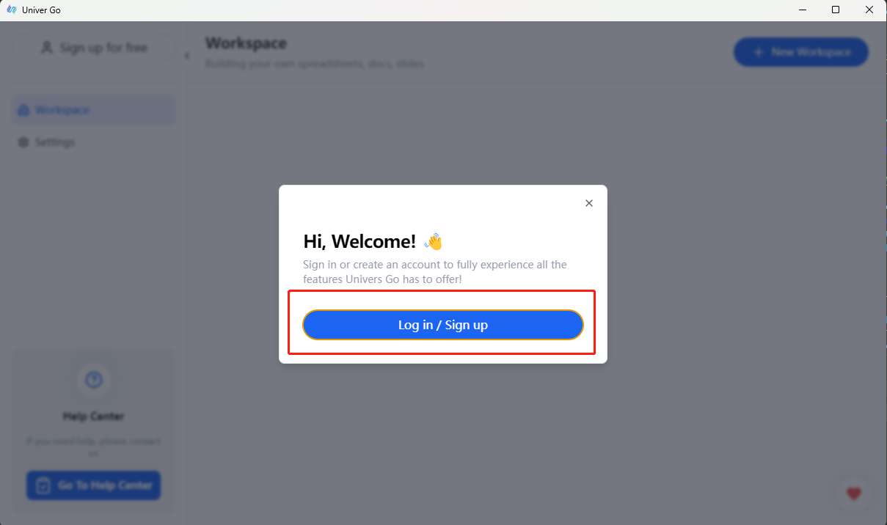
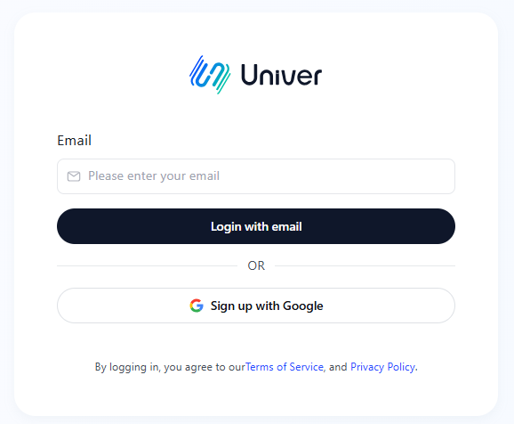
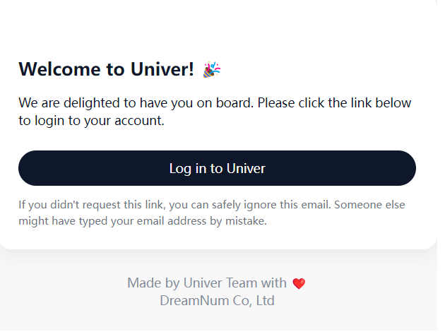
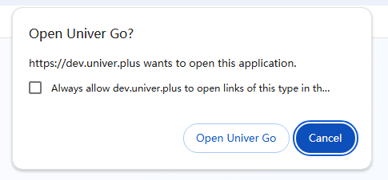

# Registration & Login

1. Open Univer Go and click the "Free Registration" button in the top left corner.
  A login/registration panel will pop up. Click it to go to the login page.
  
  | Free Registration | Login/Registration Panel |
  |---|---|
  |  |  |

2. There are currently two login methods. Make sure your email is accessible and can receive emails if you choose the email login method.
  - Method 1: Enter the registered email and click "Login with Email."
    - Check your email for a message from Univer and click "Log in to Univer."
    - A popup will prompt you to open Univer Go, click the "Open" button to complete the login.
      | Email Login | Welcome Email | Open Univer Go |
      |---|---|---|
      |  |  |  |

  - Method 2: Login with Google
      - For users already logged into Google on the browser: After logging in, you'll be redirected to the successful login page, click to open Univer Go.
      - For users not logged into Google: You will be redirected to the Google login page.
        - Enter your Google account email and password to log in.
        - After logging in, you'll be redirected to the successful login page. Click to open Univer Go.
          
