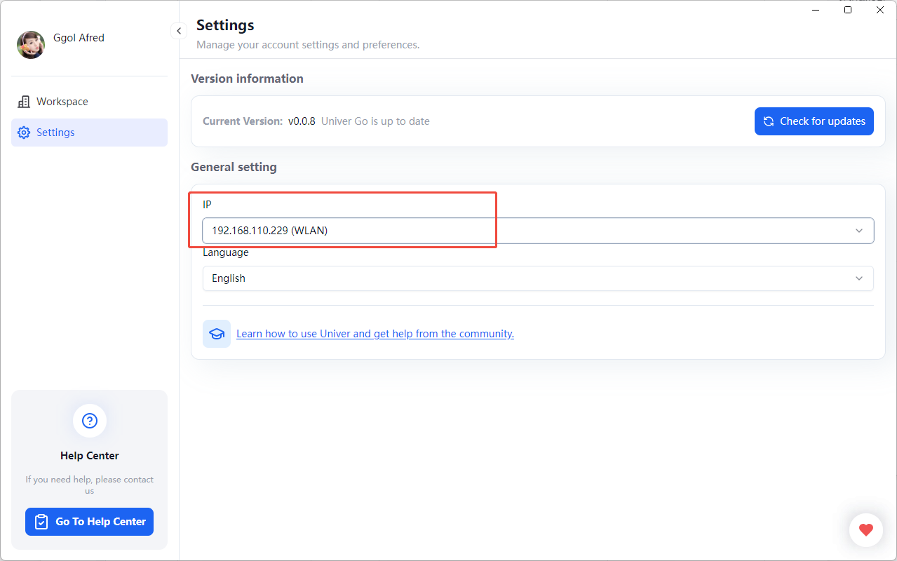
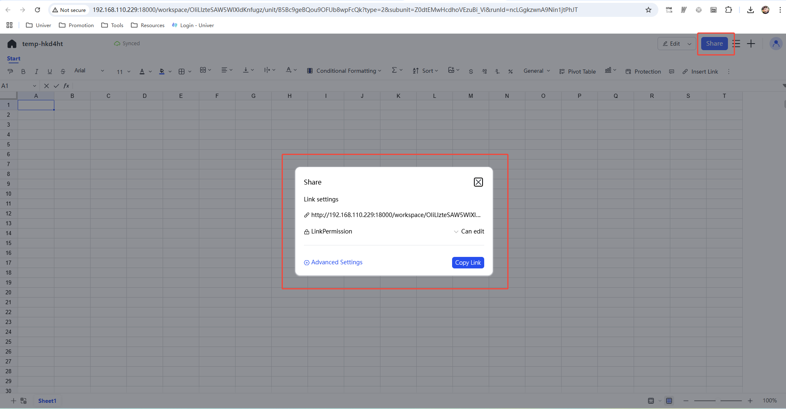

# Settings

## Language Settings

- Click on "Settings" in the sidebar of Univer Go, then click the language dropdown to switch languages.
  - Currently, only Chinese and English are supported.

## Version Information

- Click the "Check for Updates" button to see if you're using the latest version.

## LAN Sharing

Univer Go allows users to create and share workspaces locally. Through a local area network (LAN), other users can access your workspace for collaborative work. To ensure proper access within the LAN, users need to configure the correct IP address and make sure the selected IP address is available on the network.

- **Default IP Address**: If the user has not manually set an IP address, the default IP address is `127.0.0.1`, meaning it is only accessible locally.
- **Custom IP Settings**: Users can select and set a LAN-accessible IP address in the settings interface. For example, choose an IP address suitable for LAN sharing, so that other users on the same network can access your workspace using that IP address.
    

When previewing the workspace, clicking the "Share" button in the top right corner will open a popup displaying the share link and permission settings. By clicking the "Copy Link" button, you can generate a shareable link, and other users on the same LAN can access your workspace using that link.

