# Basic Usage

## Feature Flowchart

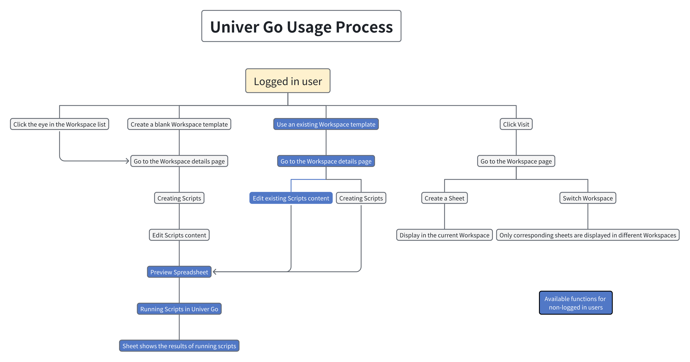

## Basic Operations

### Step 1: Create a Workspace

1. Click the **New Workspace** button in the top-right corner.
2. Create an empty Workspace or use a Workspace template.
3. Enter a **Name** and **Description**, then choose an appropriate **Icon**.
4. Click **Create** to navigate to the Workspace detail page.
  | Create Workspace | Workspace |
  |---|---|
  | 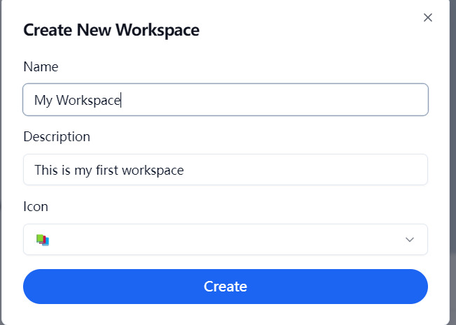 | 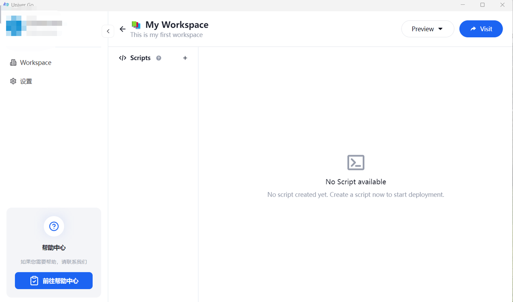 |

### Step 2: Create a Script

#### Create a Script in the Workspace Detail Page
  - When creating a blank Workspace, the details page is empty.
    1. Click the **＋** button next to **Script** to create a blank Script.
    2. In the creation panel, enter a **Script Name**. Click **Script Type** to choose between two different types of Scripts:
      - **Client Script**: Custom UI components, event handling, page interactions, etc.
      - **Server Script**: Connect to AI agents, databases, and other applications.
        | Workspace | Create Script |
        |---|---|
        |  | 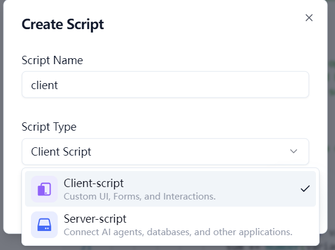 |

  - When using a template for the Workspace, the details page includes template Scripts.
        
    Click the **＋** button next to **Script** to create a blank Script.
      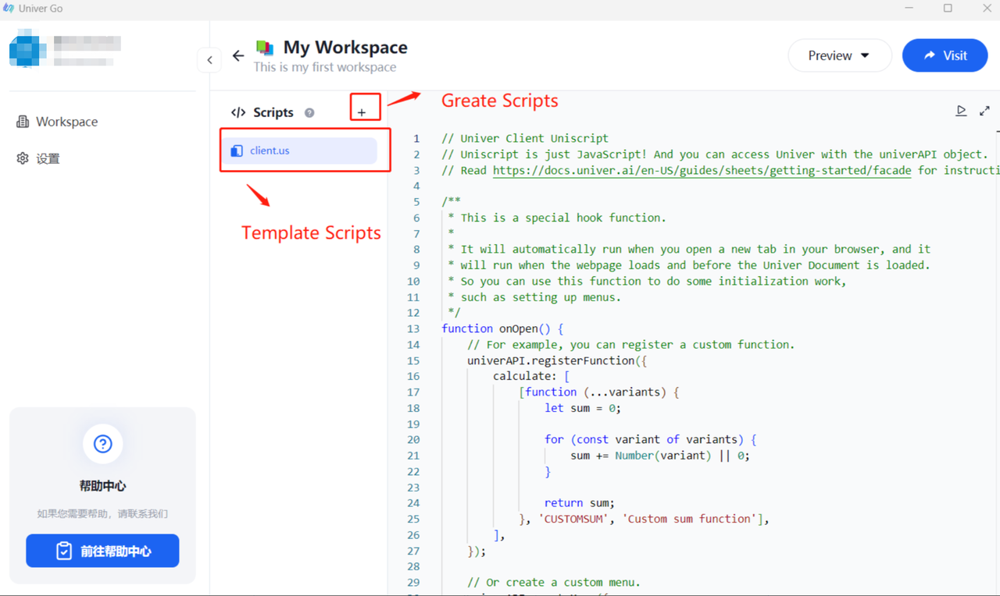

#### Modify and Delete a Script
  Click the **More** button next to the Script to modify the **Script Name** or delete the Script.
  | Modify Script | Delete Script |
  |---|---|
  | 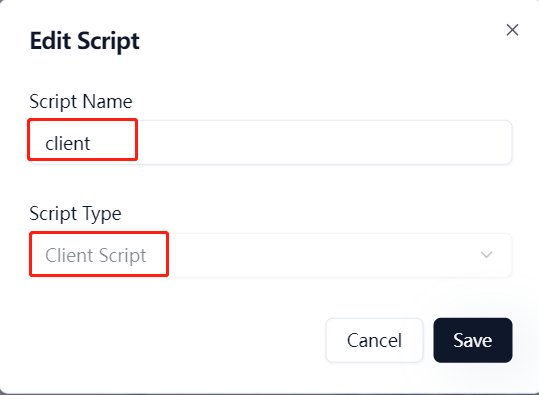 | 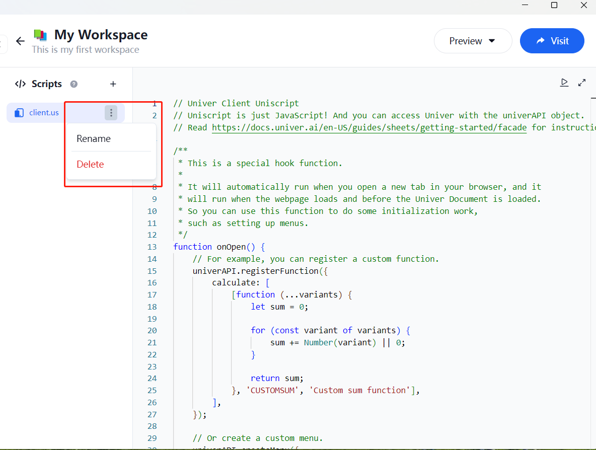 |

  > The **Script Type** cannot be changed once created.

### Step 3: Run the Script

1. After creating the Script, click the edit area on the right to input code.
  - You can click the fullscreen button in the top-right corner to enlarge the editor.
  - Press **ESC** to exit fullscreen.
      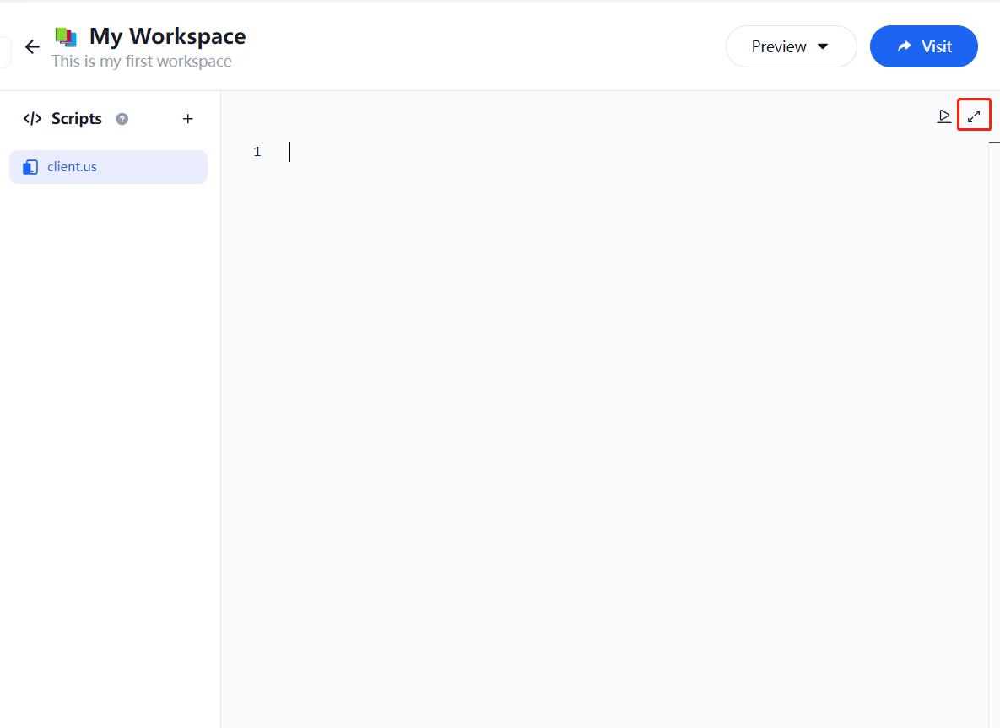

  > For the Uniscript tutorial, please refer to the [Univer official documentation](https://docs.univer.ai/en-US/guides/sheets/features/core/general-api).

2. Once the code is written, click the **Preview** button in the top-right corner and select **Spreadsheet**.
  After selecting, a sheet document will open, and the results will be displayed within it.
  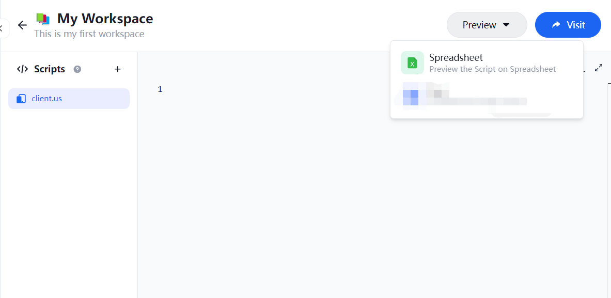

3. When you click to run, multiple options will appear:
  - **onOpen**: Triggered automatically every time the Unit document is opened.
  - **onCreate**: Triggered automatically when the Unit document is created and opened, before **onOpen**.
  - **onClose**: Triggered automatically every time the Unit document is closed.
  - **myFunction**: Custom function name, which you can modify or extend based on your needs.

4. Click the corresponding option to run the script.
  - Both success and failure will show notifications.
  - The Workspace opened via the **Visit** button will not retain the document from the current run.
    | Success | Failure |
    |---|---|
    |  | 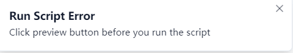 |

### Step 4: Click Visit

1. In the detail page, click **Visit**.
  1. This will open the corresponding Workspace homepage.
  2. This homepage only displays documents created or uploaded in the current Workspace.
    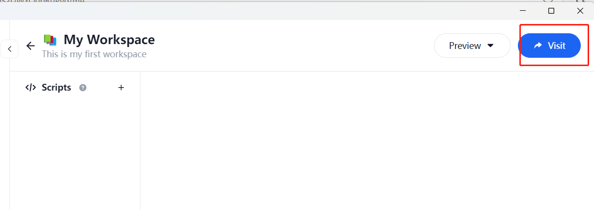

2. Create and delete documents on the homepage.
  1. Documents are only retained within the current Workspace.
  2. Deleting a Workspace in Univer Go will also delete the associated documents, and they cannot be recovered.
  3. Deleting a document from the homepage will not affect Univer Go.
    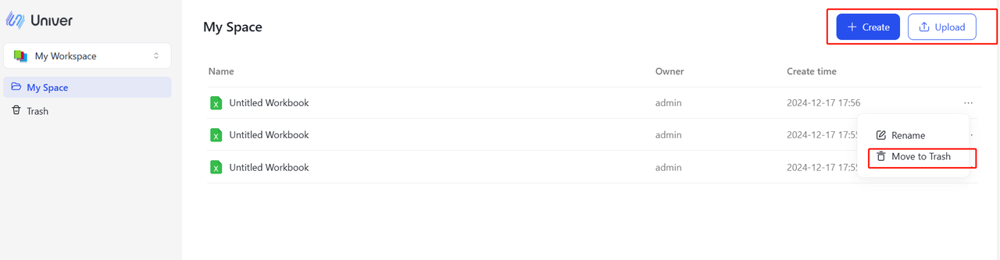

3. Switch Workspace on the homepage.
  1. Click the button in the top-right corner to view all Workspaces and switch between them.
  2. Each Workspace only displays documents manually created or uploaded within that Workspace.
  3. When editing or deleting a Workspace in Univer Go, you will need to refresh the page to synchronize the latest changes.
    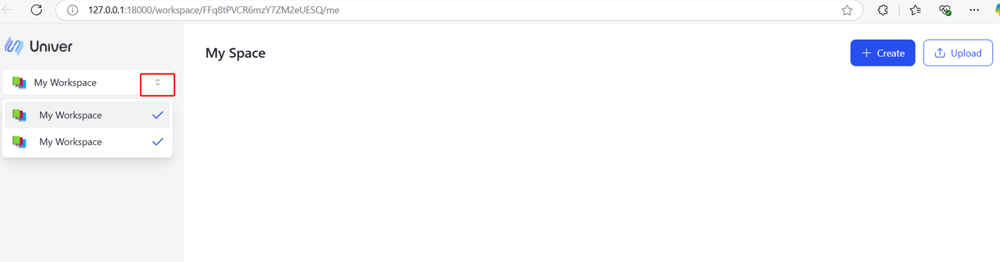

### Step 5: View the Workspace List

1. Click **Workspace** in the sidebar view all created Workspaces.
  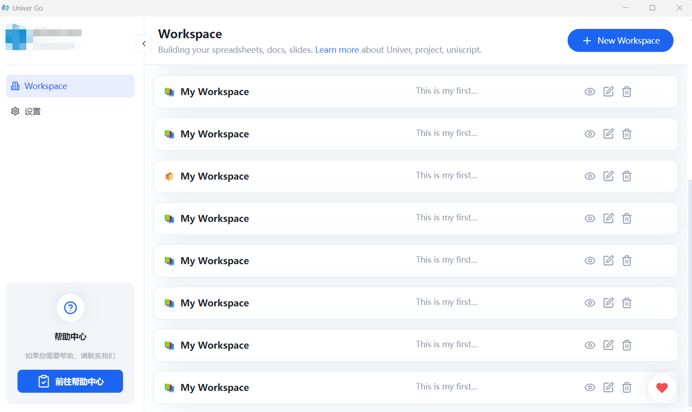

2. Click the small eye icon next to a Workspace, this will open the Workspace detail page.
  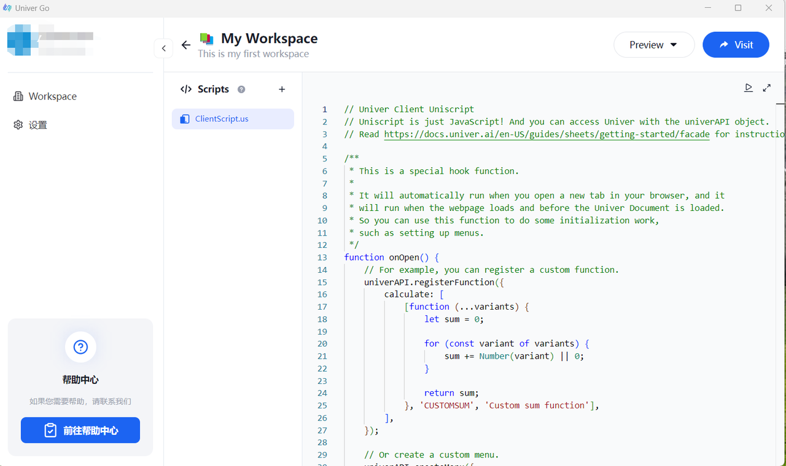

3. Click the edit button next to the Workspace to modify the **Name**, **Description**, or **Icon**.
  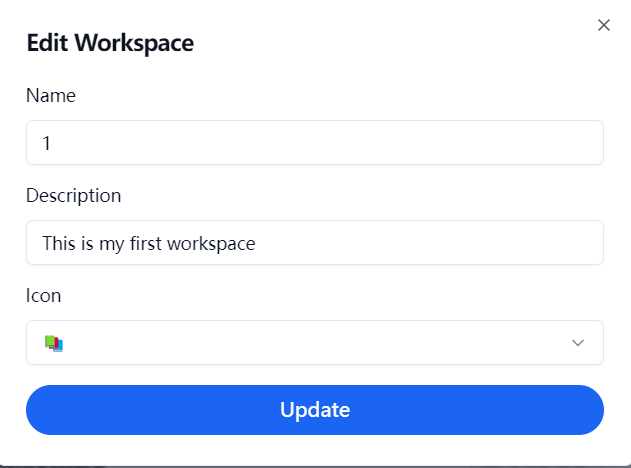

4.  Click the delete button next to the Workspace. Deleted Workspaces cannot be recovered, so please proceed with caution.
  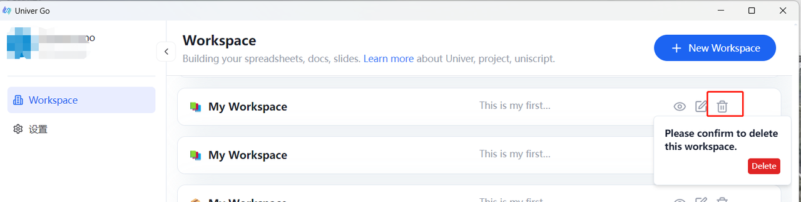
