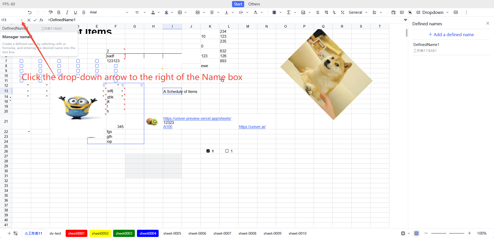

# Defined Names

Defined names are a feature that allows users to assign custom names to cells, cell ranges, or formulas. By naming, users can reference data more intuitively, simplify formulas, and enhance the readability, maintainability, and professionalism of spreadsheets.

- **Improve formula readability**: Using defined names can make formulas easier to understand. For example, using `Total Sales` instead of `A1 + A2 + A3` makes the meaning of the formula clearer.
- **Simplify complex references**: When referencing multiple cells or complex ranges, defined names can simplify these references. For example, you can define `A1:A10` as `Sales Data` and use `Sales Data` directly in formulas instead of the range.
- **Convenient unified management of data areas**: Defined names can help users better manage data areas. When the data range changes, you only need to update the reference of the defined name without modifying all formulas one by one.

## Usage

The name manager entry is located next to the drop-down arrow in the name box at the top left corner of the sheet. Clicking it will show a list of all defined names and the entry to the name manager. Through the name manager, users can view, edit, and delete defined names.



When using defined names in formulas, you can simply enter the name directly. For example, if you define a name as `Total Sales`, you can use `=Total Sales` in the formula to reference that range.

## Notes
- **Unique names**: Defined names must be unique within the same worksheet and cannot conflict with other names or built-in functions.
- **Validity of names**: Defined names cannot start with a number, contain spaces, or special characters (such as `!`, `@`, `#`, etc.). If the entered name does not meet the rules, the system will prompt an error.
- **Update defined names**: If you need to modify an already defined name, you can reopen the "Define Name" editing panel, select the name to be modified, and edit it. After modification, click "OK" to save the changes.
- **Remove defined names**: If a defined name is no longer needed, you can select it in the "Define Name" editing panel and click the "Delete" button to remove it. After deletion, the related formulas will no longer be valid.
- **Use across worksheets**: Defined names can be used in different worksheets within the same workbook, but you need to pay attention to the uniqueness of the names. If the same name is defined in different worksheets, it may lead to reference confusion.
- **Naming conventions**: It is recommended to use meaningful names and avoid overly short or vague names for better understanding and maintenance by other users.
- **Debugging formulas**: If you encounter problems when using defined names, you can check whether the name is correct, whether the reference range is accurate, and whether there are any name conflicts. You can view all defined names and their reference ranges through the "Name Manager" panel.
- **Scope of use**: Defined names can be set at the workbook level or worksheet level. Workbook-level names can be used throughout the workbook, while worksheet-level names can only be used in specific worksheets.

## Facade API

To get full definition of facade api, please refer to [FacadeAPI](https://reference.univer.ai/en-US)

### Create Defined Names

[`univerAPI.newDefinedName()`](https://reference.univer.ai/en-US/classes/FUniver#newdefinedname) creates a defined name builder, returning an instance of `FDefinedNameBuilder`, which can be used to generate an `ISetDefinedNameMutationParam` object for creating defined names through method chaining.

Here are some member methods on [`FDefinedNameBuilder`](https://reference.univer.ai/en-US/classes/FDefinedNameBuilder):

| Method | Description |
| ------ | ----------- |
| build | Builds the defined name object |
| setName | Sets the defined name |
| setFormula | Sets the defined name formula |
| setRef | Sets the reference range of the defined name |
| setComment | Sets the comment for the defined name |
| setScopeToWorksheet | Sets the defined name to be available for a specific worksheet |
| setScopeToWorkbook | Sets the defined name to be available for the entire workbook |

You can create a defined name that is available for the entire workbook using the [`FWorkbook.insertDefinedNameBuilder()`](https://reference.univer.ai/en-US/classes/FWorkbook#insertdefinednamebuilder) method.

```typescript
const fWorkbook = univerAPI.getActiveWorkbook();
const definedNameBuilder = univerAPI.newDefinedName()
  .setName('MyDefinedName')
  .setRef('Sheet1!$A$1')
  .setComment('A reference to A1 cell in Sheet1')
  .build();
fWorkbook.insertDefinedNameBuilder(definedNameBuilder);
```

You can also quickly create a defined name using the [`FWorkbook.insertDefinedName()`](https://reference.univer.ai/en-US/classes/FWorkbook#insertdefinedname) method.

```typescript
const fWorkbook = univerAPI.getActiveWorkbook();
fWorkbook.insertDefinedName('MyDefinedName', 'Sheet1!$A$1');
```

Other methods:
- [`FWorksheet.insertDefinedName()`](https://reference.univer.ai/en-US/classes/FWorksheet#insertdefinedname): Creates a defined name available for the worksheet.

### Get Defined Names

You can get the defined names in the workbook using the [`FWorkbook.getDefinedName()`](https://reference.univer.ai/en-US/classes/FWorkbook#getdefinedname) method, which returns an instance of `FDefinedName`.

```typescript
const fWorkbook = univerAPI.getActiveWorkbook();
const definedName = fWorkbook.getDefinedName('MyDefinedName');
console.log(definedName?.getFormulaOrRefString());

if (definedName) {
  definedName.setName('NewDefinedName');
}
```

Other methods:
- [`FWorkbook.getDefinedNames()`](https://reference.univer.ai/en-US/classes/FWorkbook#getdefinednames) method can get all defined names in the workbook, returning an array of `FDefinedName[]`.
- [`FWorksheet.getDefinedNames()`](https://reference.univer.ai/en-US/classes/FWorksheet#getdefinednames) method can get all defined names available for this worksheet, returning an array of `FDefinedName[]`.

### Modify Defined Names

You can modify the defined names in the workbook using the [`FWorkbook.updateDefinedNameBuilder()`](https://reference.univer.ai/en-US/classes/FWorkbook#updatedefinednamebuilder) method.

```typescript
const fWorkbook = univerAPI.getActiveWorkbook();
const definedName = fWorkbook.getDefinedName('MyDefinedName');
console.log(definedName?.getFormulaOrRefString());

// Update the defined name
if (definedName) {
  const newDefinedNameParam = definedName.toBuilder()
    .setName('NewDefinedName')
    .setRef('Sheet1!$A$2')
    .build();
  fWorkbook.updateDefinedNameBuilder(newDefinedNameParam);
}
```

Also you can directly modify the defined name configuration through the returned [`FDefinedName`](https://reference.univer.ai/en-US/classes/FDefinedName) instance.

```typescript
const fWorkbook = univerAPI.getActiveWorkbook();
const definedName = fWorkbook.getDefinedName('MyDefinedName');
console.log(definedName?.getFormulaOrRefString());

// Update the defined name
if (definedName) {
  definedName.setName('NewDefinedName');
  definedName.setRef('Sheet1!$A$2');
}
```

### Delete Defined Names

You can delete defined names in the workbook using the [`FWorkbook.deleteDefinedName()`](https://reference.univer.ai/en-US/classes/FWorkbook#deletedefinedname) method.

```typescript
const fWorkbook = univerAPI.getActiveWorkbook();
fWorkbook.deleteDefinedName('MyDefinedName');
```

Also you can delete the defined name directly through the returned [`FDefinedName`](https://reference.univer.ai/en-US/classes/FDefinedName) instance.

```typescript
const fWorkbook = univerAPI.getActiveWorkbook();
const definedName = fWorkbook.getDefinedName('MyDefinedName');
console.log(definedName?.getFormulaOrRefString());

// Delete the defined name
if (definedName) {
  definedName.delete();
}
```
