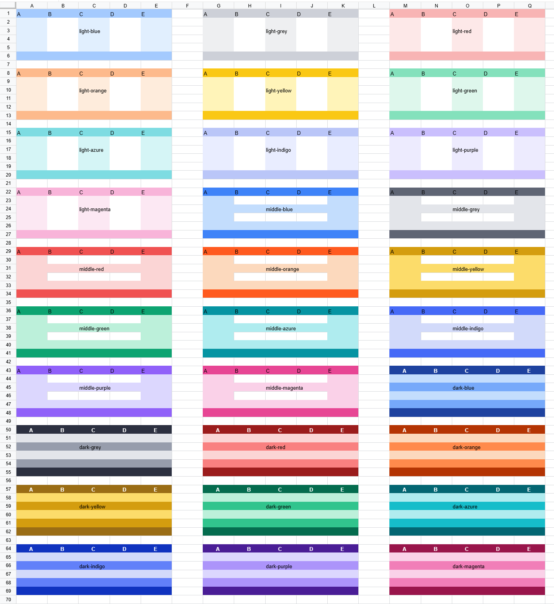

import VersionBadge from '@/components/version-badge'
import FeatureMeta from '@/components/feature-meta'

# Range Theme <VersionBadge version="0.5.3+" />

<FeatureMeta texts={['✅', '-', '-', '-', 'UniverSheetsCorePreset' ]} />

To enrich the display effect of the spreadsheet, we provide some preset range themes and also open the ability to customize themes for Univer users.

## Preset Themes

We provide a theme similar to the  `Excel Table default style` as the default theme, named `default`, which can be set through the `theme` attribute. We also provide a series of color themes, which you can get through the following Facade API to see the currently supported themes.

```typescript
const fWorkbook = univerAPI.getActiveWorkbook();
const themes = fWorkbook.getRegisteredRangeThemes();
console.log(themes); // ['default', 'light-blue', 'light-grey', 'light-red', 'light-orange', 'light-yellow', 'light-green', 'light-azure', 'light-indigo', 'light-purple', 'light-magenta', 'middle-blue', 'middle-grey', 'middle-red', 'middle-orange', 'middle-yellow', 'middle-green', 'middle-azure', 'middle-indigo', 'middle-purple', 'middle-magenta', 'dark-blue', 'dark-grey', 'dark-red', 'dark-orange', 'dark-yellow', 'dark-green', 'dark-azure', 'dark-indigo', 'dark-purple', 'dark-magenta']
```



## Setting Themes

In Univer, you can set themes in the following two ways:
- Support themes by setting snapshots
- Support themes through the Facade API

### Setting Themes by Snapshots

The themes in Univer are stored in the snapshot's resource with the key `SHEET_RANGE_THEME_MODEL_PLUGIN`. The data structure is as follows:

```typescript
interface IRangeThemeRangeInfo {
  range: IRange;
  unitId: string;
  subUnitId: string;
}

interface IRangeThemeStyleRule {
  rangeInfo: IRangeThemeRangeInfo;
  themeName: string;
}

interface ISheetRangeThemeModelJSON {
  // JSON storing the range and theme information for setting themes, the key is the id, please ensure it is not repeated, the value is the corresponding range information and template name.
  rangeThemeStyleRuleMap: Record<string, IRangeThemeStyleRule>;
  // JSON storing the themes, the key is the theme name, and the value is the serialized JSON of the theme.
  rangeThemeStyleMapJson: Record<string, IRangeThemeStyleJSON>;
}
```

### Setting Themes through Facade API

We recommend using the Facade API to set themes and then using the serialization and deserialization methods provided by Univer to store theme information.

Here are some API introductions related to themes:
```typescript
// Get the currently supported themes
const fWorkbook = univerAPI.getActiveWorkbook();
const fWorksheet = fWorkbook.getActiveSheet();
const themes = fWorkbook.getRegisteredRangeThemes();
console.log(themes);

// Set the default theme for A1:E20
const fRange = fWorksheet.getRange('A1:E20');
fRange.useThemeStyle('default'); // Use the default theme

// Get the currently used theme
const currentTheme = fRange.getUsedThemeStyle();
console.log(currentTheme);

// Clear theme style
fRange.useThemeStyle(undefined);
fRange.removeThemeStyle(currentTheme); 
```

## Custom Themes

In addition to built-in themes, Univer also provides the ability to customize themes. You can customize themes through the following API:

```typescript
// Create a custom theme
const fWorkbook = univerAPI.getActiveWorkbook();
const rangeThemeStyle = fWorkbook.createRangeThemeStyle('MyTheme', {
  secondRowStyle: {
    bg: {
      rgb: 'rgb(214,231,241)',
    }
  }
});
fWorkbook.registerRangeTheme(rangeThemeStyle);

// Use the custom theme for A1:E20
const fWorksheet = fWorkbook.getActiveSheet();
const fRange = fWorksheet.getRange('A1:E20');
// Ensure the theme is registered, otherwise an error will be thrown
fRange.useThemeStyle('MyTheme');
```

We also provide an API to delete registered themes:
```typescript
const fWorkbook = univerAPI.getActiveWorkbook();
fWorkbook.unregisterRangeTheme('MyTheme');
```

### RangeThemeStyle Class

The core class of Univer themes, [`RangeThemeStyle`](https://github.com/dream-num/univer/blob/dev/packages/sheets/src/model/range-theme-util.ts#L110), provides the following properties for users to customize themes:
- `name`: Theme name
- `wholeStyle`: Style for the entire range
- `firstRowStyle`: Style for the first row
- `secondRowStyle`: Style for the second row
- `headerRowStyle`: Style for the header row
- `lastRowStyle`: Style for the last row
- `firstColumnStyle`: Style for the first column
- `secondColumnStyle`: Style for the second column
- `headerColumnStyle`: Style for the header column
- `lastColumnStyle`: Style for the last column

In the `RangeThemeStyle` class, you can use the `getXXX/setXXX` methods to get/set styles, for example:

```typescript
const rangeThemeStyle = new RangeThemeStyle('MyTheme');
rangeThemeStyle.setSecondRowStyle({
  bg: {
    rgb: 'rgb(214,231,241)',
  },
});
```

Also you can set the style directly by optional parameter when creating the `RangeThemeStyle` instance:

```typescript
/**
 * @constructor
 * @param {string} name The name of the range theme style, it used to identify the range theme style.
 * @param {IRangeThemeStyleJSON} [options] The options to initialize the range theme style.
 */
class RangeThemeStyle{};

// example
const rangeThemeStyle = new RangeThemeStyle('MyTheme', {
  secondRowStyle: {
    bg: {
      rgb: 'rgb(214,231,241)',
    },
  },
});
```

When you define multiple styles, they will be applied in the following priority:
- `lastRowStyle` > `headerRowStyle` > `lastColumnStyle` > `headerColumnStyle` > `secondRowStyle` > `firstRowStyle` > `secondColumnStyle` > `firstColumnStyle` > `wholeStyle`

At the same time, if a cell's defined style conflicts with the style in the `range theme`, the cell's style will take precedence. Here, conflict means defining the same style attribute in both the `cell style` and the `range theme`, for example, if the cell style defines the background color as `red` and the range theme defines the background color as `blue`, the cell's background color will be `red`.
