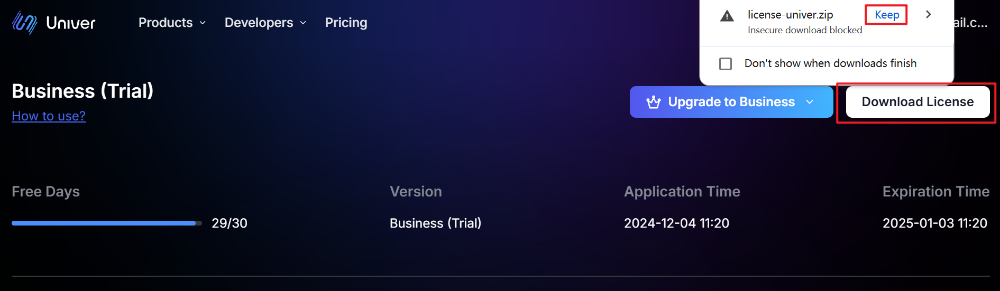
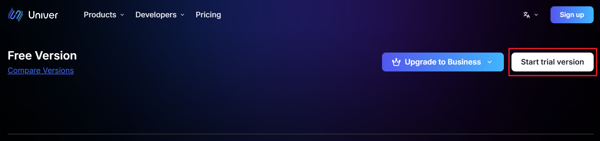
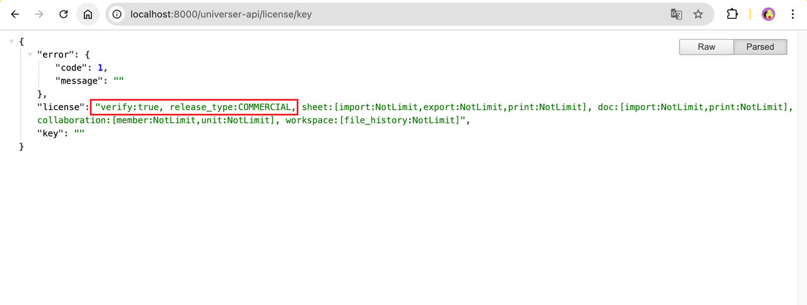

import { Cards, Callout, Steps, Tabs } from 'nextra/components'

# License

## Overview

Full Univer Pro Features require license support. You can activate paid plans by adding a license to your project, or you can upgrade to a higher-level plan by updating your license. This page will guide you on how to obtain, configure, and verify licenses.

## Prerequisites
Before you begin, make sure you:
- Have integrated Univer Pro Features in your project. If you haven't completed the integration, please refer to [Integrating Univer Pro Features](/en-US/guides/sheets/pro-features/introduction#integrate-advanced-features).
- For server-side deployment, have completed Docker or Kubernetes environment configuration. If you haven't completed the configuration, please refer to [Docker Deployment Documentation](/en-US/guides/sheets/pro-features/server/deploy#deploy-to-docker-compose) or [Kubernetes Deployment Documentation](/en-US/guides/sheets/pro-features/server/deploy#deploy-to-k8s).
- Have a valid license. If you don't have one yet, you can obtain it by registering on the [License Page](https://univer.ai/en-US/license).

## Download License
1. Visit the [License Page](https://univer.ai/en-US/license) and log in to your account

2. Download the license file


### Apply for Free Trial License

If you don't have a license or are still considering whether to purchase, we have prepared a 30-day trial license for you to fully experience all Pro Features of Univer.

1. Visit the [License Page](https://univer.ai/en-US/license) and log in to your account

2. Click the "Get Trial License" button



## Add or Update License

Unzip the downloaded license file `license-univer.zip`, you will get `license.txt` and `licenseKey.txt` files. Please keep these two files safe and ensure that you do not modify their format and content.

### Using License in JavaScript/TypeScript Projects

#### Presets Installation Mode

```typescript
import { UniverSheetsAdvancedPreset } from '@univerjs/presets/preset-sheets-advanced';

const { univerAPI } = createUniver({
  // ...
  presets: [
    // ...
    UniverSheetsAdvancedPreset({
      license: `Content of your license.txt file`,
    }),
  ],
});
```

#### Plugin Installation Mode

Register the `UniverLicensePlugin` plugin. Make sure this plugin is registered first after the univer instance is initialized. Then paste the content of the `license.txt` file into the license parameter of the plugin.

```typescript
import { UniverLicensePlugin } from '@univerjs-pro/license';

univer.registerPlugin(UniverLicensePlugin, {
  license: `Content of your license.txt file`
});
```

### Using License with Univer Server

<Tabs items={['docker-compose', 'Kubernetes']}>
  <Tabs.Tab>
    1. Copy the `license.txt` and `licenseKey.txt` files to the `/univer-server/configs/` directory.
    2. Run the service script `bash run.sh` in the univer-server directory to restart the universer service.
  </Tabs.Tab>
  <Tabs.Tab>
    1. Execute the following command
    ```bash
    helm upgrade --install -n univer --create-namespace \
      --set global.istioNamespace="univer" \
      --set-file universer.license.licenseV2=$(YOUR_LICENSE_TXT_PATH) \
      --set-file universer.license.licenseKeyV2=$(YOUR_LICENSE_KEY_TXT_PATH) \
      univer-stack oci://univer-acr-registry.cn-shenzhen.cr.aliyuncs.com/helm-charts/univer-stack
    ```
  </Tabs.Tab>
</Tabs>

## Verify License

### Verifying License in JavaScript/TypeScript Projects
1. After injecting the License into the frontend and starting the project, you can verify whether the License is valid and being used correctly.
Note: If no license is entered, or if the entered license is invalid (e.g., expired or incorrect content), some features will be restricted, and a watermark will be displayed on the page.


2. With a valid license entered, the project will run normally without restrictions.


### Verifying License in Univer Server

1. Visit `host:8000/universer-api/license/key` to view the license entitlement information. For example: If your service is running locally, please visit `http://localhost:8000/universer-api/license/key`.

```json
{
  "verify":"true", // License verification result
  "release_type":"COMMERCIAL" // License type
}
```


## Common Issues

1. If license verification fails, please check:
   - Whether the license files are complete and unmodified
   - Whether the license has expired
   - Whether the service has been correctly restarted
2. For other issues, please contact our technical support

## Related Links
- [Integrating Univer Pro Features](/en-US/guides/sheets/pro-features/introduction#integrate-advanced-features)
- [Docker Deployment Documentation](/en-US/guides/sheets/pro-features/server/deploy#deploy-to-docker-compose)
- [Kubernetes Deployment Documentation](/en-US/guides/sheets/pro-features/server/deploy#deploy-to-k8s)
