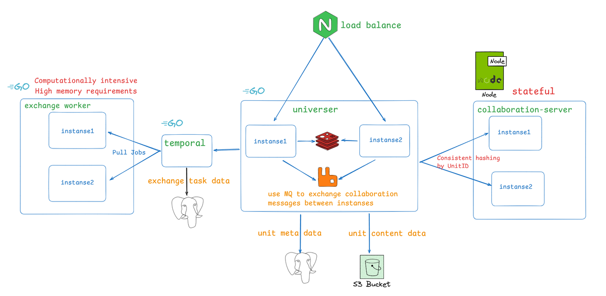

import { Tabs } from 'nextra/components'

# Production deployment

## Introduction to Deployment Architecture and Services



Service Introduction:
- collaboration-server: Collaborative editing engine in the backend, implementing the same OT algorithm as the frontend in the backend
- universer: handles various operation requests for units, maintains units data, and handles broadcast of collaborative messages
- exchange worker: responsible for executing the import and export calculation tasks of units. It is a computationally intensive service and also has a large memory requirement

Please note that collaboration-server is a stateful service, and editing requests for the same unit are processed in the same collaboration-server instance, which greatly reduces the possibility of loading data during processing and increases overall performance. Therefore, when universer calls collaboration server for application editing processing, we add a layer of consistent hash routing.

Component introduction:
- RDS: Relational database, used to store unit metadata, permission configuration, etc
- Object Storage: Object storage is used to store the content data of units, including images, data blocks, etc
- Redis: caching online collaborators of units, limit user access rate
- Rabbitmq: message queue, used for exchanging collaborative messages that need to be broadcast between universer services
- Temporal: an open-source process execution engine that Univer uses to manage the asynchronous process of import and export tasks

## Preparation before deployment

After understanding the basic architecture of Univer backend services, you should also carefully evaluate the following issues before production deployment:

### how to deploy

Univer currently provides two deployment methods:
- Deploy using Docker compose

Please note: Docker compose can only be deployed on a single machine, so it can only be scaled vertically. If you are not running K8s and the scale is not very large, you can choose it.

- deployment using k8s compatible with standards

If you are running a K8s cluster and which is compatible with the k8s standard, it's the best choice. Univer supports horizontal scaling, and deploying with K8s can achieve the best scalability.

### Determine if you have a need for user authentication and permission management

This is not enabled by default. You need to decide whether to enable it according to your needs. For more details, please refer [Integrate with your system via USIP(/guides/sheets/pro-features/server/integrate-usip)

### Capacity assessment

You need to carefully evaluate your capacity requirements. If the demand is large, the Docker Compose deployment method may not be suitable. Special note:

- Import&export service is computationally intensive. When processing import and export tasks, it may occupy a large amount of CPU and memory in a short period of time, especially when importing large documents. You need to evaluate the possible requirements for import and export and allocate appropriate CPU and memory for them
- collaboration-server is a stateful node service, and it will occupy more memory when editing more units at the same time. You need to carefully evaluate the number of instances required and the memory configuration of each instance

### component selection

As shown in the above system deployment architecture, the components that Univer will use include: MQ, Redis, RDS, Object Storage, and the installation package of Univer will include commonly used open source versions of the corresponding components.

Of course, Univer supports you to switch to your own maintained components, and we strongly recommend that you do so, which can help improve:
- system maintenance
- Ensure the security of data storage
- Ensure the stability of system
Especially for the storage components RDS and Object storage, if you use the built-in version, it is very likely to cause permanent data loss in the case of machine storage destruction. This is a relatively large risk. If you do not have your own storage infrastructure, it is recommended to choose services provided by Public Cloud vendors. If you can only use the built-in storage components of Univer, you must backup your data regularly, and it is recommended to backup every day.

If you choose to use your own maintained components, you need to ensure full compatibility with Univer's requirements for these components. The requirements for each component are as follows:

#### MQ

Full compatibility with AMQP/AMQPS is required. Currently, it is recommended to use Rabbit MQ. The Univer installation package uses Rabbit MQ's official mirroring rabbitmq: 3-management.

#### Redis

It needs to be compatible with all Redis commands. The Univer installation package uses the standard version of Redis official mirroring bitnami/redis: 7.0.15 -debian-11-r3.
Currently, the Redis commands used by Univer include: GET, MGET, SET, SETNX, DEL, EXISTS, EXPIRE, HSET, HGET, HDEL, HGETALL, HLEN, SCAN, Pipeline, EVAL, EVALSHA. You need to ensure that your Redis components are compatible. Of course, under the premise of compatibility, you can also use a distributed version of Redis.

#### RDS

Currently, we have adapted PostgreSQL 16.1, MySQL 8.0, GaussDB, and DamengDB. You can choose these or compatible databases. The Univer installation package uses the official PostgreSQL mirroring postgres: 16.1.
However, please note that Univer currently does not support distributed databases. If your distributed database is not fully compatible with access like a standalone database, you cannot use it. For example, databases that require sharding with table fields are not currently supported. In addition, if you are using a fully compatible distributed database like TiDB, you should also be cautious because the IDs generated by Univer's current ID generator are increasing in trend, which will cause its requests to be processed on the same node and have poor performance.

#### Object Storage

API compatibility with AWS S3 is required. The Univer installation package uses Minio's official mirroring bitnami/minio: 2024.8.3 -debian-12-r1.

#### observability component

When operating and maintaining the backend services of Univer in the future, do you want to use the observability components integrated with Univer or connect to your own observability system? Univer currently provides Prometheus metrics, grafana dashboards, and service logs. For more details, please read the [SRE Manual(/guides/sheets/pro-features/server/sre-manual).
If you don't have your own observability system, it is recommended to enable the built-in observability components of Univer.

## Deployment configuration

### How to modify the deployment configuration?

#### Deploy using docker compose

The default deployment configuration of Univer is in the .env file under the installation directory. If you need to modify the installation configuration, do not directly modify this .env file. Instead, create a custom configuration file named .env.custom under the directory where the .env file is located. If you configure the value of a configuration item in the .env.custom file, the Univer installation script will replace the default value in the .env file with the value you configured.

#### Deploy using K8s

The default deployment configuration of Univer is in the values.yaml file of helm chart, [click here to view](https://github.com/dream-num/helm-charts/blob/main/charts/univer-stack/values.yaml). If you want to modify the configuration, you don't need to modify the files in the charts. Just create a new values.yaml file and write the configuration items you want to modify into it. Specify your values.yaml file during helm installation, helm will replace the default configuration items with the configuration items you set. Of course, the configuration items you haven't set will use the default values. The specific helm command is explained in the final deployment step.

### Configuration details

#### Enable identity authentication and permission management

The meaning of the configuration item has been described in [Integrate with your system via USIP(/guides/sheets/pro-features/server/integrate-usip), If you need to enable it, you can configure it as follows:

<Tabs items={['docker compose', 'k8s']}>
  <Tabs.Tab label="docker compose">
  Write to the .env.custom

  ```properties
  # usip about
  USIP_ENABLED=true  # Set true to enable USIP
  USIP_URI_CREDENTIAL=https://your-domain/usip/credential
  USIP_URI_USERINFO=https://your-domain/usip/userinfo
  USIP_URI_ROLE=https://your-domain/usip/role
  USIP_URI_COLLABORATORS=https://your-domain/usip/collaborators
    
  # auth about
  AUTH_PERMISSION_ENABLE_OBJ_INHERIT=false
  AUTH_PERMISSION_CUSTOMER_STRATEGIES=
  ```
  </Tabs.Tab>
  <Tabs.Tab label="k8s">
  Write to the values.yaml

  ```yaml
  universer:
    config:
      usip:
        enabled: true  # Set true to enable USIP
        uri:
          userinfo: "https://your-domain/usip/userinfo"
          collaborators: "https://your-domain/usip/collaborators"
          role: "https://your-domain/usip/role"
          credential: "https://your-domain/usip/credential"
      auth:
        permission:
          enableObjInherit: false
          customerStrategies: ""
  ```
  </Tabs.Tab>
</Tabs>

#### Enable Univer event publishing

The meaning of the configuration item has been described in [Integrate with your system via Univer event publishing(/guides/sheets/pro-features/server/event-sync),If you need to enable it, you can configure it as follows:

<Tabs items={['docker compose', 'k8s']}>
  <Tabs.Tab label="docker compose">
  Write to the .env.custom
  ```properties
  EVENT_SYNC=true  # Set true to enable
  ```
  </Tabs.Tab>
  <Tabs.Tab label="k8s">
  Write to the values.yaml
  ```yaml
  universer:
    config:
      rabbitmq:
        eventSync: true  # Set true to enable
  ```
  </Tabs.Tab>
</Tabs>

#### Use self-maintained components

##### RDS

Please note that the components used by Univer, Temporal, do not support gaussdb and damengDB. If you choose them, Univer will install a dedicated postgresql for Temporal. The data stored in Temporal's DB is the process state of import and export tasks, which will not involve any data in your document. Even if it is lost, it will only cause the failure of the import and export tasks that you have not yet completed, and there will be no other impact.

###### Use RDS compatible with postgresql

<Tabs items={['docker compose', 'k8s']}>
  <Tabs.Tab label="docker compose">
  Write to the .env.custom

  ```properties
  # RDS config
  DISABLE_UNIVER_RDS=true  # When using your own RDS, prevent Univer deploying the default postgresql
    
  DATABASE_DRIVER=postgresql  # Set to postgresql to use a postgresql-compatible database
  DATABASE_HOST=your-database-host
  DATABASE_PORT=your-database-port
  DATABASE_DBNAME=univer  # database initialization scripts use this name by default, if you have changed, please update here to keep it consistent
  DATABASE_USERNAME=user-name  # You should grant select, insert, update, delete permissions to this user
  DATABASE_PASSWORD=password
  ```
  </Tabs.Tab>
  <Tabs.Tab label="k8s">
  Write to the values.yaml
  ```yaml
  postgresql:
    enabled: false  # When using your own RDS, prevent Univer deploying the default postgresql

  universer:
    config:
      database:
        driver: postgresql # Set to postgresql to use a postgresql-compatible database
        host: your-database-host
        port: your-database-port
        dbname: univer  # database initialization scripts use this name by default, if you have changed, please update here to keep it consistent
        username: postgres # You should grant select, insert, update, delete permissions to this user
        password: postgres

  temporal:  # temporal uses databases too
    server:
      config:
        persistence:
          default:
            driver: "sql"
            sql:
              driver: "postgres12"  # use postgres12
              host: your-database-host
              port: your-database-port
              database: temporal  # database initialization scripts use this name by default, if you have changed, please update here to keep it consistent
              user: postgres      # You should grant select, insert, update, delete permissions to this user
              password: postgres

          visibility:
            driver: "sql"
            sql:
              driver: "postgres12"  # use postgres12
              host: your-database-host
              port: your-database-port
              database: temporal_visibility  # database initialization scripts use this name by default, if you have changed, please update here to keep it consistent
              user: postgres     # You should grant select, insert, update, delete permissions to this user
              password: postgres
  ```
  </Tabs.Tab>
</Tabs>

###### Use RDS compatible with MySQL

<Tabs items={['docker compose', 'k8s']}>
  <Tabs.Tab label="docker compose">
  add to the .env.custom

  ```properties
  # RDS config
  DISABLE_UNIVER_RDS=true  # When using your own RDS, prevent Univer deploying the default postgresql
    
  DATABASE_DRIVER=mysql  # Set to mysql to use a mysql-compatible database
  DATABASE_HOST=your-database-host
  DATABASE_PORT=your-database-port
  DATABASE_DBNAME=univer  # database initialization scripts use this name by default, if you have changed, please update here to keep it consistent
  DATABASE_USERNAME=user-name  # You should grant select, insert, update, delete permissions to this user
  DATABASE_PASSWORD=password
  ```
  </Tabs.Tab>
  <Tabs.Tab label="k8s">
  add to the values.yaml

  ```yaml
  postgresql:
    enabled: false  # When using your own RDS, prevent Univer deploying the default postgresql

  universer:
    config:
      database:
        driver: mysql      # Set to mysql to use a mysql-compatible database
        host: your-database-host
        port: your-database-port
        dbname: univer  # database initialization scripts use this name by default, if you have changed, please update here to keep it consistent
        username: mysql  # You should grant select, insert, update, delete permissions to this user
        password: mysql

  temporal:
    server:
      config:
        persistence:
          default:
            driver: "sql"
            sql:
              driver: "mysql8" # use mysql8
              host: your-database-host
              port: your-database-port
              database: temporal  # database initialization scripts use this name by default, if you have changed, please update here to keep it consistent
              user: mysql  # You should grant select, insert, update, delete permissions to this user
              password: mysql

          visibility:
            driver: "sql"
            sql:
              driver: "mysql8" # use mysql8
              host: your-database-host
              port: your-database-port
              database: temporal_visibility  # database initialization scripts use this name by default, if you have changed, please update here to keep it consistent
              user: mysql  # You should grant select, insert, update, delete permissions to this user
              password: mysql
  ```
  </Tabs.Tab>
</Tabs>

###### use gaussdb

<Tabs items={['docker compose', 'k8s']}>
  <Tabs.Tab label="docker compose">
  add to the .env.custom

  ```properties
  # RDS config
  DISABLE_UNIVER_RDS=true  # When using your own RDS, prevent Univer deploying the default postgresql
    
  DATABASE_DRIVER=gaussdb  # set to gaussdb when use gaussdb
  DATABASE_HOST=your-database-host
  DATABASE_PORT=your-database-port
  DATABASE_DBNAME=univer  # database initialization scripts use this name by default, if you have changed, please update here to keep it consistent
  DATABASE_USERNAME=user-name  # You should grant select, insert, update, delete permissions to this user
  DATABASE_PASSWORD=password
  ```
  </Tabs.Tab>
  <Tabs.Tab label="k8s">
  add to the values.yaml

  ```yaml
  universer:
    config:
      database:
        driver: gaussdb  # set to gaussdb when use gaussdb
        host: your-database-host
        port: your-database-port
        dbname: univer  # database initialization scripts use this name by default, if you have changed, please update here to keep it consistent
        username: gaussdb  # You should grant select, insert, update, delete permissions to this user
        password: gaussdb
  ```
  </Tabs.Tab>
</Tabs>

###### use damengDB

<Tabs items={['docker compose', 'k8s']}>
  <Tabs.Tab label="docker compose">
  add to the .env.custom

  ```properties
  # RDS config
  DISABLE_UNIVER_RDS=true # When using your own RDS, prevent Univer deploying the default postgresql
    
  DATABASE_DRIVER=dameng # set to dameng when use damengDB
  DATABASE_HOST=your-database-host
  DATABASE_PORT=your-database-port
  DATABASE_DBNAME=univer # database initialization scripts use this name by default, if you have changed, please update here to keep it consistent
  DATABASE_USERNAME=user-name # You should grant select, insert, update, delete permissions to this user
  DATABASE_PASSWORD=password
  ```
  </Tabs.Tab>
  <Tabs.Tab label="k8s">
  add to the values.yaml

  ```yaml
  universer:
    config:
      database:
        driver: dameng # set to dameng when use damengDB
        host: your-database-host
        port: your-database-port
        dbname: univer # database initialization scripts use this name by default, if you have changed, please update here to keep it consistent
        username: dameng # You should grant select, insert, update, delete permissions to this user
        password: dameng
  ```
  </Tabs.Tab>
</Tabs>

##### Redis

<Tabs items={['docker compose', 'k8s']}>
  <Tabs.Tab label="docker compose">
  add to the .env.custom

  ```properties
  # redis config
  DISABLE_UNIVER_REDIS=true  # When using your own redis, prevent Univer deploying the default redis
    
  # if you use redis cluster, use comma ',' to separate multiple addresses
  # for example: REDIS_ADDR=192.168.1.5:6001,192.168.1.5:6002,192.168.1.5:6003
  REDIS_ADDR=host:port[,host:port]
  REDIS_USERNAME=user-name
  REDIS_PASSWORD=password
  REDIS_DB=0
  ```
  </Tabs.Tab>
  <Tabs.Tab label="k8s">
  add to the values.yaml

  ```yaml
  universer:
    config:
      redis:
        poolSize: 100
        # if you use redis cluster, use comma ',' to separate multiple addresses
        # for example: 192.168.1.100:6379,192.168.1.101:6379
        addr: host:port[,host:port]
        read_timeout: 1s
        write_timeout: 1s
        db: 0
        username: "user-name"
        password: "password"

  redis:
    enabled: false  # When using your own redis, prevent Univer deploying the default redis
  ```
  </Tabs.Tab>
</Tabs>

##### MQ

<Tabs items={['docker compose', 'k8s']}>
  <Tabs.Tab label="docker compose">
  add to the .env.custom

  ```properties
  DISABLE_UNIVER_MQ=true  # When using your own MQ, prevent Univer deploying the default MQ
    
  RABBITMQ_CLUSTER_ENABLED=true  # must be true
  RABBITMQ_CLUSTER_USERNAME=user-name # need grant Declear Exchange、Produce、Consume to the user
  RABBITMQ_CLUSTER_PASSWORD=password  # password
    
  # use comma to separate multiple addresses
  # for example: RABBITMQ_CLUSTER_ADDR=192.168.1.2:5672,192.168.1.5:5672,192.168.1.7:5672
  # Each addr must be able to Consume and Produce. Univer will poll these host when connecting, until the connection is successful
  RABBITMQ_CLUSTER_ADDR=host:port[,host:port]
    
  # RABBITMQ_CLUSTER_VHOST is the vhost of the rabbitmq cluster. If you don't set it, the default value is /
  # for example: RABBITMQ_CLUSTER_VHOST=univer
  RABBITMQ_CLUSTER_VHOST=/
  RABBITMQ_CLUSTER_SCHEMA=amqp
  ```
  </Tabs.Tab>
  <Tabs.Tab label="k8s">
  add to the values.yaml

  ```yaml
  universer:
    config:
      rabbitmq:
        cluster:
          enabled: true  # must be true
          # use comma to separate multiple addresses
          # for example: RABBITMQ_CLUSTER_ADDR=192.168.1.2:5672,192.168.1.5:5672
          # Each addr must be able to Consume and Produce. Univer will poll these host when connecting, until the connection is successful
          addr: "192.168.1.2:5672,192.168.1.5:5672"
          username: "admin"    # need grant Declear Exchange、Produce、Consume to the user
          password: "rabbitmq"
          vhost: "/"
          schema: amqp

  rabbitmq:
    enabled: false  # When using your own MQ, prevent Univer deploying the default MQ
  ```
  </Tabs.Tab>
</Tabs>

##### Object Storage

<Tabs items={['docker compose', 'k8s']}>
  <Tabs.Tab label="docker compose">
  add to the .env.custom

  ```properties
  DISABLE_UNIVER_S3=true  # When using your own Object Storage, prevent Univer deploying the default Minio
    
  # s3 config
  S3_USER=user
  S3_PASSWORD=password
  S3_REGION=your-inner-s3like-region  # s3-region
    
  # S3_PATH_STYLE
  # if set true, build url with Path-Style
  # if set false, build url with Virtual-Host Style
  S3_PATH_STYLE=true|false
    
  # S3_ENDPOINT address private
  S3_ENDPOINT=inner-visit-host:port
    
  # S3_ENDPOINT_PUBLIC public address
  S3_ENDPOINT_PUBLIC=public-visit-host:port
    
  # S3_DEFAULT_BUCKET
  S3_DEFAULT_BUCKET=default-bucket-name
  ```
  </Tabs.Tab>
  <Tabs.Tab label="k8s">
  add to the values.yaml

  ```yaml
  universer:
    config:
      s3:
        accessKeyID: admin
        accessKeySecret: minioadmin
        region: "us-east-1"
        endpoint: http://192.168.1.100:9000
        endpointPublic: ""
        usePathStyle: true
        defaultBucket: univer

  minio:
    enabled: false  # When using your own Object Storage, prevent Univer deploying the default Minio
  ```
  </Tabs.Tab>
</Tabs>

#### Enable Univer built-in observable components

<Tabs items={['docker compose', 'k8s']}>
  <Tabs.Tab label="docker compose">
  add to the .env.custom

  ```properties
  # observability config
  ENABLE_UNIVER_OBSERVABILITY=true  # set true to enable
  GRAFANA_USERNAME=set-your-admin-user-name-here      # initialise grafana admin user name 
  GRAFANA_PASSWORD=set-your-admin-user-password-here  # initialise grafana admin user password
  HOST_GRAFANA_PORT=13000  # grafana public port
  ```
  </Tabs.Tab>
  <Tabs.Tab label="k8s">
  Deploying built-in observable components in k8s does not require configuration. To enable it, please refer to the following K8s deployment operation.
  </Tabs.Tab>
</Tabs>

#### Capacity related configuration

<Tabs items={['docker compose', 'k8s']}>
  <Tabs.Tab label="docker compose">
  add to the .env.custom

  ```properties
  UNIVERSER_REPLICATION_CNT=2  # universer instances count
  COLLABORATION_SERVER_REPLICATION_CNT=2  # COLLABORATION_SERVER instances count
  COLLABORATION_SERVER_MEMORY_LIMIT=2048  # memory limit of each COLLABORATION_SERVER instances

  # Import and export configuration related to the capacity of exchange-worker.
  EXCHANGE_WORKER_REPLICATION_CNT=1 # working exchange worker count
  EXCHANGE_WORKER_MEMORY_LIMIT=4096 # MB, the memory limit of each exchange-worker.
  EXCHANGE_WORKER_IMPORT_CONCURRENT=1 # how many import tasks each worker can do at the same time.
  EXCHANGE_WORKER_EXPORT_CONCURRENT=1 # how many export tasks each worker can do at the same time.
  ```
  </Tabs.Tab>
  <Tabs.Tab label="k8s">
  add to the values.yaml

  ```yaml
  universer:
    replicaCount: 3  # universer instances count
  collaboration-server:
    replicaCount: 3  # COLLABORATION_SERVER instances count
    maxMemoryLimit: 2048 # MB, memory limit of each COLLABORATION_SERVER instances
  worker:
    replicaCount: 1  # working exchange worker count
    temporalWorker:
      importConcurrent: 1  # how many import tasks each worker can do at the same time.
      exportConcurrent: 1  # how many export tasks each worker can do at the same time.
  ```
  </Tabs.Tab>
</Tabs>

#### Network configuration

<Tabs items={['docker compose', 'k8s']}>
  <Tabs.Tab label="docker compose">
  If the default port exposed by Univer has been used by other services and needs to be modified, write it in the .env.custom file

  ```properties
  # If there is a conflict with your network configuration, you can modify the network segment used by docker. Use CIDR notation
  DOCKER_NETWORK_SUBNET=172.30.0.0/16

  # Univer API service exposed port, if it is the same as other server level port of your host machine, please change it to another port
  HOST_NGINX_PORT=the-univer-server-api-port-you-wantted

  # If you choose the built-in Minio as the object storage and there is a port conflict, please add this configuration item to modify it
  # Of course, if you are using your own maintained object storage, setting this configuration item will be meaningless
  HOST_MINIO_PORT=the-minio-port-you-wantted

  # If you choose the built-in observability components of Univer and there is a port conflict, please add this configuration item to modify it
  # Of course, if you are using your own maintained observability components, setting this configuration item will be meaningless
  HOST_GRAFANA_PORT=the-grafana-port-you-wantted
  ```
  </Tabs.Tab>
  <Tabs.Tab label="k8s">
  k8s has no such problems
  </Tabs.Tab>
</Tabs>

#### configuration to Allow cross-domain

<Tabs items={['docker compose', 'k8s']}>
  <Tabs.Tab label="docker compose">
  add to the .env.custom

  ```properties
  # allowed cross-origins config
  CORS_ALLOW_ORIGINS=["domain1", "domain2", "and more"]
  ```
  </Tabs.Tab>
  <Tabs.Tab label="k8s">
  add to the values.yaml

  ```yaml
  universer:
    config:
      server:
        http:
          corsAllowOrigins: ["domain1", "domain2", "and more"]
  ```
  </Tabs.Tab>
</Tabs>

#### Special configurations deployed using K8s

Univer configures the deployment front-end demo service by default in the helm chart, and sets the ingress routing domain name of the http gateway service universer as the domain name of the demo. During production deployment, you need to disable the demo service and change the ingress routing of universer to your domain name. You need to add the following configuration in values.yaml:

```yaml
collaboration-demo:
enabled: false  # set false to prevent deploy demo
universer:
ingress:
  enabled: true
  hosts:
    - host: "use-your-own-domain-here"  # set your real domain here
      paths:
        - path: /universer-api/
          pathType: Prefix
```

#### Configuration example

The following configuration example implemented:
- Enable USIP integration, authenticate user identity, and enable permission management
- Configure that only the document owner can copy content and print
- Enable Univer event publishing
- Use your own postgresql
- Use your own Object Storage
- Modify the port exposed by the Univer service
- Set capacity configuration for universer and collaboration-server

<Tabs items={['docker compose', 'k8s']}>
  <Tabs.Tab label="docker compose">
  .env.custom content

  ```properties
  # 1. enable USIP integration
  # usip about
  USIP_ENABLED=true
  USIP_URI_CREDENTIAL=https://usip-demo.univer.ai/usip/credential
  USIP_URI_USERINFO=https://usip-demo.univer.ai/usip/userinfo
  USIP_URI_ROLE=https://usip-demo.univer.ai/usip/role
  USIP_URI_COLLABORATORS=https://usip-demo.univer.ai/usip/collaborators
        
  # 2. only owner can copy content and print
  AUTH_PERMISSION_CUSTOMER_STRATEGIES=[ {"action": 3, "role": 2}, {"action": 6, "role": 2} ]
        
  # 3. enable univer event sync
  EVENT_SYNC=true  # set true to enable
        
  # 4. use owner RDS
  # postgresql config
  DISABLE_UNIVER_RDS=true
        
  DATABASE_DRIVER=postgresql
  DATABASE_HOST=univer-postgresql
  DATABASE_PORT=5432
  DATABASE_DBNAME=univer
  DATABASE_USERNAME=universer-biz
  DATABASE_PASSWORD=123456
        
  # 5. use owner Object storage
  # s3 config
  DISABLE_UNIVER_S3=true
        
  S3_USER=universer-biz
  S3_PASSWORD=123456
  S3_REGION=cn-sz
  S3_PATH_STYLE=true
  S3_ENDPOINT=univer-s3:9652
  S3_ENDPOINT_PUBLIC=univer.ai:9653
  S3_DEFAULT_BUCKET=univer
        
  # 6. change univer service Port
  HOST_NGINX_PORT=8010
        
  # 7. set the service scale
  UNIVERSER_REPLICATION_CNT=4
  COLLABORATION_SERVER_REPLICATION_CNT=4
  MAX_MEMORY_LIMIT=2048
  ```
  </Tabs.Tab>
  <Tabs.Tab label="k8s">
  values.yaml content, Note: When you need to modify multiple configurations, you need to merge them in the yaml.

  ```yaml
  collaboration-demo:
    enabled: false

  postgresql:
    enabled: false

  minio:
    enabled: false

  collaboration-server:
    replicaCount: 4
    maxMemoryLimit: 2048

  universer:
    replicaCount: 4
    ingress:
      enabled: true
      hosts:
        - host: "usip-demo.univer.ai"
          paths:
            - path: /universer-api/
              pathType: Prefix
    config:
      usip:
        enabled: true
        uri:
          userinfo: "https://usip-demo.univer.ai/usip/userinfo"
          collaborators: "https://usip-demo.univer.ai/usip/collaborators"
          role: "https://usip-demo.univer.ai/usip/role"
          credential: "https://usip-demo.univer.ai/usip/credential"
      auth:
        permission:
          customerStrategies: '[ {"action": 3, "role": 2}, {"action": 6, "role": 2} ]'
      rabbitmq:
        eventSync: true
      database:
        driver: postgresql
        host: univer-postgresql
        port: 5432
        dbname: univer
        username: universer-biz
        password: 123456
      s3:
        accessKeyID: universer-biz
        accessKeySecret: 123456
        region: "cn-sz"
        endpoint: "univer-s3:9652"
        endpointPublic: "univer.ai:9653"
        usePathStyle: true
        defaultBucket: univer

  temporal:
    server:
      config:
        persistence:
          default:
            driver: "sql"
            sql:
              driver: "postgres12"
              host: univer-temporal-postgresql
              port: 5432
              database: temporal
              user: univer-temporal
              password: 123456

          visibility:
            driver: "sql"
            sql:
              driver: "postgres12"
              host: univer-temporal-postgresql
              port: 5432
              database: temporal_visibility
              user: univer-temporal
              password: 123456
  ```
  </Tabs.Tab>
</Tabs>

## Production deploy SOP

After determining the configurations you need, you can deploy the Univer backend services following these steps.

### SOP of Deploy using docker [#deploy-to-docker-compose]

1. Prepare your configuration file `.env.custom`, If you don't have any configuration that needs to be modified, you can ignore this
2. Prepare your license, including file `license.txt` and `licenseKey.txt`
3. If you choose to use your own maintained RDS, please download the [Database Initialization Script](https://release-univer.oss-cn-shenzhen.aliyuncs.com/releases/latest/univer-server-sql-latest.tar.gz) and complete the initialization of RDS, including universer and temporal. If you are using gaussdb or damengdb, there's no need to initialize the temporal.
4. Fetch Univer backend services
   - if your server machine have access to the public internet
     - Execute `bash -c "$(curl -fsSL https://get.univer.ai/product)" [-- version]` to download the version you specified. If you didn't specify the version, the latest version will be downloaded by default.
   - if do not have
     - [click here](https://univer.ai/releases/univer-server/download) to download the All-in-one offline package
     - upload the All-in-one offline package to your server machine and decompress it
     - enter the decompressed package dir, execute `bash load-images.sh` to load the images to docker
5. Copy your prepared `.env.custom` to the backend service folder and place it in the directory where `.env` file located
6. Copy your license files `license.txt` and `licenseKey.txt` to the sub directory `configs/`
7. Enter the root directory of the backend service and execute `bash run.sh start` to start the Univer services
8. Now, you should test it, ensure it's working correctly.

### SOP of Deploy using K8s [#deploy-to-k8s]

Please note that when deploying using K8s: If you have custom configuration modifications, you need to implement version control of the custom configuration file values.yaml, because subsequent upgrade operations still require you to provide complete custom configurations. Univer recommends using version management tools such as git to manage it.

1. Prepare your configuration file `values.yaml`. If you don't need to modify anything, you can ignore this step
2. Prepare your license, including `license.txt` and `licenseKey.txt`
3. If you choose to use your own maintained RDS, go to download the [Database Initialization Script](https://release-univer.oss-cn-shenzhen.aliyuncs.com/releases/latest/univer-server-sql-latest.tar.gz) and complete the initialization of RDS, including universer and temporal. If you are using gaussdb or dameng, you do not need to initialize temporal
4. Execute the helm installation command
   - if your server machine have access to the public internet
     - Execute command to install
        ```bash
        helm install -n univer --create-namespace \
            -f your-own-values.yaml-path \
            --set global.istioNamespace="univer" \
            --set-file universer.license.licenseV2=your-license.txt-path \
            --set-file universer.license.licenseKeyV2=your-licenseKey.txt-path \
            univer-stack \
            oci://univer-acr-registry.cn-shenzhen.cr.aliyuncs.com/helm-charts/univer-stack \
            --version target-version

        # After successful execution, execute the following two commands to restart the services and complete the sidecar injection
        kubectl rollout restart -n univer deployment/collaboration-server
        kubectl rollout restart -n univer deployment/universer
        ```
     - If you want to deploy the observability components configured by Univer, please execute the following command:
        ```bash
        helm upgrade --install -n univer-observability --create-namespace \
            --set global.univerNamespace="univer" \
            univer-observability \
            oci://univer-acr-registry.cn-shenzhen.cr.aliyuncs.com/helm-charts/univer-observability
        ```

        Parameter description:

        - --set global.univerNamespace="univer": Configure to observe the cluster `"univer"`
   - if do not have
     - [click here](https://univer.ai/releases/univer-server/download) to download the K8s All-in-one offline package
     - upload the K8s All-in-one offline package to your server machine and decompress it
     - enter the decompressed package dir, execute command to load image:
        ```shell
        export REGISTER=XXXX # Your private image register
        export NAMESPACE=XXX # The namespace where image save
        docker login $REGISTER
        bash load-image.sh --registry $REGISTER --namespace $NAMESPACE
        ```
     - after loading image success, you can get a `values.yaml` and `values-observability.yaml` in current dir and you can edit it to set yourself custom config
       - values.yaml: Univer service setting values file
       - values-observability.yaml: Univer observability component setting values file
     - then please execute the following command to install:
        ```shell
        helm install -n univer --create-namespace \
            -f your-own-values.yaml-path \
            --set global.istioNamespace="univer" \
            --set-file universer.license.licenseV2=your-license.txt-path \
            --set-file universer.license.licenseKeyV2=your-licenseKey.txt-path \
            univer-stack \
            univer-stack-xxxx.tgz # should change to the right chart name

        # After successful execution, execute the following two commands to restart the services and complete the 
        kubectl rollout restart -n univer deployment/collaboration-server
        kubectl rollout restart -n univer deployment/universer
        ```
     - If you want to deploy the observability components configured by Univer, please execute the following command:
        ```bash
        helm upgrade --install -n univer-observability --create-namespace \
            --set global.univerNamespace="univer" \
            -f your-own-values-observability.yaml-path \
            univer-observability \
            univer-observability-xxxx.tgz
        ```

        Parameter description:

        - --set global.univerNamespace="univer": Configure to observe the cluster `"univer"`

Parameter description:

- -n univer: specify the cluster `namespace` as univer, you can change it at will, but remember that subsequent upgrades require it
- univer-stack: the name of `helm release`, you can change it at will, but remember that subsequent upgrades require it
- --version target-version: Specify the version to be deployed, you need to modify it to the target version, you can also remove this item to automatically select the latest version
- -f your-own-values.yaml-path: Specify the path of your custom configuration file `values.yaml`, you need to modify it correctly
- --set-file universer.license.licenseV2=your-license.txt-path: specify the path of `license.txt`
- --set-file universer.license.licenseKeyV2=your-licenseKey.txt-path: specify the path of `licenseKey.txt`

5. Now, you should test it, ensure it's working correctly.
