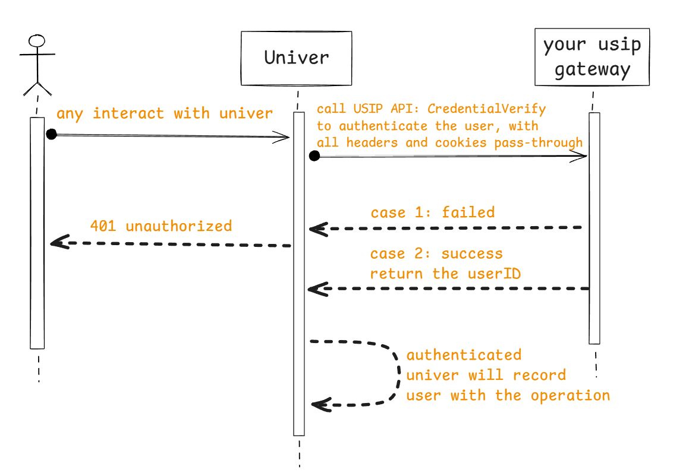
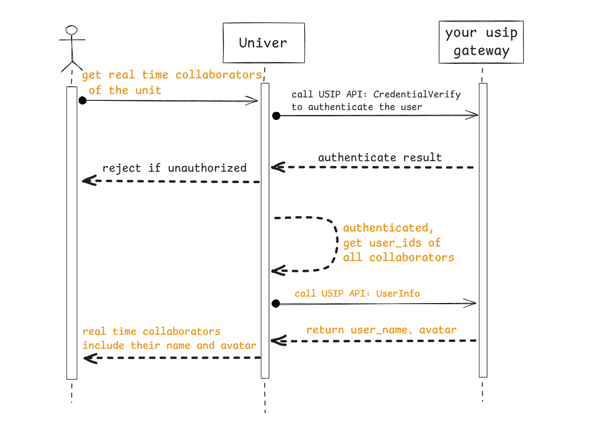
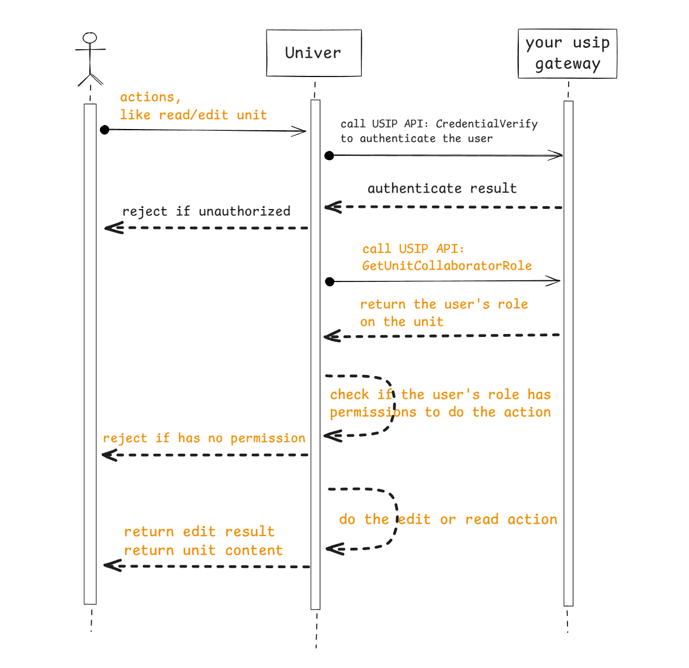

# Integrate with your system via USIP

## Overview

In fact, Univer's backend service does not integrate an account system (and shouldn't integrate). By default, Univer's backend service does not authenticate visitors, meaning that all users can access all resources.

If you need to authenticate users before they can access, you must implement your own account system. You can configure Univer server to interact with your system, and Univer server will call your system to complete authentication when it needs.

In order to achieve this type of interaction, Univer has designed the *Univer Server Integration Protocol (USIP)*. USIP is essentially a kind of SPI (Service Provider Interface), which is defined by Univer and then implemented by your system. Univer has defined some USIP interfaces according to the potential needs of customers. You can choose to implement some interfaces to change the process of Univer handling certain user requests, such as user authentication and permission verification. If the existing USIP interfaces cannot meet your needs, you can give us suggestions.

## USIP interface description

Currently, Univer defines two groups of USIP interfaces for different scenarios.

1. Account group

- User authentication
- User information acquisition

2. Permission group

- permission role: Obtain the user's permission role on a document
- list collaborators: Get the list of collaborators of a document

Below are detailed descriptions of each interface

### User authentication

#### Call scene

Every interact with the Univer backend should be authenticated, so the authentication SPI will be called every time.

#### Interaction flow



#### Protocol definition

| HTTP method | Headers | Parameter passing method | Response data format |
|:---------|:--------|:---------|:------------|
| GET | pass-through all headers transmitted by users, ensuring that you can use them for authentication | no parameters | `application/json` |

##### Request parameters

No request parameter

##### Response data

| Field name | Field Type | sample value | Description |
|:---------|:--------|:-----|:-------|
| user | **Object** | | the user object |
| &nbsp;&nbsp;user.userID | string | ace55655ceabd55 | the user ID, should make sure it can be mapped to your real users one by one, it is recommended to use the open_uid |
| &nbsp;&nbsp;user.name | string | alice | user name, used to display collaborator information in the frontend |
| &nbsp;&nbsp;user.avatar | string | https://image.xx/acde55acb45bbead55 | User's avatar URL, used to display collaborator information in the frontend |

sample response data:

```json
{
  "user": {
    "userID": "ace55655ceabd55g",
    "name": "alice",
    "avatar": "https://image.xx/acde55acb45bbead55"
  }
}
```

### Get user information in batches

#### Call scene

When multiple people collaborate, display the profile photo and name of the current collaborator; when viewing the comment list in the document, display the profile photo and name of the commenting user.

#### Interaction flow



#### Protocol definition

| HTTP method  | Headers | Parameter passing method | Response data format  |
|:---------|:--------|:---------|:------------|
| POST | No custom header, nor pass-through user request header | `Body: raw Json` | `application/json` |

##### Request parameters

| Field name | Field Type  | sample value | Description  |
|:---------|:--------|:-----|:-------|
| userIDs | array[string] | ["user_id1", "user_id2"] | array of user IDs |

sample request data:

```json
{
  "userIDs": [ "user_id1", "user_id2", "user_id3" ]
}
```

##### Response data

| Field name | Field Type | sample value | Description  |
|:---------|:--------|:-----|:-------|
| users | **array[Object]** | | user object array, containing each user in the request, the definition of the user object has been described in the authentication interface |

sample response:

```json
{
"users": [
    {"userID": "user_id1", "name":"name1", "avatar":"https://xxxx"},
    {"userID": "user_id2", "name":"name2", "avatar":"https://xxxx"},
    {"userID": "user_id3", "name":"name3", "avatar":"https://xxxx"}
  ]
}
```

### User permission role acquisition

#### Call scene

When a user reads or edits a unit, gets the user's permission role to determine whether there is permission for the corresponding operation.

#### Interaction flow



#### Protocol definition

| HTTP method  | Headers | Parameter passing method | Response data format |
|:---------|:--------|:---------|:------------|
| GET | No custom header, nor pass-through user request header | `Query Params` | `application/json` |

##### Request parameters

| Field name | Field Type  | sample value | Description  |
|:---------|:--------|:-----|:-------|
| userID | string | acd5455e44fc5bb55 | user ID |
| unitID | string | acff-adebc125e45b | unit ID |

sample request:

```bash
curl -X GET "http://sample.univer.ai/role?unitID=acff-adebc125e45b&userID=acd5455e44fc5bb55"
```

##### Response data

| Field name | Field Type  | sample value | Description  |
|:---------|:--------|:-----|:-------|
| userID | string | acd5455e44fc5bb55 | user ID |
| role   | string | editor            | user's permission role on the unit, Univer defines three roles: owner, editor, reader |

sample response data:

```json
{
  "userID": "acd5455e44fc5bb55",
  "role": "editor"
}
```

### list collaborators of the unit

#### Call scene

When setting the collaborators of a protected area or sub-table(only the collaborators of this unit can be set as readable/editable users of the sub-table and protected area).

#### Interaction flow


#### Protocol definition

| HTTP method | Headers | Parameter passing method | Response data format |
|:---------|:--------|:---------|:------------|
| POST | No custom header, nor pass-through user request header | `Body: raw Json` | `application/json` |

##### Request parameters

| Field name | Field Type  | sample value | Description  |
|:---------|:--------|:-----|:-------|
| unitIDs | array[string] | ["unit_id1", "unit_id2"] | array of unit ID |

sample request:

```json
{
  "unitIDs": [
    "unit_id1",
    "unit_id2",
    "unit_id3"
  ]
}
```

##### Response data

| Field name | Field Type  | sample value | Description  |
|:---------|:--------|:-----|:-------|
| collaborators | array[collaboratorList] |  | Collaborator object list for each unit |
| &nbsp;&nbsp;&nbsp;&nbsp;collaboratorList.unitID | string | acdf455e5f452 | unit ID |
| &nbsp;&nbsp;&nbsp;&nbsp;collaboratorList.subjects | array[subjectInfo] |  | List of collaborator objects for an unit |
| &nbsp;&nbsp;&nbsp;&nbsp;&nbsp;&nbsp;&nbsp;&nbsp;subjectInfo.role | string | editor | permissions role of the collaborator  |
| &nbsp;&nbsp;&nbsp;&nbsp;&nbsp;&nbsp;&nbsp;&nbsp;subjectInfo.subject | Object | | Collaborator Information |
| &nbsp;&nbsp;&nbsp;&nbsp;&nbsp;&nbsp;&nbsp;&nbsp;&nbsp;&nbsp;&nbsp;&nbsp;subject.type | string | user | can only be set to "user" |
| &nbsp;&nbsp;&nbsp;&nbsp;&nbsp;&nbsp;&nbsp;&nbsp;&nbsp;&nbsp;&nbsp;&nbsp;subject.id | string | acdef12555b12 | user ID |
| &nbsp;&nbsp;&nbsp;&nbsp;&nbsp;&nbsp;&nbsp;&nbsp;&nbsp;&nbsp;&nbsp;&nbsp;subject.name | string | alice | user name |
| &nbsp;&nbsp;&nbsp;&nbsp;&nbsp;&nbsp;&nbsp;&nbsp;&nbsp;&nbsp;&nbsp;&nbsp;subject.avatar | string | https://image.ai/36554 | avatar of the user |

sample response data:

```json
{
  "collaborators": [
    {
      "unitID":"unit_id1",
      "subjects": [
        {
          "subject": {
            "id": "1abcdef777",
            "name": "alice",
            "avatar": "https://image.ai/36554",
            "type": "user"
          },
          "role":"owner"
        },
        {
          "subject": {
            "id": "1abcdef779",
            "name": "bob",
            "avatar": "https://image.ai/36559",
            "type": "user"
          },
          "role":"editor"
        },
      ]
    }
  ]
}
```

## Configure to integrate via USIP

How to configure Univer backend services to enable user authentication and permission verification?

When deploying using Docker Compose, add the following configuration to the custom configuration file `.env.custom`:

```properties
# usip about
USIP_ENABLED=true  # Set true to enable USIP
USIP_URI_CREDENTIAL=https://your-domain/usip/credential # the implementation URL of USIP API user authentication
USIP_URI_USERINFO=https://your-domain/usip/userinfo     # the implementation URL of USIP API get user information
USIP_URI_ROLE=https://your-domain/usip/role             # the implementation URL of USIP API get user role
USIP_URI_COLLABORATORS=https://your-domain/usip/collaborators # the implementation URL of USIP API list collaborators
  
# auth about
AUTH_PERMISSION_ENABLE_OBJ_INHERIT=false  # See permission design instructions below
AUTH_PERMISSION_CUSTOMER_STRATEGIES=      # See permission design instructions below
```

When deploying with k8s, edit your custom `values.yaml` and add the following configuration:

```yaml
universer:
  config:
    usip:
      enabled: true  # Set true to enable USIP
      uri:
        userinfo: "https://your-domain/usip/userinfo" # the implementation URL of USIP API get user information
        collaborators: "https://your-domain/usip/collaborators" # the implementation URL of USIP API list collaborators
        role: "https://your-domain/usip/role"                   # the implementation URL of USIP API get user role
        credential: "https://your-domain/usip/credential"       # the implementation URL of USIP API user authentication
    auth:
      permission:
        enableObjInherit: false  # See permission design instructions below
        customerStrategies: ""   # See permission design instructions below
```

Please note that once you configure to enable USIP, the URLs of all four USIP APIs mentioned above need to be configured and your service needs to implement them correctly. For how to apply these configurations during deployment, please refer to [Production Deployment(/guides/sheets/pro-features/server/deploy).

## permission management design of Univer

Univer's permission control uses the `RBAC` model. Currently, there are three fixed roles: `owner`, `editor`, and `reader`. The editor role has the permissions of the reader role, and the owner role has the permissions of the editor and reader roles. Custom roles are not currently available, but users can configure the minimum role required for each action. Univer has a default configuration that takes effect. If you don't need it, you can do nothing. If necessary, you can configure it to cover the minimum role requirements for some actions.

The default actions and their required minimum roles built into Univer are as follows:
| action | enum value of the action | describe of the action | minimum role requirement | enum value of the role |
|:-------|:---------|:-------|:-------|:-------|
| ManageCollaborator | 2 | Invite/Delete the unit collaborators | owner | 2 |
| Copy | 6 | Copy content | reader | 0 |
| Print | 3 | Print  | editor | 1 |
| Duplicate | 4 | duplicate the unit | editor | 1 |
| Share | 7 | Share with others | reader | 0 |
| Export | 8 | Export  | editor | 1 |
| Comment | 5 | Comment | reader | 0 |
| View | 0 | read the unit | reader | 0 |
| MoveSheet | 25 | Move worksheets in workbooks | editor | 1 |
| DeleteSheet | 26 | delete worksheet | editor | 1 |
| HideSheet | 27 | hide worksheet | editor | 1 |
| CopySheet | 28 | duplicate worksheet | editor | 1 |
| RenameSheet | 29 | rename worksheet | editor | 1 |
| CreateSheet | 30 | create worksheet | editor | 1 |
| SetCellStyle | 33 | set the style of cells | editor | 1 |
| SetCellValue | 34 | set the value of cells | editor | 1 |
| InsertHyperlink | 16 | insert Hyperlink to cells | editor | 1 |
| Sort | 17 | sort | editor | 1 |
| Filter | 18 | Filter | editor | 1 |
| PivotTable | 19 | use PivotTable | editor | 1 |
| RecoverHistory | 43 | Recover unit to historical version | editor | 1 |
| ViewHistory | 44 | View the editing history | reader | 0 |
| SelectProtectedCells | 31 | Select cells in protected area | editor | 1 |
| SelectUnProtectedCells | 32 | Select cells not be protected | editor | 1 |
| SetRowStyle | 35 | set style of the row | editor | 1 |
| SetColumnStyle | 36 | set style of the column | editor | 1 |
| InsertRow | 37 | insert rows | editor | 1 |
| InsertColumn | 38 | insert columns | editor | 1 |
| DeleteRow | 39 | delete rows | editor | 1 |
| DeleteColumn | 40 | delete columns | editor | 1 |
| Delete | 42 | delete the whole unit | owner | 2 |
| CreatePermissionObject | 45 | create protected area of protected worksheet | editor | 1 |

If you want to modify the minimum roles required for some of the actions, such as setting that only the unit's owner (role = 2) can copy content (action = 6) and print (action = 3), you can configure it as follows:

When deploying using Docker Compose, add the following configuration to the custom configuration file `.env.custom`:

```properties
AUTH_PERMISSION_CUSTOMER_STRATEGIES=[{"action": 3, "role": 2}, {"action": 6, "role": 2}]
```

When deploying with k8s, edit your custom `values.yaml` and add the following configuration:
```yaml
universer:
  config:
    auth:
      permission:
        customerStrategies: '[ {"action": 3, "role": 2}, {"action": 6, "role": 2} ]'
```

It can be seen that the configured value is a JSON object array, and the action of the object is the enumeration value of the action in the above list, and the role is the enumeration value corresponding to the lowest role required by the action.

There is another point to pay attention to in the design of Univer permission management.

Univer not only controls permissions at the entire document level, but also controls permissions on protected areas/sub-tables under the unit, all of which have independent authorized user management. For example, if user A is the editor of the entire unit, but not the editor or owner of a protected area/sub-table in this unit, then user A cannot edit this protected area/sub-table. Under Univer's default configuration, even if user A is the owner of the unit, he cannot manage protected areas/sub-tables created by other users on this unit unless other users have added permissions to him. If you want to configure the owner of the unit to unconditionally have the owner role of all objects in the unit, you can modify the configuration as follows:

When deploying using Docker Compose, add the following configuration to the custom configuration file `.env.custom`:

```properties
AUTH_PERMISSION_ENABLE_OBJ_INHERIT=true
```

When deploying with k8s, edit your custom `values.yaml` and add the following configuration:

```yaml
universer:
  config:
    auth:
      permission:
        enableObjInherit: true
```

## USIP client system implementation example

[Refer to our USIP example source code](https://github.com/dream-num/usip-example)

## Frontend Custom Request Headers Configuration

When using USIP, you may need to add custom request headers (such as Authorization tokens) to frontend requests. You can achieve this through Univer's HTTPService interceptor.

Add the following code when initializing the Univer instance:

```typescript
import { HTTPService } from '@univerjs/presets/preset-sheets-core'

// Get injector from univer instance
const injector = univer.__getInjector()
// Add custom request headers
const httpService = injector.get(HTTPService)
httpService.registerHTTPInterceptor({
  priority: 0,
  interceptor: (request, next) => {
    // Add your required headers here
    // For example, add Authorization token:
    // request.headers.set('Authorization', 'Bearer your-token-here')
    return next(request)
  },
})
```

For more detailed information and complete configuration examples, please refer to [Univer Pro Sheet Starter Kit](https://github.com/dream-num/univer-pro-sheet-start-kit/blob/main/src/setup-univer.ts).
