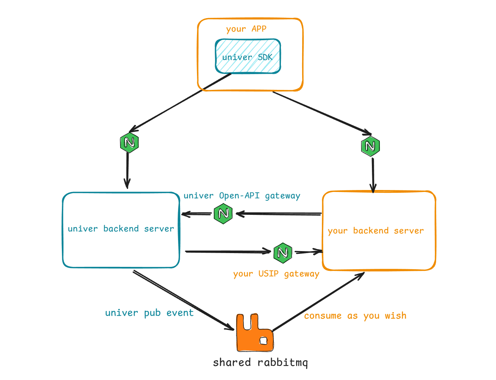

# Integration overview

Why need to integrate with your own system?

After the `Quick Start`, you have already experienced the features provided by the Univer backend. You should have noticed that everyone can access all units without logging in. If you want to force users to log in before they can access any unit resources and manage their permissions (the unit created by me cannot be read by others unless I add reading/editing permissions to them), how can you achieve this? If someone comments to your document, how can you be notified? How to operate all document resources through your own backend service?

To enable these capabilities, you need to integrate Univer's backend services with your own system. Univer has designed the following three mechanisms to meet these needs:

- USIP(Univer's SPI): This is a mechanism similar to plugins.
- OpenAPI: designing, will be gradually launched in the future
- Univer event publishing: Some events is already available

Here's the deployment architecture when integrated with your system:

Next, we will introduce the details of these mechanisms
- [Integrate with your system via USIP](/guides/sheets/pro-features/server/integrate-usip)
- [Integrate with your system via Univer event publishing](/guides/sheets/pro-features/server/event-sync)
