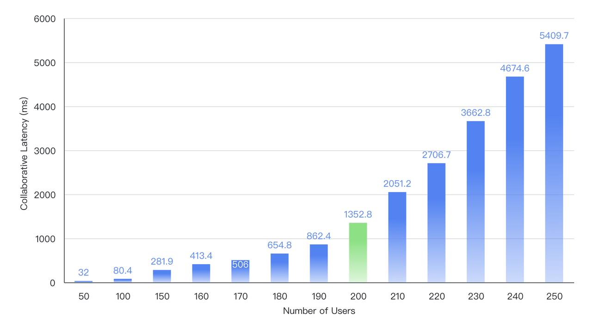

# Performance Report

## Performance of Loading snapshots from memory

| Spreadsheet Cells Count | Time (s) |
| --- | --- |
| 1M (100,000 rows, 10 columns) | 0.274 |
| 1M (10,000 rows, 100 columns) | 0.241 |
| 10M (1,000,000 rows, 10 columns) | 1.520 |
| 10M (100,000 rows, 100 columns) | 0.945 |

## Performance of Formula calculation

| Formulas | Time (s) |
| --- | --- |
| 20,000 common formulas for random reference ranges | 1.32 |
| 20,000 common formulas for nesting | 1.37 |
| 20,000 VLOOKUP formulas | 4.73 |
| 20,000 nested SUM formulas | 1.38 |

## Performance of Rendering

Test machine spec: a Windows Laptop with i9-13900H CPU and 32GB memory

| Spreadsheet Cells Count | FPS when scrolling |
| --- | --- |
| 100k (10k rows, 10 columns) | 50 ~ 60 |
| 200k (20k rows, 10 columns) | 50 ~ 60 |
| 1m (100k rows, 10 columns) | 50 ~ 60 |
| 6m (600k rows, 10 columns) | 50 ~ 60 |

## Performance of Pivot Table

Test machine spec: a MacBook Pro with Apple Silicon M2 Pro

| Spreadsheet Cells Count | Read data (s) | Query time (s) |
| --- | --- | --- |
| 500k (1 pivot row dimension, 1 pivot col dimension, 2 value dimensions) | 0.252 | 0.040 |
| 1M (1 pivot row dimension, 1 pivot col dimension, 2 value dimensions) | 0.376 | 0.078 |
| 2M (1 pivot row dimension, 1 pivot col dimension, 2 value dimensions) | 0.732 | 0.140 |
| 5M (1 pivot row dimension, 1 pivot col dimension, 2 value dimensions) | 3.200 | 0.415 |

## Performance of Transforming Office Files

Test machine spec: EC2: 4vCPU and 8GiB; CPU model: Intel (R) Xeon (R) Platinum 8369B CPU @ 2.90GHz

| Spreadsheet Cell Count | Filesize | Import from .xlsx files (s) | Export to .xlsx files (s) |
| --- | --- | --- | --- |
| 50k (1,000 rows / 25 cols / 2 sheets) | 0.5M | 0.04 | 0.23 |
| 500k (2,500 rows / 50 cols/ 4 sheets) | 5.4M | 1.22 | 2.5 |
| 1M (5,000 rows / 25 cols / 8 sheets) | 11M | 2.39 | 5.1 |
| 5M (10,000 rows / 50 cols / 10 sheets) | 55M | 11.3 | 25.3 |
| 10M (200,000 rows / 50 cols / 1 sheet) | 110M | 34.4 | 54.9 |

## Latency of Collaborative editing 

The Univer Collaboration Engine performs excellently while ensuring stability and reliability. The benchmark test results of the Univer Collaboration Engine on a 4C8G server are as follows, successfully maintaining a collaboration delay of around 1.3 seconds when handling 200 concurrent users, approaching the top performance level in the industry.

