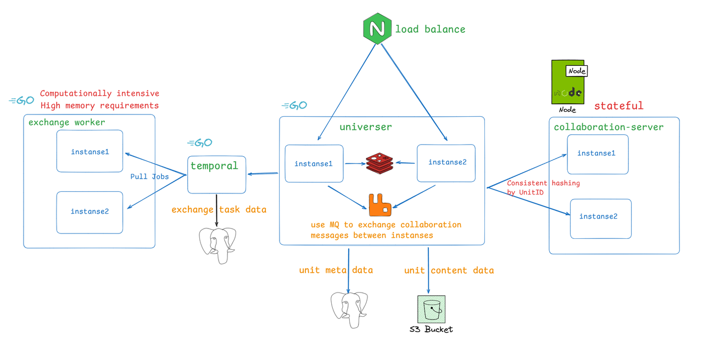

## 部署架构及服务介绍



### 服务介绍

- collaboration-server：后端的协同编辑引擎，在后端实现了和前端一致的 OT 算法
- universer：处理文档的各种操作请求，维护文档数据，处理协同消息的广播
- exchange worker：负责执行文档的导入导出计算任务，是计算密集型服务，同时也有大内存需求

<Callout>
  collaboration-server 是有状态服务，对同一个文档的编辑请求处理都在同一个 collaboration-server 实例中进行，这样可以大大减少处理时需要加载数据的可能，从而增加了整体性能。
  所以我们在 universer 调用 collaboration server 应用编辑处理时，增加了一层一致性 hash 路由。
</Callout>

### 组件介绍
- RDS：关系型数据库，用于存储文档的元数据、权限配置等
- Object Storage：对象存储，用于存储文档的内容数据，包括图片、数据块等
- Redis：文档在线协作者缓存、API 限流
- Rabbitmq：消息队列，用于 universer 服务间交换需要广播的协同消息
- Temporal：开源的流程执行引擎，Univer 将其用于管理文档导入导出的异步流程

## 部署前准备

了解了 Univer 后端服务的基本架构后，在生产部署之前，你还应该认真评估以下问题：

### 部署方式的选择：

Univer 目前提供两种部署方式：

- 使用 Docker compose 部署

docker compose 方式只能单机部署，因此其能支持的规模有限，只能进行纵向扩展，而**不支持横向扩展**。如果你没有在运维 K8s，并且使用规模不是很大，可以使用此方式部署。

- 使用兼容标准的 K8S 部署

如果你有在运维 K8s 集群，且能兼容标准 K8s 模式，用这种方式部署最好了。Univer 支持了水平扩容，用 K8s 部署能获得最佳的可扩展性。

### 确定你是否有用户身份认证和权限校验的需求

Univer 的安装配置默认是未启用的，你需要根据你的使用需求决定是否需要启用，相关说明请查看[通过 USIP 与你的系统集成](/guides/sheets/pro-features/server/integrate-usip)

### 容量评估

你需要认真评估下你的容量需求，如果需求较大，docker compose 方式部署可能就不适合了。特别说明：

- 导入导出服务 exchange worker 是计算密集型，在处理导入导出任务时，短时间内可能会占用大量的 CPU 和内存，尤其是导入大文档时。你需要评估好导入导出的可能需求，为其分配合适的 CPU 和内存
- 协同引擎 collaboration-server 是有状态的 node 服务，并且在同时打开较多的文档编辑时会占用较多的内存，你需要认真评估需要的实例数和每个实例的内存配置

### 基础组件选择

如上述系统部署架构所示，Univer 会用到的基础组件包括：MQ、Redis、RDS、Object Storage，并且 Univer 的安装包会包含对应组件的常用的开源版本。

当然，Univer 支持你改用自己维护的组件，并且我们强烈建议你这样做，这样：
- 利于系统维护
- 确保数据的存储安全
- 确保系统运行的稳定性
特别是文档数据的存储组件 RDS 和 Object storage，如果你使用 Univer 的内置版本，在物理机存储破坏的情况下很有可能会造成数据的永久丢失。这是个比较大的风险，如果你没有自有的存储基础设施，建议选择公有云厂商提供的服务。如果只能使用 Univer 内置的存储组件，则一定要定期备份数据，建议每天一次备份。

如果你选择使用自己维护的组件，需要确保能完全兼容 Univer 对这些组件的要求，每个组件的要求如下：

#### MQ

需要完全兼容 AMQP/AMQPS，目前建议选用 Rabbit MQ。Univer 安装包使用的是 Rabbit MQ 的官方镜像 rabbitmq:3-management。

#### Redis

需要能兼容所有 Redis 命令。Univer 安装包使用的是标准版本的 Redis 官方镜像 bitnami/redis:7.0.15-debian-11-r3。
目前 Univer 用到的 redis 命令包括：GET、MGET、SET、SETNX、DEL、EXISTS、EXPIRE、HSET、HGET、HDEL、HGETALL、HLEN、SCAN、Pipeline、EVAL、EVALSHA。你需要确保你的 redis 组件能兼容。当然，在满足兼容性的前提下，你也可以使用分布式版本的 Redis。

#### RDS

目前我们适配了 PostgreSQL16.1、MySQL8.0、GaussDB、DamengDB，你可以选择这些 DB 或与之兼容的 DB。Univer 安装包使用的是 PostgreSQL 官方镜像 postgres:16.1。
但请注意，目前 Univer 暂时没有支持分布式数据库，如果你的分布式数据库不能完全兼容像单机数据库那样访问，那么你不能使用。比如需要使用表字段进行分片的数据库暂不支持。另外，如果你使用的是 TiDB 这类完全兼容的分布式数据库，也要谨慎，因为 Univer 目前的 ID 生成器生成的 ID 都是趋势递增的，会导致其请求一直在同一个节点处理而性能低下。

#### Object Storage

需要能兼容 AWS S3 的 API。Univer 安装包使用的是 Minio 官方镜像 bitnami/minio:2024.8.3-debian-12-r1。

#### 可观测组件

在后续运维 Univer 的后端服务时，你希望使用 Univer 集成的可观测组件还是接入自己的可观测系统？Univer 目前提供了 Prometheus 指标及 grafana 看板、服务日志。接入详情请阅读[运维手册](/guides/sheets/pro-features/server/sre-manual)。
如果你没有自己的可观测系统，或者难以接入，建议配置启用 Univer 内置的可观测组件。

## 部署配置

### 如何修改部署配置？

#### 使用 docker compose 部署

Univer 默认的部署配置在安装目录下的 .env 文件中，如果你需要修改安装配置，不要直接修改此 .env 文件，而是在此 .env 文件所在的目录下创建一个名为 .env.custom 的自定义配置文件，如果你在 .env.custom 文件里面配置了某个配置项的值，Univer 安装脚本即会用你配置的值代替 .env 文件里的默认值。

#### 使用 K8s 部署

Univer 默认的部署配置在 Helm chart 的 values.yaml 中，[点此查看](https://github.com/dream-num/helm-charts/blob/main/charts/univer-stack/values.yaml)。如果你想要修改配置，不用修改 charts 中的文件，只需要新建一个 values.yaml 文件，将你想要修改的配置项写入其中即可，通过 helm 安装时指定你的 values.yaml 文件，即可用你设置的配置项替换掉默认的配置项，当然，你没有设置的配置项将使用默认的值。具体的 helm 命令在最后部署步骤中有说明。

### 配置详解

#### 启用身份认证和权限管理

在[通过 USIP 与你的系统集成](/zh-CN/guides/docs/getting-started/pro/usip)中已描述配置项的意义，这里不再重复，如果你需要启用，可如下配置：

<Tabs items={['docker compose', 'K8s']}>
  <Tab label="docker compose">
    ```properties title=".env.custom"
    # usip about
    USIP_ENABLED=true  # 设置为 true 以启用 USIP
    USIP_URI_CREDENTIAL=https://your-domain/usip/credential
    USIP_URI_USERINFO=https://your-domain/usip/userinfo
    USIP_URI_ROLE=https://your-domain/usip/role
    USIP_URI_COLLABORATORS=https://your-domain/usip/collaborators

    # auth about
    AUTH_PERMISSION_ENABLE_OBJ_INHERIT=false
    AUTH_PERMISSION_CUSTOMER_STRATEGIES=
    ```
  </Tab>
  <Tab label="K8s">
    ```yaml title="values.yaml"
    universer:
      config:
        usip:
          enabled: true # 设置为 true 以启用 USIP
          uri:
            userinfo: 'https://your-domain/usip/userinfo'
            collaborators: 'https://your-domain/usip/collaborators'
            role: 'https://your-domain/usip/role'
            credential: 'https://your-domain/usip/credential'
        auth:
          permission:
            enableObjInherit: false
            customerStrategies: ''
    ```
  </Tab>
</Tabs>

#### 开启 Univer 事件发布

这个在[通过 Univer 事件同步机制与你的系统集成](/guides/sheets/pro-features/server/event-sync)中已描述配置项的意义，这里不再重复，如果你需要启用，可如下配置：

<Tabs items={['docker compose', 'K8s']}>
  <Tab label="docker compose">
    ```properties title=".env.custom"
    EVENT_SYNC=true  # 设置 true 为开启
    ```
  </Tab>
  <Tab label="K8s">
    ```yaml title="values.yaml"
    universer:
      config:
        rabbitmq:
          eventSync: true # 设置 true 为开启
    ```
  </Tab>
</Tabs>

#### 使用自己维护的基础组件

##### RDS

**请注意**，由于 Univer 使用的组件 temporal 不支持 gaussdb 和 damengDB，如果你选择了他们，univer 会为 temporal 安装专用的 postgresql。temporal 在 DB 中存储的数据是导入导出任务的流程状态，不会涉及到你文档的任何数据，即使丢失，也只会造成你尚未完成的导入导出任务执行失败，不会有其他影响。

###### 使用兼容 postgresql 的 RDS

<Tabs items={['docker compose', 'K8s']}>
  <Tab label="docker compose">
    ```properties title=".env.custom"
    # RDS config
    DISABLE_UNIVER_RDS=true  # 使用自己的 RDS 时，需要设置禁止 Univer 部署默认的 postgresql

    DATABASE_DRIVER=postgresql  # 设置为 postgresql 代表使用兼容 postgresql 的数据库
    DATABASE_HOST=your-database-host
    DATABASE_PORT=your-database-port
    DATABASE_DBNAME=univer  # Univer 的数据库初始化脚本默认使用的是这个名字，如果你有更改，请更新这里保持一致
    DATABASE_USERNAME=user-name  # 你应该给此 user 授予 select、insert、update、delete 权限
    DATABASE_PASSWORD=password
    ```
  </Tab>
  <Tab label="K8s">
    ```yaml title="values.yaml"
    postgresql:
      enabled: false # 禁止 Univer 部署自带的数据库

    universer:
      config:
        database:
          driver: postgresql # 设置为 postgresql 代表使用兼容 postgresql 的数据库
          host: your-database-host
          port: your-database-port
          dbname: univer # Univer 的数据库初始化脚本默认使用的是这个名字，如果你有更改，请更新这里保持一致
          username: postgres # 你应该给此 user 授予 select、insert、update、delete 权限
          password: postgres

    temporal: # temporal 用到了数据库
      server:
        config:
          persistence:
            default:
              driver: sql # 固定设置为 sql
              sql:
                driver: postgres12 # postgres 需要 12 以上的版本
                host: your-database-host
                port: your-database-port
                database: temporal # Univer 的数据库初始化脚本默认使用的是这个名字，如果你有更改，请更新这里保持一致
                user: postgres # 你应该给此 user 授予 select、insert、update、delete 权限
                password: postgres

            visibility:
              driver: sql
              sql:
                driver: postgres12 # postgres 需要 12 以上的版本
                host: your-database-host
                port: your-database-port
                database: temporal_visibility # Univer 的数据库初始化脚本默认使用的是这个名字，如果你有更改，请更新这里保持一致
                user: postgres # 你应该给此 user 授予 select、insert、update、delete 权限
                password: postgres
    ```
  </Tab>
</Tabs>

###### 使用兼容 mysql 的 RDS

<Tabs items={['docker compose', 'K8s']}>
  <Tab label="docker compose">
    ```properties title=".env.custom"
    # RDS config
    DISABLE_UNIVER_RDS=true  # 使用自己的 RDS 时，需要设置禁止 Univer 部署默认的 postgresql

    DATABASE_DRIVER=mysql  # 设置为 mysql 代表使用兼容 mysql 的数据库
    DATABASE_HOST=your-database-host
    DATABASE_PORT=your-database-port
    DATABASE_DBNAME=univer  # Univer 的数据库初始化脚本默认使用的是这个名字，如果你有更改，请更新这里保持一致
    DATABASE_USERNAME=user-name  # 你应该给此 user 授予 select、insert、update、delete 权限
    DATABASE_PASSWORD=password
    ```
  </Tab>
  <Tab label="K8s">
    ```yaml title="values.yaml"
    postgresql:
      enabled: false # 禁止 Univer 部署自带的数据库

    universer:
      config:
        database:
          driver: mysql # 设置为 mysql 代表使用兼容 mysql 的数据库
          host: your-database-host
          port: your-database-port
          dbname: univer # Univer 的数据库初始化脚本默认使用的是这个名字，如果你有更改，请更新这里保持一致
          username: mysql # 你应该给此 user 授予 select、insert、update、delete 权限
          password: mysql

    temporal:
      server:
        config:
          persistence:
            default:
              driver: sql
              sql:
                driver: mysql8 # 我们要求的 mysql 版本为 8.x
                host: your-database-host
                port: your-database-port
                database: temporal # Univer 的数据库初始化脚本默认使用的是这个名字，如果你有更改，请更新这里保持一致
                user: mysql # 你应该给此 user 授予 select、insert、update、delete 权限
                password: mysql

            visibility:
              driver: sql
              sql:
                driver: mysql8
                host: your-database-host
                port: your-database-port
                database: temporal_visibility # Univer 的数据库初始化脚本默认使用的是这个名字，如果你有更改，请更新这里保持一致
                user: mysql
                password: mysql
    ```
  </Tab>
</Tabs>

###### 使用 gaussdb

<Tabs items={['docker compose', 'K8s']}>
  <Tab label="docker compose">
    ```properties title=".env.custom"
    # RDS config
    DISABLE_UNIVER_RDS=true  # 使用自己的 RDS 时，需要设置禁止 Univer 部署默认的 postgresql

    DATABASE_DRIVER=gaussdb
    DATABASE_HOST=your-database-host
    DATABASE_PORT=your-database-port
    DATABASE_DBNAME=univer  # Univer 的数据库初始化脚本默认使用的是这个名字，如果你有更改，请更新这里保持一致
    DATABASE_USERNAME=user-name  # 你应该给此 user 授予 select、insert、update、delete 权限
    DATABASE_PASSWORD=password
    ```
  </Tab>
  <Tab label="K8s">
    ```yaml title="values.yaml"
    universer:
      config:
        database:
          driver: gaussdb
          host: your-database-host
          port: your-database-port
          dbname: univer # Univer 的数据库初始化脚本默认使用的是这个名字，如果你有更改，请更新这里保持一致
          username: gaussdb # 你应该给此 user 授予 select、insert、update、delete 权限
          password: gaussdb
    ```
  </Tab>
</Tabs>

###### 使用 damengDB

<Tabs items={['docker compose', 'K8s']}>
  <Tab label="docker compose">
    ```properties title=".env.custom"
    # RDS config
    DISABLE_UNIVER_RDS=true  # 使用自己的 RDS 时，需要设置禁止 Univer 部署默认的 postgresql

    DATABASE_DRIVER=dameng
    DATABASE_HOST=your-database-host
    DATABASE_PORT=your-database-port
    DATABASE_DBNAME=univer # Univer 的数据库初始化脚本默认使用的是这个名字，如果你有更改，请更新这里保持一致
    DATABASE_USERNAME=user-name # 你应该给此 user 授予 select、insert、update、delete 权限
    DATABASE_PASSWORD=password
    ```
  </Tab>
  <Tab label="K8s">
    ```yaml title="values.yaml"
    universer:
      config:
        database:
          driver: dameng
          host: your-database-host
          port: your-database-port
          dbname: univer # Univer 的数据库初始化脚本默认使用的是这个名字，如果你有更改，请更新这里保持一致
          username: dameng # 你应该给此 user 授予 select、insert、update、delete 权限
          password: dameng
    ```
  </Tab>
</Tabs>

##### Redis

<Tabs items={['docker compose', 'K8s']}>
  <Tab label="docker compose">
    ```properties title=".env.custom"
    # redis config
    DISABLE_UNIVER_REDIS=true # 使用自己的 redis 时，需要禁止 Univer 安装内建的 redis

    # if you use redis cluster, use comma ',' to separate multiple addresses
    # for example: REDIS_ADDR=192.168.1.5:6001,192.168.1.5:6002,192.168.1.5:6003
    REDIS_ADDR=host:port[,host:port]
    REDIS_USERNAME=user-name
    REDIS_PASSWORD=password
    REDIS_DB=0
    ```
  </Tab>
  <Tab label="K8s">
    ```yaml title="values.yaml"
    universer:
      config:
        redis:
          poolSize: 100
          # 如果是 redis 集群，可以用逗分隔多个地址
          # 例如：192.168.1.100:6379,192.168.1.101:6379
          addr: 192.168.1.100:6379
          read_timeout: 1s
          write_timeout: 1s
          db: 0
          username: user_name_here
          password: password_here

    redis:
      enabled: false # 禁止 Univer 部署自带的 redis
    ```
  </Tab>
</Tabs>

##### MQ

<Tabs items={['docker compose', 'K8s']}>
  <Tab label="docker compose">
    ```properties title=".env.custom"
    DISABLE_UNIVER_MQ=true  # 使用自己的 MQ 时，需要禁止 Univer 安装内置的 MQ

    RABBITMQ_CLUSTER_ENABLED=true  # 必须设置为 true
    RABBITMQ_CLUSTER_USERNAME=user-name # 有权限的账户，需要 Declear Exchange、Produce、Consume 权限
    RABBITMQ_CLUSTER_PASSWORD=password  # password

    # use comma to separate multiple addresses
    # for example: RABBITMQ_CLUSTER_ADDR=192.168.1.2:5672,192.168.1.5:5672,192.168.1.7:5672
    # 每个 addr 都要能读写，Univer 在连接时会轮询其中的 host，直到连接成功
    RABBITMQ_CLUSTER_ADDR=host:port[,host:port]

    # RABBITMQ_CLUSTER_VHOST is the vhost of the rabbitmq cluster. If you don't set it, the default value is /
    # for example: RABBITMQ_CLUSTER_VHOST=univer
    RABBITMQ_CLUSTER_VHOST=/
    RABBITMQ_CLUSTER_SCHEMA=amqp
    ```
  </Tab>
  <Tab label="K8s">
    ```yaml title="values.yaml"
    universer:
      config:
        rabbitmq:
          cluster:
            enabled: true # 必须设置为 true
            # use comma to separate multiple addresses
            # for example: RABBITMQ_CLUSTER_ADDR=192.168.1.2:5672,192.168.1.5:5672
            # 每个 addr 都要能读写，Univer 在连接时会轮询其中的 host，直到连接成功
            addr: '192.168.1.2:5672,192.168.1.5:5672'
            username: user-here
            password: password-here
            vhost: /
            schema: amqp

    rabbitmq:
      enabled: false # 禁止 Univer 部署自带的 rabbitmq
    ```
  </Tab>
</Tabs>

##### Object Storage

<Tabs items={['docker compose', 'K8s']}>
  <Tab label="docker compose">
    ```properties title=".env.custom"
    DISABLE_UNIVER_S3=true  # 使用自己的 object storage 时，需要禁止 Univer 安装内建的 minio

    # s3 config
    S3_USER=user
    S3_PASSWORD=password
    S3_REGION=your-inner-s3like-region  # 如果你的 S3-like 没有这个概念，随意填写个字符串即可

    # S3_PATH_STYLE，可设置true或false
    # 如果设置为 true，使用路径样式（Path-Style）来构建访问 URL
    # 如果设置为false，使用虚拟主机样式（Virtual-Host Style）来构建访问 URL
    S3_PATH_STYLE=true|false

    # S3_ENDPOINT 提供给内部服务访问的地址
    S3_ENDPOINT=inner-visit-host:port

    # S3_ENDPOINT_PUBLIC 公开访问的地址，在客户端直接连接对象存储下载文件时使用
    S3_ENDPOINT_PUBLIC=public-visit-host:port

    # S3_DEFAULT_BUCKET 配置使用哪个 bucket
    S3_DEFAULT_BUCKET=default-bucket-name
    ```
  </Tab>
  <Tab label="K8s">
    ```yaml title="values.yaml"
    universer:
      config:
        s3:
          accessKeyID: admin
          accessKeySecret: minioadmin
          region: us-east-1
          endpoint: http://192.168.1.100:9000
          endpointPublic: http://192.168.1.100:9001
          usePathStyle: true
          defaultBucket: univer

    minio:
      enabled: false # 禁止 Univer 部署自带的 minio
    ```
  </Tab>
</Tabs>

#### 开启 Univer 内建可观测组件

<Tabs items={['docker compose', 'K8s']}>
  <Tab label="docker compose">
    ```properties title=".env.custom"
    # observability config
    ENABLE_UNIVER_OBSERVABILITY=true  # 设置为 true 则开启
    GRAFANA_USERNAME=set-your-admin-user-name-here  # 设置好 grafana 的管理员账号
    GRAFANA_PASSWORD=set-your-admin-user-password-here  # 设置好 grafana 的管理员密码
    HOST_GRAFANA_PORT=set-the-port-you-want  # grafana 对外暴露端口
    ```
  </Tab>
  <Tab label="K8s">
    K8s 方式部署内建可观测组件不用配置，要启用请参考下面的 K8s 部署操作
  </Tab>
</Tabs>

#### 容量相关配置

<Tabs items={['docker compose', 'K8s']}>
  <Tab label="docker compose">
    ```properties title=".env.custom"
    UNIVERSER_REPLICATION_CNT=2  # universer 实例数
    COLLABORATION_SERVER_REPLICATION_CNT=2  # 协同服务实例数
    COLLABORATION_SERVER_MEMORY_LIMIT=2048  # 配置协同服务的最大内存限制，单位为 MB

    # 导入导出 exchange-worker 容量相关配置
    EXCHANGE_WORKER_REPLICATION_CNT=1 # working exchange worker count
    EXCHANGE_WORKER_MEMORY_LIMIT=4096 # MB, the memory limit of each exchange-worker.
    EXCHANGE_WORKER_IMPORT_CONCURRENT=1 # how many import tasks each worker can do at the same time.
    EXCHANGE_WORKER_EXPORT_CONCURRENT=1 # how many export tasks each worker can do at the same time.
    ```
  </Tab>
  <Tab label="K8s">
    ```yaml title="values.yaml"
    universer:
      replicaCount: 3 # universer 实例数
    collaboration-server:
      replicaCount: 3 # 协同服务实例数
      maxMemoryLimit: 2048 # MB, 配置协同服务的最大内存限制
    worker:
      replicaCount: 1 # working exchange worker count
      temporalWorker:
        importConcurrent: 1 # how many import tasks each worker can do at the same time.
        exportConcurrent: 1 # how many export tasks each worker can do at the same time.
    ```
  </Tab>
</Tabs>

#### 网络配置

<Tabs items={['docker compose', 'K8s']}>
  <Tab label="docker compose">
    如果 Univer 暴露的默认端口已被其余服务使用，需要修改：

    ```properties title=".env.custom"
    # 如果和你们的网络配置存在冲突，可以修改 docker 使用的网段。使用 CIDR 表示法
    DOCKER_NETWORK_SUBNET=172.30.0.0/16

    # Univer API 服务暴露的端口，如果和你宿主机的其他服务端口重复，请更换成其他端口
    HOST_NGINX_PORT=the-univer-server-api-port-you-wantted

    # 如果你选择了 Univer 安装包内置的 minio 作为对象存储，且存在端口冲突，请添加此配置项修改
    # 当然，如果你使用的是自己维护的对象存储，设置此配置项将无任何意义
    HOST_MINIO_PORT=the-minio-port-you-wantted

    # 如果你选择了 Univer 安装包内置的可观测组件，且存在端口冲突，请添加此配置项修改
    # 当然，如果你使用的是自己维护的可观测组件，设置此配置项将无任何意义
    HOST_GRAFANA_PORT=the-grafana-port-you-wantted
    ```
  </Tab>
  <Tab label="K8s">
    K8s 部署无此问题
  </Tab>
</Tabs>

#### 允许跨域配置

<Tabs items={['docker compose', 'K8s']}>
  <Tab label="docker compose">
    ```properties title=".env.custom"
    # allowed cross-origins config
    CORS_ALLOW_ORIGINS=["domain1", "domain2", "and more"]
    ```
  </Tab>
  <Tab label="K8s">
    ```yaml title="values.yaml"
    universer:
      config:
        server:
          http:
            corsAllowOrigins: [domain1, domain2, and more]
    ```
  </Tab>
</Tabs>

#### 使用 K8s 部署的特殊配置

Univer Pro 在 Helm chart 中默认配置了部署前端 demo 服务，并且将 http 网关服务 universer 的 ingress 路由域名设置成了 demo 的域名。在生产部署时，你需要禁用 demo 服务，并且将 universer 的 ingress 路由更改为你的域名。你需要在 values.yaml 中添加以下配置：

```yaml title="values.yaml"
collaboration-demo:
  enabled: false # 设置为 false 则禁止部署 demo 服务
universer:
  ingress:
    enabled: true
    hosts:
      - host: use-your-own-domain-here # 这里修改成你的域名
        paths:
          - path: /universer-api/
            pathType: Prefix
```

#### 配置示例

以下配置示例实现了：
- 开启 USIP 集成，认证用户身份，开启权限校验
- 配置只有文档 owner 才能复制内容和打印
- 开启 Univer 事件发布
- 使用自己的 postgresql
- 使用自己的 Object Storage
- 修改 Univer 服务暴露的端口
- 设置 universer 和 collaboration-server 的容量配置

<Tabs items={['docker compose', 'K8s']}>
  <Tab label="docker compose">
    .env.custom 文件内容如下

    ```properties title=".env.custom"
    # 1. enable USIP integration
    # usip about
    USIP_ENABLED=true
    USIP_URI_CREDENTIAL=https://usip-demo.univer.ai/usip/credential
    USIP_URI_USERINFO=https://usip-demo.univer.ai/usip/userinfo
    USIP_URI_ROLE=https://usip-demo.univer.ai/usip/role
    USIP_URI_COLLABORATORS=https://usip-demo.univer.ai/usip/collaborators

    # 2. only owner can copy content and print
    AUTH_PERMISSION_CUSTOMER_STRATEGIES=[ {"action": 3, "role": 2}, {"action": 6, "role": 2} ]

    # 3. enable univer event sync
    EVENT_SYNC=true  # 设置 true 为开启

    # 4. use owner RDS
    # postgresql config
    DISABLE_UNIVER_RDS=true  # 使用自己的 RDS 时，需要设置禁止 Univer 部署默认的 postgresql

    DATABASE_DRIVER=postgresql  #设置为 postgresql 代表使用兼容 postgresql 的数据库
    DATABASE_HOST=univer-postgresql
    DATABASE_PORT=5432
    DATABASE_DBNAME=univer
    DATABASE_USERNAME=universer-biz
    DATABASE_PASSWORD=123456

    # 5. use owner Object storage
    # s3 config
    DISABLE_UNIVER_S3=true  # 使用自己的 object storage 时，需要禁止 Univer 安装内建的 minio

    S3_USER=universer-biz
    S3_PASSWORD=123456
    S3_REGION=cn-sz
    S3_PATH_STYLE=true
    S3_ENDPOINT=univer-s3:9652
    S3_ENDPOINT_PUBLIC=univer.ai:9653
    S3_DEFAULT_BUCKET=univer

    # 6. change univer service Port
    HOST_NGINX_PORT=8010

    # 7. set the service scale
    UNIVERSER_REPLICATION_CNT=4  # universer 实例数
    COLLABORATION_SERVER_REPLICATION_CNT=5  # 协同服务实例数
    MAX_MEMORY_LIMIT=2048  # 配置协同服务的最大内存限制，单位为 MB
    ```
  </Tab>
  <Tab label="K8s">
    使用K8s部署时的 values.yaml，注意：当你要修改多处配置时，需要你对最终的 yaml 进行合并。

    ```yaml title="values.yaml"
    collaboration-demo:
      enabled: false # 设置为 false 则禁止部署 demo 服务

    postgresql:
      enabled: false # 禁止 Univer 部署自带的数据库

    minio:
      enabled: false # 禁止 Univer 部署自带的 minio

    collaboration-server:
      replicaCount: 5
      maxMemoryLimit: 2048

    universer:
      replicaCount: 4
      ingress:
        enabled: true
        hosts:
          - host: usip-demo.univer.ai # 这里修改成你的域名
            paths:
              - path: /universer-api/
                pathType: Prefix
      config:
        usip:
          enabled: true # 设置为 true 以启用 USIP
          uri:
            userinfo: 'https://usip-demo.univer.ai/usip/userinfo'
            collaborators: 'https://usip-demo.univer.ai/usip/collaborators'
            role: 'https://usip-demo.univer.ai/usip/role'
            credential: 'https://usip-demo.univer.ai/usip/credential'
        auth:
          permission:
            customerStrategies: '[ {"action": 3, "role": 2}, {"action": 6, "role": 2} ]'
        rabbitmq:
          eventSync: true # 设置 true 为开启
        database:
          driver: postgresql
          host: univer-postgresql
          port: 5432
          dbname: univer
          username: universer-biz
          password: 123456
        s3:
          accessKeyID: universer-biz
          accessKeySecret: 123456
          region: cn-sz
          endpoint: 'univer-s3:9652'
          endpointPublic: 'univer.ai:9653'
          usePathStyle: true
          defaultBucket: univer

    temporal:
      server:
        config:
          persistence:
            default:
              driver: sql
              sql:
                driver: postgres12
                host: univer-postgresql
                port: 5432
                database: temporal
                user: universer-temporal
                password: 123456

            visibility:
              driver: sql
              sql:
                driver: postgres12
                host: univer-postgresql
                port: 5432
                database: temporal_visibility
                user: universer-temporal
                password: 123456
    ```
  </Tab>
</Tabs>

## 部署 SOP

确定所需的配置后，可按照如下步骤实施 Univer 后端服务的部署

### 部署到 docker compose SOP [#deploy-to-docker-compose]

1. 准备好你的配置文件 `.env.custom`，如果你没有任何需要修改的配置，可忽略此步
2. 准备好你的 License，包括 `license.txt` 和 `licenseKey.txt` 两个文件
3. 如果你选择使用自己维护的 RDS，请前往下载[数据库初始化脚本](https://release-univer.oss-cn-shenzhen.aliyuncs.com/releases/latest/univer-server-sql-latest.tar.gz)并完成 RDS 的初始化，包括 universer 和 temporal 的初始化。如果你使用的是 gaussdb 或 dameng，就不用初始化 temporal 了
4. 获取 Univer Pro 后端服务
   - 如果你的部署服务器可以访问公共互联网：
     - 执行 `bash -c "$(curl -fsSL https://get.univer.ai/product)" [-- version]`，下载到你给定版本的 Univer 服务，如果没有指定 version，将默认下载最新的版本
   - 如果你的部署服务器不能访问公共互联网：
     - [点此下载](https://univer.ai/releases/univer-server/download)Univer提供的 All in one 离线安装包
     - 将 All in one 离线安装包上传到你的部署服务器并解压
     - 进入解压后的目录执行 `bash load-images.sh` 将 Univer 后端服务的镜像加载到本机 docker
5. 将你准备好的自定义配置文件 `.env.custom` 复制到下载的Univer服务文件夹下，和默认的 `.env` 文件放在同一目录
6. 将你的 license 文件 `license.txt` 和 `licenseKey.txt` 复制到下载的Univer服务文件夹下的 `configs/` 目录
7. 进入下载的 Univer 服务根目录，执行 `bash run.sh start` 即可完成服务的部署
8. 完成回归测试

### 部署到 K8s SOP [#deploy-to-k8s]

使用 K8s 部署时请注意：如果你有自定义的配置修改，需要你来实现自定义配置文件 values.yaml 的版本管理，因为后续的升级操作还需要你来提供完整的自定义配置。Univer 建议你使用 git 等版本管理工具来管理。

1. 准备好你的配置文件 `values.yaml`，如果你没有任何需要修改的，可忽略此步
2. 准备好你的 license `license.txt` 和 `licenseKey.txt` 两个文件
3. 如果你选择使用自己维护的 RDS，请前往下载[数据库初始化脚本](https://release-univer.oss-cn-shenzhen.aliyuncs.com/releases/latest/univer-server-sql-latest.tar.gz)并完成 RDS 的初始化，包括 universer 和 temporal 的初始化。如果你使用的是 gaussdb 或 dameng，就不用初始化 temporal 了
4. 执行 Helm 安装命令，使用你的 `values.yaml` 文件和 License 文件
   - 如果你的部署服务器可以访问公共互联网:
     - 可以执行以下命令进行安装
        ```shell
        helm install -n univer --create-namespace \
            -f your-own-values.yaml-path \
            --set global.istioNamespace="univer" \
            --set-file universer.license.licenseV2=your-license.txt-path \
            --set-file universer.license.licenseKeyV2=your-licenseKey.txt-path \
            univer-stack \
            oci://univer-acr-registry.cn-shenzhen.cr.aliyuncs.com/helm-charts/univer-stack \
            --version target-version

        # 执行成功后，执行下面两个命令重启服务以完成 sidecar 的注入
        kubectl rollout restart -n univer deployment/collaboration-server
        kubectl rollout restart -n univer deployment/universer
        ```
     - 如果想要部署 Univer 配置的可观测组件，请执行以下命令安装：
        ```bash
        helm upgrade --install -n univer-observability --create-namespace \
            --set global.univerNamespace="univer" \
            univer-observability \
            oci://univer-acr-registry.cn-shenzhen.cr.aliyuncs.com/helm-charts/univer-observability
        ```

        参数说明：

        - --set global.univerNamespace="univer"：配置所观测的 Univer 集群的 `namespace` 为 `"univer"`
   - 如果你的部署服务器无法访问公共互联网：
     - [点此下载](https://univer.ai/releases/univer-server/download) Univer 提供的 K8s all in one 离线安装包
     - 将 K8s all in one 离线安装包上传到你的部署服务器并解压
     - 进入解压后的目录执行：
        ```shell
        export REGISTER=XXXX # 你的私有镜像仓库
        export NAMESPACE=XXX # 要上传的镜像 namespace
        docker login $REGISTER
        bash load-image.sh --registry $REGISTER --namespace $NAMESPACE
        ```
     - 执行成功后会在当前目录生成一个 `values.yaml` 和 `values-observability.yaml` 文件，可在里面按需修改你自己的配置
       - values.yaml：Univer 服务的配置文件
       - values-observability.yaml：Univer 服务相关可观测性监控组件
     - 接着执行以下命令进行安装
        ```shell
        helm install -n univer --create-namespace \
            -f your-own-values.yaml-path \
            --set global.istioNamespace="univer" \
            --set-file universer.license.licenseV2=your-license.txt-path \
            --set-file universer.license.licenseKeyV2=your-licenseKey.txt-path \
            univer-stack \
            univer-stack-xxxx.tgz # 需要改成当前目录解压后对应的chart包

        # 执行成功后，执行下面两个命令重启服务以完成 sidecar 的注入
        kubectl rollout restart -n univer deployment/collaboration-server
        kubectl rollout restart -n univer deployment/universer
        ```
     - 如果想要部署 Univer 配置的可观测组件，请执行以下命令安装：
        ```bash
        helm upgrade --install -n univer-observability --create-namespace \
            --set global.univerNamespace="univer" \
            -f your-own-values-observability.yaml-path \
            univer-observability \
            univer-observability-xxxx.tgz
        ```

        参数说明：

        - --set global.univerNamespace="univer"：配置所观测的 Univer 集群的 `namespace` 为 `"univer"`

参数说明：

- `-n univer`：指定集群`namespace` 为 univer，你可以随意更改，但需要记住，后续升级需要
- `univer-stack`：`helm release` 的名字，你可以随意更改，但需要记住，后续升级需要
- `--version target-version`：指定部署的版本，需要你修改为目标版本，也可以去掉此项来自动选择最新版本
- `-f your-own-values.yaml-path`：指定你的自定义配置文件 `values.yaml` 的路径，需要你修改正确
- `--set-file universer.license.licenseV2=your-license.txt-path`：指定你 license 解压后的 `license.txt` 文件路径
- `--set-file universer.license.licenseKeyV2=your-licenseKey.txt-path`：指定你 license 解压后的 `licenseKey.txt` 文件路径

5. 完成回归测试
