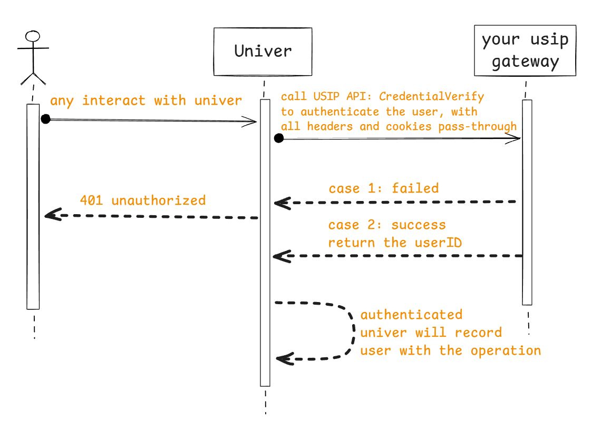
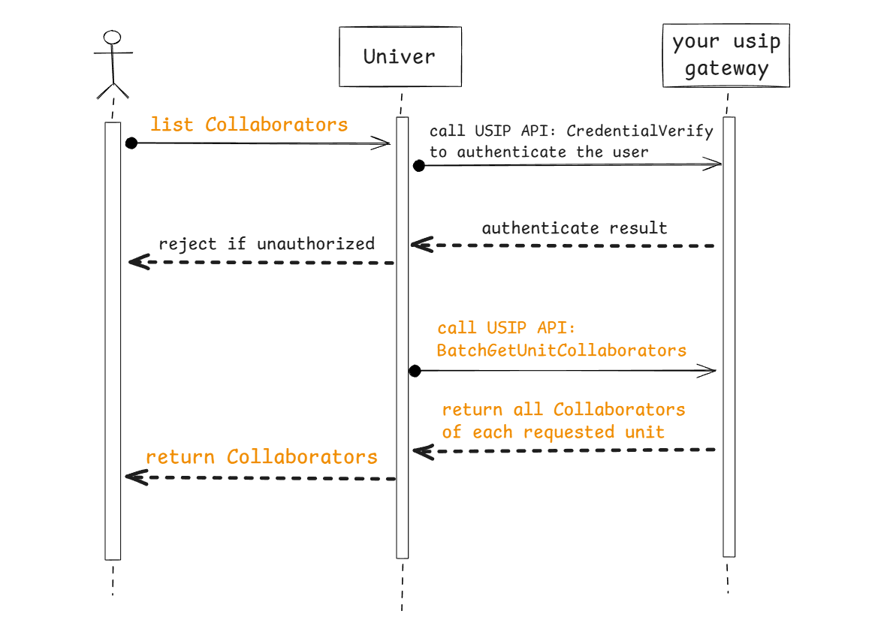

## Overview

Univer Pro's backend service does not integrate an account system (and should not), and by default, it does not authenticate visitors, meaning all users can access all resources.

If you need to authenticate users before they can use the service, you must implement your own account system. You can configure Univer Server to interact with your system, and it will call your system to complete authentication when user identity verification is required.

To achieve this interaction, Univer Pro has designed the *Univer Server Integration Protocol (USIP)*. USIP is essentially a SPI (Service Provider Interface), meaning that **Univer Pro defines the interfaces, and your system implements them**.

Univer Pro has predefined some USIP interfaces based on potential user needs. You can choose to implement some of these interfaces to change how Univer Pro handles certain user requests, such as user authentication and permission verification. If the current USIP interfaces do not meet your needs, you can suggest improvements to us.

## USIP Interface Description

Currently, Univer Pro defines USIP interfaces for two types of scenarios:

- 👥 Account-related
  - User identity authentication
  - User information retrieval: basic information like name and avatar
- 🔒 Permission-related
  - Retrieve a user's permission role on a specific document
  - Retrieve the list of collaborators for a specific document

### User authentication

#### Call scene

Every interact with the Univer backend should be authenticated, so the authentication SPI will be called every time.

#### Interaction flow



#### Protocol definition

<APITable
  request={{
    method: 'GET',
    headers: 'No custom headers, and user request headers will not be passed through',
  }}
  response={{
    type: 'application/json',
    parameters: [{
      name: 'user',
      type: 'Object',
      description: 'Return user object when authentication is successful',
      properties: [
        {
          name: 'userID',
          type: 'string',
          example: 'ace55655ceabd55',
          description: 'User ID, just ensure it can map to your real users one-to-one, it is recommended to use open_uid',
        },
        {
          name: 'name',
          type: 'string',
          example: 'alice',
          description: 'User name, used to display collaborator information on the frontend',
        },
        {
          name: 'avatar',
          type: 'string',
          example: 'https://image.xx/acde55acb45bbead55',
          description: 'User avatar URL, used to display collaborator information on the frontend',
        },
      ],
    }],
    example: JSON.stringify({
      user: {
        userID: 'ace55655ceabd55g',
        name: 'alice',
        avatar: 'https://image.xx/acde55acb45bbead55',
      },
    }, null, 2),
  }}
/>

### Get user information in batches

#### Call scene

When multiple people collaborate, display the profile photo and name of the current collaborator; when viewing the comment list in the document, display the profile photo and name of the commenting user.

#### Interaction flow


#### Protocol definition

<APITable
  request={{
    method: 'POST',
    headers: 'No custom headers, and user request headers will not be passed through',
    parametersType: 'Body',
    parameters: [{
      name: 'userIDs',
      type: 'array[string]',
      example: '["user_id1", "user_id2"]',
      description: 'Array of user IDs, Univer Pro will batch retrieve the avatars, names, and other information of these users',
    }],
    example: JSON.stringify({
      userIDs: ['user_id1', 'user_id2', 'user_id3'],
    }, null, 2),
  }}
  response={{
    type: 'application/json',
    parameters: [{
      name: 'users',
      type: 'array[Object]',
      description: 'Array of user objects, containing each user from the request, the user object definition is described in the authentication interface',
    }],
    example: JSON.stringify({
      users: [
        { userID: 'user_id1', name: 'name1', avatar: 'https://xxxx' },
        { userID: 'user_id2', name: 'name2', avatar: 'https://xxxx' },
        { userID: 'user_id3', name: 'name3', avatar: 'https://xxxx' },
      ],
    }, null, 2),
  }}
/>

### User permission role acquisition

#### Call scene

When a user reads or edits a unit, gets the user's permission role to determine whether there is permission for the corresponding operation.

#### Interaction flow


#### 协议定义

<APITable
  request={{
    method: 'GET',
    headers: 'No custom headers, and user request headers will not be passed through',
    parametersType: 'Query',
    parameters: [{
      name: 'userID',
      type: 'string',
      example: 'acd5455e44fc5bb55',
      description: 'User ID',
    }, {
      name: 'unitID',
      type: 'string',
      example: 'acff-adebc125e45b',
      description: 'Document ID',
    }],
    example: 'curl -X GET "http://sample.univer.ai/role?unitID=acff-adebc125e45b&userID=acd5455e44fc5bb55"',
  }}
  response={{
    type: 'application/json',
    parameters: [{
      name: 'userID',
      type: 'string',
      example: 'acd5455e44fc5bb55',
      description: 'User ID from the request',
    }, {
      name: 'role',
      type: 'string',
      example: 'editor',
      description: 'User permission role on the document, Univer defines 3 roles: owner, editor, reader',
    }],
    example: JSON.stringify({
      userID: 'acd5455e44fc5bb55',
      role: 'editor',
    }, null, 2),
  }}
/>

### list collaborators of the unit

#### Call scene

When setting the collaborators of a protected area or sub-table(only the collaborators of this unit can be set as readable/editable users of the sub-table and protected area).

#### Interaction flow



#### Protocol definition

<APITable
  request={{
    method: 'POST',
    headers: 'No custom headers, and user request headers will not be passed through',
    parametersType: 'Body',
    parameters: [{
      name: 'unitIDs',
      type: 'array[string]',
      example: '["unit_id1", "unit_id2"]',
      description: 'Array of document IDs, Univer Pro will batch retrieve the collaborators of these documents',
    }],
    example: JSON.stringify({
      unitIDs: ['unit_id1', 'unit_id2', 'unit_id3'],
    }, null, 2),
  }}
  response={{
    type: 'application/json',
    parameters: [{
      name: 'collaborators',
      type: 'array[Object]',
      description: 'List of collaborator objects for each document, containing the document ID and collaborator information',
      properties: [{
        name: 'unitID',
        type: 'string',
        example: 'unit_id1',
        description: 'Document ID',
      }, {
        name: 'subjects',
        type: 'array[Object]',
        description: 'List of collaborator objects for a document',
        properties: [{
          name: 'role',
          type: 'string',
          example: 'editor',
          description: 'Permission role of the collaborator, Univer defines 3 roles: owner, editor, reader',
        }, {
          name: 'subject',
          type: 'Object',
          description: 'Collaborator information',
          properties: [{
            name: 'type',
            type: 'string',
            example: 'user',
            description: 'Must be set to "user"',
          }, {
            name: 'id',
            type: 'string',
            example: 'acdef12555b12',
            description: 'User ID',
          }, {
            name: 'name',
            type: 'string',
            example: 'alice',
            description: 'User name',
          }, {
            name: 'avatar',
            type: 'string',
            example: 'https://image.ai/36554',
            description: 'User avatar URL',
          }],
        }],
      }],
    }],
    example: JSON.stringify({
      collaborators: [
        {
          unitID: 'unit_id1',
          subjects: [
            {
              subject: {
                id: '1',
                name: 'alice',
                avatar: 'https://image.ai/36554',
                type: 'user',
              },
              role: 'owner',
            },
            {
              subject: {
                id: '2',
                name: 'bob',
                avatar: 'https://image.ai/36559',
                type: 'user',
              },
              role: 'editor',
            },
          ],
        },
      ],
    }, null, 2),
  }}
/>

## Configure to integrate via USIP

How to configure Univer backend services to enable user authentication and permission verification?

When deploying using Docker Compose, add the following configuration to the custom configuration file `.env.custom`:

```properties title=".env.custom"
# usip about
USIP_ENABLED=true  # Set true to enable USIP
USIP_URI_CREDENTIAL=https://your-domain/usip/credential # the implementation URL of USIP API user authentication
USIP_URI_USERINFO=https://your-domain/usip/userinfo     # the implementation URL of USIP API get user information
USIP_URI_ROLE=https://your-domain/usip/role             # the implementation URL of USIP API get user role
USIP_URI_COLLABORATORS=https://your-domain/usip/collaborators # the implementation URL of USIP API list collaborators

# auth about
AUTH_PERMISSION_ENABLE_OBJ_INHERIT=false  # See permission design instructions below
AUTH_PERMISSION_CUSTOMER_STRATEGIES=      # See permission design instructions below
```

When deploying with K8s, edit your custom `values.yaml` and add the following configuration:

```yaml title="values.yaml"
universer:
  config:
    usip:
      enabled: true # Set true to enable USIP
      uri:
        userinfo: 'https://your-domain/usip/userinfo' # the implementation URL of USIP API get user information
        collaborators: 'https://your-domain/usip/collaborators' # the implementation URL of USIP API list collaborators
        role: 'https://your-domain/usip/role' # the implementation URL of USIP API get user role
        credential: 'https://your-domain/usip/credential' # the implementation URL of USIP API user authentication
    auth:
      permission:
        enableObjInherit: false # See permission design instructions below
        customerStrategies: '' # See permission design instructions below
```

Please note that once you configure to enable USIP, the URLs of all four USIP APIs mentioned above need to be configured and your service needs to implement them correctly. For how to apply these configurations during deployment, please refer to [Production Deployment(/guides/sheets/pro-features/server/deploy).

## permission management design of Univer

Univer's permission control uses the `RBAC` model. Currently, there are three fixed roles: `owner`, `editor`, and `reader`. The editor role has the permissions of the reader role, and the owner role has the permissions of the editor and reader roles. Custom roles are not currently available, but users can configure the minimum role required for each action. Univer has a default configuration that takes effect. If you don't need it, you can do nothing. If necessary, you can configure it to cover the minimum role requirements for some actions.

The default actions and their required minimum roles built into Univer are as follows:

| action | enum value of the action | describe of the action | minimum role requirement | enum value of the role |
|:-------|:---------|:-------|:-------|:-------|
| ManageCollaborator | 2 | Invite/Delete the unit collaborators | owner | 2 |
| Copy | 6 | Copy content | reader | 0 |
| Print | 3 | Print  | editor | 1 |
| Duplicate | 4 | duplicate the unit | editor | 1 |
| Share | 7 | Share with others | reader | 0 |
| Export | 8 | Export  | editor | 1 |
| Comment | 5 | Comment | reader | 0 |
| View | 0 | read the unit | reader | 0 |
| MoveSheet | 25 | Move worksheets in workbooks | editor | 1 |
| DeleteSheet | 26 | delete worksheet | editor | 1 |
| HideSheet | 27 | hide worksheet | editor | 1 |
| CopySheet | 28 | duplicate worksheet | editor | 1 |
| RenameSheet | 29 | rename worksheet | editor | 1 |
| CreateSheet | 30 | create worksheet | editor | 1 |
| SetCellStyle | 33 | set the style of cells | editor | 1 |
| SetCellValue | 34 | set the value of cells | editor | 1 |
| InsertHyperlink | 16 | insert Hyperlink to cells | editor | 1 |
| Sort | 17 | sort | editor | 1 |
| Filter | 18 | Filter | editor | 1 |
| PivotTable | 19 | use PivotTable | editor | 1 |
| RecoverHistory | 43 | Recover unit to historical version | editor | 1 |
| ViewHistory | 44 | View the editing history | reader | 0 |
| SelectProtectedCells | 31 | Select cells in protected area | editor | 1 |
| SelectUnProtectedCells | 32 | Select cells not be protected | editor | 1 |
| SetRowStyle | 35 | set style of the row | editor | 1 |
| SetColumnStyle | 36 | set style of the column | editor | 1 |
| InsertRow | 37 | insert rows | editor | 1 |
| InsertColumn | 38 | insert columns | editor | 1 |
| DeleteRow | 39 | delete rows | editor | 1 |
| DeleteColumn | 40 | delete columns | editor | 1 |
| Delete | 42 | delete the whole unit | owner | 2 |
| CreatePermissionObject | 45 | create protected area of protected worksheet | editor | 1 |

If you want to modify the minimum roles required for some of the actions, such as setting that only the unit's owner (role = 2) can copy content (action = 6) and print (action = 3), you can configure it as follows:

When deploying using Docker Compose, add the following configuration to the custom configuration file `.env.custom`:

```properties title=".env.custom"
AUTH_PERMISSION_CUSTOMER_STRATEGIES=[{"action": 3, "role": 2}, {"action": 6, "role": 2}]
```

When deploying with K8s, edit your custom `values.yaml` and add the following configuration:

```yaml title="values.yaml"
universer:
  config:
    auth:
      permission:
        customerStrategies: '[ {"action": 3, "role": 2}, {"action": 6, "role": 2} ]'
```

It can be seen that the configured value is a JSON object array, and the action of the object is the enumeration value of the action in the above list, and the role is the enumeration value corresponding to the lowest role required by the action.

There is another point to pay attention to in the design of Univer permission management.

Univer not only controls permissions at the entire document level, but also controls permissions on protected areas/sub-tables under the unit, all of which have independent authorized user management. For example, if user A is the editor of the entire unit, but not the editor or owner of a protected area/sub-table in this unit, then user A cannot edit this protected area/sub-table. Under Univer's default configuration, even if user A is the owner of the unit, he cannot manage protected areas/sub-tables created by other users on this unit unless other users have added permissions to him. If you want to configure the owner of the unit to unconditionally have the owner role of all objects in the unit, you can modify the configuration as follows:

When deploying using Docker Compose, add the following configuration to the custom configuration file `.env.custom`:

```properties title=".env.custom"
AUTH_PERMISSION_ENABLE_OBJ_INHERIT=true
```

When deploying with K8s, edit your custom `values.yaml` and add the following configuration:

```yaml title="values.yaml"
universer:
  config:
    auth:
      permission:
        enableObjInherit: true
```

## USIP client system implementation example

[Refer to our USIP example source code](https://github.com/dream-num/usip-example)

## Configure custom request headers on the frontend

When using USIP, you may need to add custom request headers (such as Authorization token) in the frontend requests. You can achieve this by using the HTTPService interceptor of Univer.

Add the following code when initializing the Univer instance:

```typescript
import { HTTPService } from '@univerjs/presets/preset-sheets-core'

// Get injector from univer instance
const injector = univer.__getInjector()
// Add custom request headers
const httpService = injector.get(HTTPService)
httpService.registerHTTPInterceptor({
  priority: 0,
  interceptor: (request, next) => {
    // Add your required headers here
    // For example, add Authorization token:
    // request.headers.set('Authorization', 'Bearer your-token-here')
    return next(request)
  },
})
```

For more detailed information and complete configuration examples, please refer to [Univer Pro Sheet Starter Kit](https://github.com/dream-num/univer-pro-sheet-start-kit/blob/main/src/setup-univer.ts).
