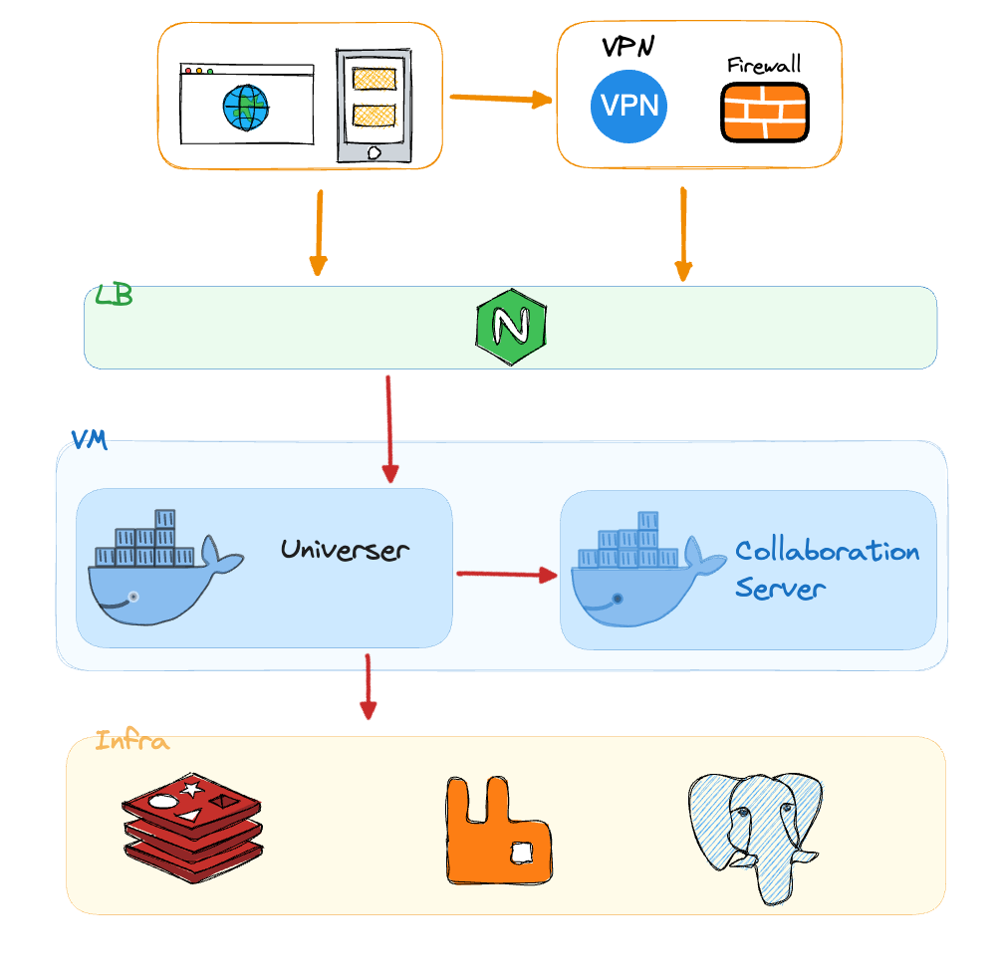
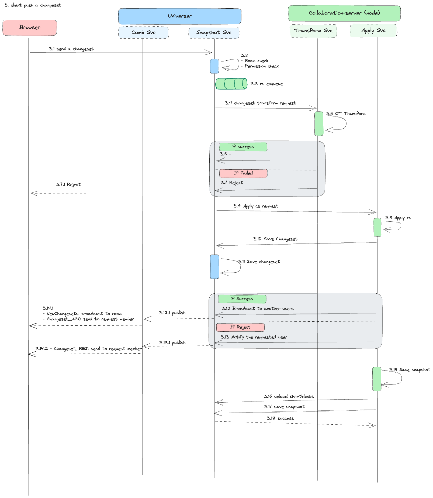
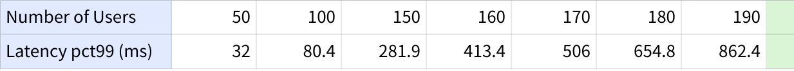
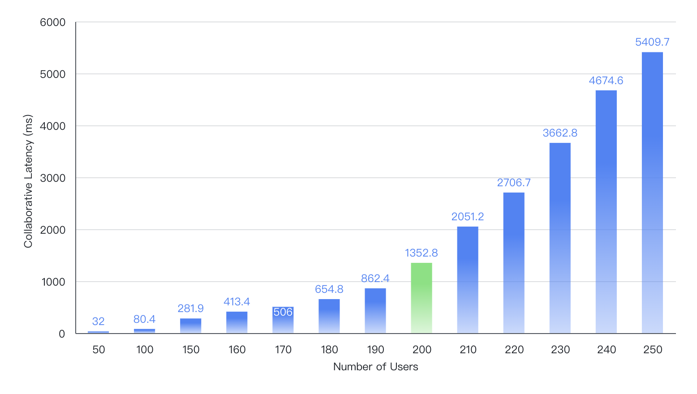
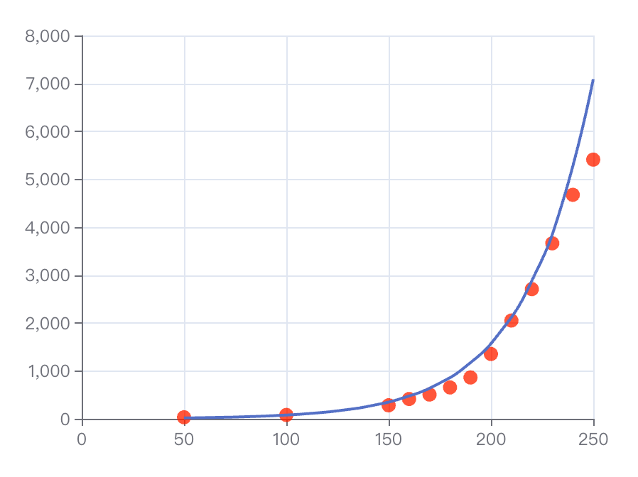

## はじめに

現代のビジネスでは、リアルタイム共同編集は生産性ツールの中核機能です。特にリモートワークのチームがクリエイティブ/編集作業を行う際に欠かせません。本レポートでは、Univer 協調エンジンのマルチユーザー同時編集における性能を詳細に評価し、主要プロダクトとの比較を行います。

「Performance of real-time collaborative editors at large scale: User perspective」という研究では、主要なリアルタイム編集サービスにおけるレイテンシ問題が指摘されています。**同時編集者数**が性能に大きな影響を与えることが示されました。以下は主要プロダクトの比較です:

|                  | Office 365 | Tencent Docs | Shimo Docs | Google Sheet | Feishu Sheet |
|------------------|------------|----------|----------|--------------|----------|
| 最大同時編集者数 | 365        | 200      | 200      | 200          | 200      |

注: データは 2022 年時点。

## Univer 協調エンジンの概要

テスト結果に入る前に、Univer 協調エンジンの概要を確認します。

Univer はスケーラビリティを重視しており、分散構成をサポートします。ただし本レポートでは、簡潔さのために単一マシンでのデプロイに焦点を当てます。

エンジンは主に Golang と JavaScript の 2 言語で実装されています。

- Golang は高い同時接続と高速ネットワーク I/O の処理に強く、多数のクライアント接続を効率的に扱えます。
- JavaScript（Node.js）はバックエンドとフロントエンドでのコード共有を可能にし、競合エラーを大幅に減らします。将来的なサーバーサイド計算やレンダリングの基盤にもなります。

Univer は共同編集の競合処理に OT（Operational Transformation）を採用しています。

協調エンジンはステートフルなサービスとして設計されており、アクティブな各ドキュメントの最新コピーをメモリに保持し、変更の適用と更新を高速化しています。

ステートフルな collaboration-server は Node.js で実装され、フロントエンドエディタと競合解決コードを共有し、次の 2 つの主要機能を持ちます:

- Transform: 表/ドキュメントの changeset に対して OT アルゴリズムを実行
- Apply: 変換後の changeset を表/ドキュメントに適用

ステートレスな universer サービスは Golang で実装され、スケジューリングとネットワーク処理を担います:

- Comb: WebSocket を利用したルームサービスで、共同編集イベントを配信
- Snapshot: EventSourcing パターンに基づくドキュメントスナップショットサービス。任意のバージョンを効率的に復元

編集イベントが協調エンジンで処理される流れは次のとおりです:

> changeset はユーザーが行った変更を指し、cs と略されることがあります。

## パフォーマンス測定

Univer 協調エンジンの主要指標とシナリオを評価するために包括的なテストを実施しました。

共同編集体験の重要指標は、あるユーザーの編集が別のユーザーに反映されるまでの遅延で、これを「共同編集レイテンシ」と呼びます。

<Callout title="定義「共同編集レイテンシ」">
  changeset が送信されてから、クライアントに最初に適用されるまでの時間差です。
  この指標は changeset の変換・適用プロセスの性能を直接示します。
</Callout>

共同編集レイテンシに直接影響する要因として、処理される changeset の数（「共同編集の同時性」）があります。

<Callout title="定義 CS QPS（共同編集の同時性）">
  1 つのドキュメントに対して 1 秒あたりに送信される Changeset の数です。
</Callout>

テスト条件:

- ECS（4 コア / 8GB メモリ）
- Docker Compose による単一マシンデプロイ

ベースラインシナリオ:

- 各クライアントは約 0.15 回/秒で編集を送信
- 編集者 200 人時、共同編集の同時性は約 30（CS QPS=30）

測定方法:

- 編集者数を段階的に増やして共同編集レイテンシを監視
- 総テスト時間は 5 分

結果として、編集者数と共同編集レイテンシの関連性が確認されました。以下のグラフを参照してください:

## 結論

データによると、標準的なサーバー上で同時 200 ユーザーでも、Univer 協調エンジンは約 1.3 秒のレイテンシを維持しており、業界トップクラスの性能と同等です。

ユーザー数が増えるほどレイテンシが指数関数的に増加する傾向があり、`y = 3.92e^(0.03x)` とモデル化できます。

これらのベンチマークは、Univer が多数ユーザー環境でも堅牢なリアルタイム協調性能を提供し、レイテンシを適切に制御できることを示しています。ユーザー増加に伴うレイテンシ上昇の傾向は、今後の最適化の指針になります。

## 次のステップ

今回の実験はレイテンシやユーザー数といった外部指標に焦点を当てましたが、ユーザー増加によるレイテンシ上昇は、変換/適用処理の遅延など内部要因の分析が必要であることを示しています。

さらに、ユーザー数が増えるにつれてネットワークスループットが重要になります。今後はユーザー数、ネットワーク容量、レイテンシの関係を検証します。

また、複数ドキュメントを管理した場合のレイテンシへの影響も検証が必要です。特に単一スレッドで動作する Node.js が、1 インスタンスでどれだけのドキュメントを効率的に扱えるかを評価します。

継続的な最適化と改善により、Univer 協調エンジンのリアルタイム協調性能をさらに高め、よりスムーズな体験を提供していきます。
