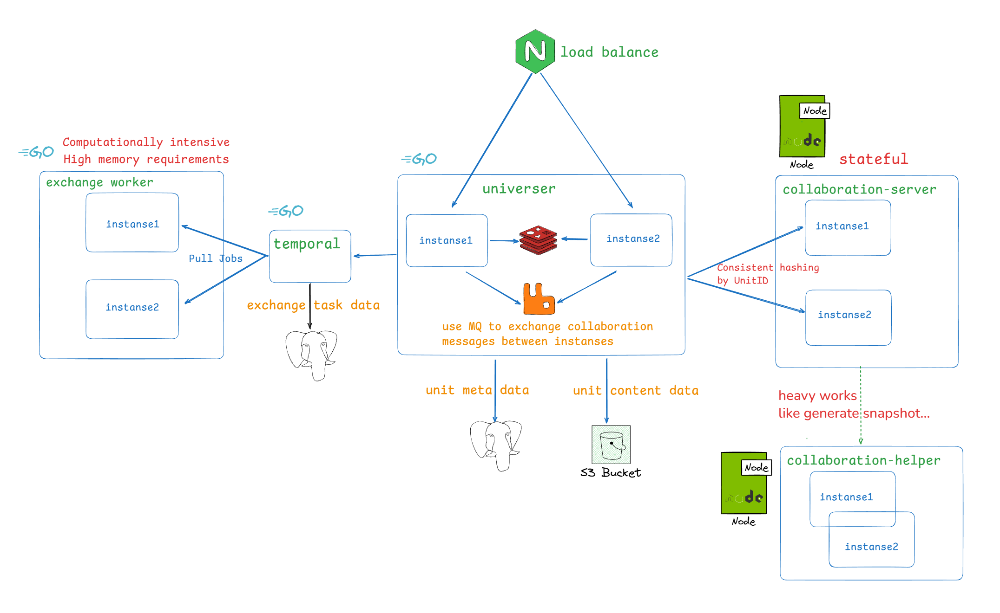

## 部署架構及服務介紹



### 演進歷史

- `v0.13.0`版本開始，新增了`collaboration-helper`服務，用於處理需要非同步執行的CPU密集型任務，如生成快照等
- `v0.15.0`版本開始，引入了協同編輯分層排程，將不同規模sheet的操作排程到不同的協同服務叢集，儘量降低大表編輯影響普通規模表格

### 服務介紹

- collaboration-server：後端的協同編輯引擎，在後端實現了和前端一致的 OT 演算法
- collaboration-helper：負責處理協同中的CPU密集型任務（比如快照生成），讓協同編輯本身可以持續流暢執行。注：v0.13.0開始引入
- universer：處理文件的各種操作請求，維護文件資料，處理協同訊息的廣播
- exchange worker：負責執行文件的匯入匯出計算任務，是計算密集型服務，同時也有大記憶體需求

<Callout>
  collaboration-server 是有狀態服務，對同一個文件的編輯請求處理都在同一個 collaboration-server 例項中進行，這樣可以大大減少處理時需要載入資料的可能，從而增加了整體效能。
  所以我們在 universer 呼叫 collaboration server 應用編輯處理時，增加了一層一致性 hash 路由。
</Callout>

### 元件介紹

- RDS：關係型資料庫，用於儲存文件的後設資料、許可權配置等
- Object Storage：物件儲存，用於儲存文件的內容資料，包括圖片、資料塊等
- Redis：文件線上協作者快取、API 限流
- Rabbitmq：訊息佇列，用於 universer 服務間交換需要廣播的協同訊息
- Temporal：開源的流程執行引擎，Univer 將其用於管理文件匯入匯出的非同步流程

## 部署前準備

瞭解了 Univer 後端服務的基本架構後，在生產部署之前，你還應該認真評估以下問題：

### 部署方式的選擇：

Univer 目前提供兩種部署方式：

- 使用 Docker compose 部署
    docker compose 方式只能單機部署，因此其能支援的規模有限，只能進行縱向擴充套件，而**不支援橫向擴充套件**。如果你沒有在運維 K8s，並且使用規模不是很大，可以使用此方式部署。

- 使用相容標準的 K8S 部署
    如果你有在運維 K8s 叢集，且能相容標準 K8s 模式，用這種方式部署最好了。Univer 支援了水平擴容，用 K8s 部署能獲得最佳的可擴充套件性。

### 確定你是否有使用者身份認證和許可權校驗的需求

Univer 的安裝配置預設是未啟用的，你需要根據你的使用需求決定是否需要啟用，相關說明請檢視[透過 USIP 與你的系統整合](/guides/pro/usip)

### 容量評估

你需要認真評估下你的容量需求，如果需求較大，docker compose 方式部署可能就不適合了。特別說明：

- 匯入匯出服務 exchange worker 是計算密集型，在處理匯入匯出任務時，短時間內可能會佔用大量的 CPU 和記憶體，尤其是匯入大文件時。你需要評估好匯入匯出的可能需求，為其分配合適的 CPU 和記憶體
- 協同引擎 collaboration-server 是有狀態的 node 服務，並且在同時開啟較多的文件編輯時會佔用較多的記憶體，你需要認真評估需要的例項數和每個例項的記憶體配置。如果有編輯超大表格（大於500萬單元格）的需求，建議每個例項至少配置8GB記憶體。

另外，`v0.15.0`版本開始，引入了協同編輯分層排程，你需要統計下在你們的使用場景中，表格的規模分佈（doc和slide不會參與分層排程），以此來判斷是否需要配置分層排程，如果需要，還要評估好需要多少個等級的叢集、每個等級處理什麼規模的表格（單元格總數量、匯入耗時等指標）。具體配置在後續章節中說明。

### 基礎元件選擇

如上述系統部署架構所示，Univer 會用到的基礎元件包括：MQ、Redis、RDS、Object Storage，並且 Univer 的安裝包會包含對應元件的常用的開源版本。

當然，Univer 支援你改用自己維護的元件，並且我們強烈建議你這樣做，這樣：

- 利於系統維護
- 確保資料的儲存安全
- 確保系統執行的穩定性

特別是文件資料的儲存元件 RDS 和 Object storage，如果你使用 Univer 的內建版本，在物理機儲存破壞的情況下很有可能會造成資料的永久丟失。這是個比較大的風險，如果你沒有自有的儲存基礎設施，建議選擇公有云廠商提供的服務。如果只能使用 Univer 內建的儲存元件，則一定要定期備份資料，建議每天一次備份。

如果你選擇使用自己維護的元件，需要確保能完全相容 Univer 對這些元件的要求，每個元件的要求如下：

#### MQ

需要完全相容 AMQP/AMQPS，目前建議選用 Rabbit MQ。Univer 安裝包使用的是 Rabbit MQ 的官方映象 rabbitmq:3-management。

#### Redis

需要能相容所有 Redis 命令。Univer 安裝包使用的是標準版本的 Redis 官方映象 bitnami/redis:7.0.15-debian-11-r3。
目前 Univer 用到的 redis 命令包括：GET、MGET、SET、SETNX、DEL、EXISTS、EXPIRE、HSET、HGET、HDEL、HGETALL、HLEN、SCAN、Pipeline、EVAL、EVALSHA。你需要確保你的 redis 元件能相容。當然，在滿足相容性的前提下，你也可以使用分散式版本的 Redis。

#### RDS

目前我們適配了 PostgreSQL16.1、MySQL8.0、GaussDB、DamengDB，你可以選擇這些 DB 或與之相容的 DB。Univer 安裝包使用的是 PostgreSQL 官方映象 postgres:16.1。
但請注意，目前 Univer 暫時沒有支援分散式資料庫，如果你的分散式資料庫不能完全相容像單機資料庫那樣訪問，那麼你不能使用。比如需要使用表欄位進行分片的資料庫暫不支援。另外，如果你使用的是 TiDB 這類完全相容的分散式資料庫，也要謹慎，因為 Univer 目前的 ID 生成器生成的 ID 都是趨勢遞增的，會導致其請求一直在同一個節點處理而效能低下。

#### Object Storage

需要能相容 AWS S3 的 API。Univer 安裝包使用的是 Minio 官方映象 bitnami/minio:2024.8.3-debian-12-r1。

#### 可觀測元件

在後續運維 Univer 的後端服務時，你希望使用 Univer 整合的可觀測元件還是接入自己的可觀測系統？Univer 目前提供了 Prometheus 指標及 grafana 看板、服務日誌。接入詳情請閱讀[運維手冊](/guides/pro/sre-manual)。
如果你沒有自己的可觀測系統，或者難以接入，建議配置啟用 Univer 內建的可觀測元件。

## 部署配置

### 如何修改部署配置？

#### 使用 docker compose 部署

Univer 預設的部署配置在安裝目錄下的 .env 檔案中，如果你需要修改安裝配置，不要直接修改此 .env 檔案，而是在此 .env 檔案所在的目錄下建立一個名為 .env.custom 的自定義配置檔案，如果你在 .env.custom 檔案裡面配置了某個配置項的值，Univer 安裝指令碼即會用你配置的值代替 .env 檔案裡的預設值。

#### 使用 K8s 部署

Univer 預設的部署配置在 Helm chart 的 values.yaml 中，[點此檢視](https://github.com/dream-num/helm-charts/blob/main/charts/univer-stack/values.yaml)。如果你想要修改配置，不用修改 charts 中的檔案，只需要新建一個 values.yaml 檔案，將你想要修改的配置項寫入其中即可，透過 helm 安裝時指定你的 values.yaml 檔案，即可用你設定的配置項替換掉預設的配置項，當然，你沒有設定的配置項將使用預設的值。具體的 helm 命令在最後部署步驟中有說明。

### 配置詳解

#### 啟用身份認證和許可權管理

在[透過 USIP 與你的系統整合](/guides/pro/usip)中已描述配置項的意義，這裡不再重複，如果你需要啟用，可如下配置：

<Tabs items={['docker compose', 'K8s']}>
  <Tab label="docker compose">
    ```properties title=".env.custom"
    # usip about
    USIP_ENABLED=true # 設定為 true 以啟用 USIP
    USIP_URI_CREDENTIAL=https://your-domain/usip/credential
    USIP_URI_USERINFO=https://your-domain/usip/userinfo
    USIP_URI_ROLE=https://your-domain/usip/role
    USIP_URI_COLLABORATORS=https://your-domain/usip/collaborators
    USIP_URI_UNITEDITTIME=https://your-domain/usip/unit-edit-time

    # auth about
    AUTH_PERMISSION_ENABLE_OBJ_INHERIT=false
    AUTH_PERMISSION_CUSTOMER_STRATEGIES=
    ```
  </Tab>
  <Tab label="K8s">
    ```yaml title="values.yaml"
    universer:
      config:
        usip:
          enabled: true # 設定為 true 以啟用 USIP
          uri:
            userinfo: 'https://your-domain/usip/userinfo'
            collaborators: 'https://your-domain/usip/collaborators'
            role: 'https://your-domain/usip/role'
            credential: 'https://your-domain/usip/credential'
            unitEditTime: 'https://your-domain/usip/unit-edit-time'
        auth:
          permission:
            enableObjInherit: false
            customerStrategies: ''
    ```
  </Tab>
</Tabs>

#### 開啟 Univer 事件釋出

這個在[透過 Univer 事件同步機制與你的系統整合](/guides/pro/event-sync)中已描述配置項的意義，這裡不再重複，如果你需要啟用，可如下配置：

<Tabs items={['docker compose', 'K8s']}>
  <Tab label="docker compose">
    ```properties title=".env.custom"
    EVENT_SYNC=true # 設定 true 為開啟
    ```
  </Tab>
  <Tab label="K8s">
    ```yaml title="values.yaml"
    universer:
      config:
        rabbitmq:
          eventSync: true # 設定 true 為開啟
    ```
  </Tab>
</Tabs>

#### 使用自己維護的基礎元件

##### RDS

**請注意**，由於 Univer 使用的元件 temporal 不支援 gaussdb 和 damengDB，如果你選擇了他們，univer 會為 temporal 安裝專用的 postgresql。temporal 在 DB 中儲存的資料是匯入匯出任務的流程狀態，不會涉及到你文件的任何資料，即使丟失，也只會造成你尚未完成的匯入匯出任務執行失敗，不會有其他影響。

###### 使用相容 postgresql 的 RDS

<Tabs items={['docker compose', 'K8s']}>
  <Tab label="docker compose">
    ```properties title=".env.custom"
    # RDS config
    DISABLE_UNIVER_RDS=true # 使用自己的 RDS 時，需要設定禁止 Univer 部署預設的 postgresql

    DATABASE_DRIVER=postgresql # 設定為 postgresql 代表使用相容 postgresql 的資料庫
    DATABASE_HOST=your-database-host
    DATABASE_PORT=your-database-port
    DATABASE_DBNAME=univer # Univer 的資料庫初始化指令碼預設使用的是這個名字，如果你有更改，請更新這裡保持一致
    DATABASE_USERNAME=user-name # 你應該給此 user 授予 select、insert、update、delete 許可權
    DATABASE_PASSWORD=password
    ```
  </Tab>
  <Tab label="K8s">
    ```yaml title="values.yaml"
    postgresql:
      enabled: false # 禁止 Univer 部署自帶的資料庫

    universer:
      config:
        database:
          driver: postgresql # 設定為 postgresql 代表使用相容 postgresql 的資料庫
          host: your-database-host
          port: your-database-port
          dbname: univer # Univer 的資料庫初始化指令碼預設使用的是這個名字，如果你有更改，請更新這裡保持一致
          username: postgres # 你應該給此 user 授予 select、insert、update、delete 許可權
          password: postgres

    temporal: # temporal 用到了資料庫
      server:
        config:
          persistence:
            default:
              driver: sql # 固定設定為 sql
              sql:
                driver: postgres12 # postgres 需要 12 以上的版本
                host: your-database-host
                port: your-database-port
                database: temporal # Univer 的資料庫初始化指令碼預設使用的是這個名字，如果你有更改，請更新這裡保持一致
                user: postgres # 你應該給此 user 授予 select、insert、update、delete 許可權
                password: postgres

            visibility:
              driver: sql
              sql:
                driver: postgres12 # postgres 需要 12 以上的版本
                host: your-database-host
                port: your-database-port
                database: temporal_visibility # Univer 的資料庫初始化指令碼預設使用的是這個名字，如果你有更改，請更新這裡保持一致
                user: postgres # 你應該給此 user 授予 select、insert、update、delete 許可權
                password: postgres
    ```
  </Tab>
</Tabs>

###### 使用相容 MySQL 的 RDS

<Tabs items={['docker compose', 'K8s']}>
  <Tab label="docker compose">
    ```properties title=".env.custom"
    # RDS config
    DISABLE_UNIVER_RDS=true # 使用自己的 RDS 時，需要設定禁止 Univer 部署預設的 postgresql

    DATABASE_DRIVER=mysql # 設定為 MySQL 代表使用相容 MySQL 的資料庫
    DATABASE_HOST=your-database-host
    DATABASE_PORT=your-database-port
    DATABASE_DBNAME=univer # Univer 的資料庫初始化指令碼預設使用的是這個名字，如果你有更改，請更新這裡保持一致
    DATABASE_USERNAME=user-name # 你應該給此 user 授予 select、insert、update、delete 許可權
    DATABASE_PASSWORD=password
    ```
  </Tab>
  <Tab label="K8s">
    ```yaml title="values.yaml"
    postgresql:
      enabled: false # 禁止 Univer 部署自帶的資料庫

    universer:
      config:
        database:
          driver: mysql # 設定為 MySQL 代表使用相容 MySQL 的資料庫
          host: your-database-host
          port: your-database-port
          dbname: univer # Univer 的資料庫初始化指令碼預設使用的是這個名字，如果你有更改，請更新這裡保持一致
          username: mysql # 你應該給此 user 授予 select、insert、update、delete 許可權
          password: mysql

    temporal:
      server:
        config:
          persistence:
            default:
              driver: sql
              sql:
                driver: mysql8 # 我們要求的 MySQL 版本為 8.x
                host: your-database-host
                port: your-database-port
                database: temporal # Univer 的資料庫初始化指令碼預設使用的是這個名字，如果你有更改，請更新這裡保持一致
                user: mysql # 你應該給此 user 授予 select、insert、update、delete 許可權
                password: mysql

            visibility:
              driver: sql
              sql:
                driver: mysql8
                host: your-database-host
                port: your-database-port
                database: temporal_visibility # Univer 的資料庫初始化指令碼預設使用的是這個名字，如果你有更改，請更新這裡保持一致
                user: mysql
                password: mysql
    ```
  </Tab>
</Tabs>

###### 使用 GaussDB

<Tabs items={['docker compose', 'K8s']}>
  <Tab label="docker compose">
    ```properties title=".env.custom"
    # RDS config
    DISABLE_UNIVER_RDS=true # 使用自己的 RDS 時，需要設定禁止 Univer 部署預設的 postgresql

    DATABASE_DRIVER=gaussdb
    DATABASE_HOST=your-database-host
    DATABASE_PORT=your-database-port
    DATABASE_DBNAME=univer # Univer 的資料庫初始化指令碼預設使用的是這個名字，如果你有更改，請更新這裡保持一致
    DATABASE_USERNAME=user-name # 你應該給此 user 授予 select、insert、update、delete 許可權
    DATABASE_PASSWORD=password
    ```
  </Tab>
  <Tab label="K8s">
    ```yaml title="values.yaml"
    universer:
      config:
        database:
          driver: gaussdb
          host: your-database-host
          port: your-database-port
          dbname: univer # Univer 的資料庫初始化指令碼預設使用的是這個名字，如果你有更改，請更新這裡保持一致
          username: gaussdb # 你應該給此 user 授予 select、insert、update、delete 許可權
          password: gaussdb
    ```
  </Tab>
</Tabs>

###### 使用 DamengDB

<Tabs items={['docker compose', 'K8s']}>
  <Tab label="docker compose">
    ```properties title=".env.custom"
    # RDS config
    DISABLE_UNIVER_RDS=true # 使用自己的 RDS 時，需要設定禁止 Univer 部署預設的 postgresql

    DATABASE_DRIVER=dameng
    DATABASE_HOST=your-database-host
    DATABASE_PORT=your-database-port
    DATABASE_DBNAME=univer # Univer 的資料庫初始化指令碼預設使用的是這個名字，如果你有更改，請更新這裡保持一致
    DATABASE_USERNAME=user-name # 你應該給此 user 授予 select、insert、update、delete 許可權
    DATABASE_PASSWORD=password
    ```
  </Tab>
  <Tab label="K8s">
    ```yaml title="values.yaml"
    universer:
      config:
        database:
          driver: dameng
          host: your-database-host
          port: your-database-port
          dbname: univer # Univer 的資料庫初始化指令碼預設使用的是這個名字，如果你有更改，請更新這裡保持一致
          username: dameng # 你應該給此 user 授予 select、insert、update、delete 許可權
          password: dameng
    ```
  </Tab>
</Tabs>

##### Redis

<Tabs items={['docker compose', 'K8s']}>
  <Tab label="docker compose">
    ```properties title=".env.custom"
    # redis config
    DISABLE_UNIVER_REDIS=true # 使用自己的 redis 時，需要禁止 Univer 安裝內建的 redis

    # if you use redis cluster, use comma ',' to separate multiple addresses
    # for example: REDIS_ADDR=192.168.1.5:6001,192.168.1.5:6002,192.168.1.5:6003
    REDIS_ADDR=host:port[,host:port]
    REDIS_USERNAME=user-name
    REDIS_PASSWORD=password
    REDIS_DB=0

    # redis tls config
    # 支援三種模式：不安全模式（insecure）、僅進行 CA 驗證、以及客戶端證書（mTLS）驗證。
    # CA、證書和私鑰既可以以檔案路徑形式提供，也可以直接以檔案內容形式提供；
    # 如果使用檔案路徑，請務必使用 Docker volume 掛載後的容器內虛擬路徑。
    REDIS_TLS_ENABLED=false
    REDIS_TLS_INSECURE=false
    REDIS_TLS_CA=
    REDIS_TLS_CERT=
    REDIS_TLS_KEY=
    ```
  </Tab>
  <Tab label="K8s">
    ```yaml title="values.yaml"
    universer:
      config:
        redis:
          poolSize: 100
          # 如果是 redis 叢集，可以用逗分隔多個地址
          # 例如：192.168.1.100:6379,192.168.1.101:6379
          addr: 192.168.1.100:6379
          read_timeout: 1s
          write_timeout: 1s
          db: 0
          username: user_name_here
          password: password_here

          # TLS 配置
          # 支援三種模式：不安全模式（insecure）、僅進行 CA 驗證、以及客戶端證書（mTLS）驗證。
          # CA、證書和私鑰需要時是填寫檔案內容
          tlsConfig:
            enabled: false
            insecure: false
            ca: ''
            cert: ''
            key: ''

    # 跟 universer.config.redis 一樣
    worker:
      redis:
        poolSize: 10
        addr: 192.168.1.100:6379
        read_timeout: 1s
        write_timeout: 1s
        db: 0
        username: user_name_here
        password: password_here
        tlsConfig:
          enabled: false
          insecure: false
          ca: ''
          cert: ''
          key: ''

    redis:
      enabled: false # 禁止 Univer 部署自帶的 redis
    ```
  </Tab>
</Tabs>

##### MQ

<Tabs items={['docker compose', 'K8s']}>
  <Tab label="docker compose">
    ```properties title=".env.custom"
    DISABLE_UNIVER_MQ=true # 使用自己的 MQ 時，需要禁止 Univer 安裝內建的 MQ

    RABBITMQ_CLUSTER_ENABLED=true # 必須設定為 true
    RABBITMQ_CLUSTER_USERNAME=user-name # 有許可權的賬戶，需要 Declear Exchange、Produce、Consume 許可權
    RABBITMQ_CLUSTER_PASSWORD=password # password

    # use comma to separate multiple addresses
    # for example: RABBITMQ_CLUSTER_ADDR=192.168.1.2:5672,192.168.1.5:5672,192.168.1.7:5672
    # 每個 addr 都要能讀寫，Univer 在連線時會輪詢其中的 host，直到連線成功
    RABBITMQ_CLUSTER_ADDR=host:port[,host:port]

    # RABBITMQ_CLUSTER_VHOST is the vhost of the rabbitmq cluster. If you don't set it, the default value is /
    # for example: RABBITMQ_CLUSTER_VHOST=univer
    RABBITMQ_CLUSTER_VHOST=/
    RABBITMQ_CLUSTER_SCHEMA=amqp
    ```
  </Tab>
  <Tab label="K8s">
    ```yaml title="values.yaml"
    universer:
      config:
        rabbitmq:
          cluster:
            enabled: true # 必須設定為 true
            # use comma to separate multiple addresses
            # for example: RABBITMQ_CLUSTER_ADDR=192.168.1.2:5672,192.168.1.5:5672
            # 每個 addr 都要能讀寫，Univer 在連線時會輪詢其中的 host，直到連線成功
            addr: '192.168.1.2:5672,192.168.1.5:5672'
            username: user-here
            password: password-here
            vhost: /
            schema: amqp

    rabbitmq:
      enabled: false # 禁止 Univer 部署自帶的 rabbitmq
    ```
  </Tab>
</Tabs>

##### Object Storage

<Tabs items={['docker compose', 'K8s']}>
  <Tab label="docker compose">
    ```properties title=".env.custom"
    DISABLE_UNIVER_S3=true # 使用自己的 object storage 時，需要禁止 Univer 安裝內建的 minio

    # s3 config
    S3_USER=user
    S3_PASSWORD=password
    S3_REGION=your-inner-s3like-region # 如果你的 S3-like 沒有這個概念，隨意填寫個字串即可

    # S3_PATH_STYLE，可設定true或false
    # 如果設定為 true，使用路徑樣式（Path-Style）來構建訪問 URL
    # 如果設定為false，使用虛擬主機樣式（Virtual-Host Style）來構建訪問 URL
    S3_PATH_STYLE=true|false

    # S3_ENDPOINT 提供給內部服務訪問的地址
    S3_ENDPOINT=inner-visit-host:port

    # S3_ENDPOINT_PUBLIC 公開訪問的地址，在客戶端直接連線物件儲存下載檔案時使用
    S3_ENDPOINT_PUBLIC=public-visit-host:port

    # S3_DEFAULT_BUCKET 配置使用哪個 bucket
    S3_DEFAULT_BUCKET=default-bucket-name
    ```
  </Tab>
  <Tab label="K8s">
    ```yaml title="values.yaml"
    universer:
      config:
        s3:
          accessKeyID: admin
          accessKeySecret: minioadmin
          region: us-east-1
          endpoint: http://192.168.1.100:9000
          endpointPublic: http://192.168.1.100:9001
          usePathStyle: true
          defaultBucket: univer

    minio:
      enabled: false # 禁止 Univer 部署自帶的 minio
    ```
  </Tab>
</Tabs>

#### 開啟 Univer 內建可觀測元件

<Tabs items={['docker compose', 'K8s']}>
  <Tab label="docker compose">
    ```properties title=".env.custom"
    # observability config
    ENABLE_UNIVER_OBSERVABILITY=true # 設定為 true 則開啟
    GRAFANA_USERNAME=set-your-admin-user-name-here # 設定好 grafana 的管理員賬號
    GRAFANA_PASSWORD=set-your-admin-user-password-here # 設定好 grafana 的管理員密碼
    HOST_GRAFANA_PORT=set-the-port-you-want # grafana 對外暴露埠
    ```
  </Tab>
  <Tab label="K8s">
    K8s 方式部署內建可觀測元件不用配置，要啟用請參考下面的 K8s 部署操作
  </Tab>
</Tabs>

#### 容量相關配置

<Tabs items={['docker compose', 'K8s']}>
  <Tab label="docker compose">
    ```properties title=".env.custom"
    UNIVERSER_REPLICATION_CNT=2 # universer 例項數
    COLLABORATION_SERVER_REPLICATION_CNT=2 # 協同服務例項數
    COLLABORATION_SERVER_MEMORY_LIMIT=2048 # 配置協同服務的最大記憶體限制，單位為 MB
    COLLABORATION_HELPER_REPLICATION_CNT=2 # helper服務例項數，注：v0.13.0開始引入
    COLLABORATION_HELPER_MEMORY_LIMIT=2048 # 配置helper的最大記憶體限制，單位為 MB，注：v0.13.0開始引入

    # 匯入匯出 exchange-worker 容量相關配置
    EXCHANGE_WORKER_REPLICATION_CNT=1 # working exchange worker count
    EXCHANGE_WORKER_MEMORY_LIMIT=4096 # MB, the memory limit of each exchange-worker.
    EXCHANGE_WORKER_IMPORT_CONCURRENT=1 # how many import tasks each worker can do at the same time.
    EXCHANGE_WORKER_EXPORT_CONCURRENT=1 # how many export tasks each worker can do at the same time.
    ```
  </Tab>
  <Tab label="K8s">
    ```yaml title="values.yaml"
    universer:
      replicaCount: 3 # universer 例項數
    collaboration-server:
      replicaCount: 3 # 協同服務例項數
      maxMemoryLimit: 2048 # MB, 配置協同服務的最大記憶體限制
    collaboration-helper-server: # 注：v0.13.0開始引入
      replicaCount: 2 # helper服務例項數
    worker:
      replicaCount: 1 # working exchange worker count
      temporalWorker:
        importConcurrent: 1 # how many import tasks each worker can do at the same time.
        exportConcurrent: 1 # how many export tasks each worker can do at the same time.
    ```
  </Tab>
</Tabs>

#### 協同編輯分層排程配置

`v0.15.0`版本開始引入，預設配置下不會生效，需要手動配置開啟。目前會透過workbook的單元格總數、匯入實際消耗的時間來決定應該排程到哪個等級的協同服務叢集。針對剛透過匯入建立的workbook，會根據匯入實際耗時來決定；其他方式建立或觸發新快照生成後，則透過單元格總數來決定。每次快照建立後，會將相關指標資料持久化到資料庫並更新排程。

分層排程實際上就是將協同服務部署了多個叢集，然後配置規則指定什麼規模的表格應該排程到哪個叢集處理。規則配置資料結構如下：

```yaml
unitRoutingConf:
  tiers:
    - tierName: normal
      enable: true
      upgradeCellsThreshold: 0
      downgradeCellsThreshold: 0
      upgradeImportTimeThreshold: 0
    - tierName: large
      enable: true
      upgradeCellsThreshold: 1000
      downgradeCellsThreshold: 900
      upgradeImportTimeThreshold: 10
    - tierName: huge
      enable: true
      upgradeCellsThreshold: 10000
      downgradeCellsThreshold: 9000
      upgradeImportTimeThreshold: 60
```

說明：

- `tiers`: 描述每一個叢集資訊，理論上可以有任意多個叢集
- `enable`: 設定是否啟用此叢集，設定為`false`則此叢集會被忽略
- `upgradeCellsThreshold`: 指定當sheet單元格總數達到此規模時才能排程到此叢集
- `downgradeCellsThreshold`: 則指定：如果sheet當前正被排程到此叢集，只有當單元格總數低於此值時才能被排程到更低等級的叢集。這樣可以避免兩個等級交界處規模的sheet被頻繁地切換排程
- `upgradeImportTimeThreshold`: 新匯入的sheet暫時沒有單元格總數統計，此時利用此配置來決定排程，作用機制同`upgradeCellsThreshold`，只是指標用的是匯入的實際耗時

可以看出，必須得有一個叢集的指標要求全是0，才能保證每個sheet都能被排程到。

按上述示例配置引數下的排程case：

- workbook1建立後的初始單元格數量為0，排程到normal叢集
- workbook1隨後被編輯到總單元格數量為1000時，排程到large叢集
- workbook1總單元格數量又降至999時，由於大於設定的降級線900，仍然排程到large叢集
- workbook1總單元格數量繼續降至899時，則降級排程回normal叢集
- workbook2被匯入了，實際耗時61秒，已經超過huge叢集的條件60秒，將被排程到huge叢集處理

Univer 的 Docker Compose 部署指令碼提供了選項，可選部署1個 or 2個等級的叢集（分離普通表格和大表格）。
叢集配置中的 `ENABLE_LARGE_TIER_COLLABORATION_SERVER` 引數控制排程時是否使用大表格叢集，以及控制Docker Compose是否實際部署大表格叢集服務。
如果你需要更精細的叢集等級控制或使用 K8s 部署，請調整docker compose/charts的編排來實際部署對應等級的`collaboration-server`服務叢集，然後按上述說明配置好排程路由表（`tiers`陣列）

如果你直接使用univer提供的docker compose編排，可調整如下引數來配置是否啟用第二個等級叢集，以及什麼規模的表格算作大表格需要分離處理。

<Tabs items={['docker compose', 'K8s']}>
  <Tab label="docker compose">
    預設部署只配置了兩個等級：`normal`和`large`

    ```properties title=".env.custom"
    # 配置開啟/關閉large叢集，true-開啟，false-關閉，預設關閉
    ENABLE_LARGE_TIER_COLLABORATION_SERVER=false

    # 如果開啟large叢集，當總單元格數達到此規模後將排程到large叢集，預設2M
    LARGE_TIER_MIN_CELLS_COUNT=2000000

    # 如果sheet當前排程在large叢集，則只有當總單元格數降至此值以下時才會降級回normal叢集，預設1.95M
    LARGE_TIER_DOWNGRADE_CELLS_COUNT=1950000

    # 如果開啟large叢集，當workbook匯入耗時超過配置後將排程到large叢集，預設10s
    LARGE_TIER_MIN_IMPORT_SECONDS=10

    # large叢集協同服務例項數，預設2
    LARGE_TIER_COLLABORATION_SERVER_REPLICATION_CNT=2

    # large叢集協同服務例項記憶體限制，建議至少配置8GB，預設8GB
    LARGE_TIER_COLLABORATION_SERVER_MEMORY_LIMIT=8192
    ```
  </Tab>
  <Tab label="K8s">
    自行配置部署
  </Tab>
</Tabs>

#### 網路配置

<Tabs items={['docker compose', 'K8s']}>
  <Tab label="docker compose">
    如果 Univer 暴露的預設埠已被其餘服務使用，需要修改：

    ```properties title=".env.custom"
    # 如果和你們的網路配置存在衝突，可以修改 docker 使用的網段。使用 CIDR 表示法
    DOCKER_NETWORK_SUBNET=172.30.0.0/16

    # Univer API 服務暴露的埠，如果和你宿主機的其他服務埠重複，請更換成其他埠
    HOST_NGINX_PORT=the-univer-server-api-port-you-wantted

    # 如果你選擇了 Univer 安裝包內建的 minio 作為物件儲存，且存在埠衝突，請新增此配置項修改
    # 當然，如果你使用的是自己維護的物件儲存，設定此配置項將無任何意義
    HOST_MINIO_PORT=the-minio-port-you-wantted

    # 如果你選擇了 Univer 安裝包內建的可觀測元件，且存在埠衝突，請新增此配置項修改
    # 當然，如果你使用的是自己維護的可觀測元件，設定此配置項將無任何意義
    HOST_GRAFANA_PORT=the-grafana-port-you-wantted
    ```
  </Tab>
  <Tab label="K8s">
    K8s 部署無此問題
  </Tab>
</Tabs>

#### 允許跨域配置

<Tabs items={['docker compose', 'K8s']}>
  <Tab label="docker compose">
    ```properties title=".env.custom"
    # allowed cross-origins config
    CORS_ALLOW_ORIGINS='["domain1", "domain2", "and more"]'
    CORS_ALLOW_HEADERS='["content-type","authorization"]'
    ```
  </Tab>
  <Tab label="K8s">
    ```yaml title="values.yaml"
    universer:
      config:
        server:
          http:
            corsAllowOrigins: [domain1, domain2, and more]
            corsAllowHeaders: [content-type, authorization]
    ```
  </Tab>
</Tabs>

#### 使用 K8s 部署的特殊配置

Univer Pro 在 Helm chart 中預設配置了部署前端 demo 服務，並且將 http 閘道器服務 universer 的 ingress 路由域名設定成了 demo 的域名。在生產部署時，你需要禁用 demo 服務，並且將 universer 的 ingress 路由更改為你的域名。你需要在 values.yaml 中新增以下配置：

```yaml title="values.yaml"
collaboration-demo:
  enabled: false # 設定為 false 則禁止部署 demo 服務
universer:
  ingress:
    enabled: true
    hosts:
      - host: use-your-own-domain-here # 這裡修改成你的域名
        paths:
          - path: /universer-api/
            pathType: Prefix
```

#### 配置示例

以下配置示例實現了：

- 開啟 USIP 整合，認證使用者身份，開啟許可權校驗
- 配置只有文件 owner 才能複製內容和列印
- 開啟 Univer 事件釋出
- 使用自己的 postgresql
- 使用自己的 Object Storage
- 修改 Univer 服務暴露的埠
- 設定 universer 和 collaboration-server 的容量配置

<Tabs items={['docker compose', 'K8s']}>
  <Tab label="docker compose">
    .env.custom 檔案內容如下

    ```properties title=".env.custom"
    # 1. enable USIP integration
    # usip about
    USIP_ENABLED=true
    USIP_URI_CREDENTIAL=https://usip-demo.univer.ai/usip/credential
    USIP_URI_USERINFO=https://usip-demo.univer.ai/usip/userinfo
    USIP_URI_ROLE=https://usip-demo.univer.ai/usip/role
    USIP_URI_COLLABORATORS=https://usip-demo.univer.ai/usip/collaborators
    USIP_URI_UNITEDITTIME=https://usip-demo.univer.ai/unit-edit-time

    # 2. only owner can copy content and print
    AUTH_PERMISSION_CUSTOMER_STRATEGIES=[ {"action": 3, "role": 2}, {"action": 6, "role": 2} ]

    # 3. enable univer event sync
    EVENT_SYNC=true # 設定 true 為開啟

    # 4. use owner RDS
    # postgresql config
    DISABLE_UNIVER_RDS=true # 使用自己的 RDS 時，需要設定禁止 Univer 部署預設的 postgresql

    DATABASE_DRIVER=postgresql # 設定為 postgresql 代表使用相容 postgresql 的資料庫
    DATABASE_HOST=univer-postgresql
    DATABASE_PORT=5432
    DATABASE_DBNAME=univer
    DATABASE_USERNAME=universer-biz
    DATABASE_PASSWORD=123456

    # 5. use owner Object storage
    # s3 config
    DISABLE_UNIVER_S3=true # 使用自己的 object storage 時，需要禁止 Univer 安裝內建的 minio

    S3_USER=universer-biz
    S3_PASSWORD=123456
    S3_REGION=cn-sz
    S3_PATH_STYLE=true
    S3_ENDPOINT=univer-s3:9652
    S3_ENDPOINT_PUBLIC=univer.ai:9653
    S3_DEFAULT_BUCKET=univer

    # 6. change univer service Port
    HOST_NGINX_PORT=8010

    # 7. set the service scale
    UNIVERSER_REPLICATION_CNT=4 # universer 例項數
    COLLABORATION_SERVER_REPLICATION_CNT=5 # 協同服務例項數
    MAX_MEMORY_LIMIT=2048 # 配置協同服務的最大記憶體限制，單位為 MB
    ```
  </Tab>
  <Tab label="K8s">
    使用 K8s 部署時的 values.yaml，注意：當你要修改多處配置時，需要你對最終的 yaml 進行合併。

    ```yaml title="values.yaml"
    collaboration-demo:
      enabled: false # 設定為 false 則禁止部署 demo 服務

    postgresql:
      enabled: false # 禁止 Univer 部署自帶的資料庫

    minio:
      enabled: false # 禁止 Univer 部署自帶的 minio

    collaboration-server:
      replicaCount: 5
      maxMemoryLimit: 2048

    universer:
      replicaCount: 4
      ingress:
        enabled: true
        hosts:
          - host: usip-demo.univer.ai # 這裡修改成你的域名
            paths:
              - path: /universer-api/
                pathType: Prefix
      config:
        usip:
          enabled: true # 設定為 true 以啟用 USIP
          uri:
            userinfo: 'https://usip-demo.univer.ai/usip/userinfo'
            collaborators: 'https://usip-demo.univer.ai/usip/collaborators'
            role: 'https://usip-demo.univer.ai/usip/role'
            credential: 'https://usip-demo.univer.ai/usip/credential'
            unitEditTime: 'https://usip-demo.univer.ai/usip/unit-edit-time'
        auth:
          permission:
            customerStrategies: '[ {"action": 3, "role": 2}, {"action": 6, "role": 2} ]'
        rabbitmq:
          eventSync: true # 設定 true 為開啟
        database:
          driver: postgresql
          host: univer-postgresql
          port: 5432
          dbname: univer
          username: universer-biz
          password: 123456
        s3:
          accessKeyID: universer-biz
          accessKeySecret: 123456
          region: cn-sz
          endpoint: 'univer-s3:9652'
          endpointPublic: 'univer.ai:9653'
          usePathStyle: true
          defaultBucket: univer

    temporal:
      server:
        config:
          persistence:
            default:
              driver: sql
              sql:
                driver: postgres12
                host: univer-postgresql
                port: 5432
                database: temporal
                user: universer-temporal
                password: 123456

            visibility:
              driver: sql
              sql:
                driver: postgres12
                host: univer-postgresql
                port: 5432
                database: temporal_visibility
                user: universer-temporal
                password: 123456
    ```
  </Tab>
</Tabs>

## 部署 SOP

確定所需的配置後，可按照如下步驟實施 Univer 後端服務的部署

### 部署到 docker compose SOP [#deploy-to-docker-compose]

1. 準備好你的配置檔案 `.env.custom`，如果你沒有任何需要修改的配置，可忽略此步
2. 準備好你的 License，包括 `license.txt` 和 `licenseKey.txt` 兩個檔案
3. 如果你選擇使用自己維護的 RDS，請前往下載[資料庫初始化指令碼](https://release-univer.oss-cn-shenzhen.aliyuncs.com/releases/latest/univer-server-sql-latest.tar.gz)並完成 RDS 的初始化，包括 universer 和 temporal 的初始化。如果你使用的是 gaussdb 或 dameng，就不用初始化 temporal 了
4. 獲取 Univer Pro 後端服務
   - 如果你的部署伺服器可以訪問公共網際網路：
     - 執行 `bash -c "$(curl -fsSL https://get.univer.ai/product)" [-- version]`，下載到你給定版本的 Univer 服務，如果沒有指定 version，將預設下載最新的版本
   - 如果你的部署伺服器不能訪問公共網際網路：
     - [點此下載](https://univer.ai/releases/univer-server/download)Univer提供的 All in one 離線安裝包
     - 將 All in one 離線安裝包上傳到你的部署伺服器並解壓
     - 進入解壓後的目錄執行 `bash load-images.sh` 將 Univer 後端服務的映象載入到本機 docker
5. 將你準備好的自定義配置檔案 `.env.custom` 複製到下載的Univer服務資料夾下，和預設的 `.env` 檔案放在同一目錄
6. 將你的 license 檔案 `license.txt` 和 `licenseKey.txt` 複製到下載的Univer服務資料夾下的 `configs/` 目錄
7. 進入下載的 Univer 服務根目錄，執行 `bash run.sh start` 即可完成服務的部署
8. 完成迴歸測試

### 部署到 K8s SOP [#deploy-to-k8s]

使用 K8s 部署時請注意：如果你有自定義的配置修改，需要你來實現自定義配置檔案 values.yaml 的版本管理，因為後續的升級操作還需要你來提供完整的自定義配置。Univer 建議你使用 git 等版本管理工具來管理。

1. 準備好你的配置檔案 `values.yaml`，如果你沒有任何需要修改的，可忽略此步
2. 準備好你的 license `license.txt` 和 `licenseKey.txt` 兩個檔案
3. 如果你選擇使用自己維護的 RDS，請前往下載[資料庫初始化指令碼](https://release-univer.oss-cn-shenzhen.aliyuncs.com/releases/latest/univer-server-sql-latest.tar.gz)並完成 RDS 的初始化，包括 universer 和 temporal 的初始化。如果你使用的是 gaussdb 或 dameng，就不用初始化 temporal 了
4. 執行 helm 安裝命令，使用你的 `values.yaml` 檔案和 License 檔案
   - 如果你的部署伺服器可以訪問公共網際網路:
     - 可以執行以下命令進行安裝
        ```shell
        helm install -n univer --create-namespace \
            -f your-own-values.yaml-path \
            --set global.istioNamespace="univer" \
            --set-file universer.license.licenseV2=your-license.txt-path \
            --set-file universer.license.licenseKeyV2=your-licenseKey.txt-path \
            univer-stack \
            oci://univer-acr-registry.cn-shenzhen.cr.aliyuncs.com/helm-charts/univer-stack \
            --version target-version

        # 執行成功後，執行下面兩個命令重啟服務以完成 sidecar 的注入
        kubectl rollout restart -n univer deployment/collaboration-server
        kubectl rollout restart -n univer deployment/universer
        ```
     - 如果想要部署 Univer 配置的可觀測元件，請執行以下命令安裝：
        ```bash
        helm upgrade --install -n univer-observability --create-namespace \
            --set global.univerNamespace="univer" \
            univer-observability \
            oci://univer-acr-registry.cn-shenzhen.cr.aliyuncs.com/helm-charts/univer-observability
        ```

        引數說明：

        - `--set global.univerNamespace="univer"`：配置所觀測的 Univer 叢集的 `namespace` 為 `"univer"`
   - 如果你的部署伺服器無法訪問公共網際網路：
     - [點此下載](https://univer.ai/releases/univer-server/download) Univer 提供的 K8s all in one 離線安裝包
     - 將 K8s all in one 離線安裝包上傳到你的部署伺服器並解壓
     - 進入解壓後的目錄執行：
        ```shell
        export REGISTER=XXXX # 你的私有映象倉庫
        export NAMESPACE=XXX # 要上傳的映象 namespace
        docker login $REGISTER
        bash load-image.sh --registry $REGISTER --namespace $NAMESPACE
        ```
     - 執行成功後會在當前目錄生成一個 `values.yaml` 和 `values-observability.yaml` 檔案，可在裡面按需修改你自己的配置
       - values.yaml：Univer 服務的配置檔案
       - values-observability.yaml：Univer 服務相關可觀測性監控元件
     - 接著執行以下命令進行安裝
        ```shell
        helm install -n univer --create-namespace \
            -f your-own-values.yaml-path \
            --set global.istioNamespace="univer" \
            --set-file universer.license.licenseV2=your-license.txt-path \
            --set-file universer.license.licenseKeyV2=your-licenseKey.txt-path \
            univer-stack \
            univer-stack-xxxx.tgz # 需要改成當前目錄解壓後對應的 chart 包

        # 執行成功後，執行下面兩個命令重啟服務以完成 sidecar 的注入
        kubectl rollout restart -n univer deployment/collaboration-server
        kubectl rollout restart -n univer deployment/universer
        ```
     - 如果想要部署 Univer 配置的可觀測元件，請執行以下命令安裝：
        ```bash
        helm upgrade --install -n univer-observability --create-namespace \
            --set global.univerNamespace="univer" \
            -f your-own-values-observability.yaml-path \
            univer-observability \
            univer-observability-xxxx.tgz
        ```

        引數說明：

        - `--set global.univerNamespace="univer"`：配置所觀測的 Univer 叢集的 namespace 為 `"univer"`

引數說明：

- `-n univer`：指定叢集`namespace` 為 univer，你可以隨意更改，但需要記住，後續升級需要
- `univer-stack`：`helm release` 的名字，你可以隨意更改，但需要記住，後續升級需要
- `--version target-version`：指定部署的版本，需要你修改為目標版本，也可以去掉此項來自動選擇最新版本
- `-f your-own-values.yaml-path`：指定你的自定義配置檔案 `values.yaml` 的路徑，需要你修改正確
- `--set-file universer.license.licenseV2=your-license.txt-path`：指定你 license 解壓後的 `license.txt` 檔案路徑
- `--set-file universer.license.licenseKeyV2=your-licenseKey.txt-path`：指定你 license 解壓後的 `licenseKey.txt` 檔案路徑

5. 完成迴歸測試
