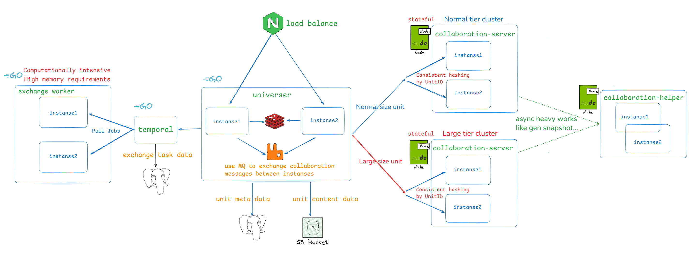

## デプロイメントアーキテクチャとサービス紹介

### 進化の歴史

- `v0.13.0` から、非同期で実行される CPU 集約型タスク（スナップショット生成など）を処理する `collaboration-helper` サービスが追加されました。
- `v0.15.0` から、協同編集の階層スケジューリングが導入され、異なる規模のシートに対する操作を異なる協同サービスクラスタにスケジューリングし、大きなスプレッドシートが通常規模のスプレッドシートに与える影響を軽減します。

### サービス紹介

- **collaboration-server**: バックエンドの協同編集エンジンで、フロントエンドと同じ OT アルゴリズムを実装しています。
- **collaboration-helper**: 協同編集中の CPU 集約型タスク（スナップショット生成など）を処理し、協同編集の円滑な実行を保証します。注：`v0.13.0` から導入。
- **universer**: ドキュメント操作リクエストを処理し、ドキュメントデータを管理し、協同メッセージのブロードキャストを担当します。
- **exchange worker**: ドキュメントのインポート／エクスポート計算タスクの実行を担当する計算集約型サービスで、メモリにも高い要求があります。

<Callout>
  collaboration-server はステートフルサービスです。同じドキュメントに対する編集リクエストはすべて同じ collaboration-server インスタンスで処理され、データ読み込みのオーバーヘッドを削減し、全体的なパフォーマンスを向上させます。
  そのため、universer は collaboration-server を呼び出して編集操作を処理する際、一貫性ハッシュルーティングの層を追加しています。
</Callout>

### コンポーネント紹介

- **RDS**: リレーショナルデータベース。ドキュメントのメタデータや権限設定などを保存します。
- **Object Storage**: オブジェクトストレージ。ドキュメントのコンテンツデータ、画像、データチャンクなどを保存します。
- **Redis**: ドキュメントのオンライン協同編集者のキャッシュおよび API レート制限。
- **RabbitMQ**: メッセージキュー。universer サービス間でブロードキャストが必要な協同メッセージを交換するために使用されます。
- **Temporal**: オープンソースのワークフロー実行エンジン。Univer はこれをドキュメントのインポート／エクスポートの非同期ワークフロー管理に使用しています。

## デプロイ前の準備

Univer バックエンドサービスの基本アーキテクチャを理解した後、本番デプロイ前に以下の事項を評価する必要があります：

### デプロイメント方式の選択

Univer は現在 2 つのデプロイメント方式を提供しています：

- **Docker Compose デプロイ**
  Docker Compose はシングルマシンデプロイのみをサポートし、拡張方式は主に垂直スケーリングであり、**水平スケーリングはサポートされていません**。Kubernetes の運用能力がなく、使用規模が比較的小さいシナリオに適しています。

- **標準 Kubernetes 互換デプロイ**
  すでに Kubernetes クラスタを運用しており、標準 K8s モードと互換性がある場合、この方式を推奨します。Univer は水平スケーリングをサポートしており、K8s デプロイは最適な拡張性を提供します。

### ユーザー身元認証と権限検証

Univer のインストール構成では、デフォルトで身元認証と権限検証が有効になっていません。実際の業務ニーズに応じて有効にするかどうかを決定する必要があります。詳細は [USIP を介したシステム連携](/guides/pro/usip) を参照してください。

### 基盤コンポーネントの選択

上記のシステムデプロイメントアーキテクチャに示すように、Univer が依存する基盤コンポーネントには MQ、Redis、RDS、Object Storage が含まれます。Univer のインストールパッケージには、対応するコンポーネントの一般的なオープンソースバージョンが含まれています。

同時に、Univer は自己管理コンポーネントへの切り替えをサポートしており、本番環境では**強く推奨**します。理由は以下の通りです：

- システムメンテナンスが容易
- データ保存の安全性を確保
- システムの安定的な稼働を確保

特にドキュメントデータを保存する RDS と Object Storage です。Univer 内蔵バージョンを使用すると、物理マシンのストレージ破損によりデータが永遠に失われる可能性があります。独自のストレージインフラがない場合は、パブリッククラウドベンダーが提供するサービスを選択することをお勧めします。Univer 内蔵のストレージコンポーネントしか使用できない場合は、必ず定期的にデータをバックアップし、1 日 1 回のバックアップを推奨します。

自己管理コンポーネントを使用することを選択する場合は、Univer の要件と完全に互換性があることを確認してください。各コンポーネントの要件は以下の通りです：

#### MQ

AMQP/AMQPS と完全に互換性がある必要があります。現在は RabbitMQ の使用を推奨します。Univer インストールパッケージで使用されている公式イメージは `rabbitmq:3-management` です。

#### Redis

すべての Redis コマンドと互換性がある必要があります。Univer インストールパッケージで使用されている公式イメージは `bitnami/redis:7.0.15-debian-11-r3` です。

Univer が現在使用している Redis コマンドには、`GET`、`MGET`、`SET`、`SETNX`、`DEL`、`EXISTS`、`EXPIRE`、`HSET`、`HGET`、`HDEL`、`HGETALL`、`HLEN`、`SCAN`、`Pipeline`、`EVAL`、`EVALSHA` が含まれます。Redis コンポーネントが上記コマンドと互換性があることを確認してください。互換性を満たす前提で、分散版の Redis を使用することもできます。

#### RDS

現在、PostgreSQL 16.1、MySQL 8.0、GaussDB、DamengDB に対応しています。上記のデータベースまたは互換性のあるデータベースを選択できます。Univer インストールパッケージで使用されている公式イメージは `postgres:16.1` です。

Univer は現在、テーブルフィールド単位のシャーディングが必要な分散データベースをサポートしていないことに注意してください。分散データベースが単一マシンデータベースのアクセス方式と完全に互換性がない場合は使用できません。また、TiDB などの完全に互換性のある分散データベースを使用する場合も、慎重である必要があります。Univer の現在の ID ジェネレーターは傾向増加 ID を生成するため、リクエストが同じノードに集中し、パフォーマンスのボトルネックが発生する可能性があります。

#### Object Storage

AWS S3 API と互換性がある必要があります。Univer インストールパッケージで使用されている公式イメージは `bitnami/minio:2024.8.3-debian-12-r1` です。

#### 可観測性コンポーネント

その後、Univer バックエンドサービスを運用する際に、Univer が統合した可観測性コンポーネントを使用するか、既存の可観測性システムに接続するかを決定する必要があります。Univer は現在、Prometheus メトリクス、Grafana ダッシュボード、サービスログを提供しています。接続の詳細については [SRE マニュアル](/guides/pro/sre-manual) を参照してください。

可観測性システムがない場合、または統合が困難な場合は、Univer 内蔵の可観測性コンポーネントを有効にすることをお勧めします。

## 次のステップ

上記の評価を完了した後、実際のデプロイメント方式に応じて以下のドキュメントを参照してください：

- [キャパシティ計画](/guides/pro/deploy/capacity) — 必要な CPU、メモリ、インスタンス数の見積もり
- [Docker Compose デプロイガイド](/guides/pro/deploy/docker-compose) — Docker Compose の構成とデプロイ手順
- [Kubernetes デプロイガイド](/guides/pro/deploy/kubernetes) — K8s の構成とデプロイ手順
