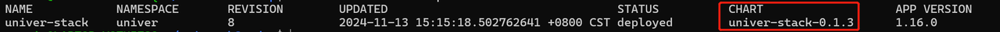

This section introduces the Downtime Upgrade SOP for Univer backend services. If you are familiar with docker compose and K8s, Univer recommends that you refer to this SOP to create a more suitable SOP for your production environment.

## Downtime Upgrade SOP for Docker Compose

### Upgrade Preparation

**Custom configuration file**

Before preparing for the upgrade, you should check our version introduction to determine which version you want to upgrade to, and refer to our [Production Deployment](/en-US/guides/pro/deploy), which will explain from which version new configuration items were added and from which version old configuration items are no longer supported. Based on the documentation, review your old version's custom configuration file `.env.custom` for any necessary modifications or new configurations that need to be customized. After confirming, prepare a new custom configuration file `.env.custom`, and keep the old version's `.env.custom` for safe rollback later.

**License File**

You also need to prepare your License file.

**Upgrade Notification**

Notify users of the expected downtime for the upgrade so they can prepare accordingly.

### Upgrade Process

<Steps>
  <Step>
    #### Stop the Old Version of the Service

    Assuming the old version of the Univer service is deployed in the directory `universer-old`

    - Prevent writing

    **Note**: Due to the special nature of collaborative editing, to ensure that all collaborative editing requests are saved properly, it is best not to stop the service directly, but to first prevent writing for a period of time before stopping the service. You can use your own infrastructure to achieve this, or use the nginx provided by Univer service. Below is how to do it using the nginx deployed by Univer.
    Modify `universer-old/nginx/universer.conf` as follows, adding the route configuration `location ~ ^/universer-api {return 403;}` to prohibit all new requests:

    ```nginx
    server {
      listen 8000;

      client_max_body_size 100m;

      location ~ ^/universer-api {return 403;} # Add this sentence to disable all requests through nginx

      location / {
        proxy_pass http://universer;
      }

      location /universer-api/comb/connect {
        proxy_pass http://universer;
        proxy_http_version 1.1;
        proxy_set_header Upgrade $http_upgrade;
        proxy_set_header Connection $connection_upgrade;
      }

      location /universer-api/metrics {
        return 403;
      }
    }
    ```

    After modifying, you need to reload the nginx configuration for it to take effect. Execute the following command to reload the nginx configuration:

    ```bash
    docker exec univer-lb nginx -s reload
    ```

    where `univer-lb` is the default configured nginx container name. If you have modified it, you need to change it accordingly.

    - Prevent writing for a period of time, recommended at least 1 minute
    - Stop the old version of the service

    Execute the following command to stop the service:

    ```bash
    cd universer-old && bash run.sh stop
    ```
  </Step>
  <Step>
    #### Data Backup

    Univer recommends that you back up important data before upgrading. The data to be backed up includes document metadata in the RDS. You can use the corresponding RDS backup tool to back it up. Data in Object Storage will only be added and not modified, so no backup is needed.
  </Step>
  <Step>
    #### Deploy the specialized version

    - Get the Univer backend service
      - If your deployment server can access the public internet:
        - Execute `bash -c "$(curl -fsSL https://get.univer.ai/product)" [-- version]` to download the Univer service for the specified version. If no version is specified, it will default to downloading the latest version.
      - If your deployment server cannot access the public internet:
        - [Download here](https://univer.ai/releases/univer-server/download) the All in one offline installation package provided by Univer
        - Upload the All in one offline installation package to your deployment server and extract it
        - Navigate to the extracted directory and execute `bash load-images.sh` to load the Univer backend service images into the local docker
    - Copy your new custom configuration file `.env.custom` to the new version folder, placing it in the same directory as the default `.env` file
    - Copy your License files `license.txt` and `licenseKey.txt` to the `configs/` directory in the new version folder
    - If you are using your own maintained RDS, please download the [Database Update Script](https://release-univer.oss-cn-shenzhen.aliyuncs.com/releases/latest/univer-server-sql-latest.tar.gz) to complete the RDS DDL update for the Univer service
    - Modify the load balance configuration to allow only test accounts to use the new version of the system

    If you are using the built-in nginx of Univer, you can configure it as follows:

    Edit the `/nginx/universer.conf` in the new version folder and add the following configuration before the server route configuration:

    ```nginx title="/nginx/universer.conf"
    server {
      listen 8000;

      # Configure to allow only requests with header x-request-env=test
      # Add this configuration to verify the new version when users are not available
      underscores_in_headers on;
      if ($http_x_request_env != "test") {
        return 403;
      }

      client_max_body_size 100m;

      location / {
        proxy_pass http://universer;
      }

      ...
    }
    ```

    - Start the new version of the service: `bash run.sh start`. After successful startup, you can log in using a test account and carry the header `x-request-env=test` to perform verification.
  </Step>
</Steps>

### Post-Upgrade Verification

Now that you have started the new version of the service and users cannot access it temporarily, you need to comprehensively verify whether the new version of the service is configured and deployed correctly and whether it can run stably as expected.

### Enable the New Version Service

If the new version service passes acceptance and is decided to be adopted, remove the part of the configuration in `/nginx/universer.conf` that only allows specific header requests, and execute the command to reload the nginx configuration: `docker exec univer-lb nginx -s reload`. The `univer-lb` is the default configured nginx container name; if you have modified it, you need to change it accordingly.

### Rollback to the Old Version Service

If the new version service does not pass acceptance or there is not enough time to complete the acceptance, you can configure it to continue using the old version.

1. First, stop the new version of the service. Since no users are using it at this time, you can stop it directly. Execute `bash run.sh stop` to stop the new version service.
2. Restore the nginx configuration of the old version service: remove the write prohibition configuration `location ~ ^/universer-api {return 403;}` (remember we prohibited writing before stopping the old service?).
3. Restart the old version service.

## Downtime Upgrade SOP for K8s

### Upgrade Preparation

**Custom configuration file**

In preparation for the upgrade, you should check our version introduction to determine which version you want to upgrade to, and refer to our [Production Deployment](/en-US/guides/pro/deploy), which will explain from which version new configuration items were added and from which version old configuration items are no longer supported. Based on the documentation, review your old version's custom configuration file `values.yaml` for any necessary modifications or new configurations that need to be customized. After confirming, prepare a new custom configuration file `values.yaml`, and keep the old version's `values.yaml` for safe rollback later.

<Callout>
  If you find that a custom configuration item in the old version does not need to be modified, the new version of the custom configuration still needs to include it, otherwise this configuration item will use the default value when upgrading. This is because helm dynamically renders the resource list required by K8s with’values.yaml ‘and templates during deployment.
</Callout>

**License File**

You also need to prepare your License file.

**Upgrade Notification**

Notify users of the expected downtime for the upgrade so they can prepare accordingly.

### Upgrade Process

<Steps>
  <Step>
    #### Stop the Old Version of the Service

    **Note**: Due to the special nature of collaborative editing, to ensure that all collaborative editing requests are saved properly, it is best not to stop the service directly, but to first prevent writing for a period of time before stopping the service. If your K8s cluster has a method to configure rejection of all requests with the path prefix `/universer-api/`, you can configure it directly. If not, you can disable the universer service's ingress to achieve this purpose, as shown below:

    ```yaml title="values.yaml"
    universer:
      ingress:
        enabled: false # Disable universer ingress
    ```

    Since Helm dynamically renders K8s resource manifests, to enable the above configuration, you need to apply the changes based on your old version's custom configuration (assuming it is `values-1.0.0.yaml`), generate a new configuration file (assuming it is `values-1.0.0-forbid.yaml`), and then use helm to execute the update to apply this configuration:

    ```bash
    helm upgrade univer-stack \
      oci://univer-acr-registry.cn-shenzhen.cr.aliyuncs.com/helm-charts/univer-stack \
      --version your-current-version \
      -n univer \
      -f values-1.0.0-forbid.yaml \
      --set-file universer.license.licenseV2=your-license.txt-path \
      --set-file universer.license.licenseKeyV2=your-licenseKey.txt-path
    ```

    In the command, use `-f` to specify the new write prohibition configuration `values-1.0.0-forbid.yaml`. Additionally, note that we are only configuring to prohibit access to Univer at this time and not upgrading to the new version service yet, so we need to use `--version` to specify the chart version as the currently deployed version `your-current-version`. You can use the following command to get the current deployed chart version:

    `helm list --all-namespaces --filter univer-stack`

    The execution result is shown in the figure below, where you can get the current deployed version number from the chart field. In this example, it is 0.1.3.

    

    Preventing access should last for a period of time, recommended at least 1 minute, before proceeding to the next step.
  </Step>
  <Step>
    #### Data Backup

    Univer recommends that you back up important data before upgrading. The data to be backed up includes document metadata in the RDS. You can use the corresponding RDS backup tool to back it up. Data in Object Storage will only be added and not modified, so no backup is needed.
  </Step>
  <Step>
    #### Upgrade to the New Version

    - If you are using your own maintained RDS, please download the [Database Update Script](https://release-univer.oss-cn-shenzhen.aliyuncs.com/releases/latest/univer-server-sql-latest.tar.gz) to complete the RDS DDL update for the Univer service
    - Since we do not want all users to directly access the new version service, but need test accounts to access it for testing, you need to configure it to allow only specific users to access. If your infrastructure can support it, configure it through that. If not, you can configure it through ingress as follows.

    If your K8s cluster uses `nginx ingress controller`, the following configuration will only allow requests with the header `x-request-env=test`. You can merge this into the new version's custom configuration `values.yaml` to support testing with this header:

    ```yaml title="values.yaml"
    universer:
      ingress:
        enabled: true
        annotations:
          nginx.ingress.kubernetes.io/configuration-snippet: |
            if ($http_x_request_env != "test") {
              return 403;
            }
    ```

    - Execute the helm command to upgrade to the specified version:
      - If your deployment server can access the public internet:
      ```bash
      helm upgrade --install univer-stack \
        oci://univer-acr-registry.cn-shenzhen.cr.aliyuncs.com/helm-charts/univer-stack \
        --version target-version \
        -n univer \
        -f your-values.yaml-path \
        --set-file universer.license.licenseV2=your-license.txt-path \
        --set-file universer.license.licenseKeyV2=your-licenseKey.txt-path
      ```
      - If your deployment server cannot access the public internet:
        - [Download here](https://univer.ai/releases/univer-server/download) the All in one offline installation package provided by Univer
        - Navigate to the extracted directory and execute `bash load-images.sh` to upload the Univer backend service images to your private image registry
            ```shell
            export REGISTER=XXXX # Your private image register
            export NAMESPACE=XXX # The namespace where image save
            docker login $REGISTER
            bash load-image.sh --registry $REGISTER --namespace $NAMESPACE
            ```
      - After successful execution, a `values.yaml` and `values-observability.yaml` file will be generated in the current directory. You can modify your own configurations as needed.
        - `values.yaml`: Configuration file for the Univer service
        - `values-observability.yaml`: Configuration file for Univer service related observability monitoring components
      - Execute the following command to upgrade and install:
          ```shell
          helm upgrade --install univer-stack \
            -n univer \
            -f your-own-values.yaml-path \
            --set-file universer.license.licenseV2=your-license.txt-path \
            --set-file universer.license.licenseKeyV2=your-licenseKey.txt-path \
            univer-stack-xxxx.tgz # should change to the right chart name
          ```
    In the command, use `-f` to specify the new version's custom configuration `values.yaml`; use `--version` to specify the target version you want to upgrade to. If you want to upgrade directly to the latest version, you can remove the `--version` parameter.
  </Step>
</Steps>

### Post-Upgrade Verification

Now that you have started the new version of the service and users cannot access it temporarily, you need to comprehensively verify whether the new version of the service is configured and deployed correctly and whether it can run stably as expected.

### Enable the New Version Service

If the new version service passes acceptance and is decided to be adopted, update the configuration to allow all users to access it. If you are using ingress to control which users can access it, you need to remove the corresponding configuration and execute `helm upgrade` again to apply the configuration, allowing all users to access it.

### Rollback to the Old Version Service

If the new version service does not pass acceptance or there is not enough time to complete the acceptance, you can configure it to continue using the old version.

Use the old version's chart version number and custom configuration to update the deployment:

```bash
helm upgrade --install univer-stack \
  oci://univer-acr-registry.cn-shenzhen.cr.aliyuncs.com/helm-charts/univer-stack \
  --version old-version \
  -n univer \
  -f old-values.yaml \
  --set-file universer.license.licenseV2=your-license.txt-path \
  --set-file universer.license.licenseKeyV2=your-licenseKey.txt-path
```

use `--version` to specify the old chart version, `-f` to specify the old custom configuration.
