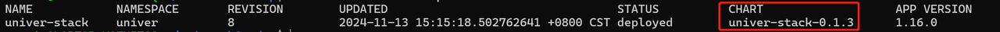

本章節介紹 Univer 後端服務的停機升級 SOP。如果你對 Docker Compose 和 K8s 比較熟悉，Univer 建議你參照此 SOP 來制定更適合你們生產環境的 SOP。

## Docker Compose 方式升級 SOP

### 升級前準備

**自定義配置檔案**

在準備升級前，你應該檢視我們的版本介紹，確定你想要升級的版本，並檢視我們的[生產部署](/guides/pro/deploy)，其中會介紹從哪個版本開始加入了新的配置項，從哪個版本開始舊的配置項不再支援。根據文件，檢視自己的舊版本自定義配置檔案 `.env.custom` 有哪些需要修改、有哪些新增配置需要自定義。確定好後，準備一份新的自定義配置檔案 `.env.custom`，並且保留舊版本的 `.env.custom`以便後續能安全回滾。

**License 檔案**

你還需要準備好你的 License 檔案。

**升級知會**

告知使用者預計的停機升級時間段，以便他們做好準備

### 升級流程

<Steps>
  <Step>
    #### 停止舊版本服務

    這裡假設舊版本的 Univer 服務部署在目錄 `universer-old`

    - 先禁寫

    **注意**：因為協同編輯的特殊性，為了確保所有協同編輯請求都正常儲存，最好不要直接停止服務，而是先透過一段時間的禁寫操作後再停止服務。你可以使用你們自己的基礎設施來達到此目的，或者透過 Univer 服務中的 nginx 來實現。下面介紹使用 Univer 部署的 nginx 來實現的方式。
    如下修改 `universer-old/nginx/universer.conf`，增加路由配置`location ~ ^/universer-api {return 403;}` 來禁止所有新請求

    ```nginx
    server {
      listen 8000;

      client_max_body_size 100m;

      location ~ ^/universer-api {return 403;} # 增加這句來透過 nginx 禁止所有請求

      location / {
        proxy_pass http://universer;
      }

      location /universer-api/comb/connect {
        proxy_pass http://universer;
        proxy_http_version 1.1;
        proxy_set_header Upgrade $http_upgrade;
        proxy_set_header Connection $connection_upgrade;
      }

      location /universer-api/metrics {
        return 403;
      }
    }
    ```

    修改後，需要讓 nginx 重新載入此配置方能生效，執行以下命令讓 nginx 重新載入配置：

    ```bash
    docker exec univer-lb nginx -s reload
    ```

    其中的 `univer-lb` 是預設配置的 nginx 容器名，如果你修改了，需要更換下

    - 禁寫持續一段時間，建議至少 1 分鐘
    - 停止舊版本服務

    執行以下命令來停止服務

    ```bash
    cd universer-old && bash run.sh stop
    ```
  </Step>
  <Step>
    #### 資料備份

    Univer 建議你在升級前進行重要資料的備份，需要備份的資料包括 RDS 中的文件後設資料，使用對應 RDS 的資料備份工具自行備份即可。Object Storage 中的資料只會新增，不會修改，所以不用備份。
  </Step>
  <Step>
    #### 部署選定的版本

    - 獲取Univer後端服務
      - 如果你的部署伺服器可以訪問公共網際網路：
        - 執行 `bash -c "$(curl -fsSL https://get.univer.ai/product)" [-- version]`，下載到你給定版本的Univer服務，如果沒有指定 version，將預設下載最新的版本
      - 如果你的部署伺服器不能訪問公共網際網路：
        - [點此下載](https://univer.ai/releases/univer-server/download) Univer提供的 All in one 離線安裝包
        - 將 All in one 離線安裝包上傳到你的部署伺服器並解壓
        - 進入解壓後的目錄執行 `bash load-images.sh` 將 Univer 後端服務的映象載入到本機 docker
    - 將你的新自定義配置檔案 `.env.custom` 複製到新版本資料夾下，和預設的 `.env` 檔案放在同一目錄
    - 將你的 License 檔案 `license.txt` 和 `licenseKey.txt` 複製到新版本資料夾下的 `configs/` 目錄下
    - 如果你使用的是自己維護的 RDS，請下載[資料庫更新指令碼](https://release-univer.oss-cn-shenzhen.aliyuncs.com/releases/latest/univer-server-sql-latest.tar.gz)，完成 Univer 服務的 RDS DDL 更新
    - 修改 load balance 配置，僅允許測試賬戶使用新版系統

    如果你使用的是 Univer 內建的 nginx，可如下配置：

    編輯新版本資料夾下 `/nginx/universer.conf`，在 server 路由配置前增加如下配置：

    ```nginx title="/nginx/universer.conf"
    server {
      listen 8000;

      # 配置僅允許攜帶 header x-request-env=test 的請求
      # 新增此配置以在使用者不可用的情況下驗證新版本
      underscores_in_headers on;
      if ($http_x_request_env != "test") {
        return 403;
      }

      client_max_body_size 100m;

      location / {
        proxy_pass http://universer;
      }

      ...
    }
    ```

    - 啟動新版本的服務：`bash run.sh start`，成功後，即可使用測試賬號登入，攜帶 header `x-request-env=test` 來進行驗證
  </Step>
</Steps>

### 升級後驗證

現在，你已經啟動了新版服務，並且使用者暫時不能訪問。接下來你需要全面地驗證新版服務是否配置部署正確，是否能如期地穩定地執行。

### 啟用新版本服務

如果新版服務驗收透過決定採用，將前面在 `/nginx/universer.conf` 中配置的只允許特定 header 請求的部分刪除，執行命令讓 nginx 重新載入配置：`docker exec univer-lb nginx -s reload`， `univer-lb` 是預設配置的 nginx 容器名，如果你修改了，則需要更換。

### 退回使用舊版服務

如果新版服務驗收未透過，或者時間不夠完成驗收，可先配置繼續使用舊版本。

1. 先停止新版的服務，因為此時沒有使用者在使用，直接停止即可。執行 `bash run.sh stop` 停止新版服務
2. 還原舊版本服務的nginx配置：去掉禁寫配置 `location ~ ^/universer-api {return 403;}` （還記得我們在前面停止舊服務前禁寫了嗎？）
3. 重新啟動舊版服務

## K8s 方式升級 SOP

### 升級前準備

**自定義配置檔案**

在準備升級前，你應該檢視我們的版本介紹，確定你想要升級的版本，並檢視我們的[生產部署](/guides/pro/deploy)，其中會介紹從哪個版本開始加入了新的配置項，從哪個版本開始舊的配置項不再支援。根據文件，檢視自己的舊版本自定義配置檔案 `values.yaml` 有哪些需要修改、有哪些新增配置需要自定義。確定好後，準備一份新的自定義配置檔案 `values.yaml`，並且保留舊版本的 `values.yaml`，以便後續能安全回滾。

**請注意**：如果你發現舊版本的某一自定義配置項不需要修改，新版本的自定義配置仍然需要包含它，否則此配置項將會在升級時使用預設的值。這是由於 Helm 在部署時是用 `values.yaml` 和模板動態地渲染 K8s 所需資源清單的。

**License 檔案**

你還需要準備好你的 License 檔案。

**升級知會**

告知使用者預計的停機升級時間段，以便他們做好準備

### 升級流程

<Steps>
  <Step>
    #### 舊版本禁止訪問

    **注意**：因為協同編輯的特殊性，為了確保所有協同編輯請求都正常儲存，最好不要直接停止服務程式，而是透過其他手段來禁止使用者訪問。如果你維護的 K8s 叢集有方法來配置拒絕所有 path 包含字首 `/universer-api/` 的請求，那麼直接配置即可。如果沒有，你可以透過禁用 universer 服務的 ingress 來達到此目的，可以如下配置：

    ```yaml title="values.yaml"
    universer:
      ingress:
        enabled: false # 禁用 universer 的 ingress
    ```

    因為 Helm 是動態渲染 K8s 資源清單的，為了啟用上述配置，你需要在你舊版本自定義配置（假設是 `values-1.0.0.yaml`）的基礎上應用上述配置變更，生成新的配置檔案（假設是 `values-1.0.0-forbid.yaml`），之後使用 helm 執行更新以應用此配置：

    ```bash
    helm upgrade univer-stack \
      oci://univer-acr-registry.cn-shenzhen.cr.aliyuncs.com/helm-charts/univer-stack \
      --version your-current-version \
      -n univer \
      -f values-1.0.0-forbid.yaml \
      --set-file universer.license.licenseV2=your-license.txt-path \
      --set-file universer.license.licenseKeyV2=your-licenseKey.txt-path
    ```

    命令中，使用 `-f` 指定新增禁寫配置的 `values-1.0.0-forbid.yaml`。另外，需要注意，我們此時只是配置禁止訪問 Univer，並不能現在就升級到新版本服務，因此需要用 `--version` 指定 chart 版本仍然是當前部署的版本 `your-current-version`。可以使用下列命令獲取當前部署的 chart 版本：

    `helm list --all-namespaces --filter univer-stack`

    執行結果如下圖，從其中的 chart 欄位即可獲取到當前部署的版本號，本例中是 0.1.3

    

    禁止訪問需要持續一段時間，建議至少 1 分鐘，之後再往下操作
  </Step>
  <Step>
    #### 資料備份

    Univer 建議你在升級前進行重要資料的備份，需要備份的資料包括 RDS 中的文件後設資料，使用對應 RDS 的資料備份工具自行備份即可。Object Storage 中的資料只會新增，不會修改，所以不用備份。
  </Step>
  <Step>
    #### 升級到新版本

    - 如果你使用的是自己維護的 RDS，請下載[資料庫更新指令碼](https://release-univer.oss-cn-shenzhen.aliyuncs.com/releases/latest/univer-server-sql-latest.tar.gz)，完成 Univer 服務的 RDS DDL 更新
    - 由於我們不想讓所有使用者直接能訪問到新版本服務，又需要測試賬戶能夠訪問來測試，你需要配置好只允許特定使用者訪問。如果你的基礎設施能夠支援，透過它配置即可。如果不支援，可透過 ingress 如下配置

    如果你的 K8s 叢集使用的是 `nginx ingress controller`，以下配置將只允許攜帶 `header x-request-env=test` 的請求，你可以將其合併到新版本的自定義配置 `values.yaml` 來支援帶上此 header 進行測試驗證：

    ```yaml title="values.yaml"
    universer:
      ingress:
        enabled: true
        annotations:
          nginx.ingress.kubernetes.io/configuration-snippet: |
            if ($http_x_request_env != "test") {
              return 403;
            }
    ```

    - 執行 helm 命令升級到指定的版本
      - 如果你的部署伺服器可以訪問公共網際網路：
      ```bash
      helm upgrade --install univer-stack \
        oci://univer-acr-registry.cn-shenzhen.cr.aliyuncs.com/helm-charts/univer-stack \
        --version target-version \
        -n univer \
        -f your-values.yaml-path \
        --set-file universer.license.licenseV2=your-license.txt-path \
        --set-file universer.license.licenseKeyV2=your-licenseKey.txt-path
      ```
      - 如果你的部署伺服器不能訪問公共網際網路：
        - [點此下載](https://univer.ai/releases/univer-server/download)Univer提供的 K8s All in one 離線安裝包
        - 進入解壓後的目錄執行 `bash load-images.sh` 將Univer後端服務的映象上傳到私有映象倉庫
            ```shell
            export REGISTER=XXXX # 你的私有映象倉庫
            export NAMESPACE=XXX # 要上傳的映象 namespace
            docker login $REGISTER
            bash load-image.sh --registry $REGISTER --namespace $NAMESPACE
            ```
      - 執行成功後會在當前目錄生成一個 `values.yaml` 和 `values-observability.yaml` 檔案，可在裡面按需修改你自己的配置
        - `values.yaml`：univer 服務的配置檔案
        - `values-observability.yaml`：univer 服務相關可觀測性監控元件
      - 接著執行以下命令進行升級安裝
          ```shell
          helm upgrade --install univer-stack \
            -n univer \
            -f your-own-values.yaml-path \
            --set-file universer.license.licenseV2=your-license.txt-path \
            --set-file universer.license.licenseKeyV2=your-licenseKey.txt-path \
            univer-stack-xxxx.tgz # 需要改成當前目錄解壓後對應的 chart 包
          ```
    命令中，使用 `-f` 指定新版本的自定義配置 values.yaml；使用 `--version` 指定想要升級到的目標版本，如果想直接升級到最新版本，去掉 `--version` 引數即可。
  </Step>
</Steps>

### 升級後驗證

現在，你已經啟動了新版服務，並且使用者暫時不能訪問。接下來你需要全面地驗證新版服務是否配置部署正確，是否能如期地穩定地執行。

### 啟用新版本服務

如果新版服務驗收透過決定採用，更新配置讓所有使用者都能訪問即可。如果你是使用 ingress 的方式控制哪些使用者可以訪問的，需要去除對應的配置，再次執行 `helm upgrade` 應用配置以開放給所有使用者訪問。

### 退回使用舊版服務

如果新版服務驗收未透過，或者時間不夠完成驗收，可如下配置退回到舊版本：

使用舊版本的 chart 版本號和自定義配置更新部署即可：

```bash
helm upgrade --install univer-stack \
  oci://univer-acr-registry.cn-shenzhen.cr.aliyuncs.com/helm-charts/univer-stack \
  --version old-version \
  -n univer \
  -f old-values.yaml \
  --set-file universer.license.licenseV2=your-license.txt-path \
  --set-file universer.license.licenseKeyV2=your-licenseKey.txt-path
```

透過引數 `--version` 指定舊版本的 chart 版本號，引數 `-f` 指定舊版本的自定義配置檔案。
