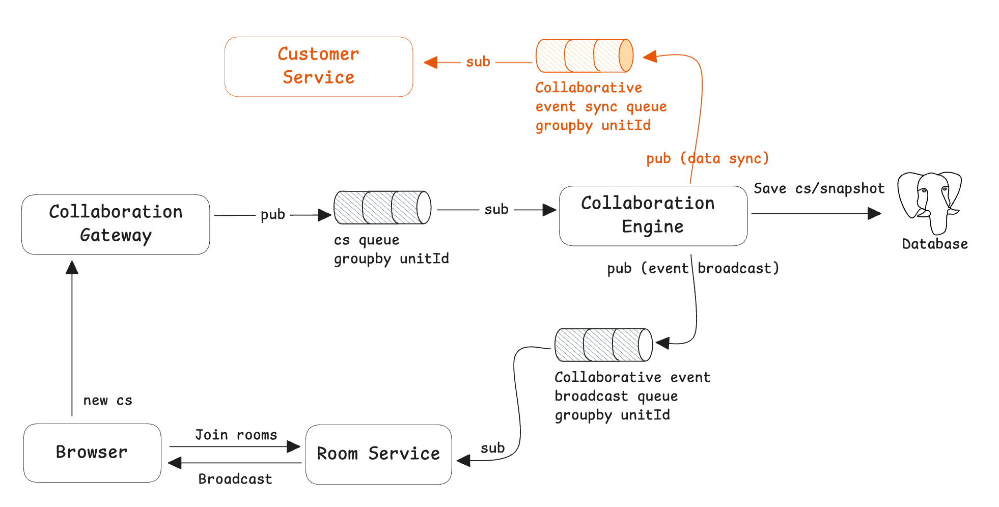

Event Sync publishes collaboration engine events to your system so you can react (auditing, notifications, indexing, etc.).



## Use Cases

- Collaboration change audit/replay
- Sync changes to search/indexing pipelines
- External notifications and alerts

Supported events:

- Collaboration edits: persisted changeset

## Enable Event Sync

<Tabs items={['docker compose', 'K8s']}>
  <Tab label="docker compose">
    Add to `.env.custom`:

    ```properties title=".env.custom"
    EVENT_SYNC=true
    ```
  </Tab>
  <Tab label="K8s">
    Add to `values.yaml`:

    ```yaml title="values.yaml"
    universer:
      config:
        rabbitmq:
          eventSync: true
    ```
  </Tab>
</Tabs>

## Consumer Example

See: https://github.com/dream-num/univer-event-sync-example-go

## Event Schema

```go
message EventSyncData {
  string eventId = 1;
  string eventType = 2; // type of event, now support changeset
  int32 createdAt = 3;
  oneof event {
    univer.ChangesetAck csAckEvent = 4;
    // more event types in the future.
  }
  optional string unitMetaData = 99; // Introduced since v0.20.0, customer setted metadata of the unit(created by CreateUnit request or Import request)
}

message ChangesetAck {
  univer.Changeset cs = 1;
}

message Changeset {
  string unitID = 1; // unitID of the Univer document
  univer.constants.UniverType type = 2;
  int32 baseRev = 3;
  int32 revision = 4;
  string userID = 5;
  repeated Mutation mutations = 6;
  string memberID = 7;
}

message Mutation {
  string id = 1; // ID of the mutation
  string data = 2; // serialized params
}
```
