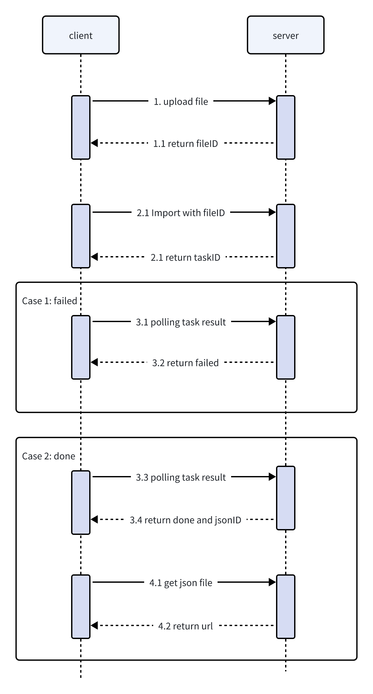
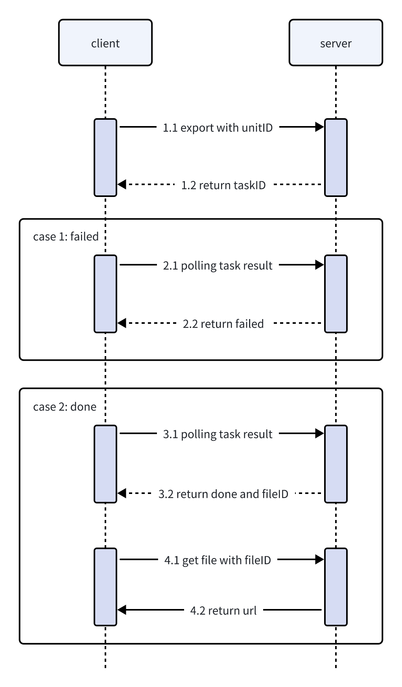

## Import Process

1. Upload the file to object storage and obtain the `fileID` return value.
2. Call the import interface with the `fileID` parameter, setting the export type `outputType` (1 for importing as a unit document, 2 for obtaining JSON data), and get the `taskID` return value.
3. Poll to get the conversion result, handling based on the `status` return value:
    - `pending`: Continue polling.
    - `done`: Conversion successful, obtaining `import.jsonID` or `import.unitID` return value.
    - `failed`: Conversion failed, retrieve error information from `error.message`.
4. If you want to obtain JSON data instead of a unit document, use `import.jsonID` to call the file retrieval interface to download the conversion result. Note that after obtaining the JSON data, you still need to [convert it](/en-US/guides/docs/features/import-export#server-data-transformation) before it can be used in Univer.

## Export Process

1. Call the export interface with the `unitID` parameter to obtain the `taskID` return value.
2. Poll to get the conversion result, handling based on the `status` return value:
    - `pending`: Continue polling.
    - `done`: Conversion successful, obtaining `export.fileID` return value.
    - `failed`: Conversion failed, retrieve error information from `error.message`.
3. Use `export.fileID` to call the file retrieval interface to download the conversion result.

## API

See the [Univer Server API Definition](/en-US/guides/pro/api)

Example of import:https://github.com/dream-num/usip-example/tree/main/import
