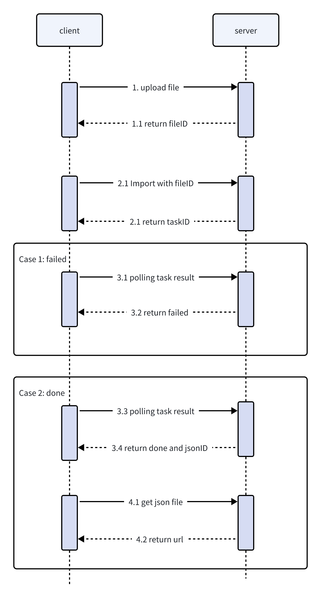
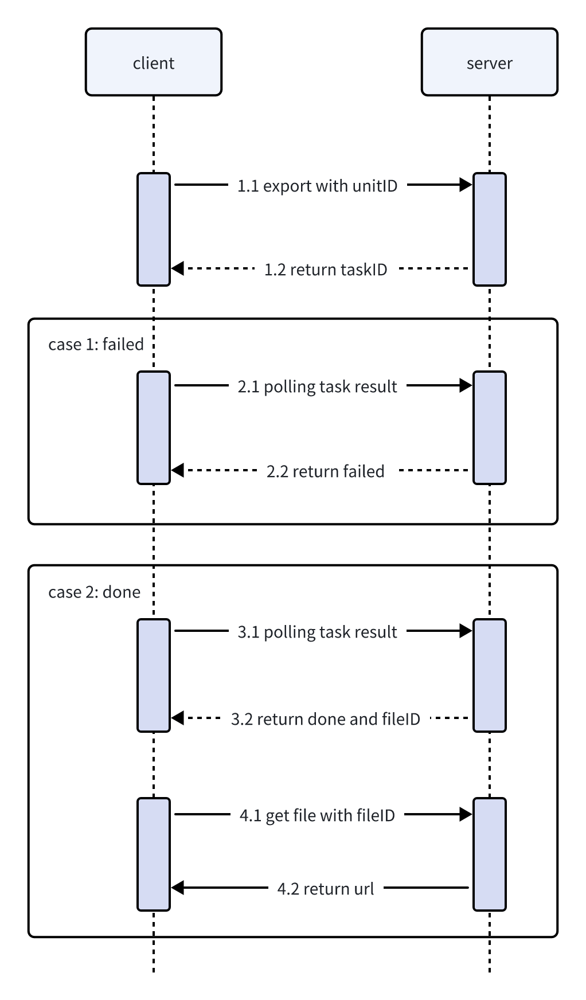

匯入匯出能力由後端提供，可將 Office 檔案轉成 Univer 文件或匯出為 Office 格式。

## 前置條件

- 已完成後端部署（見[快速開始](/guides/pro/server)）
- exchange worker 與 temporal 正常運作
- 物件儲存可存取

## 匯入流程

1. [上傳檔案](/guides/pro/api#upload-file)到物件儲存，取得 `fileID`
2. 呼叫[匯入](/guides/pro/api#import-file) API，設定 `outputType`
   - `1`：匯入為 unit 文件
   - `2`：匯入為 JSON
3. 輪詢[任務狀態](/guides/pro/api#get-task-result)：
   - `pending`：持續輪詢
   - `done`：取得 `import.unitID` 或 `import.jsonID`
   - `failed`：查看 `error.message`
4. 文件載入
   - 若匯入為 unit 文件，直接使用 `import.unitID` 載入，使用見[協同編輯](/guides/sheets/features/collaboration)章節
   - 若匯入為 JSON，使用 `import.jsonID` [取得檔案](/guides/pro/api#get-file)下載連結，拿到 JSON 後按[服務端資料轉換](/guides/sheets/features/import-export#server-side-data-conversion)處理後再載入



## 匯出流程

unit 協同文件匯出方式：

1. 以 `unitID` 呼叫[匯出](/guides/pro/api#export-file) API，取得 `taskID`
2. 輪詢[任務狀態](/guides/pro/api#get-task-result)：
   - `pending`：持續輪詢
   - `done`：取得 `export.fileID`
   - `failed`：查看 `error.message`
3. 使用 `export.fileID` [取得檔案](/guides/pro/api#get-file)下載連結



非協同文件匯出方式：

1. [上傳](/guides/pro/api#upload-file)前端 snapshot json 生成的檔案到物件儲存，取得 `fileID`
2. 以 `jsonID` 呼叫[匯出](/guides/pro/api#export-file) API，取得 `taskID`；`jsonID` 為前一步上傳檔案的 `fileID`
3. 輪詢[任務狀態](/guides/pro/api#get-task-result)：
   - `pending`：持續輪詢
   - `done`：取得 `export.fileID`
   - `failed`：查看 `error.message`
4. 使用 `export.fileID` [取得檔案](/guides/pro/api#get-file)下載連結

## 實作範例

前端已經整合了匯入匯出的 API 呼叫，詳見 [Facade API](/guides/sheets/features/import-export#facade-api)。

以下程式碼展示使用 `fetch` 的完整 TypeScript 實作。請將 `BASE_URL` 替換為你的 Univer 伺服器端點，並在每次請求中帶上認證資訊（例如 `cookie` 或 `Authorization`）。

### 1. 上傳檔案

```typescript
async function uploadFile(file: File): Promise<string> {
  const formData = new FormData()
  formData.append('file', file)

  const res = await fetch(
    `${BASE_URL}/universer-api/stream/file/upload?size=${file.size}`,
    {
      method: 'POST',
      headers: {
        // 在此添加認證資訊，例如
        // cookie: '_univer=XXXXXX',
      },
      body: formData,
    },
  )

  const data = await res.json()
  if (data.error?.code !== 1) {
    throw new Error(data.error?.message || '上傳失敗')
  }
  return data.FileId // 作為下一步的 fileID 使用
}
```

### 2. 輪詢任務狀態

```typescript
interface TaskResult {
  status: 'pending' | 'done' | 'failed'
  error?: { code: number, message: string }
  import?: { unitID?: string, jsonID?: string }
  export?: { fileID?: string }
}

async function pollTask(taskID: string, interval = 2000): Promise<TaskResult> {
  while (true) {
    const res = await fetch(
      `${BASE_URL}/universer-api/exchange/task/${taskID}`,
      {
        headers: {
          // cookie: '_univer=XXXXXX',
        },
      },
    )
    const data: TaskResult = await res.json()

    if (data.status === 'done' || data.status === 'failed') {
      return data
    }

    await new Promise(resolve => setTimeout(resolve, interval))
  }
}
```

### 3. 匯入檔案

```typescript
interface ImportParams {
  fileID: string
  type: 1 | 2 // 1 = 文件, 2 = 試算表
  outputType: 1 | 2 // 1 = unit 文件, 2 = JSON
  minSheetRowCount?: number
  minSheetColumnCount?: number
}

async function importFile(params: ImportParams): Promise<string> {
  const res = await fetch(
    `${BASE_URL}/universer-api/exchange/${params.type}/import`,
    {
      method: 'POST',
      headers: {
        'Content-Type': 'application/json',
        // cookie: '_univer=XXXXXX',
      },
      body: JSON.stringify({
        fileID: params.fileID,
        outputType: params.outputType,
        minSheetRowCount: params.minSheetRowCount ?? 1000,
        minSheetColumnCount: params.minSheetColumnCount ?? 20,
      }),
    },
  )

  const data = await res.json()
  if (data.error?.code !== 1) {
    throw new Error(data.error?.message || '匯入請求失敗')
  }

  // 輪詢任務狀態直到完成或失敗
  const taskResult = await pollTask(data.taskID)
  if (taskResult.status === 'failed') {
    throw new Error(taskResult.error?.message || '匯入失敗')
  }

  return params.outputType === 1
    ? taskResult.import!.unitID!
    : taskResult.import!.jsonID!
}
```

### 4. 匯出檔案

```typescript
interface ExportParams {
  unitID: string
  jsonID: string
  type: 1 | 2 // 1 = 文件, 2 = 試算表
  sscSwitch?: boolean
}

async function exportFile(params: ExportParams): Promise<string> {
  const res = await fetch(
    `${BASE_URL}/universer-api/exchange/${params.type}/export`,
    {
      method: 'POST',
      headers: {
        'Content-Type': 'application/json',
        // cookie: '_univer=XXXXXX',
      },
      body: JSON.stringify({
        unitID: params.unitID,
        type: params.type,
        sscSwitch: params.sscSwitch ?? false,
      }),
    },
  )

  const data = await res.json()
  if (data.error?.code !== 1) {
    throw new Error(data.error?.message || '匯出請求失敗')
  }

  const taskResult = await pollTask(data.taskID)
  if (taskResult.status === 'failed') {
    throw new Error(taskResult.error?.message || '匯出失敗')
  }

  // 取得帶簽名的下載連結
  const urlRes = await fetch(
    `${BASE_URL}/universer-api/file/${taskResult.export!.fileID!}/sign-url`,
    {
      headers: {
        // cookie: '_univer=XXXXXX',
      },
    },
  )
  const urlData = await urlRes.json()
  if (urlData.error?.code !== 1) {
    throw new Error(urlData.error?.message || '取得下載連結失敗')
  }

  return urlData.url
}
```

## API 與範例

- API 參考：[Univer Server API](/guides/pro/api)
- 匯入範例：https://github.com/dream-num/usip-example/tree/main/import
