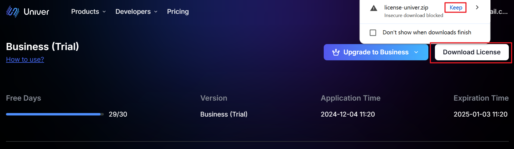
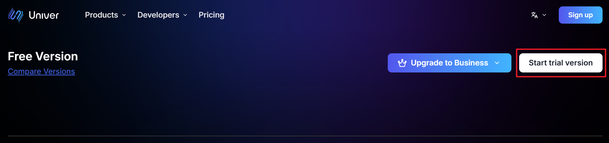

## 概要

Univer の高度な機能を完全に利用するにはライセンスが必要です。ライセンスを追加して有償プランを有効化したり、ライセンス更新で上位プランにアップグレードできます。このページでは、ライセンスの取得・設定・検証方法を説明します。

## 事前準備

開始前に以下を確認してください:
- Univer の高度な機能をプロジェクトに統合済みであること。未完了の場合は [Univer 高度機能の統合](/guides/pro) を参照してください。
- サーバー側デプロイの場合、Docker または Kubernetes 環境の設定を完了していること。未完了の場合は [Docker デプロイ ドキュメント](/guides/pro/deploy#deploy-to-docker-compose) または [Kubernetes デプロイ ドキュメント](/guides/pro/deploy#deploy-to-k8s) を参照してください。
- 有効なライセンスを所持していること。未取得の場合は [ライセンスページ](https://univer.ai/license) で登録して取得してください。

## ライセンスのダウンロード

1. [ライセンスページ](https://univer.ai/license) にアクセスしてログインします。

2. ライセンスファイルをダウンロードします。


### 無料トライアルライセンス

ライセンス未取得、または購入を迷っている場合は、Univer の全ての高度機能を体験できる 30 日間のトライアルライセンスを提供しています。

1. [ライセンスページ](https://univer.ai/license) にアクセスしてログインします。

2. "Get Trial License" ボタンをクリックします。


## ライセンスの追加/更新

ダウンロードした `license-univer.zip` を解凍すると、`license.txt` と `licenseKey.txt` が取得できます。これら 2 つのファイルは安全に保管し、形式や内容を変更しないでください。

### クライアントでの利用

#### プリセットモード

```typescript
import { UniverSheetsAdvancedPreset } from '@univerjs/preset-sheets-advanced'

const { univerAPI } = createUniver({
  presets: [
    UniverSheetsAdvancedPreset({
      license: `license.txt の内容をここに貼り付けてください`,
    }),
  ],
})
```

#### プラグインモード

まず `@univerjs-pro/license` プラグインをインストールします:

```package-install
npm install @univerjs-pro/license
```

次に `UniverLicensePlugin` を登録します。Univer インスタンス生成直後にこのプラグインを登録してください。`license.txt` の内容を `license` パラメータに貼り付けます。

```typescript
import { UniverLicensePlugin } from '@univerjs-pro/license'

univer.registerPlugin(UniverLicensePlugin, {
  license: `license.txt の内容をここに貼り付けてください`,
})
```

### サーバーでの利用

<Tabs items={['docker compose', 'K8s']}>
  <Tab>
    1. `license.txt` と `licenseKey.txt` を `/univer-server/configs/` ディレクトリにコピーします。
    2. `univer-server` ディレクトリで `bash run.sh` を実行し、universer サービスを再起動します。
  </Tab>
  <Tab>
    1. 次のコマンドを実行します。

    ```bash
    helm upgrade --install -n univer --create-namespace \
    --set global.istioNamespace="univer" \
    --set-file universer.license.licenseV2=$(YOUR_LICENSE_TXT_PATH) \
    --set-file universer.license.licenseKeyV2=$(YOUR_LICENSE_KEY_TXT_PATH) \
    univer-stack oci://univer-acr-registry.cn-shenzhen.cr.aliyuncs.com/helm-charts/univer-stack
    ```
  </Tab>
</Tabs>

## ライセンスの検証

### JavaScript/TypeScript プロジェクトでの検証

1. フロントエンドにライセンスを注入した後、プロジェクトを起動してライセンスが有効かつ正しく使用されているか確認します。
注: ライセンス未入力または無効（期限切れ/内容不正）の場合、一部機能が制限され、ページにウォーターマークが表示されます。


2. 有効なライセンスを入力すると、制限なしで通常どおり動作します。


### Univer Server での検証

`host:8000/universer-api/license/key` にアクセスしてライセンスの権限情報を確認します。例えばローカルで動作している場合は `http://localhost:8000/universer-api/license/key` を開きます。

```json
{
  "verify": "true", // License verification result
  "release_type": "COMMERCIAL" // License type
}
```


## よくある問題

1. ライセンス検証に失敗する場合は以下を確認してください:
    - ライセンスファイルが完全で、改変されていないか
    - ライセンスの有効期限が切れていないか
    - サービスを正しく再起動できているか
2. それ以外の問題がある場合は、テクニカルサポートにお問い合わせください。
