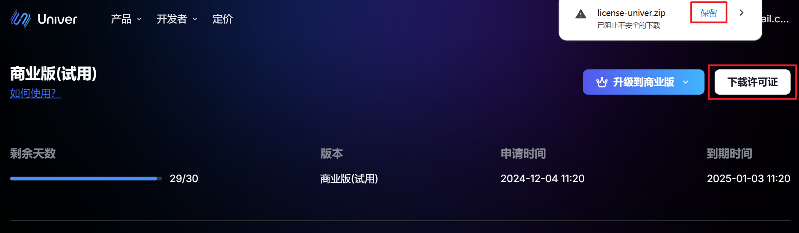
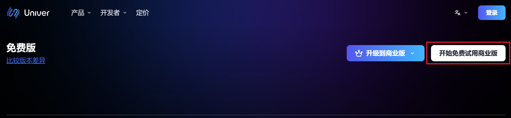
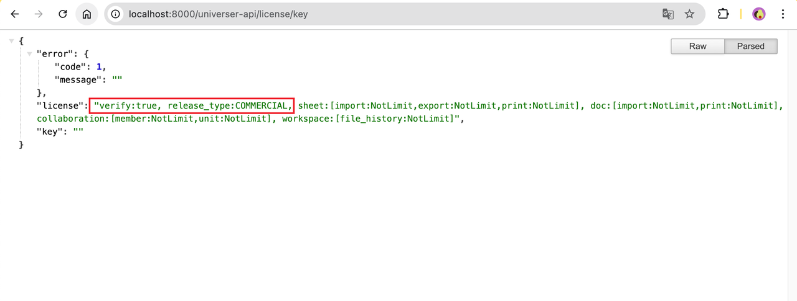

Univer Pro 的高級能力需要授權才能解鎖完整權益。本頁說明如何取得、設定與驗證授權。

## 何時需要授權

- 體驗階段：可不使用授權，但會有限制（浮水印、匯入體積、協作數量）
- 正式上線：建議購買授權以解鎖完整功能

若尚未部署後端，請先閱讀[快速開始](/guides/pro/server)。

## 取得授權

1. 前往[授權頁面](https://univer.ai/license)並登入
2. 下載授權檔案



### 免費試用授權

可申請 30 天試用授權：

1. 前往[授權頁面](https://univer.ai/license)並登入
2. 點擊「取得試用授權」



## 新增或更新授權

解壓 `license-univer.zip`，取得 `license.txt` 與 `licenseKey.txt`。請勿修改內容。

### 在用戶端使用授權

#### 預設模式

```typescript
import { UniverSheetsAdvancedPreset } from '@univerjs/preset-sheets-advanced'

const { univerAPI } = createUniver({
  presets: [
    UniverSheetsAdvancedPreset({
      license: `license.txt 的內容`,
    }),
  ],
})
```

#### 外掛模式

確保 `UniverLicensePlugin` 在建立實例後最先註冊：

```typescript
import { UniverLicensePlugin } from '@univerjs-pro/license'

univer.registerPlugin(UniverLicensePlugin, {
  license: `license.txt 的內容`,
})
```

### 在服務端使用授權

<Tabs items={['docker compose', 'K8s']}>
  <Tab>
    1. 將 `license.txt` 與 `licenseKey.txt` 複製到 `/univer-server/configs/`
    2. 在 `univer-server` 目錄執行 `bash run.sh restart`
  </Tab>
  <Tab>
    1. 透過 Helm 安裝/升級：

    ```bash
    helm upgrade --install -n univer --create-namespace \
    --set global.istioNamespace="univer" \
    --set-file universer.license.licenseV2=$(YOUR_LICENSE_TXT_PATH) \
    --set-file universer.license.licenseKeyV2=$(YOUR_LICENSE_KEY_TXT_PATH) \
    univer-stack oci://univer-acr-registry.cn-shenzhen.cr.aliyuncs.com/helm-charts/univer-stack
    ```
  </Tab>
</Tabs>

## 驗證授權

### 前端驗證

- 未輸入或授權無效會顯示浮水印並限制功能
- 輸入合法授權後水印消失


### 服務端驗證

開啟 `host:8000/universer-api/license/key` 檢視權益資訊。例如本機：

`http://localhost:8000/universer-api/license/key`

```json
{
  "verify": "true",
  "release_type": "COMMERCIAL"
}
```



## 常見問題

1. 驗證失敗：檢查授權有效期、檔案完整性、服務是否重啟
2. 仍有浮水印：確認前端是否已注入 `license.txt` 內容
3. 其他問題：請聯繫技術支援
