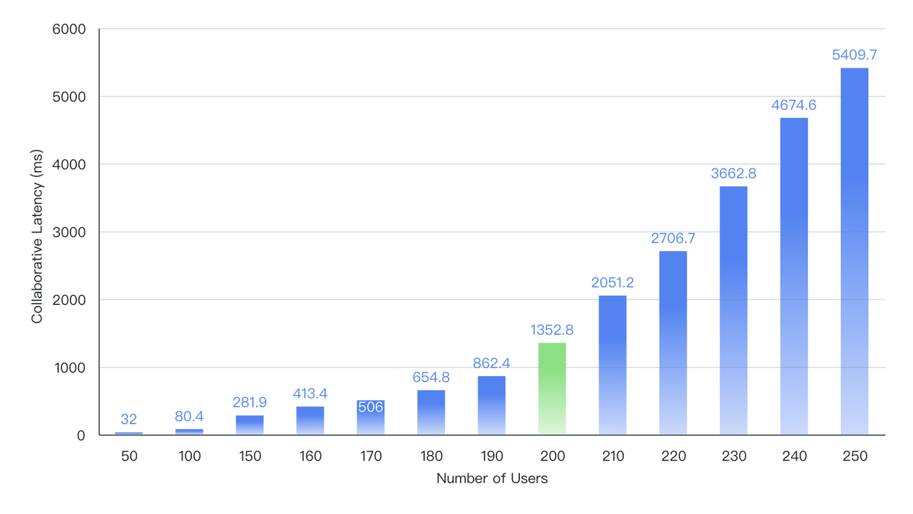

이 페이지에서는 Univer Pro의 주요 성능 데이터를 요약합니다. 결과는 하드웨어, 데이터 세트 크기 및 구성에 따라 달라집니다.

## 메모리에서 스냅샷 불러오기

| 통합 문서 셀 수 | 시간(초) |
| --- | --- |
| 1M (100,000행, 10열) | 0.274 |
| 1M (10,000행, 100열) | 0.241 |
| 10M (1,000,000행, 10열) | 1.520 |
| 10M (100,000행, 100열) | 0.945 |

## 수식 계산

| 수식 복잡도 | 시간(초) |
| --- | --- |
| 수식 20,000개, 임의 범위 | 1.32 |
| 중첩 수식 20,000개 | 1.37 |
| VLOOKUP을 사용하는 수식 20,000개 | 4.73 |
| 중첩 SUM을 사용하는 수식 20,000개 | 1.38 |

## 렌더링 성능

테스트 환경: Windows, 32GB RAM, i9-13900H.

| 셀 수 | 스크롤 FPS |
| --- | --- |
| 100k (10k행, 10열) | 50 ~ 60 |
| 200k (20k행, 10열) | 50 ~ 60 |
| 1m (100k행, 10열) | 50 ~ 60 |
| 6m (600k행, 10열) | 50 ~ 60 |

## 피벗 테이블 성능

테스트 환경: macOS, Apple Silicon M2 Pro.

| 셀 수 | 읽기 시간(초) | 쿼리 시간(초) |
| --- | --- | --- |
| 500k (행 차원 1개, 열 차원 1개, 값 차원 2개) | 0.252 | 0.040 |
| 1M (행 차원 1개, 열 차원 1개, 값 차원 2개) | 0.376 | 0.078 |
| 2M (행 차원 1개, 열 차원 1개, 값 차원 2개) | 0.732 | 0.140 |
| 5M (행 차원 1개, 열 차원 1개, 값 차원 2개) | 3.200 | 0.415 |

## Office 형식 변환

테스트 환경: Linux, 8GB RAM, Intel Xeon Platinum 8369B 4코어.

| 셀 수 | 파일 크기 | .xlsx 가져오기(초) | .xlsx 내보내기(초) |
| --- | --- | --- | --- |
| 50k (1,000행 / 25열 / 시트 2개) | 0.5M | 0.04 | 0.23 |
| 500k (2,500행 / 50열 / 시트 4개) | 5.4M | 1.22 | 2.5 |
| 1M (5,000행 / 25열 / 시트 8개) | 11M | 2.39 | 5.1 |
| 5M (10,000행 / 50열 / 시트 10개) | 55M | 11.3 | 25.3 |
| 10M (200,000행 / 50열 / 시트 1개) | 110M | 34.4 | 54.9 |

## 공동 편집 지연 시간

4C8G 서버에서 동시 사용자 200명 기준 약 1.3초의 공동 편집 지연 시간을 기록해 업계 벤치마크에 근접했습니다.

