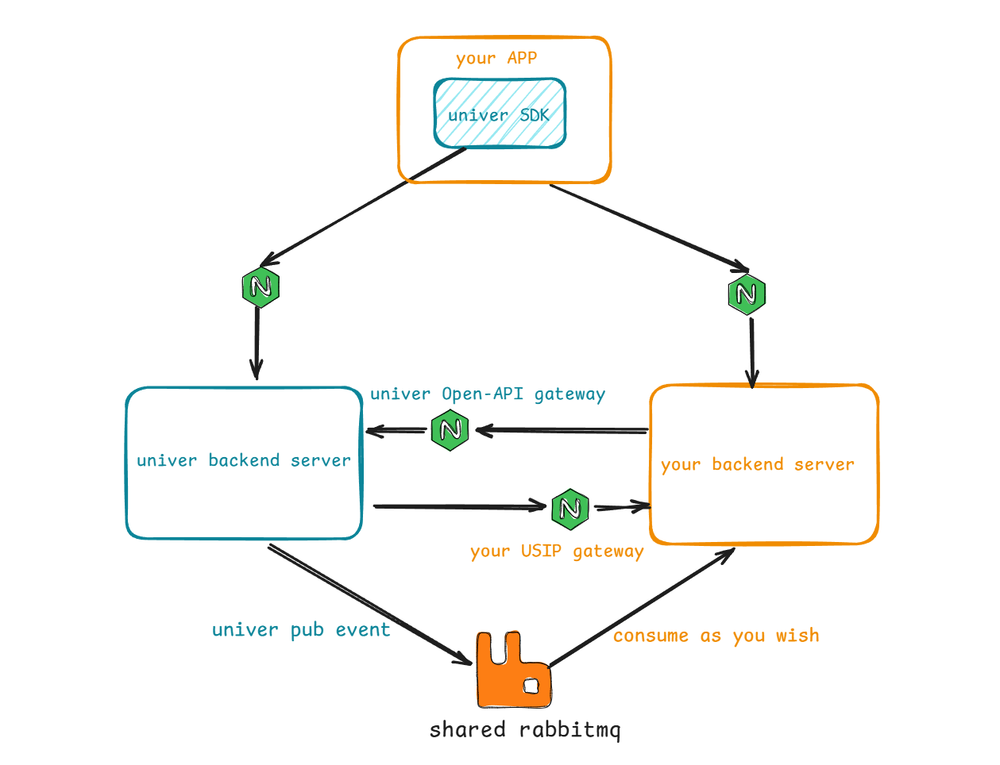

如果你想快速体验协同、导入导出等需要后端支持的能力，可以从本页开始。生产环境请使用[生产部署](/guides/pro/deploy)。

## 适用场景

- 本地体验或 PoC
- 小规模内部测试
- 尚未接入企业身份体系或权限系统

## 环境要求

| 环境 | 要求 |
| ---- | ---- |
| 操作系统 | Linux、Mac、Windows(WSL) |
| CPU | 至少 1 核 |
| 内存 | 至少 2GB；导入导出建议 >4GB |
| 磁盘 | 至少 10GB |
| Docker | 23 及以上版本 |

兼容性：

- Linux：内核版本不低于 3.10.0（部分用户在低版本内核下遇到兼容性问题）
- Docker Compose：版本 2.21 或更高
- 数据库：MySQL 8+、PostgreSQL 13+，以及兼容的国产数据库（含达梦 V8）
- Redis：5.0 或更高

<Callout>
  未授权的 Univer 后端服务为功能受限版本。若需要解锁限制，请前往[许可证](/guides/pro/license)。
</Callout>

## 一键部署到 Docker Compose

### 安装

<Callout type="warning" title="注意事项">
  如果你没有安装过 Docker，以下脚本会自动为你安装最新版本的 Docker。
</Callout>

```bash
bash -c "$(curl -fsSL https://get.univer.ai)"
```

指定版本：

```bash
bash -c "$(curl -fsSL https://get.univer.ai/product)" -- 0.9.1
```

离线安装：

1. 下载离线安装包：https://univer.ai/releases/univer-server/download
2. 上传到服务器解压
3. 执行 `bash load-images.sh` 将镜像加载到本机 Docker

脚本运行后会生成 `univer-server` 目录并自动启动服务。

### 启动 Demo UI

```bash
cd univer-server && bash run.sh start-demo-ui
```

访问 `http://localhost:3010` 即可体验。打开链接后会自动创建空白文档，如果需要协作体验，可在另一个浏览器或无痕窗口打开同一链接。

### 启动 USIP Demo

<Steps>
  <Step>
    在 `univer-server` 目录下创建 `.env.custom` 文件，并写入：

    ```properties
    USIP_ENABLED=true
    ```
  </Step>
  <Step>
    执行 `bash run.sh restart` 重启服务
  </Step>
  <Step>
    执行 `bash run.sh start-demo-usip` 启动 Demo
  </Step>
</Steps>

访问 `http://localhost:8080` 体验。

### 常用命令

- **停止**：`cd univer-server && bash run.sh stop`
- **启动**：`cd univer-server && bash run.sh start`
- **重启**：`cd univer-server && bash run.sh restart`
- **卸载**：`cd univer-server && bash run.sh uninstall`

<Callout type="warning" title="注意事项">
  卸载会删除体验过程中创建的文档与图片等数据，请谨慎操作。
</Callout>

### 更新服务

在 `univer-server` 的父目录再次运行安装命令即可升级，旧配置与数据会保留：

```bash
bash -c "$(curl -fsSL https://get.univer.ai)"
```

## 一键部署到 K8s

如果你已维护 K8s 集群并希望快速体验，可使用 Helm 安装：

```bash
helm install -n univer --create-namespace \
  --set global.istioNamespace="univer" \
  univer-stack oci://univer-acr-registry.cn-shenzhen.cr.aliyuncs.com/helm-charts/univer-stack
kubectl rollout restart -n univer deployment/collaboration-server
kubectl rollout restart -n univer deployment/universer
```

访问 `http://univer.example.com/sheet/` 即可体验。

卸载：

```bash
helm uninstall univer-stack -n univer
```

#### 更新服务

```bash
helm upgrade --install univer-stack \
  oci://univer-acr-registry.cn-shenzhen.cr.aliyuncs.com/helm-charts/univer-stack \
  -n univer
```

## 进一步集成

如果你希望进一步将 Univer Pro 的服务端集成到自己的系统中，以实现类似以下功能：

- 用户登录后才可访问 Univer Pro 的服务
- 按角色或用户来管理文档的访问权限
- 获取文档评论的通知
- 操作文档资源（如创建、删除、修改文档等）

Univer Pro 设计了两种集成方式，分别是：

<Cards>
  <Card title="USIP" href="/zh-CN/guides/pro/usip">
    已实现部分接口
  </Card>
  <Card title="Univer 事件同步" href="/zh-CN/guides/pro/event-sync">
    已支持部分事件
  </Card>
</Cards>

你可以根据自己的需求选择合适的集成方式。

下图描述了 Univer 与你的系统集成下的部署架构：


