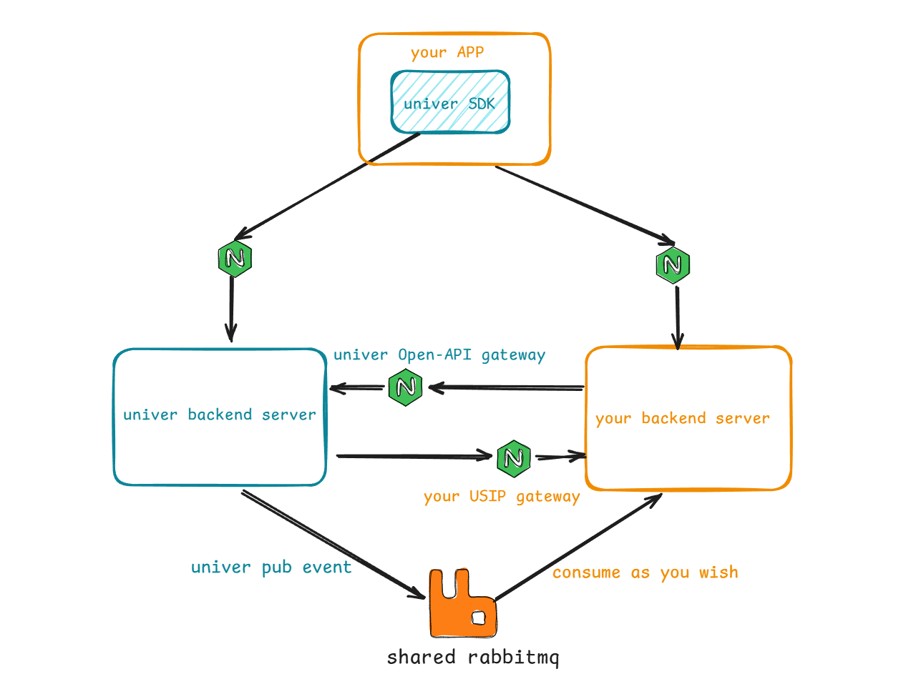

如果你想要快速体验需要 Univer 后端服务才能支持的功能，可以使用我们准备的一键部署版本：

请参考 [Univer Server 配置要求](/guides/pro#evironment-requirements)，以确保你的运行环境可以满足运行 Univer 后端服务的要求。

<Callout>
  未经授权的 Univer 后端服务使用功能受限的体验版本，如果你想要不受限制地使用后端服务，请前往章节[许可证](/guides/pro/license)。
</Callout>

## 一键部署到 docker compose

### 操作说明

<Callout type="warning" title="注意事项">
  如果你没有安装过 Docker，以下脚本会自动为你安装最新版本的 Docker。
</Callout>

执行以下命令，即可在**当前目录**自动下载安装并运行最新版本的 Univer 后端服务：

```bash
bash -c "$(curl -fsSL https://get.univer.ai)"
```

<Callout>
  如需安装指定版本的 Univer 后端服务，可以在上述命令中添加 `-- <version>` 参数，如：

  ```bash
  bash -c "$(curl -fsSL https://get.univer.ai)" -- 0.9.1
  ```
</Callout>

脚本运行后服务会被安装在当前工作目录下名为 `univer-server` 的目录中，安装完成会自动启动。

#### 测试服务

如果想测试服务是否正常运行，可以执行以下命令启动内置的 demo 服务：

```bash
cd univer-server && bash run.sh start-demo-ui`
```

成功启动后，即可浏览器打开：`http://localhost:3010` 体验。打开此链接后会自动创建一份新的空白文档并跳转到此文档的链接，如果想要体验协同编辑功能，可以在另一个浏览器或无痕窗口中再次打开此文档。

#### 测试 USIP

如果需要体验与自己的系统集成以对用户身份进行认证、权限管理，你可以按以下步骤操作：

<Steps>
  <Step>
    在 `univer-server` 目录下创建名为 `.env.custom` 的文件，在其中写入下述配置：

    ```properties
    USIP_ENABLED=true
    ```
  </Step>
  <Step>
    执行 `bash run.sh restart` 重启后端服务
  </Step>
  <Step>
    执行 `bash run.sh start-demo-usip` 启动 demo 服务
  </Step>
</Steps>

上述步骤都成功完成后，即可浏览器打开 `http://localhost:8080` 体验。

#### 停止、启动、重启、卸载服务

另外，你可以通过 `univer-server` 目录下的 `run.sh` 来控制 Univer 后端服务的停止、启动、重启和卸载。

<Callout type="warning" title="注意事项">
  卸载操作将会删除你在体验过程中所创建的文档及其中包含的图片等所有数据，请谨慎操作。
</Callout>

- **停止**：`cd univer-server && bash run.sh stop`
- **启动**：`cd univer-server && bash run.sh start`
- **重启**：`cd univer-server && bash run.sh restart`
- **卸载**：`cd univer-server && bash run.sh uninstall`，

#### 更新服务

在安装目录 `univer-server` 的父目录下，在此运行以下命令即可覆盖安装最新的版本，**旧的配置和数据会被保留**：

```bash
bash -c "$(curl -fsSL https://get.univer.ai)"
```

## 一键部署到 K8s

### 环境要求

Univer 使用 Helm 来完成在 K8s 上的部署，因此需要你先安装 Helm。请参照 Helm 的[官方安装指南](https://helm.sh/zh/docs/intro/install/)完成安装。

Helm 需要访问你的 K8s 集群，你需要确保已经有了K8s集群，然后通过下列方式**之一**让 Helm 能够访问：

- 确保在 `~/.kube/config` 配置了K8s集群的 `kubeconfig` 文件
- 配置了 `KUBECONFIG` 环境变量，且值为你的 `kubeconfig` 文件路径
- 在 Helm 命令中使用参数 `--kubeconfig`，参数值设置为你的 `kubeconfig` 文件路径，如：`helm install --kubeconfig your-kubeconfig-path`

### 操作说明

执行以下命令安装 Univer 后端服务到你的 K8s

```bash
helm install -n univer --create-namespace \
  --set global.istioNamespace="univer" \
  univer-stack oci://univer-acr-registry.cn-shenzhen.cr.aliyuncs.com/helm-charts/univer-stack
kubectl rollout restart -n univer deployment/collaboration-server
kubectl rollout restart -n univer deployment/universer
```

#### 测试服务

安装完成后打开 `http://univer.example.com/sheet/` 即可体验。

#### 卸载服务

```bash
helm uninstall univer-stack -n univer
```

#### 更新服务

```bash
helm upgrade --install univer-stack \
  oci://univer-acr-registry.cn-shenzhen.cr.aliyuncs.com/helm-charts/univer-stack \
  -n univer
```

## 进一步集成

如果你希望进一步将 Univer Pro 的服务端集成到自己的系统中，以实现类似以下功能：

- 用户登录后才可访问 Univer Pro 的服务
- 按角色或用户来管理文档的访问权限
- 获取文档评论的通知
- 操作文档资源（如创建、删除、修改文档等）

Univer Pro 设计了三种集成方式，分别是：

<Cards>
  <Card title="USIP" href="/zh-CN/guides/pro/usip">
    已实现部分接口
  </Card>
  <Card title="Univer 事件同步" href="/zh-CN/guides/pro/event-sync">
    已支持部分事件
  </Card>
  <Card title="OpenAPI">
    设计中，后续逐步推出
  </Card>
</Cards>

你可以根据自己的需求选择合适的集成方式。

下图描述了 Univer 与你的系统集成下的部署架构：


