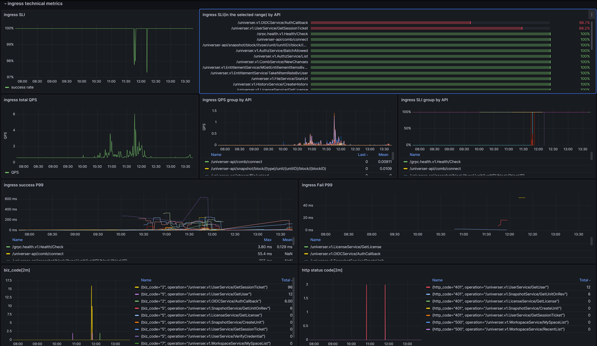
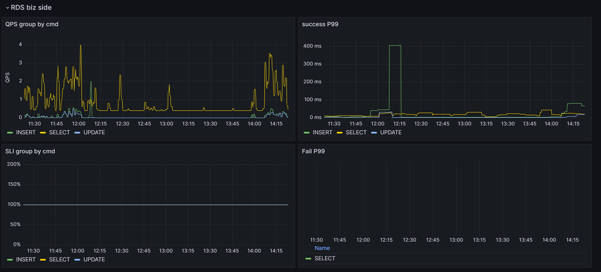
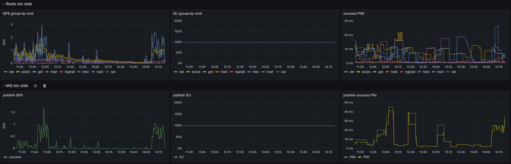
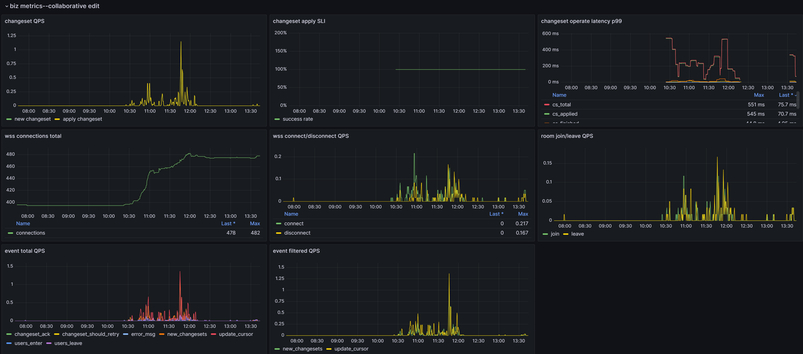
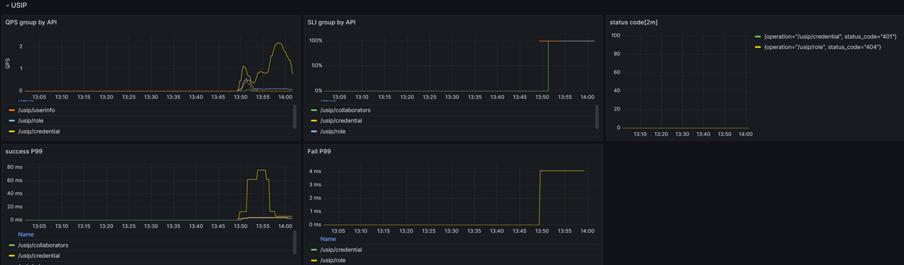
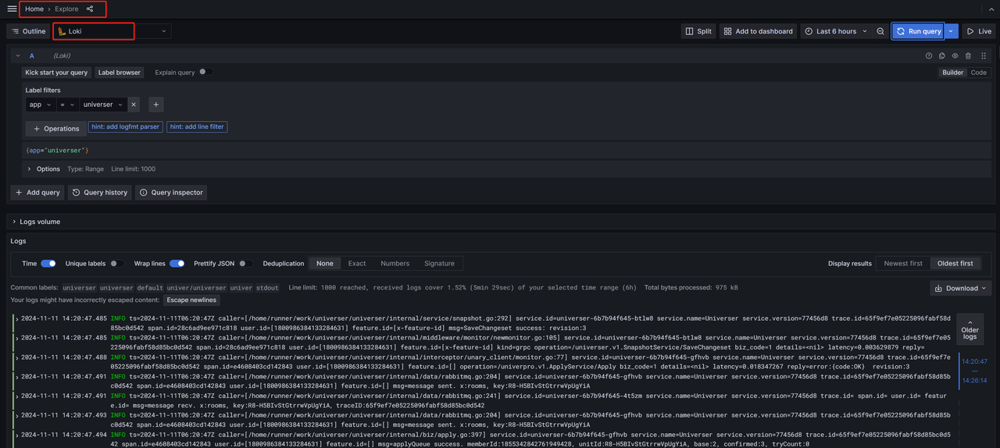

This section introduces the backend service operation and maintenance resources provided by Univer, helping you better understand the running status of Univer backend services, locate failures, and manage the service capacity.

Univer provides the following observable support:

- Prometheus metrics
- Service Log

## Metrics

The Univer backend service produce Prometheus metrics. If you have configured the observable components built into the Univer deployment, you can directly open grafana to view them. We have already built a set of grafana monitoring dashboard, including:

- components: rabbitmq, redis, rds
- collaborative service: collaboration-server
- universer
- import & export exchange

You can view the performance metrics, availability, and key business metrics of Univer services in real time. If you are using your own monitoring system, you can [click here to download](https://release-univer.oss-cn-shenzhen.aliyuncs.com/release/univer-grafana-dashboards.tar.gz) Univer prepared grafana monitoring dashboard configuration.

prepared Grafana dashboard Instructions:

1. the golden 4 metrics, focusing on observing QPS and SLI of each API, and error code distribution

2. component performance and availability from server side

- RDS

- Redis&MQ

3. business metrics of Collaborative editing

4. If you enable USIP integration, you can observe the technical metrics from the Univer service side

## Service Log

If you deploy using docker compose, you can directly view the logs of the corresponding container through the docker command. In addition to outputting to standard output, the logs of the Univer backend service will also be output to a persistent volume, but will not be permanently saved. When the total size of logs for a single service instance exceeds 1G, some older logs will be immediately cleared. Even if the log size does not exceed 1G, it will only be kept for a maximum of 30 days. The log files that exceed 30 days will be cleared. You can directly open the corresponding log files to view them. The logs of the universer service are saved in the deployment directory `/logs/universer/`, and the logs of the import and export services are saved in `/logs/worker-exchange/`.

Whether you deploy with Docker Compose or k8s, if you configure and deploy the built-in observable components of Univer, you can also use Loki to view logs. View path: grafana Toggle Menu - > Explore, select Loki as the data source, as shown in the figure below.

Of course, if you already have your own logging system, you can configure to collection logs of Univer services. The logs of the Univer backend service will be output to standard outputs.

## Common error troubleshooting

1. It was found that some functions of the service are unavailable.

First, open the monitoring dashboard and check whether the access to the basic components RDS, MQ, and Redis is normal, that is, check whether the SLI is normal. If the SLI is abnormal, it is generally a failure of the basic components or a network failure of the service and basic components.

If the basic components are accessed normally, check whether the SLIs of the ingress and egress interfaces of the universer service are normal. If some interface SLIs are abnormal, you can check the error code returned by this interface. Based on the error code, you can understand some reasons. At the same time, try to search the log of the error code through grafana Loki, search for keywords: biz_code = the_biz_err_code. This information can further locate the root cause of the problem.
