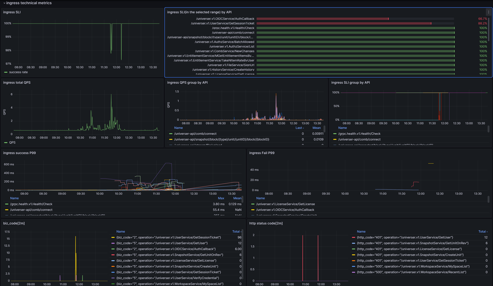
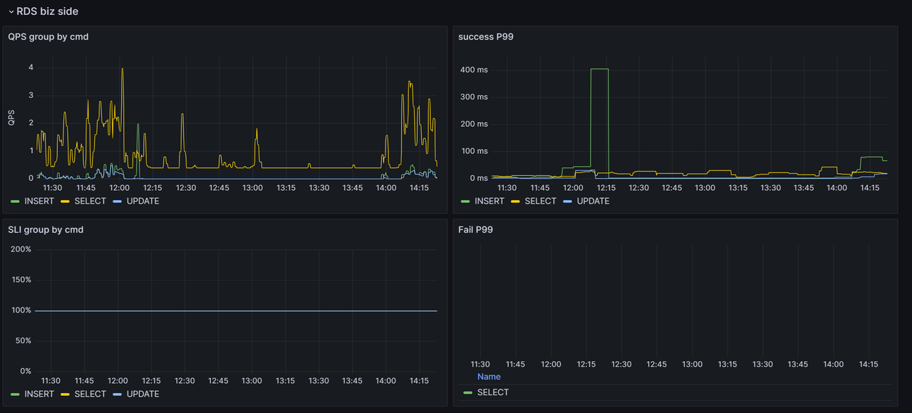
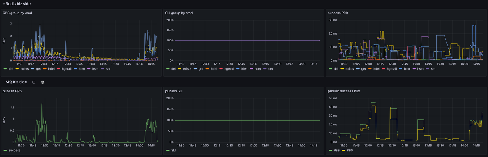
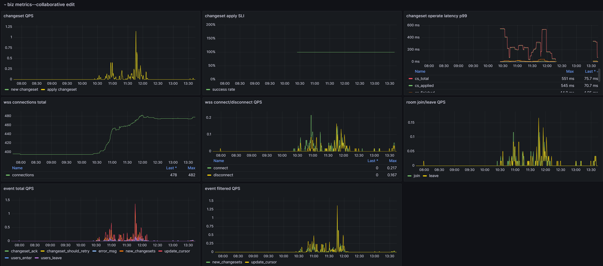
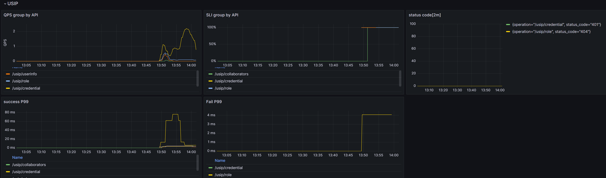
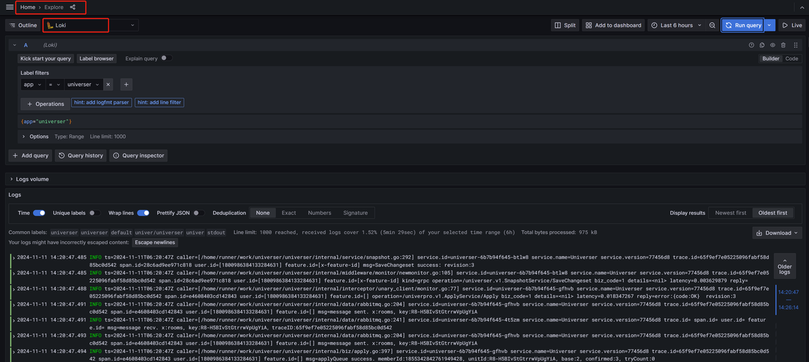

На этой странице описаны средства наблюдаемости и основные инструменты эксплуатации сервисов Univer, включая метрики, журналы и типовые способы диагностики.

## Наблюдаемость

Univer предоставляет:

- метрики Prometheus;
- журналы сервисов (stdout и постоянные тома).

Если вы включили встроенный стек наблюдаемости, дашборды можно просматривать в Grafana. В противном случае экспортируйте их в собственную систему.

## Метрики

Встроенные дашборды Grafana охватывают:

- инфраструктуру: RabbitMQ, Redis, RDS;
- совместную работу: collaboration-server;
- основной сервис: universer;
- импорт и экспорт: exchange.

С помощью этих дашбордов можно отслеживать производительность, доступность и ключевые бизнес-показатели. Для внешних систем скачайте дашборды по ссылке:

https://release-univer.oss-cn-shenzhen.aliyuncs.com/release/univer-grafana-dashboards.tar.gz

### Примеры дашбордов

1. Золотые сигналы (QPS, SLI, распределение ошибок)

2. Производительность и доступность инфраструктуры

3. Метрики совместной работы

4. Метрики интеграции USIP

## Журналы сервисов

### Docker Compose

Журналы записываются в stdout и постоянные тома (хранятся не более 30 дней или до достижения объёма 1 ГБ).

- universer: `/logs/universer/`
- exchange: `/logs/worker-exchange/`

### K8s / Loki

Если используется встроенный стек наблюдаемости, журналы можно запрашивать через Loki в разделе Grafana -> Explore:

## Типовая диагностика

1. **Недоступность функции**: проверьте SLI для RDS/MQ/Redis
2. **Ошибки API**: изучите SLI сервиса universer и коды ошибок
3. **Поиск по журналам**: выполните в Loki запрос `biz_code=xxx`
4. **Проблемы с ресурсами**: отслеживайте QPS, задержку, загрузку CPU и использование памяти
