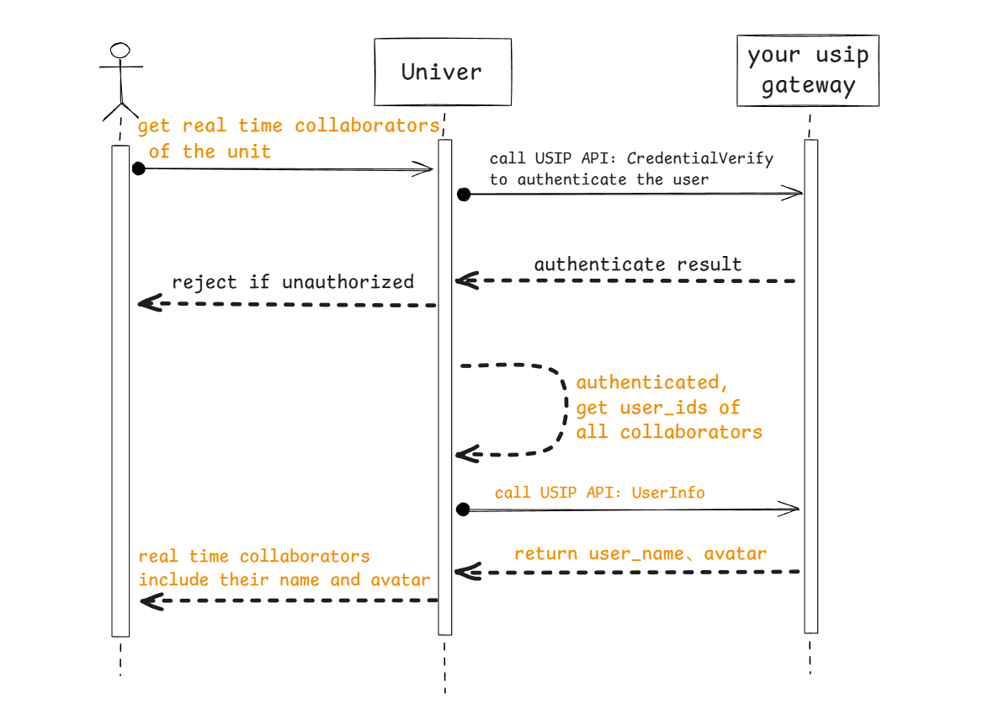
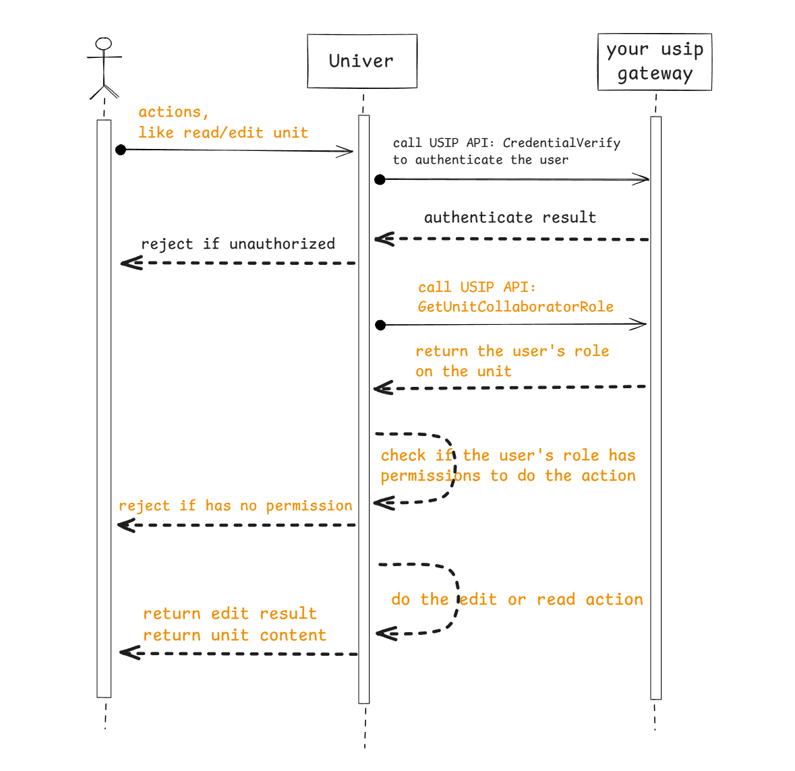
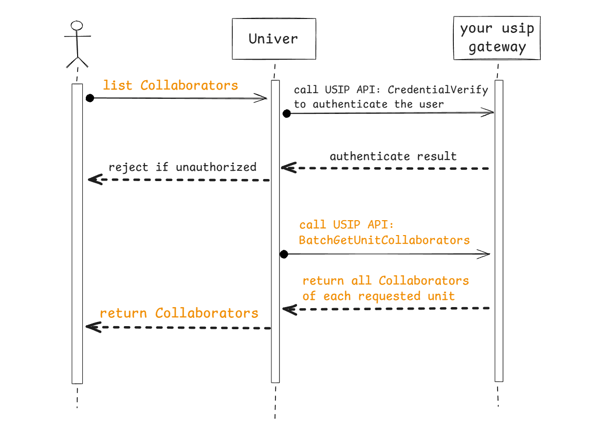

## 概述

Univer Pro 的后端服务没有集成账户系统（也不应该集成），默认配置下，Univer Pro 的后端服务不会对访问者进行身份认证，也即所有用户都可访问所有的资源。

如果你需要对用户进行身份认证，认证通过才能使用，那么你必须实现自己的账户系统。你可以配置 Univer Server 和你的系统进行交互，Univer Server 在需要认证用户身份的时候即会调用你的系统完成认证。

为了实现这类交互，Univer Pro 设计了 *Univer Server 集成协议 USIP（Univer Server Integration Protocol）*。USIP本质上是一种 SPI（`Service Provider Interface`），也即由 **Univer Pro 来定义接口，然后由你的系统进行实现**。

Univer Pro 根据用户的潜在需求，已经定义好了一些 USIP 接口，你可以选择实现一些接口来改变 Univer Pro 处理某些用户请求的流程，比如进行用户认证和权限校验。如果当前已有 USIP 接口无法满足你的需求，可以给我们提出建议。

## USIP 接口说明

目前 Univer Pro 定义了两类场景的 USIP 接口：

- 👥 账户类
  - 身份认证
  - 用户信息获取：name、avatar 之类的基础信息
- 🔒 权限类
  - 获取用户在某一文档上的权限角色
  - 获取某一文档的协作者列表

### 用户身份认证

#### 调用场景

用户每次与 Univer Pro 后端服务进行交互都会调用

#### 交互流程


#### 协议定义

<APITable
  request={{
    method: 'GET',
    headers: '透传用户传输的所有 header，保障你可以用于身份认证',
  }}
  response={{
    type: 'application/json',
    parameters: [{
      name: 'user',
      type: 'Object',
      description: '认证成功时，返回 user 对象',
      properties: [
        {
          name: 'userID',
          type: 'string',
          example: 'ace55655ceabd55',
          description: '用户的 ID，只需确保能和你们的真实用户一一映射即可，建议使用 open_uid',
        },
        {
          name: 'name',
          type: 'string',
          example: 'alice',
          description: '用户的名字，用于在前端展示协作者信息',
        },
        {
          name: 'avatar',
          type: 'string',
          example: 'https://image.xx/acde55acb45bbead55',
          description: '用户的头像 URL，用于在前端展示协作者信息',
        },
      ],
    }],
    example: JSON.stringify({
      user: {
        userID: 'ace55655ceabd55g',
        name: 'alice',
        avatar: 'https://image.xx/acde55acb45bbead55',
      },
    }, null, 2),
  }}
/>

### 批量获取用户信息

#### 调用场景

多人协作时，展示当前协作者的头像、名字；查看文档中的评论列表时，展示评论用户的头像、名字

#### 交互流程



#### 协议定义

<APITable
  request={{
    method: 'POST',
    headers: '无自定义 header，也不会透传用户请求的 header',
    parametersType: 'Body',
    parameters: [{
      name: 'userIDs',
      type: 'array[string]',
      example: '["user_id1", "user_id2"]',
      description: '用户 ID 数组，Univer Pro 会批量获取这些用户的头像、名字等信息',
    }],
    example: JSON.stringify({
      userIDs: ['user_id1', 'user_id2', 'user_id3'],
    }, null, 2),
  }}
  response={{
    type: 'application/json',
    parameters: [{
      name: 'users',
      type: 'array[Object]',
      description: '用户对象数组，包含请求中的每一个用户，用户对象的定义已在身份认证接口描述',
    }],
    example: JSON.stringify({
      users: [
        { userID: 'user_id1', name: 'name1', avatar: 'https://xxxx' },
        { userID: 'user_id2', name: 'name2', avatar: 'https://xxxx' },
        { userID: 'user_id3', name: 'name3', avatar: 'https://xxxx' },
      ],
    }, null, 2),
  }}
/>

### 用户权限角色获取

#### 调用场景

用户读取 / 编辑文档时，获取其权限角色来判断是否有对应操作的权限

#### 交互流程



#### 协议定义

<APITable
  request={{
    method: 'GET',
    headers: '无自定义 header，也不会透传用户请求的 header',
    parametersType: 'Query',
    parameters: [{
      name: 'userID',
      type: 'string',
      example: 'acd5455e44fc5bb55',
      description: '用户 ID',
    }, {
      name: 'unitID',
      type: 'string',
      example: 'acff-adebc125e45b',
      description: '文档 ID',
    }],
    example: 'curl -X GET "http://sample.univer.ai/role?unitID=acff-adebc125e45b&userID=acd5455e44fc5bb55"',
  }}
  response={{
    type: 'application/json',
    parameters: [{
      name: 'userID',
      type: 'string',
      example: 'acd5455e44fc5bb55',
      description: '请求中的用户 ID',
    }, {
      name: 'role',
      type: 'string',
      example: 'editor',
      description: '用户在文档上的权限角色，Univer 定义了 3 种角色：owner、editor、reader',
    }],
    example: JSON.stringify({
      userID: 'acd5455e44fc5bb55',
      role: 'editor',
    }, null, 2),
  }}
/>

### 获取文档的所有协作者

#### 调用场景

在前端设置子表、保护选区的可读取/编辑用户时，需要获取此文档的协作者（只有此文档的协作者才能被设置成子表、保护选区的可读取/编辑用户）

#### 交互流程



#### 协议定义

<APITable
  request={{
    method: 'POST',
    headers: '无自定义 header，也不会透传用户请求的 header',
    parametersType: 'Body',
    parameters: [{
      name: 'unitIDs',
      type: 'array[string]',
      example: '["unit_id1", "unit_id2"]',
      description: '文档 ID 数组',
    }],
    example: JSON.stringify({
      unitIDs: ['unit_id1', 'unit_id2', 'unit_id3'],
    }, null, 2),
  }}
  response={{
    type: 'application/json',
    parameters: [{
      name: 'collaborators',
      type: 'array[Object]',
      description: '每篇文档的协作者对象列表，包含文档 ID 和协作者信息',
      properties: [{
        name: 'unitID',
        type: 'string',
        example: 'unit_id1',
        description: '文档 ID',
      }, {
        name: 'subjects',
        type: 'array[Object]',
        description: '某一文档的协作者对象列表',
        properties: [{
          name: 'role',
          type: 'string',
          example: 'editor',
          description: '协作者的权限角色，Univer 定义了 3 种角色：owner、editor、reader',
        }, {
          name: 'subject',
          type: 'Object',
          description: '协作者信息',
          properties: [{
            name: 'type',
            type: 'string',
            example: 'user',
            description: '只能设置为 "user"',
          }, {
            name: 'id',
            type: 'string',
            example: 'acdef12555b12',
            description: '用户 ID',
          }, {
            name: 'name',
            type: 'string',
            example: 'alice',
            description: '用户名字',
          }, {
            name: 'avatar',
            type: 'string',
            example: 'https://image.ai/36554',
            description: '用户头像 URL',
          }],
        }],
      }],
    }],
    example: JSON.stringify({
      collaborators: [
        {
          unitID: 'unit_id1',
          subjects: [
            {
              subject: {
                id: '1',
                name: 'alice',
                avatar: 'https://image.ai/36554',
                type: 'user',
              },
              role: 'owner',
            },
            {
              subject: {
                id: '2',
                name: 'bob',
                avatar: 'https://image.ai/36559',
                type: 'user',
              },
              role: 'editor',
            },
          ],
        },
      ],
    }, null, 2),
  }}
/>

## 配置 USIP 接入

如何配置 Univer 后端服务启用用户身份认证和权限校验？

使用 docker compose 部署时，在自定义的配置文件 `.env.custom` 中添加以下配置：

```properties title=".env.custom"
# usip about
USIP_ENABLED=true  # 设置为 true 以启用 USIP
USIP_URI_CREDENTIAL=https://your-domain/usip/credential # 配置好身份认证 USIP 的实现 URL
USIP_URI_USERINFO=https://your-domain/usip/userinfo     # 配置好用户信息获取 USIP 的实现 URL
USIP_URI_ROLE=https://your-domain/usip/role             # 配置好权限角色获取 USIP 的实现 URL
USIP_URI_COLLABORATORS=https://your-domain/usip/collaborators # 配置好协作者列表 USIP 的实现 URL

# auth about
AUTH_PERMISSION_ENABLE_OBJ_INHERIT=false  # 见下面权限设计说明
AUTH_PERMISSION_CUSTOMER_STRATEGIES=      # 见下面权限设计说明
```

使用 K8s 部署时，编辑你的自定义 values.yaml，添加以下配置：

```yaml title="values.yaml"
universer:
  config:
    usip:
      enabled: true # 设置为 true 以启用 USIP
      uri:
        userinfo: 'https://your-domain/usip/userinfo' # 配置好用户信息获取 USIP 的实现 URL
        collaborators: 'https://your-domain/usip/collaborators' # 配置好协作者列表 USIP 的实现 URL
        role: 'https://your-domain/usip/role' # 配置好权限角色获取 USIP 的实现 URL
        credential: 'https://your-domain/usip/credential' # 配置好身份认证 USIP 的实现 URL
    auth:
      permission:
        enableObjInherit: false # 见下面权限设计说明
        customerStrategies: '' # 见下面权限设计说明
```

**请注意**，一旦你配置了开启 USIP，上述的所有 4 个 USIP API 的 url 都需要配置，并且需要你的服务正确实现。如何在部署的时候应用这些配置请参考[生产部署](/zh-CN/guides/pro/deploy)。

## Univer 权限设计

Univer 的权限控制采用的是 `RBAC` 模型，目前固定设置了 3 个角色：`owner`、`editor`、`reader`，并且 editor 角色具有 reader 角色的权限、owner 角色又具有 editor 角色和 reader 角色的权限。目前暂未开放自定义角色，但开放了用户可配置各权限点位所需的最低角色。Univer 内置有一份默认生效的配置，如果你没有需要可以什么都不做，如果有需要，你可以配置以覆盖部分权限点位的最低角色要求。

Univer 内置的默认生效的各权限点位及其所需的最低角色如下：

| 权限点位 | 权限点位枚举值 | 点位含义 | 最低角色要求 | 角色枚举值 |
|:-------|:---------|:-------|:-------|:-------|
| ManageCollaborator | 2 | 邀请 / 删除文档的协作者 | owner | 2 |
| Copy | 6 | 拷贝文档内容 | reader | 0 |
| Print | 3 | 打印 | editor | 1 |
| Duplicate | 4 | 复制文档 | editor | 1 |
| Share | 7 | 分享给他人 | reader | 0 |
| Export | 8 | 导出 | editor | 1 |
| Comment | 5 | 评论 | reader | 0 |
| View | 0 | 阅读 | reader | 0 |
| MoveSheet | 25 | 移动 workbook 内的 worksheet | editor | 1 |
| DeleteSheet | 26 | 删除 worksheet | editor | 1 |
| HideSheet | 27 | 隐藏 worksheet | editor | 1 |
| CopySheet | 28 | 复制 worksheet | editor | 1 |
| RenameSheet | 29 | 重命名 worksheet | editor | 1 |
| CreateSheet | 30 | 新增 worksheet | editor | 1 |
| SetCellStyle | 33 | 设置单元格样式 | editor | 1 |
| SetCellValue | 34 | 设置单元格值 | editor | 1 |
| InsertHyperlink | 16 | 插入超链接 | editor | 1 |
| Sort | 17 | 排序 | editor | 1 |
| Filter | 18 | 过滤 | editor | 1 |
| PivotTable | 19 | 透视表 | editor | 1 |
| RecoverHistory | 43 | 恢复文档到历史版本 | editor | 1 |
| ViewHistory | 44 | 查看文档编辑历史记录 | reader | 0 |
| SelectProtectedCells | 31 | 选择被保护区域的单元格 | editor | 1 |
| SelectUnProtectedCells | 32 | 选择非保护区域的单元格 | editor | 1 |
| SetRowStyle | 35 | 设置行样式 | editor | 1 |
| SetColumnStyle | 36 | 设置列样式 | editor | 1 |
| InsertRow | 37 | 插入行 | editor | 1 |
| InsertColumn | 38 | 插入列 | editor | 1 |
| DeleteRow | 39 | 删除行 | editor | 1 |
| DeleteColumn | 40 | 删除列 | editor | 1 |
| Delete | 42 | 删除文档 | owner | 2 |
| CreatePermissionObject | 45 | 创建保护区 / 保护子表 | editor | 1 |

如果你想要修改其中一些权限点位要求的最低角色，比如，想设置只有文档 owner（role=2） 才能复制内容（action=6）和打印（action=3），可如下配置：

使用 docker compose 部署时，在自定义的配置文件 `.env.custom` 中添加以下配置：

```properties title=".env.custom"
AUTH_PERMISSION_CUSTOMER_STRATEGIES=[{"action": 3, "role": 2}, {"action": 6, "role": 2}]
```

使用 K8s 部署时，编辑你的自定义 values.yaml，添加以下配置：

```yaml title="values.yaml"
universer:
  config:
    auth:
      permission:
        customerStrategies: '[ {"action": 3, "role": 2}, {"action": 6, "role": 2} ]'
```

可以看到，配置的值是一个 json 对象数组，对象的 action 即为上述列表中的权限点位枚举值，role 则是该权限点位要求的最低角色对应的枚举值。

Univer 权限管理设计还有一个需要关注的点：

Univer 除了在整个文档级别控制权限，还会在文档下的保护区域 / 子表上控制权限，他们都拥有独立的授权用户管理。比如，用户 A 是整个文档的 editor，但不是此文档中某个保护区域 / 子表的 editor 或 owner，那么用户 A 不能编辑此保护区域 / 子表。在 Univer 的默认配置下，即使用户 A 是文档的 owner，也无法管理其他用户在此文档上创建的保护区域 / 子表，除非其他用户给他添加了保护区域 / 子表的权限。如果你想要配置成文档的 owner 无条件拥有文档中所有对象的 owner 角色，可以如下修改配置：

使用 docker compose 部署时，在自定义的配置文件 `.env.custom` 中添加以下配置：

```properties title=".env.custom"
AUTH_PERMISSION_ENABLE_OBJ_INHERIT=true
```

使用 K8s 部署时，编辑你的自定义 values.yaml，添加以下配置：

```yaml title="values.yaml"
universer:
  config:
    auth:
      permission:
        enableObjInherit: true
```

## USIP 客户系统实现示例

[参考我们的 USIP 示例源码](https://github.com/dream-num/usip-example)

## 前端配置自定义请求头

在使用 USIP 时，你可能需要在前端请求中添加自定义的请求头（比如 Authorization token）。你可以通过 Univer 的 HTTPService 拦截器来实现这一点。

在初始化 Univer 实例时，添加如下代码：

```typescript
import { HTTPService } from '@univerjs/preset-sheets-core'

// 通过 univer 实例获取 injector
const injector = univer.__getInjector()
// 添加自定义请求头
const httpService = injector.get(HTTPService)
httpService.registerHTTPInterceptor({
  priority: 0,
  interceptor: (request, next) => {
    // 在这里添加你需要的请求头
    // 例如添加 Authorization token：
    // request.headers.set('Authorization', 'Bearer your-token-here')
    return next(request)
  },
})
```

更详细信息和完整的配置示例，请参考 [Univer Pro Sheet 启动套件](https://github.com/dream-num/univer-pro-sheet-start-kit/blob/main/src/setup-univer.ts)。
