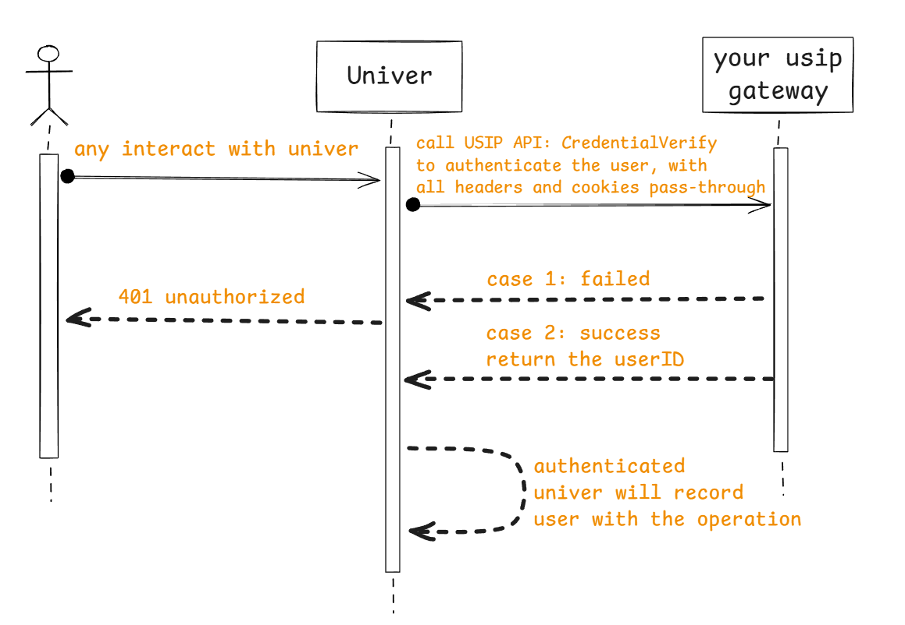
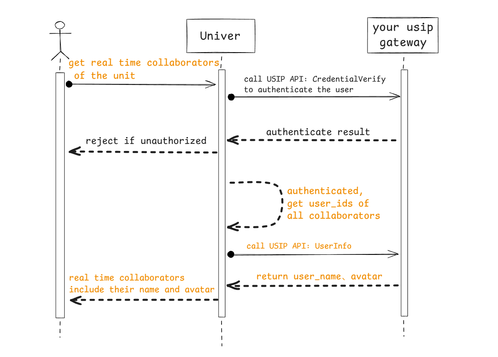
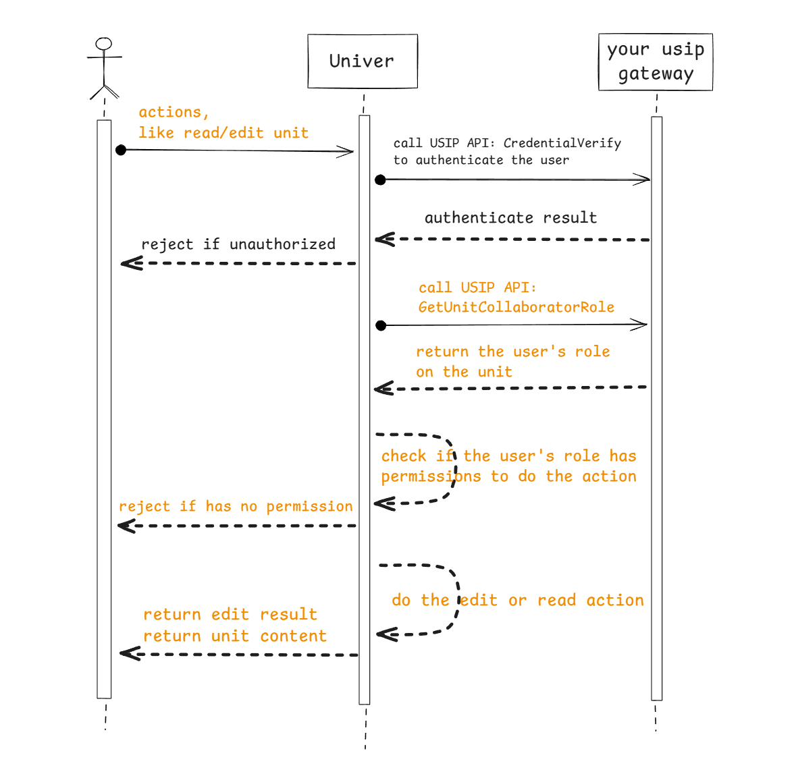
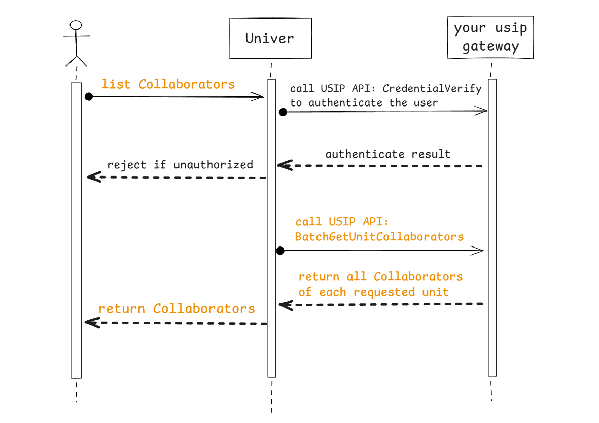

Univer SDK Pro 預設不內建帳號系統。若需要身分驗證、權限控制或與業務系統整合，請使用 USIP（Univer Server Integration Protocol）。USIP 是一種 SPI：由 Univer 定義介面，你的系統實作並回應。

## 適用場景

- 存取需登入
- 依角色控制編輯權限
- 同步協作者資訊、評論與修改時間

## 接入流程

1. 實作 USIP API（見下方）
2. 在部署設定中啟用 USIP
3. 用戶端請求需透傳認證資訊（例如 token）

## USIP 介面說明

目前 USIP 分為三類：

- 👥 帳號類：身分驗證、使用者資訊
- 🔒 權限類：角色與協作者列表
- 📄 文件類：文件最新修改時間

### 使用者身分驗證

#### 呼叫時機

每次與後端服務互動都會呼叫。

#### 交互流程



#### 協議定義

<APITable
  request={{
    method: 'GET',
    headers: '透傳所有請求 header，以利完成驗證',
  }}
  response={{
    type: 'application/json',
    parameters: [{
      name: 'user',
      type: 'Object',
      description: '驗證成功時回傳 user 物件',
      properties: [
        {
          name: 'userID',
          type: 'string',
          example: 'ace55655ceabd55',
          description: '使用者 ID（建議 open_uid）',
        },
        {
          name: 'name',
          type: 'string',
          example: 'alice',
          description: '使用者名稱，用於協作者顯示',
        },
        {
          name: 'avatar',
          type: 'string',
          example: 'https://image.xx/acde55acb45bbead55',
          description: '頭像 URL，用於協作者顯示',
        },
      ],
    }],
    example: JSON.stringify({
      user: {
        userID: 'ace55655ceabd55g',
        name: 'alice',
        avatar: 'https://image.xx/acde55acb45bbead55',
      },
    }, null, 2),
  }}
/>

### 批次取得使用者資訊

#### 呼叫時機

顯示協作者頭像/名稱、顯示評論作者資訊。

#### 交互流程



#### 協議定義

<APITable
  request={{
    method: 'POST',
    headers: '無自訂 header，使用者 header 不會透傳',
    parametersType: 'Body',
    parameters: [{
      name: 'userIDs',
      type: 'array[string]',
      example: '["user_id1", "user_id2"]',
      description: '使用者 ID 陣列',
    }],
    example: JSON.stringify({
      userIDs: ['user_id1', 'user_id2', 'user_id3'],
    }, null, 2),
  }}
  response={{
    type: 'application/json',
    parameters: [{
      name: 'users',
      type: 'array[Object]',
      description: '使用者物件陣列，結構同身分驗證介面',
    }],
    example: JSON.stringify({
      users: [
        { userID: 'user_id1', name: 'name1', avatar: 'https://xxxx' },
        { userID: 'user_id2', name: 'name2', avatar: 'https://xxxx' },
        { userID: 'user_id3', name: 'name3', avatar: 'https://xxxx' },
      ],
    }, null, 2),
  }}
/>

### 使用者權限角色

#### 呼叫時機

讀寫文件時取得角色以判斷權限。

#### 交互流程



#### 協議定義

<APITable
  request={{
    method: 'GET',
    headers: '無自訂 header，使用者 header 不會透傳',
    parametersType: 'Query',
    parameters: [{
      name: 'userID',
      type: 'string',
      example: 'acd5455e44fc5bb55',
      description: '使用者 ID',
    }, {
      name: 'unitID',
      type: 'string',
      example: 'acff-adebc125e45b',
      description: '文件 ID',
    }],
    example: 'curl -X GET "http://sample.univer.ai/role?unitID=acff-adebc125e45b&userID=acd5455e44fc5bb55"',
  }}
  response={{
    type: 'application/json',
    parameters: [{
      name: 'userID',
      type: 'string',
      example: 'acd5455e44fc5bb55',
      description: '請求中的使用者 ID',
    }, {
      name: 'role',
      type: 'string',
      example: 'editor',
      description: '角色：owner、editor、reader',
    }],
    example: JSON.stringify({
      userID: 'acd5455e44fc5bb55',
      role: 'editor',
    }, null, 2),
  }}
/>

### 取得文件協作者

#### 呼叫時機

設定保護範圍/子表權限時需取得協作者列表。

#### 交互流程



#### 協議定義

<APITable
  request={{
    method: 'POST',
    headers: '無自訂 header，使用者 header 不會透傳',
    parametersType: 'Body',
    parameters: [{
      name: 'unitIDs',
      type: 'array[string]',
      example: '["unit_id1", "unit_id2"]',
      description: '文件 ID 陣列',
    }],
    example: JSON.stringify({
      unitIDs: ['unit_id1', 'unit_id2', 'unit_id3'],
    }, null, 2),
  }}
  response={{
    type: 'application/json',
    parameters: [{
      name: 'collaborators',
      type: 'array[Object]',
      description: '依文件分組的協作者列表',
      properties: [{
        name: 'unitID',
        type: 'string',
        example: 'unit_id1',
        description: '文件 ID',
      }, {
        name: 'subjects',
        type: 'array[Object]',
        description: '協作者列表',
        properties: [{
          name: 'role',
          type: 'string',
          example: 'editor',
          description: '角色：owner、editor、reader',
        }, {
          name: 'subject',
          type: 'Object',
          description: '協作者資訊',
          properties: [{
            name: 'type',
            type: 'string',
            example: 'user',
            description: '只能是 "user"',
          }, {
            name: 'id',
            type: 'string',
            example: 'acdef12555b12',
            description: '使用者 ID',
          }, {
            name: 'name',
            type: 'string',
            example: 'alice',
            description: '使用者名稱',
          }, {
            name: 'avatar',
            type: 'string',
            example: 'https://image.ai/36554',
            description: '頭像 URL',
          }],
        }],
      }],
    }],
    example: JSON.stringify({
      collaborators: [
        {
          unitID: 'unit_id1',
          subjects: [
            {
              subject: {
                id: '1',
                name: 'alice',
                avatar: 'https://image.ai/36554',
                type: 'user',
              },
              role: 'owner',
            },
            {
              subject: {
                id: '2',
                name: 'bob',
                avatar: 'https://image.ai/36559',
                type: 'user',
              },
              role: 'editor',
            },
          ],
        },
      ],
    }, null, 2),
  }}
/>

### 通知文件最新修改時間

#### 呼叫時機

供業務系統顯示最後修改時間。

#### 協議定義

<APITable
  request={{
    method: 'POST',
    headers: '無自訂 header，使用者 header 不會透傳',
    parametersType: 'Body',
    parameters: [{
      name: 'unitID',
      type: 'string',
      example: 'acff-adebc125e45b',
      description: '文件 ID',
    }, {
      name: 'editTimeUnixMs',
      type: 'int',
      example: '1762591632345',
      description: 'Unix 毫秒時間戳',
    }],
    example: JSON.stringify({
      unitID: 'unit_id1',
      editTimeUnixMs: 1762591632345,
    }, null, 2),
  }}
  response={{
    type: 'application/json',
    parameters: [],
    example: JSON.stringify({}, null, 2),
  }}
/>

## 設定 USIP [#usip-configuration]

<Tabs items={['docker compose', 'K8s']}>
  <Tab label="docker compose">
    ```properties title=".env.custom"
    USIP_ENABLED=true
    USIP_URI_CREDENTIAL=https://your-domain/usip/credential
    USIP_URI_USERINFO=https://your-domain/usip/userinfo
    USIP_URI_ROLE=https://your-domain/usip/role
    USIP_URI_COLLABORATORS=https://your-domain/usip/collaborators
    USIP_URI_UNITEDITTIME=https://your-domain/usip/unit-edit-time

    USIP_APIKEY=

    AUTH_PERMISSION_ENABLE_OBJ_INHERIT=false
    AUTH_PERMISSION_CUSTOMER_STRATEGIES=
    ```
  </Tab>
  <Tab label="K8s">
    ```yaml title="values.yaml"
    universer:
      config:
        usip:
          enabled: true
          uri:
            userinfo: 'https://your-domain/usip/userinfo'
            collaborators: 'https://your-domain/usip/collaborators'
            role: 'https://your-domain/usip/role'
            credential: 'https://your-domain/usip/credential'
            unitEditTime: 'https://your-domain/usip/unit-edit-time'
          apikey: ''
        auth:
          permission:
            enableObjInherit: false
            customerStrategies: ''
    ```
  </Tab>
</Tabs>

**注意**：啟用 USIP 後需配置 5 個端點，並確保服務實作正確。

如果你的 USIP 服務暴露在公網環境中，爲了保證接口請求的安全性，我們可以參考 AI API 的鑑權方式。你可以生成一個 API key，並將其配置到 Univer server 中。當調用 USIP 接口時，請求會攜帶 x-api-key: API_KEY 的請求頭，你可以通過該值來校驗請求的合法性。

## 權限模型

Univer 使用 RBAC，固定角色為 `owner`、`editor`、`reader`。可為權限點位設定最低角色。

預設權限點位如下：

| 權限點位 | 枚舉值 | 說明 | 最低角色 | 角色枚舉 |
|:-------|:---------|:-------|:-------|:-------|
| ManageCollaborator | 2 | 邀請/刪除協作者 | owner | 2 |
| Copy | 6 | 複製內容 | reader | 0 |
| Print | 3 | 列印 | editor | 1 |
| Duplicate | 4 | 複製文件 | editor | 1 |
| Share | 7 | 分享 | reader | 0 |
| Export | 8 | 匯出 | editor | 1 |
| Comment | 5 | 評論 | reader | 0 |
| View | 0 | 檢視 | reader | 0 |
| MoveSheet | 25 | 移動工作表 | editor | 1 |
| DeleteSheet | 26 | 刪除工作表 | editor | 1 |
| HideSheet | 27 | 隱藏工作表 | editor | 1 |
| CopySheet | 28 | 複製工作表 | editor | 1 |
| RenameSheet | 29 | 重新命名工作表 | editor | 1 |
| CreateSheet | 30 | 新增工作表 | editor | 1 |
| SetCellStyle | 33 | 設定儲存格樣式 | editor | 1 |
| SetCellValue | 34 | 設定儲存格值 | editor | 1 |
| InsertHyperlink | 16 | 插入超連結 | editor | 1 |
| Sort | 17 | 排序 | editor | 1 |
| Filter | 18 | 篩選 | editor | 1 |
| PivotTable | 19 | 資料透視表 | editor | 1 |
| RecoverHistory | 43 | 還原歷史版本 | editor | 1 |
| ViewHistory | 44 | 檢視歷史 | reader | 0 |
| SelectProtectedCells | 31 | 選取保護區 | editor | 1 |
| SelectUnProtectedCells | 32 | 選取非保護區 | editor | 1 |
| SetRowStyle | 35 | 設定列樣式 | editor | 1 |
| SetColumnStyle | 36 | 設定欄樣式 | editor | 1 |
| InsertRow | 37 | 插入列 | editor | 1 |
| InsertColumn | 38 | 插入欄 | editor | 1 |
| DeleteRow | 39 | 刪除列 | editor | 1 |
| DeleteColumn | 40 | 刪除欄 | editor | 1 |
| Delete | 42 | 刪除文件 | owner | 2 |
| CreatePermissionObject | 45 | 建立保護區/子表 | editor | 1 |

若希望僅允許 owner 複製與列印：

```properties title=".env.custom"
AUTH_PERMISSION_CUSTOMER_STRATEGIES=[{"action": 3, "role": 2}, {"action": 6, "role": 2}]
```

K8s 設定：

```yaml title="values.yaml"
universer:
  config:
    auth:
      permission:
        customerStrategies: '[ {"action": 3, "role": 2}, {"action": 6, "role": 2} ]'
```

### 物件權限繼承

預設情況下，文件 owner 不會自動擁有所有保護區/子表的 owner 權限。若需啟用繼承：

```properties title=".env.custom"
AUTH_PERMISSION_ENABLE_OBJ_INHERIT=true
```

K8s 設定：

```yaml title="values.yaml"
universer:
  config:
    auth:
      permission:
        enableObjInherit: true
```

## 客戶系統範例

參考：https://github.com/dream-num/usip-example

## 前端自訂請求標頭

若需新增自訂 header（如 Authorization token），可使用 HTTPService 攔截器：

<Tabs items={['預設模式', '外掛模式']}>
  <Tab>
    ```typescript
    import { HTTPService } from '@univerjs/preset-sheets-core'

    const injector = univer.__getInjector()
    const httpService = injector.get(HTTPService)
    httpService.registerHTTPInterceptor({
      priority: 0,
      interceptor: (request, next) => {
        // request.headers.set('Authorization', 'Bearer your-token-here')
        return next(request)
      },
    })
    ```
  </Tab>
  <Tab>
    ```typescript
    import { HTTPService } from '@univerjs/network'

    const injector = univer.__getInjector()
    const httpService = injector.get(HTTPService)
    httpService.registerHTTPInterceptor({
      priority: 0,
      interceptor: (request, next) => {
        // request.headers.set('Authorization', 'Bearer your-token-here')
        return next(request)
      },
    })
    ```
  </Tab>
</Tabs>

若使用[歷史記錄](/guides/sheets/features/edit-history)，也需為 HistoryUniver 設定相同攔截器：

```typescript
historyLoaderService.historyUniver$.subscribe((historyUniver) => {
  if (!historyUniver) return

  const injector = historyUniver.__getInjector()
  const httpService = injector.get(HTTPService)
  httpService.registerHTTPInterceptor({
    priority: 0,
    interceptor: (request, next) => {
      // request.headers.set('Authorization', 'Bearer your-token-here')
      return next(request)
    },
  })
})
```

完整範例可參考 [Univer SDK Pro Sheet 起步套件](https://github.com/dream-num/univer-pro-sheet-start-kit/blob/main/src/setup-univer.ts)。
