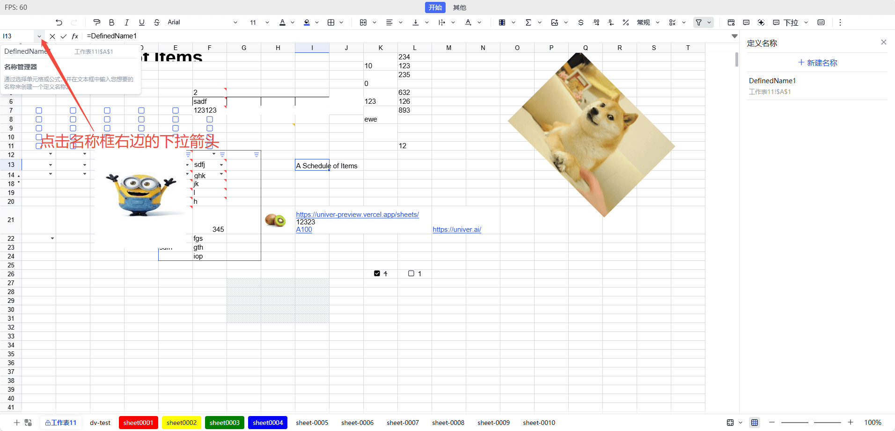

Les noms définis permettent d’attribuer un nom personnalisé à des cellules, à des plages de cellules ou à des formules. Ils permettent de référencer les données de manière plus intuitive, de simplifier les formules et d’améliorer la lisibilité, la maintenabilité et la qualité professionnelle de la feuille de calcul.

- **Amélioration de la lisibilité des formules** : les noms définis rendent les formules plus faciles à comprendre. Par exemple, utiliser `Amount` au lieu de `A1 + A2 + A3` permet de mieux saisir le sens de la formule.
- **Simplification des références complexes** : lorsqu’une formule fait référence à plusieurs cellules ou à des plages complexes, les noms définis permettent de simplifier ces références. Vous pouvez, par exemple, définir `SalesData` pour `A1:A10`, puis utiliser directement `SalesData` dans les formules.
- **Gestion centralisée des plages de données** : les noms définis facilitent la gestion des plages de données. Lorsque la plage change, il suffit de mettre à jour la référence du nom défini au lieu de modifier toutes les formules une par une.

## Utilisation

L’accès au gestionnaire de noms se trouve à côté de la zone Nom, dans l’angle supérieur gauche de la feuille. Vous pouvez y consulter la liste de tous les noms définis et ouvrir le gestionnaire de noms. Celui-ci permet d’afficher, de modifier et de supprimer les noms définis.



Pour utiliser un nom défini dans une formule, saisissez-le directement. Par exemple, si vous avez défini le nom `TotalSales`, utilisez `=TotalSales` dans votre formule pour référencer la plage correspondante.

## Remarques

- **Unicité des noms** : les noms définis doivent être uniques au sein d’une même feuille de calcul et ne peuvent pas entrer en conflit avec d’autres noms ou avec des fonctions intégrées.
- **Validité des noms** : un nom défini ne peut pas commencer par un chiffre ni contenir d’espace ou de caractère spécial, tel que `!`, `@` ou `#`. Si le nom saisi ne respecte pas ces règles, le système affiche une erreur.
- **Mise à jour des noms définis** : pour modifier un nom défini existant, ouvrez de nouveau le panneau de modification « Définir un nom », sélectionnez le nom concerné, puis modifiez-le. Cliquez ensuite sur « OK » pour enregistrer les changements.
- **Suppression des noms définis** : si un nom défini n’est plus nécessaire, sélectionnez-le dans le panneau de modification « Définir un nom », puis cliquez sur le bouton « Supprimer ». Après sa suppression, les formules associées ne seront plus valides.
- **Utilisation entre plusieurs feuilles** : les noms définis peuvent être utilisés dans différentes feuilles d’un même classeur, mais leur unicité doit être prise en compte. Définir le même nom dans plusieurs feuilles peut entraîner des ambiguïtés dans les références.
- **Conventions de nommage** : il est recommandé d’utiliser des noms explicites et d’éviter les noms trop courts ou vagues, afin d’en faciliter la compréhension et la maintenance par les autres utilisateurs.
- **Débogage des formules** : si vous rencontrez un problème lors de l’utilisation de noms définis, vérifiez que les noms sont corrects, que les plages référencées sont exactes et qu’il n’existe aucun conflit de noms.
- **Portée d’utilisation** : les noms définis peuvent être créés au niveau du classeur ou de la feuille de calcul. Les noms définis au niveau du classeur sont utilisables dans tout le classeur, tandis que ceux définis au niveau d’une feuille ne sont utilisables que dans cette feuille.

## API Facade

Les définitions de types complètes de l’API Facade sont disponibles dans la [documentation de l’API Facade](https://reference.univer.ai/en-US).

### Créer des noms définis

`FWorkbook.newDefinedNameBuilder()` crée un générateur de nom défini et renvoie une instance de `FDefinedNameBuilder`. Vous pouvez chaîner ses méthodes pour générer un objet `ISetDefinedNameMutationParam` permettant de créer des noms définis.

Voici quelques méthodes de [`FDefinedNameBuilder`](https://docs.univer.ai/reference/facade/defined-name) :

| Méthode | Description |
| ---- | ---- |
| build | Construit l’objet du nom défini |
| setName | Définit le nom |
| setFormula | Définit la formule du nom défini |
| setRef | Définit la plage de référence du nom défini |
| setComment | Définit le commentaire |
| setScopeToWorksheet | Rend le nom défini disponible pour une feuille de calcul donnée |
| setScopeToWorkbook | Rend le nom défini disponible pour l’ensemble du classeur |

La méthode [`FWorkbook.insertDefinedNameBuilder()`](https://docs.univer.ai/reference/facade/workbook#insertdefinednamebuilder) permet de créer un nom défini disponible dans l’ensemble du classeur.

```typescript
const fWorkbook = univerAPI.getActiveWorkbook()
const definedNameParam = fWorkbook.newDefinedNameBuilder()
  .setName('MyDefinedName')
  .setRef('Sheet1!$A$1')
  .setComment('A reference to A1 cell in Sheet1')
  .build()
fWorkbook.insertDefinedNameBuilder(definedNameParam)
```

La méthode [`FWorkbook.insertDefinedName()`](https://docs.univer.ai/reference/facade/workbook#insertdefinedname) permet de créer rapidement un nom défini.

```typescript
const fWorkbook = univerAPI.getActiveWorkbook()
fWorkbook.insertDefinedName('MyDefinedName', 'Sheet1!$A$1')
```

Autre méthode :
- [`FWorksheet.insertDefinedName()`](https://docs.univer.ai/reference/facade/worksheet#insertdefinedname) : crée un nom défini disponible pour une feuille de calcul donnée.

### Obtenir des noms définis

La méthode [`FWorkbook.getDefinedName()`](https://docs.univer.ai/reference/facade/workbook#getdefinedname) permet d’obtenir un nom défini dans le classeur et renvoie une instance de `FDefinedName`.

```typescript
const fWorkbook = univerAPI.getActiveWorkbook()
const definedName = fWorkbook.getDefinedName('MyDefinedName')
console.log(definedName?.getFormulaOrRefString())

if (definedName) {
  definedName.setName('NewDefinedName')
}
```

Autres méthodes :
- La méthode [`FWorkbook.getDefinedNames()`](https://docs.univer.ai/reference/facade/workbook#getdefinednames) permet d’obtenir tous les noms définis du classeur sous la forme d’un tableau de `FDefinedName[]`.
- La méthode [`FWorksheet.getDefinedNames()`](https://docs.univer.ai/reference/facade/worksheet#getdefinednames) permet d’obtenir tous les noms définis disponibles pour cette feuille de calcul sous la forme d’un tableau de `FDefinedName[]`.

### Modifier des noms définis

La méthode [`FWorkbook.updateDefinedNameBuilder()`](https://docs.univer.ai/reference/facade/workbook#updatedefinednamebuilder) permet de modifier un nom défini dans le classeur.

```typescript
const fWorkbook = univerAPI.getActiveWorkbook()
const definedName = fWorkbook.getDefinedName('MyDefinedName')
console.log(definedName?.getFormulaOrRefString())

// Modify the defined name
if (definedName) {
  const newDefinedNameParam = definedName.toBuilder()
    .setName('NewDefinedName')
    .setRef('Sheet1!$A$2')
    .build()
  fWorkbook.updateDefinedNameBuilder(newDefinedNameParam)
}
```

Une instance de [`FDefinedName`](https://docs.univer.ai/reference/facade/defined-name) peut également être utilisée pour modifier directement la configuration du nom défini.

```typescript
const fWorkbook = univerAPI.getActiveWorkbook()
const definedName = fWorkbook.getDefinedName('MyDefinedName')
console.log(definedName?.getFormulaOrRefString())

// Modify the defined name
if (definedName) {
  definedName.setName('NewDefinedName')
  definedName.setRef('Sheet1!$A$2')
}
```

### Supprimer des noms définis

La méthode [`FWorkbook.deleteDefinedName()`](https://docs.univer.ai/reference/facade/workbook#deletedefinedname) permet de supprimer un nom défini du classeur.

```typescript
const fWorkbook = univerAPI.getActiveWorkbook()
fWorkbook.deleteDefinedName('MyDefinedName')
```

Vous pouvez également supprimer directement le nom défini à l’aide de l’instance de [`FDefinedName`](https://docs.univer.ai/reference/facade/defined-name) renvoyée.

```typescript
const fWorkbook = univerAPI.getActiveWorkbook()
const definedName = fWorkbook.getDefinedName('MyDefinedName')
console.log(definedName?.getFormulaOrRefString())

// Delete the defined name
if (definedName) {
  definedName.delete()
}
```
