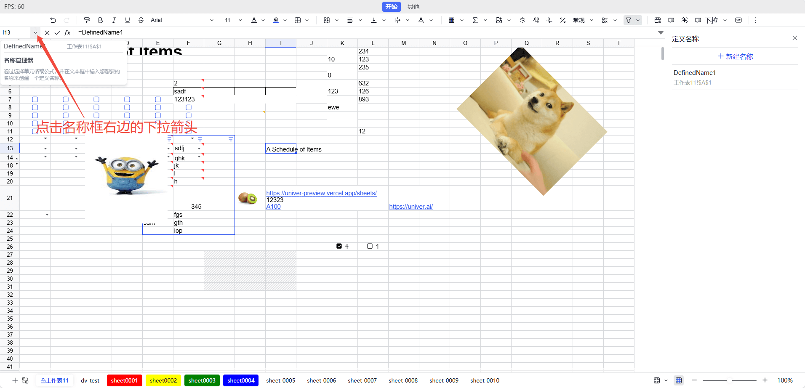

Defined Names is a feature that allows users to assign custom names to cells, cell ranges, or formulas. By naming, users can reference data more intuitively, simplify formulas, and enhance the readability, maintainability, and professionalism of the worksheet.

- **Improves Formula Readability**: Using defined names can make formulas easier to understand. For example, using `Amount` instead of `A1 + A2 + A3` makes the meaning of the formula clearer.
- **Simplifies Complex References**: When referencing multiple cells or complex ranges, defined names can simplify these references. For example, you can define `SalesData` for `A1:A10`, and use `SalesData` directly in formulas.
- **Facilitates Unified Management of Data Areas**: Defined names can help users better manage data areas. When the data range changes, you only need to update the defined name reference, rather than modifying all formulas one by one.

## Usage

The Name Manager entry is located next to the name box in the upper left corner of the Sheet, where you can see a list of all defined names and access the Name Manager. Through the Name Manager, users can view, edit, and delete defined names.



When using defined names in formulas, you can simply enter the name directly. For example, if you have defined a name as `TotalSales`, you can use `=TotalSales` in your formula to reference that range.

## Notes

- **Uniqueness of Names**: Defined names must be unique within the same worksheet and cannot conflict with other names or built-in functions.
- **Validity of Names**: Defined names cannot start with a number, and cannot contain spaces or special characters (such as `!`, `@`, `#`, etc.). If the entered name does not comply with the rules, the system will prompt an error.
- **Updating Defined Names**: If you need to modify an existing defined name, you can reopen the "Define Name" edit panel, select the name you want to modify, and edit it. After making changes, click "OK" to save the changes.
- **Deleting Defined Names**: If a defined name is no longer needed, you can select it in the "Define Name" edit panel and click the "Delete" button to delete it. After deletion, the related formulas will no longer be valid.
- **Cross-Worksheet Usage**: Defined names can be used across different worksheets within the same workbook, but you need to pay attention to the uniqueness of names. If the same name is defined in different worksheets, it may lead to reference confusion.
- **Naming Conventions**: It is recommended to use meaningful names and avoid overly short or vague names to facilitate understanding and maintenance by other users.
- **Debugging Formulas**: If you encounter issues when using defined names, you can check whether the names are correct, whether the reference ranges are accurate, and whether there are any name conflicts.
- **Scope of Use**: Defined names can be set at the workbook level or worksheet level. Workbook-level names can be used throughout the entire workbook, while worksheet-level names can only be used within specific worksheets.

## Facade API

Complete Facade API type definitions can be found in the [FacadeAPI](https://reference.univer.ai/en-US).

### Creating Defined Names

[`univerAPI.newDefinedName()`](https://reference.univer.ai/en-US/classes/FUniver#newdefinedname) creates a defined name builder, returning an `FDefinedNameBuilder` instance. You can use method chaining to generate an `ISetDefinedNameMutationParam` object for creating defined names.

Following are some member methods of [`FDefinedNameBuilder`](https://reference.univer.ai/en-US/classes/FDefinedNameBuilder):

| Method | Description |
| ---- | ---- |
| build | Builds the defined name object |
| setName | Sets the defined name |
| setFormula | Sets the formula for the defined name |
| setRef | Sets the reference range for the defined name |
| setComment | Sets the comment for the defined name |
| setScopeToWorksheet | Sets the defined name to be available for a specific worksheet |
| setScopeToWorkbook | Sets the defined name to be available for the entire workbook |

[`FWorkbook.insertDefinedNameBuilder()`](https://reference.univer.ai/en-US/classes/FWorkbook#insertdefinednamebuilder) method can be used to create a defined name that is available for the entire workbook.

```typescript
const fWorkbook = univerAPI.getActiveWorkbook()
const definedNameBuilder = univerAPI.newDefinedName()
  .setName('MyDefinedName')
  .setRef('Sheet1!$A$1')
  .setComment('A reference to A1 cell in Sheet1')
  .build()
fWorkbook.insertDefinedNameBuilder(definedNameBuilder)
```

[`FWorkbook.insertDefinedName()`](https://reference.univer.ai/en-US/classes/FWorkbook#insertdefinedname) method can be used to quickly create a defined name.

```typescript
const fWorkbook = univerAPI.getActiveWorkbook()
fWorkbook.insertDefinedName('MyDefinedName', 'Sheet1!$A$1')
```

Other methods:
- [`FWorksheet.insertDefinedName()`](https://reference.univer.ai/en-US/classes/FWorksheet#insertdefinedname): Creates a defined name that is available for a specific worksheet.

### Getting Defined Names

[`FWorkbook.getDefinedName()`](https://reference.univer.ai/en-US/classes/FWorkbook#getdefinedname) method can be used to get a defined name in the workbook, returning an `FDefinedName` instance.

```typescript
const fWorkbook = univerAPI.getActiveWorkbook()
const definedName = fWorkbook.getDefinedName('MyDefinedName')
console.log(definedName?.getFormulaOrRefString())

if (definedName) {
  definedName.setName('NewDefinedName')
}
```

Other methods:
- [`FWorkbook.getDefinedNames()`](https://reference.univer.ai/en-US/classes/FWorkbook#getdefinednames) method can be used to get all defined names in the workbook, returning an array of `FDefinedName[]`.
- [`FWorksheet.getDefinedNames()`](https://reference.univer.ai/en-US/classes/FWorksheet#getdefinednames) method can be used to get all defined names available for this worksheet, returning an array of `FDefinedName[]`.

### Modifying Defined Names

[`FWorkbook.updateDefinedNameBuilder()`](https://reference.univer.ai/en-US/classes/FWorkbook#updatedefinednamebuilder) method can be used to modify a defined name in the workbook.

```typescript
const fWorkbook = univerAPI.getActiveWorkbook()
const definedName = fWorkbook.getDefinedName('MyDefinedName')
console.log(definedName?.getFormulaOrRefString())

// Modify the defined name
if (definedName) {
  const newDefinedNameParam = definedName.toBuilder()
    .setName('NewDefinedName')
    .setRef('Sheet1!$A$2')
    .build()
  fWorkbook.updateDefinedNameBuilder(newDefinedNameParam)
}
```

[`FDefinedName`](https://reference.univer.ai/en-US/classes/FDefinedName) instance can also be used to directly modify the defined name configuration.

```typescript
const fWorkbook = univerAPI.getActiveWorkbook()
const definedName = fWorkbook.getDefinedName('MyDefinedName')
console.log(definedName?.getFormulaOrRefString())

// Modify the defined name
if (definedName) {
  definedName.setName('NewDefinedName')
  definedName.setRef('Sheet1!$A$2')
}
```

### Deleting Defined Names

[`FWorkbook.deleteDefinedName()`](https://reference.univer.ai/en-US/classes/FWorkbook#deletedefinedname) method can be used to delete a defined name in the workbook.

```typescript
const fWorkbook = univerAPI.getActiveWorkbook()
fWorkbook.deleteDefinedName('MyDefinedName')
```

You can also directly delete the defined name using the returned [`FDefinedName`](https://reference.univer.ai/en-US/classes/FDefinedName) instance.

```typescript
const fWorkbook = univerAPI.getActiveWorkbook()
const definedName = fWorkbook.getDefinedName('MyDefinedName')
console.log(definedName?.getFormulaOrRefString())

// Delete the defined name
if (definedName) {
  definedName.delete()
}
```
