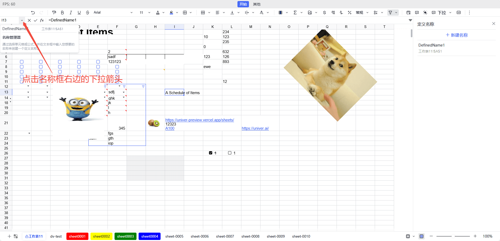

定义名称是用于为单元格、单元格区域或公式赋予一个自定义名称的功能。通过命名，用户可以更直观地引用数据，简化公式，提高工作表的可读性、可维护性和专业性。

- **提高公式可读性**：使用定义名称可以让公式更易于理解。例如，使用 `销售总额` 代替 `A1 + A2 + A3`，使得公式的含义更加明确。
- **简化复杂引用**：当需要引用多个单元格或复杂的范围时，定义名称可以简化这些引用。例如，可以将 `A1:A10` 定义为 `销售数据`，在公式中直接使用 `销售数据` 来代替。
- **便于统一管理数据区域**：定义名称可以帮助用户更好地管理数据区域。当数据范围发生变化时，只需更新定义名称的引用即可，无需逐一修改所有公式。

## 使用方法

名称管理器入口在 Sheet 左上角名称框旁边的下拉箭头，点击后可以看到所有已定义的名称列表和名称管理器的入口。通过名称管理器，用户可以查看、编辑和删除已定义的名称。



在公式中使用定义名称时，只需直接输入名称即可。例如，如果你定义了一个名称为 `销售总额`，可以在公式中直接使用 `=销售总额` 来引用该范围。

## 注意事项

- **名称的唯一性**：在同一个工作表中，定义名称必须是唯一的，不能与其他名称或内置函数冲突。
- **名称的有效性**：定义名称不能以数字开头，不能包含空格或特殊字符（如 `!`、`@`、`#` 等）。如果输入的名称不符合规则，系统会提示错误。
- **更新定义名称**：如果需要修改已定义的名称，可以再次打开“定义名称”编辑面板，选择要修改的名称进行编辑。修改后，点击“确定”保存更改。
- **删除定义名称**：如果不再需要某个定义名称，可以在“定义名称”编辑面板中选择该名称，然后点击“删除”按钮进行删除。删除后，相关的公式将不再有效。
- **跨工作表使用**：定义名称可以在同一个工作簿的不同工作表中使用，但需要注意名称的唯一性。如果在不同工作表中定义了相同的名称，可能会导致引用混淆。
- **命名规范**：建议使用有意义的名称，避免使用过于简短或模糊的名称，以便于其他用户理解和维护。
- **调试公式**：如果在使用定义名称时遇到问题，可以检查名称是否正确，引用范围是否准确，以及是否存在名称冲突等问题。可以通过“名称管理器”面板查看所有已定义的名称及其引用范围。
- **使用范围**：定义名称可以设置为工作簿级别或工作表级别。工作簿级别的名称可以在整个工作簿中使用，而工作表级别的名称只能在特定的工作表中使用。

## Facade API

完整 Facade API 类型定义，请查看 [Facade API](https://reference.univer.ai/zh-CN)

### 创建定义名称

[`univerAPI.newDefinedName()`](https://reference.univer.ai/zh-CN/classes/FUniver#newdefinedname) 创建一个定义名称构建器，返回一个 `FDefinedNameBuilder` 实例，可以通过链式调用生成 `ISetDefinedNameMutationParam` 对象用于创建定义名称。

以下是 [`FDefinedNameBuilder`](https://reference.univer.ai/zh-CN/classes/FDefinedNameBuilder) 上的一些成员方法：

| 方法 | 描述 |
| ---- | ---- |
| build | 构建定义名称对象 |
| setName | 设置定义名称 |
| setFormula | 设置定义名称的公式 |
| setRef | 设置定义名称的引用范围 |
| setComment | 设置定义名称的注释 |
| setScopeToWorksheet | 设置定义名称为某个工作表可用 |
| setScopeToWorkbook | 设置定义名称为整个工作簿可用 |

通过 [`FWorkbook.insertDefinedNameBuilder()`](https://reference.univer.ai/zh-CN/classes/FWorkbook#insertdefinednamebuilder) 方法可以创建整个工作簿可用的定义名称。

```typescript
const fWorkbook = univerAPI.getActiveWorkbook()
const definedNameBuilder = univerAPI.newDefinedName()
  .setName('MyDefinedName')
  .setRef('Sheet1!$A$1')
  .setComment('A reference to A1 cell in Sheet1')
  .build()
fWorkbook.insertDefinedNameBuilder(definedNameBuilder)
```

也可以通过 [`FWorkbook.insertDefinedName()`](https://reference.univer.ai/zh-CN/classes/FWorkbook#insertdefinedname) 方法快速创建定义名称。

```typescript
const fWorkbook = univerAPI.getActiveWorkbook()
fWorkbook.insertDefinedName('MyDefinedName', 'Sheet1!$A$1')
```

其他方法：
- [`FWorksheet.insertDefinedName()`](https://reference.univer.ai/zh-CN/classes/FWorksheet#insertdefinedname)：创建工作表可用的定义名称。

### 获取定义名称

[`FWorkbook.getDefinedName()`](https://reference.univer.ai/zh-CN/classes/FWorkbook#getdefinedname) 方法可以获取工作簿中已定义的名称，返回一个 `FDefinedName` 实例。

```typescript
const fWorkbook = univerAPI.getActiveWorkbook()
const definedName = fWorkbook.getDefinedName('MyDefinedName')
console.log(definedName?.getFormulaOrRefString())

if (definedName) {
  definedName.setName('NewDefinedName')
}
```

其他方法：
- [`FWorkbook.getDefinedNames()`](https://reference.univer.ai/zh-CN/classes/FWorkbook#getdefinednames) 方法可以获取工作簿中所有已定义的名称，返回一个 `FDefinedName[]` 数组。
- [`FWorksheet.getDefinedNames()`](https://reference.univer.ai/zh-CN/classes/FWorksheet#getdefinednames) 方法可以获取所有此工作表可用的定义名称，返回一个 `FDefinedName[]` 数组。

### 修改定义名称

`FWorkbook.updateDefinedNameBuilder()` 方法可以修改工作簿中已定义的名称。

```typescript
const fWorkbook = univerAPI.getActiveWorkbook()
const definedName = fWorkbook.getDefinedName('MyDefinedName')
console.log(definedName?.getFormulaOrRefString())

// 更新定义名称
if (definedName) {
  const newDefinedNameParam = definedName.toBuilder()
    .setName('NewDefinedName')
    .setRef('Sheet1!$A$2')
    .build()
  fWorkbook.updateDefinedNameBuilder(newDefinedNameParam)
}
```

也可以通过返回的 [`FDefinedName`](https://reference.univer.ai/zh-CN/classes/FDefinedName) 实例直接修改定义名称配置。

```typescript
const fWorkbook = univerAPI.getActiveWorkbook()
const definedName = fWorkbook.getDefinedName('MyDefinedName')
console.log(definedName?.getFormulaOrRefString())

// 更新定义名称
if (definedName) {
  definedName.setName('NewDefinedName')
  definedName.setRef('Sheet1!$A$2')
}
```

### 删除定义名称

[`FWorkbook.deleteDefinedName()`](https://reference.univer.ai/zh-CN/classes/FWorkbook#deletedefinedname) 方法可以删除工作簿中已定义的名称。

```typescript
const fWorkbook = univerAPI.getActiveWorkbook()
fWorkbook.deleteDefinedName('MyDefinedName')
```

也可以通过返回的 [`FDefinedName`](https://reference.univer.ai/zh-CN/classes/FDefinedName) 实例直接删除定义名称。

```typescript
const fWorkbook = univerAPI.getActiveWorkbook()
const definedName = fWorkbook.getDefinedName('MyDefinedName')
console.log(definedName?.getFormulaOrRefString())

// 删除定义名称
if (definedName) {
  definedName.delete()
}
```
