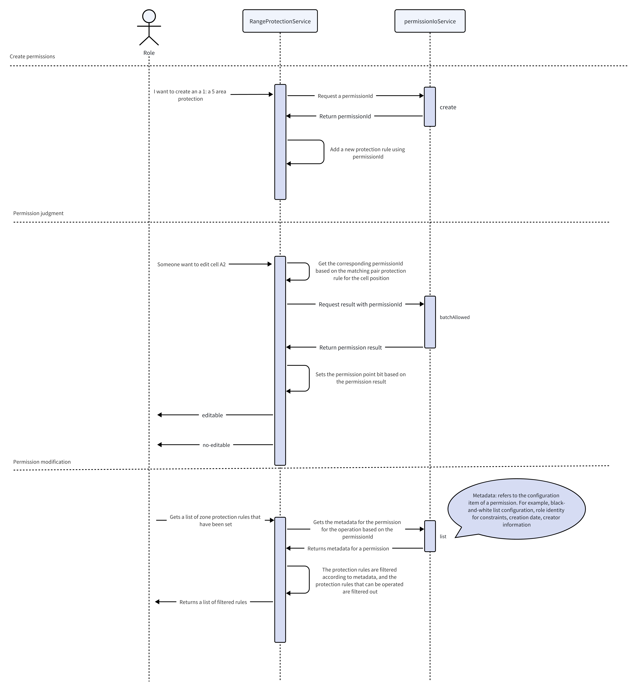

import { MigrationCell, MigrationRow, MigrationTable } from './components/migration-table'

Univer はブック・シート・セル範囲に対する権限制御機能を提供します。ユーザーが許可されていない操作を実行しようとすると、コード実行を停止し、権限不足を通知できます。たとえば、範囲保護（エリア保護）を設定し、その範囲内で他の共同編集者が編集 / 閲覧 / コピー / フィルター等を行えるかどうかを制御できます。

<Callout type="warning" title="使用上の注意">
  Univer が提供するのは拡張可能な基盤能力であり、カスタマイズ済み機能ではありません。
  永続化や組織構造など、より広範かつ特化した要件がある場合は、権限ルールの保存および組織構造との統合を自ら実装する必要があります。その際はカスタムプラグインを作成してください。
  そのため、権限を設定した後に権限一覧が空であったり、ユーザー情報を取得しても空で返ることがあります。これは当該情報が API 経由で取得されるべきカスタムロジックであり、追加実装が必要だからです。以下の「サードパーティ認可サービス統合」を参照してください。
</Callout>

<PlaygroundFrame lang="ja-JP" slug="sheets/permission" clickToShow />

## 基本概念

- 範囲：権限の対象となる範囲。Univer ではワークブック、ワークシート、選区の 3 つの範囲がサポートされており、ユーザーはこれらの範囲に対して権限を設定できます。
- 権限ポイント：権限の対象となる機能点。各機能点は対応する権限ポイントクラスで表され、ユーザーはこれらのポイントを設定して特定の機能を制御できます。
- 保護ルール：ワークシートと選区の権限設定には、まず保護ルールを作成する必要があります。保護ルールは、特定のユーザーやユーザーグループに対して範囲内の操作を許可または禁止するためのルールです。

<Callout type="info" title="権限ポイント説明">
  ローカル非永続化（非協同編集環境）権限制御は、権限ポイントを変更することで直接実現できます。永続化された権限については、以下の「サードパーティ認可サービス統合」を参照してください。
  協同編集シナリオでは、権限ポイントの更新はサーバー側の状態も同期的に更新します：
  - false：その権限ポイントには少なくとも `owner` ロールが必要
  - true：その権限ポイントには少なくとも `reader` ロールが必要
</Callout>

## 基本例

最も一般的な権限設定方法を、ワークブック、ワークシート、選区の 3 つのレベルで以下に示します。

### ワークブック権限コード例

現状、ブックレベルの権限は API を通じて直接変更します。Univer は [Facade API](/guides/sheets/getting-started/facade) を提供しており、これを用いてブックの各機能に対する権限を設定できます。

編集権限を例にとると（他の機能の場合は、権限ポイントを置き換えるだけで済みます。詳細については、[権限ポイントビット一覧 - ワークブック](#workbook-point)を参照してください）、次のコードを使用してワークブック全体を編集不可に設定できます：

```typescript
const fWorkbook = univerAPI.getActiveWorkbook()
const workbookPermission = fWorkbook.getWorkbookPermission()

// ワークブックを編集不可に設定
await workbookPermission.setPoint(univerAPI.Enum.WorkbookPermissionPoint.Edit, false)
```

重要な点：
- ブック権限ポイントは直接設定でき、保護ルールの作成は必要ありません。

### ワークシート権限コード例

ワークシートおよび範囲に関連する権限は Facade API とコマンド両方で設定可能です。ここではワークシート編集権限を例とします。その他のワークシート機能は[権限ポイントビット一覧 - ワークシート](#worksheet-point)を参照してください。

```typescript
const fWorkbook = univerAPI.getActiveWorkbook()
const fWorksheet = fWorkbook.getActiveSheet()
const worksheetPermission = fWorksheet.getWorksheetPermission()

// ワークシート保護を作成し、指定したユーザーのみ編集可能に設定
const permissionId = await worksheetPermission.protect({
  allowedUsers: ['user1', 'user2'],
  name: 'My Worksheet Protection',
})

// 権限ポイントを設定する必要がある場合は、まずワークシート保護を作成する必要があります
await worksheetPermission.setPoint(univerAPI.Enum.WorksheetPermissionPoint.Edit, false)
```

#### ワークシート権限の削除

```typescript
const fWorkbook = univerAPI.getActiveWorkbook()
const fWorksheet = fWorkbook.getActiveSheet()
const worksheetPermission = fWorksheet.getWorksheetPermission()

// ワークシート保護を削除します
await worksheetPermission.unprotect()
```

### カスタム範囲権限コード例

範囲（Range）権限も API とコマンドの両方式で設定できます。ここでは範囲編集権限を例とします。他の範囲機能は[権限ポイントビット一覧 - 範囲](#range-point)を参照してください。

```typescript
const fWorkbook = univerAPI.getActiveWorkbook()
const fWorksheet = fWorkbook.getActiveSheet()
const fRange = fWorksheet.getRange('A1:B2')
const rangePermission = fRange.getRangePermission()

// 指定したユーザーのみ編集可能、他のユーザーは閲覧不可
const rule = await rangePermission.protect({
  name: 'My protected range',
  allowViewByOthers: false,
  allowedUsers: ['user1', 'user2'],
})
console.log(rule)

// 権限ポイントを設定する必要がある場合は、まず範囲保護を作成する必要があります
await rule.setPoint(univerAPI.Enum.RangePermissionPoint.Edit, false)
await rule.setPoint(univerAPI.Enum.RangePermissionPoint.View, true)
```

#### 範囲保護権限の削除

```typescript
const fWorkbook = univerAPI.getActiveWorkbook()
const fWorksheet = fWorkbook.getActiveSheet()
const fRange = fWorksheet.getRange('A1:B2')
const rangePermission = fRange.getRangePermission()

// スコープ内のすべての保護ルールを削除
await rangePermission.unprotect()

// または、指定されたルールを削除
const rules = await rangePermission.listRules()
if (rules.length > 0) {
  await rules[0].remove()
}
```

## 拡張利用

独自のプラグイン内で権限検証を追加する必要がある場合は、直接権限ポイントを操作できます。

ここでは `WorkbookEditablePermission` を例に、独自プラグイン内で権限検証を追加します。他のポイントも同様です。

```typescript
import { IPermissionService } from '@univerjs/core'
import { WorkbookEditablePermission } from '@univerjs/sheets'

class YourService {
  constructor(@IPermissionService private _permissionService: IPermissionService) {
  }

  setWorkbookNotEditable() {
    this._permissionService.updatePermissionPoint(new WorkbookEditablePermission('unitId').id, false)
  }

  setWorkbookEditable() {
    this._permissionService.updatePermissionPoint(new WorkbookEditablePermission('unitId').id, true)
  }
}
```

他の権限ポイントを拡張・変更して別機能の権限制御も可能です。具体的なポイント一覧は記事末尾を参照してください。

### 権限ポイントの拡張方法

権限ポイントをカスタマイズする必要がある場合は、`IPermissionPoint` を実装し、権限サービスに登録できます。

```typescript
import type { IPermissionPoint } from '@univerjs/core'
import { IPermissionService, PermissionStatus } from '@univerjs/core'
import { UnitAction, UnitObject } from '@univerjs/protocol'

export class CustomPermissionPoint implements IPermissionPoint {
  type = UnitObject.Unkonwn // 任意のタイプ
  subType = UnitAction.View // 任意のサブタイプ
  status = PermissionStatus.INIT
  value = true // 初期値
  id: string
  constructor(unitId: string, subUnitId: string, customId: string) {
    // id は IPermissionService 全体で一意である必要がある
    this.id = `${unitId}.${subUnitId}.${customId}`
  }
}

class YourService {
  constructor(@IPermissionService private _permissionService: IPermissionService) {
    this._init()
  }

  _init() {
    this._permissionService.addPermissionPoint(new CustomPermissionPoint('unitId', 'subUnitId', 'my-id'))
  }
}

// 他所での利用例
class ConsumeService {
  constructor(@IPermissionService private _permissionService: IPermissionService) {
  }

  doSomething() {
    const point = this._permissionService.getPermissionPoint(new CustomPermissionPoint('unitId', 'subUnitId', 'my-id').id)
    console.log(point.value)
  }

  bindEvent() {
    // これは Rx オブジェクトを取得し、権限変更を監視したりリストを更新したりできる
    const pount$ = this._permissionService.getPermissionPoint$(new CustomPermissionPoint('unitId', 'subUnitId', 'my-id').id)
    console.log(pount$)
  }
}
```

### サードパーティ認可サービスの統合（高度な利用）

<Callout type="warning" title="注意事項">
  カスタム権限アクセスと Permission Facade API の混在は避けることを推奨します。後者は権限ポイントをより細粒度に制御できるためです。
</Callout>

権限判定ロジックは通常外部サービスで処理され、通信が発生します。フロントエンド SDK 実装ではこのロジックを処理するために [AuthzIoLocalService](https://github.com/dream-num/univer/blob/dev/packages/core/src/services/authz-io/authz-io-local.service.ts) を利用しています。

本番環境ではこの実装をバックエンドサービスに置き換える必要があります。フロントエンドは [IAuthzIoService](https://github.com/dream-num/univer/blob/dev/packages/core/src/services/authz-io/type.ts) インターフェースに基づき、実行時差し替え用のリクエスト関数を実装します。



以下は 2 つの事前定義ロール（Owner / Reader）に対し、保護された範囲の追加と削除を行う簡易例です。 Owner は保護範囲の編集・閲覧が可能で、Reader は保護範囲内セルの内容を編集・閲覧できません。

```typescript
import type { Injector } from '@univerjs/core'
import type { IActionInfo, IAllowedRequest, IBatchAllowedResponse, ICollaborator, ICreateRequest, ICreateRequest_SelectRangeObject, IListPermPointRequest, IPermissionPoint, IPutCollaboratorsRequest, IUnitRoleKV, IUpdatePermPointRequest } from '@univerjs/protocol'
import { createDefaultUser, generateRandomId, IAuthzIoService, Inject, IResourceManagerService, isDevRole, Univer, UserManagerService } from '@univerjs/core'
import { ObjectScope, UnitAction, UnitObject, UnitRole, UniverType } from '@univerjs/protocol'

class YourAuthzService implements IAuthzIoService {
  private _permissionMap: Map<string, ICreateRequest_SelectRangeObject & { objectType: UnitObject }> = new Map([])

  constructor(
    @IResourceManagerService private _resourceManagerService: IResourceManagerService,
    @Inject(UserManagerService) private _userManagerService: UserManagerService,
  ) {
    this._initSnapshot()
    this._initDefaultUser()
  }

  private _initDefaultUser() {
    const currentUser = this._userManagerService.getCurrentUser()
    const currentUserIsValid = currentUser && currentUser.userID
    if (!currentUserIsValid) {
      this._userManagerService.setCurrentUser(createDefaultUser(UnitRole.Owner))
    }
  }

  private _getRole(type: UnitRole) {
    const user = this._userManagerService.getCurrentUser()
    if (!user) {
      return false
    }
    return isDevRole(user.userID, type)
  }

  private _initSnapshot() {
    this._resourceManagerService.registerPluginResource({
      toJson: (_unitId: string) => {
        const obj = [...this._permissionMap.keys()].reduce((r, k) => {
          const v = this._permissionMap.get(k)
          r[k] = v!
          return r
        }, {} as Record<string, ICreateRequest_SelectRangeObject & { objectType: UnitObject }>)
        return JSON.stringify(obj)
      },
      parseJson: (json: string) => {
        return JSON.parse(json)
      },
      pluginName: 'SHEET_AuthzIoMockService_PLUGIN',
      businesses: [UniverType.UNIVER_SHEET, UniverType.UNIVER_DOC, UniverType.UNIVER_SLIDE],
      onLoad: (_unitId, resource) => {
        for (const key in resource) {
          this._permissionMap.set(key, resource[key])
        }
      },
      onUnLoad: () => {
        this._permissionMap.clear()
      },
    })
  }

  async create(config: ICreateRequest): Promise<string> {
    const permissionId = generateRandomId(8)
    if (config.objectType === UnitObject.SelectRange && config.selectRangeObject) {
      this._permissionMap.set(permissionId, { ...config.selectRangeObject, objectType: config.objectType })
    }
    return permissionId
  }

  async batchAllowed(config: IAllowedRequest[]): Promise<IBatchAllowedResponse['objectActions']> {
    const selectionRangeConfig = config.filter(c => c.objectType === UnitObject.SelectRange)
    if (selectionRangeConfig.length) {
      const currentUser = this._userManagerService.getCurrentUser()
      const res = [] as IBatchAllowedResponse['objectActions']
      selectionRangeConfig.forEach((c) => {
        res.push({
          unitID: c.unitID,
          objectID: c.objectID,
          actions: c.actions.map((action) => {
            if (isDevRole(currentUser.userID, UnitRole.Owner)) {
              return { action, allowed: true }
            }
            return { action, allowed: false }
          }),
        })
      })
      return res
    }
    return Promise.resolve([])
  }

  async list(config: IListPermPointRequest): Promise <IPermissionPoint[]> {
    const result: IPermissionPoint[] = []
    config.objectIDs.forEach((objectID) => {
      const rule = this._permissionMap.get(objectID)
      if (rule) {
        const item = {
          objectID,
          unitID: config.unitID,
          objectType: rule!.objectType,
          name: rule!.name,
          shareOn: false,
          shareRole: UnitRole.Owner,
          shareScope: -1,
          scope: {
            read: ObjectScope.AllCollaborator,
            edit: ObjectScope.AllCollaborator,
          },
          creator: createDefaultUser(UnitRole.Owner),
          strategies: [
            {
              action: UnitAction.View,
              role: UnitRole.Owner,
            },
            {
              action: UnitAction.Edit,
              role: UnitRole.Owner,
            },
          ],
          actions: config.actions.map((a) => {
            return { action: a, allowed: this._getRole(UnitRole.Owner) }
          }),
        }
        result.push(item)
      }
    })
    return result
  }

  async listCollaborators(): Promise<ICollaborator[]> {
    // 既存の共同編集者を列挙
    return []
  }

  async allowed(_config: IAllowedRequest): Promise<IActionInfo[]> {
    // これは権限処理用のモックサービスのため実ロジックは書かない。空配列を返し、ユーザーが元々設定した権限を変更しない。
    // 永続化を行いたい場合はここを改修
    return Promise.resolve([])
  }

  async listRoles(): Promise<{ roles: IUnitRoleKV[], actions: UnitAction[] }> {
    return {
      roles: [],
      actions: [],
    }
  }

  async update(config: IUpdatePermPointRequest): Promise<void> {
    // ビット情報更新
  }

  async updateCollaborator(): Promise<void> {
    // 共同編集者情報更新
    return undefined
  }

  async createCollaborator(): Promise<void> {
    // 新規共同編集者作成
    return undefined
  }

  async deleteCollaborator(): Promise<void> {
    return undefined
  }

  async putCollaborators(config: IPutCollaboratorsRequest): Promise<void> {
    return undefined
  }
}

export class YourPlugin extends Plugin {
  constructor(
    _config: unknown,
    @Inject(Injector) protected override _injector: Injector,
  ) {
  }

  override onStarting(): void {
    this._injector.add([IAuthzIoService, { useClass: YourAuthzService }])
  }
}

// override オプションで [[IAuthzIoService, null]] を設定することで、組み込み IAuthzIoService を登録しないよう指示できる。
// これにより YourAuthzService が認可サービス実装として利用される。
const univer = new Univer({
  override: [[IAuthzIoService, null]],
})

univer.registerPlugin(YourPlugin)
```

## 権限ポイントビット一覧 [#point-list]

対象コードは次の [code](https://github.com/dream-num/univer/tree/dev/packages/sheets/src/services/permission/permission-point) を参照してください。

ブック権限とワークシート／範囲権限が交差する場合、利用には全て true に設定されている必要があります。

### ワークブック権限 [#workbook-point]

| API 列挙 | 対応する権限ポイントクラス | 説明 |
| --- | --- | --- |
| univerAPI.Enum.WorkbookPermissionPoint.Edit | WorkbookEditablePermission | 編集可能 |
| univerAPI.Enum.WorkbookPermissionPoint.View | WorkbookViewPermission | 閲覧可能 |
| univerAPI.Enum.WorkbookPermissionPoint.Print | WorkbookPrintPermission | 印刷可能 |
| univerAPI.Enum.WorkbookPermissionPoint.Export | WorkbookExportPermission | エクスポート可能 |
| univerAPI.Enum.WorkbookPermissionPoint.Share | WorkbookSharePermission | 共有可能 |
| univerAPI.Enum.WorkbookPermissionPoint.CopyContent | WorkbookCopyPermission |コピー可能 |
| univerAPI.Enum.WorkbookPermissionPoint.DuplicateFile | WorkbookDuplicatePermission | 複製可能 |
| univerAPI.Enum.WorkbookPermissionPoint.Comment | WorkbookCommentPermission | コメント可能 |
| univerAPI.Enum.WorkbookPermissionPoint.ManageCollaborator | WorkbookManageCollaboratorPermission | 共同編集者管理可能 |
| univerAPI.Enum.WorkbookPermissionPoint.CreateSheet | WorkbookCreateSheetPermission | ワークシート作成可能 |
| univerAPI.Enum.WorkbookPermissionPoint.DeleteSheet | WorkbookDeleteSheetPermission | ワークシート削除可能 |
| univerAPI.Enum.WorkbookPermissionPoint.RenameSheet | WorkbookRenameSheetPermission | ワークシート名称変更可能 |
| univerAPI.Enum.WorkbookPermissionPoint.MoveSheet | WorkbookMoveSheetPermission | ワークシート移動可能 |
| univerAPI.Enum.WorkbookPermissionPoint.HideSheet | WorkbookHideSheetPermission | ワークシート非表示設定可能 |
| univerAPI.Enum.WorkbookPermissionPoint.CopySheet | WorkbookCopySheetPermission | ワークシート複製可能 |
| univerAPI.Enum.WorkbookPermissionPoint.ViewHistory | WorkbookViewHistoryPermission | 履歴閲覧可能 |
| univerAPI.Enum.WorkbookPermissionPoint.RecoverHistory | WorkbookRecoverHistoryPermission | 履歴復元可能 |
| univerAPI.Enum.WorkbookPermissionPoint.CreateProtection | WorkbookCreateProtectPermission | 保護範囲作成可能 |
| univerAPI.Enum.WorkbookPermissionPoint.InsertRow | WorkbookInsertRowPermission | 行挿入可能 |
| univerAPI.Enum.WorkbookPermissionPoint.InsertColumn | WorkbookInsertColumnPermission | 列挿入可能 |
| univerAPI.Enum.WorkbookPermissionPoint.DeleteRow | WorkbookDeleteRowPermission | 行削除可能 |
| univerAPI.Enum.WorkbookPermissionPoint.DeleteColumn | WorkbookDeleteColumnPermission | 列削除可能 |

### ワークシート権限 [#worksheet-point]

| API 列挙 | 対応する権限ポイントクラス | 説明 |
| --- | --- | --- |
| univerAPI.Enum.WorksheetPermissionPoint.Edit | WorksheetEditPermission | 編集可能 |
| univerAPI.Enum.WorksheetPermissionPoint.View | WorksheetViewPermission | 閲覧可能 |
| univerAPI.Enum.WorksheetPermissionPoint.Copy | WorksheetCopyPermission | コピー可能 |
| univerAPI.Enum.WorksheetPermissionPoint.SetCellValue | WorksheetSetCellValuePermission | セル値編集可能 |
| univerAPI.Enum.WorksheetPermissionPoint.SetCellStyle | WorksheetSetCellStylePermission | セルスタイル編集可能 |
| univerAPI.Enum.WorksheetPermissionPoint.SetRowStyle | WorksheetSetRowStylePermission | 行スタイル設定可能 |
| univerAPI.Enum.WorksheetPermissionPoint.SetColumnStyle | WorksheetSetColumnStylePermission | 列スタイル設定可能 |
| univerAPI.Enum.WorksheetPermissionPoint.InsertRow | WorksheetInsertRowPermission | 行挿入可能 |
| univerAPI.Enum.WorksheetPermissionPoint.InsertColumn | WorksheetInsertColumnPermission | 行挿入可能 |
| univerAPI.Enum.WorksheetPermissionPoint.DeleteRow | WorksheetDeleteRowPermission | 行削除可能 |
| univerAPI.Enum.WorksheetPermissionPoint.DeleteColumn | WorksheetDeleteColumnPermission | 列削除可能 |
| univerAPI.Enum.WorksheetPermissionPoint.Sort | WorksheetSortPermission | 並べ替え可能 |
| univerAPI.Enum.WorksheetPermissionPoint.Filter | WorksheetFilterPermission | フィルタ使用可能 |
| univerAPI.Enum.WorksheetPermissionPoint.PivotTable | WorksheetPivotTablePermission | ピボットテーブル使用可能 |
| univerAPI.Enum.WorksheetPermissionPoint.InsertHyperlink | WorksheetInsertHyperlinkPermission | ハイパーリンク使用可能 |
| univerAPI.Enum.WorksheetPermissionPoint.ManageCollaborator | WorksheetManageCollaboratorPermission | 共同編集者管理可能 |
| univerAPI.Enum.WorksheetPermissionPoint.DeleteProtection | WorksheetDeleteProtectionPermission | 保護範囲削除可能 |

### 範囲 [#range-point]

| API Enum  | Corresponding Permission Point Class | Description |
| --- | --- | --- |
| univerAPI.Enum.RangePermissionPoint.Edit | RangeProtectionPermissionEditPoint | 保護範囲を編集可能 |
| univerAPI.Enum.RangePermissionPoint.View | RangeProtectionPermissionViewPoint | 保護範囲の内容を閲覧可能 |
| univerAPI.Enum.RangePermissionPoint.Delete | RangeProtectionPermissionDeleteProtectionPoint | 保護範囲を削除可能 |

## 設定

### 権限保護範囲シャドウ戦略

権限背景シャドウはデフォルト表示です。以下で非表示にできます:

<Tabs items={['プリセットモード', 'プラグインモード']}>
  <Tab>
    ```typescript
    createUniver({
      presets: [
        UniverSheetsCorePreset({
          sheets: {
            /**
             * 権限保護範囲の影表示戦略。
             * - true または 'always': すべての保護範囲の影を表示（デフォルト動作）
             * - 'non-editable': 編集できない範囲の影のみ表示（編集権限が false の場合）
             * - 'non-viewable': 表示できない範囲の影のみ表示（表示権限が false の場合）
             * - false または 'none': 保護範囲の影を表示しない
             * @default true
             */
            protectedRangeShadow: false,
          },
        }),
      ],
    })
    ```
  </Tab>
  <Tab>
    ```typescript
    univer.registerPlugin(UniverSheetsUIPlugin, {
      /**
       * 権限保護範囲の影表示戦略。
       * - true または 'always': すべての保護範囲の影を表示（デフォルト動作）
       * - 'non-editable': 編集できない範囲の影のみ表示（編集権限が false の場合）
       * - 'non-viewable': 表示できない範囲の影のみ表示（表示権限が false の場合）
       * - false または 'none': 保護範囲の影を表示しない
       * @default true
       */
      protectedRangeShadow: false,
    })
    ```
  </Tab>
</Tabs>

API 経由で動的に変更も可能です:

```typescript
// 編集不可範囲の影のみ表示に設定
univerAPI.setProtectedRangeShadowStrategy('non-editable')

// 現在の保護範囲影表示戦略を取得
console.log(univerAPI.getProtectedRangeShadowStrategy())

// 保護範囲影表示戦略の変更を監視
const subscription = univerAPI.getProtectedRangeShadowStrategy$().subscribe((strategy) => {
  console.log('Global strategy changed to:', strategy)
  // UIの更新や他のアクションを実行
})

// 後で購読解除
subscription.unsubscribe()
```

### カスタムユーザーコンポーネント

Univer の標準ユーザーコンポーネントは適応性に限界があります。より複雑なカスタムコンポーネントが必要な場合は以下の方法で作成できます。

<Callout>
  カスタムコンポーネントの作り方は [Custom Components](/guides/sheets/ui/components) を参照してください。
</Callout>

<Tabs items={['プリセットモード', 'プラグインモード']}>
  <Tab>
    ```typescript
    const { univer } = createUniver({
      presets: [
        UniverSheetsCorePreset({
          sheets: {
            protectedRangeUserSelector: {
            /**
             * カスタムコンポーネント。`IPermissionDetailUserPartProps` インターフェースを実装すること
             */
              component: CustomPermissionDetailUserPart,
              /**
               * コンポーネントのフレームワーク。正しく指定する必要あり
               */
              framework: 'react',
            },
          },
        }),
      ],
    })
    ```
  </Tab>
  <Tab>
    ```typescript
    univer.registerPlugin(UniverSheetsUIPlugin, {
      protectedRangeUserSelector: {
        /**
         * カスタムコンポーネント。`IPermissionDetailUserPartProps` を実装
         */
        component: CustomPermissionDetailUserPart,
        /**
         * 利用フレームワーク
         */
        framework: 'react',
      },
    })
    ```
  </Tab>
</Tabs>

カスタムユーザー設定を完了したら、後続利用のために `sheetPermissionUserManagerService` サービスの `_selectUserList` に同期してください。

<Tabs items={['プリセットモード', 'プラグインモード']}>
  <Tab>
    ```typescript
    import { SheetPermissionUserManagerService, useDependency } from '@univerjs/preset-sheets-core'

    const sheetPermissionUserManagerService = useDependency(SheetPermissionUserManagerService)
    // 具体的なデータ構造は下記参照：https://github.com/dream-num/univer/blob/b4d4cfa063c9e6d5a82d1fc6b05edc206a415252/packages/sheets-ui/src/services/permission/sheet-permission-user-list.service.ts#L57
    sheetPermissionUserManagerService.setSelectUserList([])
    ```
  </Tab>
  <Tab>
    ```typescript
    import { SheetPermissionUserManagerService } from '@univerjs/sheets-ui'
    import { useDependency } from '@univerjs/ui'

    const sheetPermissionUserManagerService = useDependency(SheetPermissionUserManagerService)
    // データ構造参考：https://github.com/dream-num/univer/blob/b4d4cfa063c9e6d5a82d1fc6b05edc206a415252/packages/sheets-ui/src/services/permission/sheet-permission-user-list.service.ts#L57
    sheetPermissionUserManagerService.setSelectUserList([])
    ```
  </Tab>
</Tabs>

## Facade API

Facade API は、権限に対する統一されたエントリーポイントを提供します。以下は、ワークブック、ワークシート、選区ごとに一般的なメソッドをグループ化して示しています。

### ワークブック権限

#### ワークブック権限インスタンスの取得

```typescript
const fWorkbook = univerAPI.getActiveWorkbook()
const workbookPermission = fWorkbook.getWorkbookPermission()
```

#### ワークブック権限ポイントの設定

`WorkbookPermissionPoint` 列挙値のリストは、[権限ポイントビット一覧 - ワークブック権限](#workbook-point) にあります。

```typescript
const fWorkbook = univerAPI.getActiveWorkbook()
const workbookPermission = fWorkbook.getWorkbookPermission()

// ワークブック印刷権限を不可に設定
await workbookPermission.setPoint(univerAPI.Enum.WorkbookPermissionPoint.Print, false)
```

定義済みモードの利用例：

```typescript
const fWorkbook = univerAPI.getActiveWorkbook()
const workbookPermission = fWorkbook.getWorkbookPermission()

// オーナーモードに設定
await workbookPermission.setMode('owner')

// エディターモードに設定
await workbookPermission.setMode('editor')

// ビューアモードに設定
await workbookPermission.setMode('viewer')

// コメント可能モードに設定
await workbookPermission.setMode('commenter')
```

ショートカットメソッドの利用例：

- `FWorkbookPermission.setReadOnly()`：読み取り専用モードに設定することは、`setMode('viewer')` と同じです。
- `FWorkbookPermission.setEditable()`: 読み取り/書き込み可能モードに設定することは、`setMode('editor')` と同じです。

#### ワークブック権限ポイントステータスの取得

```typescript
const fWorkbook = univerAPI.getActiveWorkbook()
const workbookPermission = fWorkbook.getWorkbookPermission()

// ワークブック印刷権限ステータスを取得
const canPrint = workbookPermission.getPoint(univerAPI.Enum.WorkbookPermissionPoint.Print)
console.log('Can print:', canPrint)

// すべてのワークブック権限ポイントステータスを取得
const snapshot = workbookPermission.getSnapshot()
console.log('Workbook permission snapshot:', snapshot)
```

ショートカットメソッドの利用例：

- `FWorkbookPermission.canEdit()`: ワークブックが編集可能か確認します

#### 共同編集者管理

<Callout type="warning" title="注意事項">
  共同編集者管理関連の API は、共同編集機能を利用し USIP サービスと統合している場合にのみ利用可能です。
  カスタム権限サービスを利用する場合は、上記の「サードパーティ認可サービスの統合」セクションを参照し、共同編集者管理ロジックを自分で実装してください。
</Callout>

- 共同編集者リストの取得

```typescript
const fWorkbook = univerAPI.getActiveWorkbook()
const workbookPermission = fWorkbook.getWorkbookPermission()

const collaborators = await workbookPermission.listCollaborators()
console.log(collaborators)
```

- 共同編集者の追加

```typescript
const fWorkbook = univerAPI.getActiveWorkbook()
const workbookPermission = fWorkbook.getWorkbookPermission()

// 複数の共同編集者を一度に追加
await workbookPermission.setCollaborators([
  {
    user: { userID: 'user1', name: 'John Doe', avatar: 'https://...' },
    role: univerAPI.Enum.UnitRole.Editor,
  },
  {
    user: { userID: 'user2', name: 'Jane Smith', avatar: '' },
    role: univerAPI.Enum.UnitRole.Reader,
  },
])

// 単一の共同編集者を追加
await workbookPermission.addCollaborator(
  { userID: 'user1', name: 'John Doe', avatar: 'https://...' },
  univerAPI.Enum.UnitRole.Editor,
)
```

- 共同編集者ロールの更新

```typescript
const fWorkbook = univerAPI.getActiveWorkbook()
const workbookPermission = fWorkbook.getWorkbookPermission()

await workbookPermission.updateCollaborator(
  { userID: 'user1', name: 'John Doe Updated', avatar: 'https://...' },
  univerAPI.Enum.UnitRole.Reader,
)
```

- 共同編集者の削除

```typescript
const fWorkbook = univerAPI.getActiveWorkbook()
const workbookPermission = fWorkbook.getWorkbookPermission()

// 複数の共同編集者を一度に削除
await workbookPermission.removeCollaborators(['user1', 'user2'])

// 単一の共同編集者を削除
await workbookPermission.removeCollaborator('user1')
```

### ワークシート権限

#### ワークシート権限インスタンスの取得

```typescript
const fWorkbook = univerAPI.getActiveWorkbook()
const fWorksheet = fWorkbook.getActiveSheet()
const worksheetPermission = fWorksheet.getWorksheetPermission()
```

#### ワークシート保護

```typescript
const fWorkbook = univerAPI.getActiveWorkbook()
const fWorksheet = fWorkbook.getActiveSheet()
const worksheetPermission = fWorksheet.getWorksheetPermission()

// ワークシート保護を設定し、指定ユーザーが編集可能にする
const permissionId = await worksheetPermission.protect({
  allowedUsers: ['user1', 'user2'],
  name: 'My Worksheet Protection',
})

// ワークシートが保護されているか確認
const isProtected = worksheetPermission.isProtected()
console.log('Is worksheet protected:', isProtected)

if (isProtected) {
  // ワークシート保護を解除
  await worksheetPermission.unprotect()
}
```

#### ワークシート権限ポイントの設定

`WorksheetPermissionPoint` 列挙値のリストは、[権限ポイントビット一覧 - ワークシート権限](#worksheet-point) にあります。

```typescript
const fWorkbook = univerAPI.getActiveWorkbook()
const fWorksheet = fWorkbook.getActiveSheet()
const worksheetPermission = fWorksheet.getWorksheetPermission()

// 権限ポイントを設定する必要がある場合は、まずワークシート保護を作成する必要があります
await worksheetPermission.protect()

// ワークシートの行挿入権限を不可に設定
await worksheetPermission.setPoint(univerAPI.Enum.WorksheetPermissionPoint.InsertRow, false)
```

定義済みモードの利用例：

```typescript
const fWorkbook = univerAPI.getActiveWorkbook()
const fWorksheet = fWorkbook.getActiveSheet()
const worksheetPermission = fWorksheet.getWorksheetPermission()

// 権限ポイントを設定する必要がある場合は、まずワークシート保護を作成する必要があります
await worksheetPermission.protect()

// エディターモードに設定
await worksheetPermission.setMode('editable')

// ビューアモードに設定
await worksheetPermission.setMode('readOnly')

// フィルタ/ソートのみモードに設定
await worksheetPermission.setMode('filterOnly')

// カスタムモードに設定
await worksheetPermission.applyConfig({
  mode: 'readOnly',
  points: {
    [univerAPI.Enum.WorksheetPermissionPoint.InsertRow]: true,
    [univerAPI.Enum.WorksheetPermissionPoint.InsertColumn]: true,
  },
})
```

ショートカットメソッドの利用例：

- `FWorksheetPermission.setReadOnly()`：読み取り専用モードに設定することは、`setMode('readOnly')` と同じです。
- `FWorksheetPermission.setEditable()`：読み取り/書き込み可能モードに設定することは、`setMode('editable')` と同じです。

#### ワークシート権限ポイントステータスの取得

```typescript
const fWorkbook = univerAPI.getActiveWorkbook()
const fWorksheet = fWorkbook.getActiveSheet()
const worksheetPermission = fWorksheet.getWorksheetPermission()

// ワークシートの行挿入権限ステータスを取得
const canInsertRow = worksheetPermission.getPoint(univerAPI.Enum.WorksheetPermissionPoint.InsertRow)

// すべてのワークシート権限ポイントステータスを取得
const snapshot = worksheetPermission.getSnapshot()
```

ショートカットメソッドの利用例：

- `FWorksheetPermission.canEdit(): boolean`：ワークシートが編集可能か確認します
- `FWorksheetPermission.canEditCell(row: number, col: number): boolean`：特定のセルが編集可能か確認します
- `FWorksheetPermission.canView(): boolean`：ワークシートが閲覧可能か確認します
- `FWorksheetPermission.canViewCell(row: number, col: number): boolean`：特定のセルが閲覧可能か確認します
- `FWorksheetPermission.debugCellPermission(row: number, col: number): ICellPermissionDebugInfo`：特定のセルの権限デバッグ情報を取得します

### 範囲権限

#### 範囲権限インスタンスの取得

```typescript
const fWorkbook = univerAPI.getActiveWorkbook()
const fWorksheet = fWorkbook.getActiveSheet()
const fRange = fWorksheet.getRange('A1:B2')
const rangePermission = fRange.getRangePermission()
```

#### 範囲保護の設定

- ワークシート権限を使用して範囲保護を設定します：

```typescript
const fWorkbook = univerAPI.getActiveWorkbook()
const fWorksheet = fWorkbook.getActiveSheet()
const worksheetPermission = fWorksheet.getWorksheetPermission()

// 複数の保護範囲を設定、A1:B2 は他のユーザーが閲覧可能だが編集不可、C3:D4 は指定ユーザーが編集可能だが他のユーザーは閲覧不可
const rules = await worksheetPermission.protectRanges([
  {
    ranges: [fWorksheet.getRange('A1:B2')],
    options: { name: 'Protected Area 1', allowViewByOthers: true },
  },
  {
    ranges: [fWorksheet.getRange('C3:D4')],
    options: { name: 'Protected Area 2', allowViewByOthers: false, allowedUsers: ['user1'] },
  },
])
console.log(rules)

// 現在のワークシートのすべての保護範囲ルールを取得
const rules = await worksheetPermission.listRangeProtectionRules()
console.log(rules)

// 最初の保護範囲ルールを削除
await worksheetPermission.unprotectRules([rules[0].id])

// または、`FRangeProtectionRule.remove()` を使用して保護ルールを削除
await ruleList[0].remove()
```

- 範囲権限インスタンスを使用して範囲保護を設定します：

```typescript
const fWorkbook = univerAPI.getActiveWorkbook()
const fWorksheet = fWorkbook.getActiveSheet()
const fRange = fWorksheet.getRange('A1:B2')
const rangePermission = fRange.getRangePermission()

// 範囲保護を設定し、指定ユーザーが編集可能で他のユーザーは閲覧不可にする
const rule = await rangePermission.protect({
  name: 'My protected range',
  allowViewByOthers: false,
  allowedUsers: ['user1', 'user2'],
})
console.log(rule)

// 現在の範囲のすべての保護ルールを取得
const rules = await rangePermission.listRules()
console.log(rules)

// 現在の範囲内のすべての保護ルールを削除
await rangePermission.unprotect()

// または、`FRangeProtectionRule.remove()` を使用して保護ルールを削除
await rules[0].remove()
```

#### 範囲権限ポイントの設定

`RangePermissionPoint` 列挙値のリストは、[権限ポイントビット一覧 - 範囲](#range-point) にあります。

```typescript
const fWorkbook = univerAPI.getActiveWorkbook()
const fWorksheet = fWorkbook.getActiveSheet()
const fRange = fWorksheet.getRange('A1:B2')
const rangePermission = fRange.getRangePermission()

// 権限ポイントを設定する必要がある場合は、まず範囲保護を作成する必要があります
if (rangePermission.isProtected()) {
  const rules = await rangePermission.listRules()

  // 最初の保護ルールの編集権限を不可、閲覧権限を可に設定
  await rules[0].setPoint(univerAPI.Enum.RangePermissionPoint.Edit, false)
  await rules[0].setPoint(univerAPI.Enum.RangePermissionPoint.View, true)
} else {
  await rangePermission.protect({
    name: 'My protected range',
    allowViewByOthers: false,
    allowedUsers: ['user1', 'user2'],
  })

  // A1:B2 選択範囲の編集権限を不可、閲覧権限を可に設定
  await rangePermission.setPoint(univerAPI.Enum.RangePermissionPoint.Edit, false)
  await rangePermission.setPoint(univerAPI.Enum.RangePermissionPoint.View, true)
}
```

### 範囲権限ルール API

`FRangeProtectionRule` の主なメソッドは以下の通りです：

| 方法 | 説明 |
| --- | --- |
| `id: string` | 保護ルールの一意識別子 |
| `permissionId: string` | この保護ルールに関連付けられた権限ポイントの ID |
| `ranges: FRange[]` | この保護ルールが適用される範囲のリスト |
| `options: IRangeProtectionOptions` | 保護ルールのオプション設定 |
| `updateRanges(ranges: FRange[]): Promise<boolean>` | 保護ルールの範囲を更新 |
| `remove(): Promise<boolean>` | この保護ルールを削除 |
| `setPoint(point: RangePermissionPoint, value: boolean): Promise<void>` | 保護ルールの権限ポイントを設定 |
| `getPoint(point: RangePermissionPoint): boolean` | 保護ルールの特定の権限ポイントのステータスを取得 |
| `canEdit(): boolean` | チェック保護ルールが編集を許可するかどうか |
| `canView(): boolean` | チェック保護ルールが閲覧を許可するかどうか |
| `canDelete(): boolean` | チェック保護ルールが削除を許可するかどうか |
| `getSnapshot(): RangePermissionSnapshot` | 保護ルールの現在の状態のスナップショットを取得 |

```typescript
const fWorkbook = univerAPI.getActiveWorkbook()
const fWorksheet = fWorkbook.getActiveSheet()
const worksheetPermission = fWorksheet.getWorksheetPermission()
const rules = await worksheetPermission.listRangeProtectionRules()
const rule = rules?.[0]

// ID 最初の保護ルールの ID を取得
const ruleId = rule?.id
console.log(ruleId)

// 最初の保護ルールの範囲を取得
const ranges = rule?.ranges
console.log(ranges)

// A1:C3 最初の保護ルールの範囲を A1:C3 に更新
await rule?.updateRanges([fWorksheet.getRange('A1:C3')])

// 最初の保護ルールを削除
await rule?.remove()
```

### 権限ダイアログの非表示

```typescript
univerAPI.setPermissionDialogVisible(false)
```

### 旧 API 移行ガイド

<MigrationTable headers={['API メソッドの説明', '移行ガイド']}>
  <MigrationRow method="権限インスタンスの取得">
    <MigrationCell className="mb-2.5">
      <strong>旧 API：</strong>
      <br />
      <code>FWorkbook.getPermission()</code>
    </MigrationCell>
    <MigrationCell>
      <strong>新しい API：</strong>
      <br />
      <div>ワークブック：<code>FWorkbook.getWorkbookPermission()</code></div>
 <div>ワークシート：<code>FWorksheet.getWorksheetPermission()</code></div>
 <div>範囲：<code>FRange.getRangePermission()</code></div>
    </MigrationCell>
  </MigrationRow>
  <MigrationRow method="ワークブック権限ポイントの設定">
    <MigrationCell className="mb-2.5">
      <strong>旧 API：</strong>
      <br />
      <code>FPermission.setWorkbookPermissionPoint(unitId: string, FPointClass: WorkbookPermissionPointConstructor, value: boolean)</code>
    </MigrationCell>
    <MigrationCell>
      <strong>新しい API：</strong>
      <br />
      <code>FWorkbookPermission.setPoint(point: WorkbookPermissionPoint, value: boolean)</code>
    </MigrationCell>
  </MigrationRow>
  <MigrationRow method="ワークブック権限ポイントステータスの取得">
    <MigrationCell className="mb-2.5">
      <strong>旧 API：</strong>
      <br />
      <code>FPermission.checkWorkbookPermissionPoint(unitId: string, FPointClass: WorkbookPermissionPointConstructor): boolean</code>
    </MigrationCell>
    <MigrationCell>
      <strong>新しい API：</strong>
      <br />
      <code>FWorkbookPermission.getPoint(point: WorkbookPermissionPoint): boolean</code>
    </MigrationCell>
  </MigrationRow>
  <MigrationRow method="ワークブック編集権限の設定">
    <MigrationCell className="mb-2.5">
      <strong>旧 API：</strong>
      <br />
      <code>FPermission.setWorkbookEditPermission(unitId: string, value: boolean)</code>
    </MigrationCell>
    <MigrationCell>
      <strong>新しい API：</strong>
      <br />
      <code>FWorkbookPermission.setPoint(univerAPI.Enum.WorkbookPermissionPoint.Edit, value: boolean)</code>
    </MigrationCell>
  </MigrationRow>
  <MigrationRow method="ワークシート保護の設定">
    <MigrationCell className="mb-2.5">
      <strong>旧 API：</strong>
      <br />
      <code>FPermission.addWorksheetBasePermission(unitId: string, subUnitId: string)</code>
    </MigrationCell>
    <MigrationCell>
      <strong>新しい API：</strong>
      <br />
      <code>FWorksheetPermission.protect(options?: IWorksheetProtectionOptions)</code>
    </MigrationCell>
  </MigrationRow>
  <MigrationRow method="ワークシート保護の解除">
    <MigrationCell className="mb-2.5">
      <strong>旧 API：</strong>
      <br />
      <code>FPermission.removeWorksheetPermission(unitId: string, subUnitId: string)</code>
    </MigrationCell>
    <MigrationCell>
      <strong>新しい API：</strong>
      <br />
      <code>FWorksheetPermission.unprotect()</code>
    </MigrationCell>
  </MigrationRow>
  <MigrationRow method="ワークシート権限ポイントの設定">
    <MigrationCell className="mb-2.5">
      <strong>旧 API：</strong>
      <br />
      <code>FPermission.setWorksheetPermissionPoint(unitId: string, subUnitId: string, FPointClass: WorkSheetPermissionPointConstructor, value: boolean)</code>
    </MigrationCell>
    <MigrationCell>
      <strong>新しい API：</strong>
      <br />
      <code>FWorksheetPermission.setPoint(point: WorksheetPermissionPoint, value: boolean)</code>
    </MigrationCell>
  </MigrationRow>
  <MigrationRow method="ワークシート権限ポイントステータスの取得">
    <MigrationCell className="mb-2.5">
      <strong>旧 API：</strong>
      <br />
      <code>FPermission.checkWorksheetPermissionPoint(unitId: string, subUnitId: string, FPointClass: WorkSheetPermissionPointConstructor): boolean</code>
    </MigrationCell>
    <MigrationCell>
      <strong>新しい API：</strong>
      <br />
      <code>FWorksheetPermission.getPoint(point: WorksheetPermissionPoint): boolean</code>
    </MigrationCell>
  </MigrationRow>
  <MigrationRow method="特定のセルの権限デバッグ情報を取得します">
    <MigrationCell className="mb-2.5">
      <strong>旧 API：</strong>
      <br />
      <code>FPermission.getPermissionInfoWithCell(unitId: string, subUnitId: string, row: number, column: number)</code>
    </MigrationCell>
    <MigrationCell>
      <strong>新しい API：</strong>
      <br />
      <code>FWorksheetPermission.debugCellPermission(row: number, col: number): ICellPermissionDebugInfo</code>
    </MigrationCell>
  </MigrationRow>
  <MigrationRow method="範囲保護の設定">
    <MigrationCell className="mb-2.5">
      <strong>旧 API：</strong>
      <br />
      <code>FPermission.addRangeBaseProtection(unitId: string, subUnitId: string, ranges: FRange[])</code>
    </MigrationCell>
    <MigrationCell>
      <strong>新しい API：</strong>
      <br />
      <div>ワークシート：<code>FWorksheetPermission.protectRanges(configs)</code></div>
 <div>範囲：<code>FRangePermission.protect(options?: IRangeProtectionOptions)</code></div>
    </MigrationCell>
  </MigrationRow>
  <MigrationRow method="範囲保護の解除">
    <MigrationCell className="mb-2.5">
      <strong>旧 API：</strong>
      <br />
      <code>FPermission.removeRangeProtection(unitId: string, subUnitId: string, ruleIds: string[])</code>
    </MigrationCell>
    <MigrationCell>
      <strong>新しい API：</strong>
      <br />
      <div>ワークシート：<code>FWorksheetPermission.unprotectRules(ruleIds: string[])</code></div>
 <div>範囲：<code>FRangePermission.unprotect()</code></div>
 <div>範囲権限ルール：<code>FRangeProtectionRule.remove()</code></div>
    </MigrationCell>
  </MigrationRow>
  <MigrationRow method="範囲権限ポイントの設定">
    <MigrationCell className="mb-2.5">
      <strong>旧 API：</strong>
      <br />
      <code>FPermission.setRangeProtectionPermissionPoint(unitId: string, subUnitId: string, permissionId: string, FPointClass: RangePermissionPointConstructor, value: boolean)</code>
    </MigrationCell>
    <MigrationCell>
      <strong>新しい API：</strong>
      <br />
      <code>FRangeProtectionRule.setPoint(point: RangePermissionPoint, value: boolean)</code>
    </MigrationCell>
  </MigrationRow>
  <MigrationRow method="保護ルールの範囲を更新">
    <MigrationCell className="mb-2.5">
      <strong>旧 API：</strong>
      <br />
      <code>FPermission.setRangeProtectionRanges(unitId: string, subUnitId: string, ruleId: string, ranges: FRange[])</code>
    </MigrationCell>
    <MigrationCell>
      <strong>新しい API：</strong>
      <br />
      <code>FRangeProtectionRule.updateRanges(ranges: FRange[])</code>
    </MigrationCell>
  </MigrationRow>
  <MigrationRow method="権限ダイアログの非表示">
    <MigrationCell className="mb-2.5">
      <strong>旧 API：</strong>
      <br />
      <code>FPermission.setPermissionDialogVisible(false)</code>
    </MigrationCell>
    <MigrationCell>
      <strong>新しい API：</strong>
      <br />
      <code>univerAPI.setPermissionDialogVisible(false)</code>
    </MigrationCell>
  </MigrationRow>
</MigrationTable>
