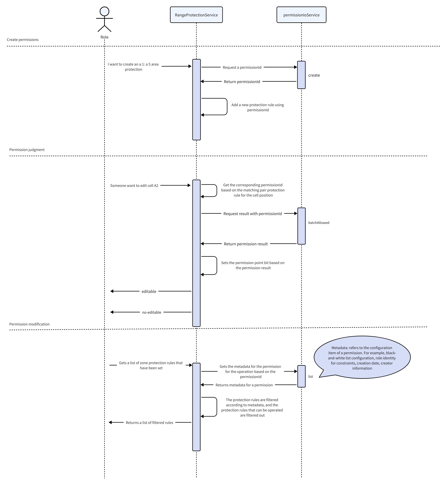

Univer provides permission control capabilities, typically used to restrict user operations on workbooks, sheets, and ranges. When a user performs an operation without permission, the code execution can be halted and the user will be prompted about the missing permissions. For example, you can set area protection within a range, which allows setting whether other collaborators can edit, read, copy, filter, etc., within the protected range.

**Note: Univer provides extendable foundational capabilities, not customized features. If you have more extensive and tailored requirements such as persistence or organizational structures, you need to implement the storage of permission rules and integrate organizational structures yourself. In this case, you need to write custom plugins to achieve this.**
Therefore, after setting permissions, you might find the permission list empty when viewing it, or user information returns empty when you check it. This is because this information needs to be fetched via API requests; it's custom logic that requires additional implementation on your part. You can refer to the third-party integration below.

## Basic Example

### Workbook Permissions

Currently, workbook-level permissions are directly modified through the API. We provide the [Facade API](/guides/sheets/getting-started/facade), and you can use this API to set permissions for different functions of the workbook.

Taking edit permission as an example (other functions require replacing the permission points, which are listed at the bottom of the article and need to be imported from `@univerjs/sheets`), you can use the following code to set the entire workbook to be non-editable:

```typescript
import { FUniver } from '@univerjs/core/facade'

const univerAPI = FUniver.newAPI(univer)
```

Then, you can use the univerAPI methods to get the FPermission object and set specific permissions:

```typescript
const permission = univerAPI.getPermission()
const workbookEditablePermission = permission.permissionPointsDefinition.WorkbookEditablePermission
// unitId is the workbook id, WorkbookEditablePermission is the permission point, false means the permission is not available
permission.setWorkbookPermissionPoint(unitId, workbookEditablePermission, false)
```

### Worksheet Permissions Code Example

Worksheet and range-related permissions can be set via both the Facade API and command. Here, we'll use worksheet edit permissions as an example. Other worksheet functions require replacing the permission points, which are listed at the bottom of the article.

<Tabs items={['Facade API', 'Command Mode']}>
  <Tab>
    ```typescript
    const permission = univerAPI.getPermission()
    const worksheetEditPermission = permission.permissionPointsDefinition.WorksheetEditPermission
    // Create worksheet permission, unitId is the workbook id, subUnitId is the sheet id, the generated permission is a basic permission used for rendering permission areas
    const permissionId = await permission.addWorksheetBasePermission(unitId, subUnitId)

    permission.sheetRuleChangedAfterAuth$.subscribe((currentPermissionId) => {
      if (currentPermissionId === permissionId) {
        // Set the worksheet as non-editable
        permission.setWorksheetPermissionPoint(unitId, subUnitId, worksheetEditPermission, false)
      }
    })
    ```
  </Tab>
  <Tab>
    ```typescript
    import { ICommandService, IPermissionService, IUniverInstanceService } from '@univerjs/core'
    import { AddWorksheetProtectionMutation, getSheetCommandTarget, WorksheetEditPermission } from '@univerjs/sheets'

    const accessor = univer.__getInjector()
    const commandService = accessor.get(ICommandService)
    const univerInstanceService = accessor.get(IUniverInstanceService)

    const target = getSheetCommandTarget(univerInstanceService)
    if (!target) {
      return
    }

    const { unitId, subUnitId } = target

    commandService.executeCommand(AddWorksheetProtectionMutation.id, {
      unitId,
      subUnitId,
      rule: {
        permissionId: '2sxcza1',
        name: 'sheet',
        unitType: 2,
        unitId,
        subUnitId,
      },
    })

    const permissionService = accessor.get(IPermissionService)
    permissionService.updatePermissionPoint(new WorksheetEditPermission(unitId, subUnitId).id, false)
    ```
  </Tab>
</Tabs>

Parameters in this command: `permissionId` is a unique ID you generate to store the permission, `unitType` is the sheet type (you can use the UnitObject enum from the repository), unitId is the workbook id, and `subUnitId` is the sheet id.

#### Delete Worksheet Permissions

<Tabs items={['API Method', 'Command Mode']}>
  <Tab>
    ```typescript
    const permission = univerAPI.getPermission()
    permission.removeWorksheetPermission(unitId, subUnitId)
    ```
  </Tab>
  <Tab>
    ```typescript
    import { DeleteWorksheetProtectionMutation } from '@univerjs/sheets' // [!code ++]

    commandService.executeCommand(DeleteWorksheetProtectionMutation.id, {
      unitId,
      subUnitId,
    })
    ```
  </Tab>
</Tabs>

### Custom Range Permissions Code Example

Range permissions can also be set via API and command modes. Here, we'll use range edit permissions as an example. Other range functions require replacing the permission points, which are listed at the bottom of the article.

<Tabs items={['API Method', 'Command Mode']}>
  <Tab>
    ```typescript
    const workbook = univerAPI.getActiveWorkbook()
    const sheet = workbook.getActiveSheet()
    const unitId = workbook.getId()
    const subUnitId = sheet.getSheetId()

    const range1 = sheet.getRange('A1:B3')
    const range2 = sheet.getRange('C4:D5')
    const ranges = [range1, range2]

    const permission = univerAPI.getPermission()
    const rangeProtectionPermissionEditPoint = permission.permissionPointsDefinition.RangeProtectionPermissionEditPoint
    const res = await permission.addRangeBaseProtection(unitId, subUnitId, ranges)
    // The response differs from worksheet permissions as a sheet may have multiple range protections, so ruleId is used for storing the unique permission rule, and permissionId is for combining permission points.
    const { permissionId, ruleId } = res

    permission.rangeRuleChangedAfterAuth$.subscribe((currentPermissionId) => {
      if (currentPermissionId === permissionId) {
        // Set the range protection as non-editable
        permission.setRangeProtectionPermissionPoint(unitId, subUnitId, permissionId, rangeProtectionPermissionEditPoint, false)
      }
    })
    ```
  </Tab>
  <Tab>
    ```typescript
    import { ICommandService, IPermissionService, IUniverInstanceService } from '@univerjs/core'
    import { AddRangeProtectionMutation, getSheetCommandTarget, RangeProtectionPermissionEditPoint } from '@univerjs/sheets'

    const accessor = univer.__getInjector()
    const commandService = accessor.get(ICommandService)
    const univerInstanceService = accessor.get(IUniverInstanceService)

    const target = getSheetCommandTarget(univerInstanceService)
    if (!target) {
      return
    }

    const { unitId, subUnitId } = target
    const ranges = [
      {
        startRow: 0,
        startColumn: 0,
        endRow: 2,
        endColumn: 1,
      },
      {
        startRow: 3,
        startColumn: 2,
        endRow: 4,
        endColumn: 3,
      },
    ]

    commandService.executeCommand(AddRangeProtectionMutation.id, {
      unitId,
      subUnitId,
      rules: [{
        permissionId: '3xtfxG1',
        name: 'sheet1',
        unitType: 3,
        unitId,
        subUnitId,
        ranges,
        id: 'rule1',
      }],
    })

    const permissionService = accessor.get(IPermissionService)
    // Here, RangeProtectionPermissionEditPoint's third parameter is the generated permissionId, false means not editable
    permissionService.updatePermissionPoint(new RangeProtectionPermissionEditPoint(unitId, subUnitId, '3xtfxG1').id, false)
    ```
  </Tab>
</Tabs>

Here, the parameters are similar to those above, with additional `ranges` parameter for selected areas, and `id` parameter for uniquely identifying the rule, used for deletion.

#### Delete Range Protection Permissions

<Tabs items={['API Method', 'Command Mode']}>
  <Tab>
    ```typescript
    const permission = univerAPI.getPermission()
    permission.removeRangeProtection(unitId, subUnitId, ruleIds)
    ```
  </Tab>
  <Tab>
    ```typescript
    import { DeleteRangeProtectionMutation } from '@univerjs/sheets' // [!code ++]

    commandService.executeCommand(DeleteRangeProtectionMutation.id, {
      unitId,
      subUnitId,
      ruleIds: ['rule1'],
    })
    ```
  </Tab>
</Tabs>

### Remove permission dialog

```typescript
const permission = univerAPI.getPermission()
permission.setPermissionDialogVisible(false)
```

## Extended usage

Here we take `WorkbookEditablePermission` as an example and add permission verification in your own plug-in. Other points are similar.

```typescript
import { IPermissionService } from '@univerjs/core'
import { WorkbookEditablePermission } from '@univerjs/sheets'

class YourService {
  constructor(@IPermissionService private _permissionService: IPermissionService) {

  }

  setWorkbookNotEditable() {
    this._permissionService.updatePermissionPoint(new WorkbookEditablePermission('unitId').id, false)
  }

  setWorkbookEditable() {
    this._permissionService.updatePermissionPoint(new WorkbookEditablePermission('unitId').id, true)
  }
}
```

You can also extend and modify other permission points to achieve permission control for different functions. For a specific list of points, please refer to the bottom of the article.

### How to extend the permission point

```typescript
import type { IPermissionPoint } from '@univerjs/core'
import { IPermissionService } from '@univerjs/core'

export class CustomPermissionPoint implements IPermissionPoint {
  type = UnitObject.Unkonwn // your type
  subType = UnitAction.View // your subType
  status = PermissionStatus.INIT
  value = true // Initial values
  id: string
  constructor(unitId: string, subUnitId: string, customId: string) {
    // The id attribute needs to be guaranteed to be unique throughout `IPermissionService`.
    this.id = `${unitId}.${subUnitId}.${customId}`
  }
}

class YourService {
  constructor(@IPermissionService private _permissionService: IPermissionService) {
    this._init()
  }

  _init() {
    this._permissionService.addPermissionPoint(new CustomPermissionPoint('unitId', 'subUnitId', 'my-id'))
  }
}

// How to use it elsewhere
class ConsumeService {
  constructor(@IPermissionService private _permissionService: IPermissionService) {
  }

  doSomething() {
    const point = this._permissionService.getPermissionPoint(new CustomPermissionPoint('unitId', 'subUnitId', 'my-id').id)
    console.log(point.value)
  }

  bindEvent() {
    // This will get an RX object, allowing you to listen for changes to the current permissions and make a list of changes
    const pount$ = this._permissionService.getPermissionPoint$(new CustomPermissionPoint('unitId', 'subUnitId', 'my-id').id)
    console.log(pount$)
  }
}
```

### Integration of Third-Party Authorization Service(Advanced Usage)

<Callout type="warning" emoji="🚨">
  **It is recommended to avoid mixing custom permission access with the Permission Facade API, as it allows for more granular control over permission points.**
</Callout>

The logic for determining permissions is typically handled by an external service, which involves a communication process. In the frontend SDK implementation, we use the [AuthzIoLocalService](https://github.com/dream-num/univer/blob/dev/packages/core/src/services/authz-io/authz-io-local.service.ts) to handle this logic.

In a production environment, we need to replace this implementation with a backend service. The frontend needs to implement the corresponding request functions based on the [IAuthzIoService](https://github.com/dream-num/univer/blob/dev/packages/core/src/services/authz-io/type.ts) interface for runtime replacement.



Here is a simple example demonstrating the addition and deletion of protected range permissions for two predefined roles (Owner/Reader).
The Owner has editing/viewing permissions for protected ranges, while the Reader cannot edit or view the contents of cells within protected ranges.

```typescript
import type { Injector } from '@univerjs/core'
import type { IActionInfo, IAllowedRequest, IBatchAllowedResponse, ICollaborator, ICreateRequest, ICreateRequest_SelectRangeObject, IListPermPointRequest, IPermissionPoint, IPutCollaboratorsRequest, IUnitRoleKV, IUpdatePermPointRequest } from '@univerjs/protocol'

import { createDefaultUser, generateRandomId, IAuthzIoService, Inject, IResourceManagerService, isDevRole, Univer, UserManagerService } from '@univerjs/core'
import { ObjectScope, UnitAction, UnitObject, UnitRole, UniverType } from '@univerjs/protocol'

class YourAuthzService implements IAuthzIoService {
  private _permissionMap: Map<string, ICreateRequest_SelectRangeObject & { objectType: UnitObject }> = new Map([])

  constructor(
    @IResourceManagerService private _resourceManagerService: IResourceManagerService,
    @Inject(UserManagerService) private _userManagerService: UserManagerService,
  ) {
    this._initSnapshot()
    this._initDefaultUser()
  }

  private _initDefaultUser() {
    const currentUser = this._userManagerService.getCurrentUser()
    const currentUserIsValid = currentUser && currentUser.userID
    if (!currentUserIsValid) {
      this._userManagerService.setCurrentUser(createDefaultUser(UnitRole.Owner))
    }
  }

  private _getRole(type: UnitRole) {
    const user = this._userManagerService.getCurrentUser()
    if (!user) {
      return false
    }
    return isDevRole(user.userID, type)
  }

  private _initSnapshot() {
    this._resourceManagerService.registerPluginResource({
      toJson: (_unitId: string) => {
        const obj = [...this._permissionMap.keys()].reduce((r, k) => {
          const v = this._permissionMap.get(k)
          r[k] = v!
          return r
        }, {} as Record<string, ICreateRequest_SelectRangeObject & { objectType: UnitObject }>)
        return JSON.stringify(obj)
      },
      parseJson: (json: string) => {
        return JSON.parse(json)
      },
      pluginName: 'SHEET_AuthzIoMockService_PLUGIN',
      businesses: [UniverType.UNIVER_SHEET, UniverType.UNIVER_DOC, UniverType.UNIVER_SLIDE],
      onLoad: (_unitId, resource) => {
        for (const key in resource) {
          this._permissionMap.set(key, resource[key])
        }
      },
      onUnLoad: () => {
        this._permissionMap.clear()
      },
    })
  }

  async create(config: ICreateRequest): Promise<string> {
    const permissionId = generateRandomId(8)
    if (config.objectType === UnitObject.SelectRange && config.selectRangeObject) {
      this._permissionMap.set(permissionId, { ...config.selectRangeObject, objectType: config.objectType })
    }
    return permissionId
  }

  async batchAllowed(config: IAllowedRequest[]): Promise<IBatchAllowedResponse['objectActions']> {
    const selectionRangeConfig = config.filter(c => c.objectType === UnitObject.SelectRange)
    if (selectionRangeConfig.length) {
      const currentUser = this._userManagerService.getCurrentUser()
      const res = [] as IBatchAllowedResponse['objectActions']
      selectionRangeConfig.forEach((c) => {
        res.push({
          unitID: c.unitID,
          objectID: c.objectID,
          actions: c.actions.map((action) => {
            if (isDevRole(currentUser.userID, UnitRole.Owner)) {
              return { action, allowed: true }
            }
            return { action, allowed: false }
          }),
        })
      })
      return res
    }
    return Promise.resolve([])
  }

  async list(config: IListPermPointRequest): Promise <IPermissionPoint[]> {
    const result: IPermissionPoint[] = []
    config.objectIDs.forEach((objectID) => {
      const rule = this._permissionMap.get(objectID)
      if (rule) {
        const item = {
          objectID,
          unitID: config.unitID,
          objectType: rule!.objectType,
          name: rule!.name,
          shareOn: false,
          shareRole: UnitRole.Owner,
          shareScope: -1,
          scope: {
            read: ObjectScope.AllCollaborator,
            edit: ObjectScope.AllCollaborator,
          },
          creator: createDefaultUser(UnitRole.Owner),
          strategies: [
            {
              action: UnitAction.View,
              role: UnitRole.Owner,
            },
            {
              action: UnitAction.Edit,
              role: UnitRole.Owner,
            },
          ],
          actions: config.actions.map((a) => {
            return { action: a, allowed: this._getRole(UnitRole.Owner) }
          }),
        }
        result.push(item)
      }
    })
    return result
  }

  async listCollaborators(): Promise<ICollaborator[]> {
    // List the existing collaborators
    return []
  }

  async allowed(_config: IAllowedRequest): Promise<IActionInfo[]> {
    // Because this is a mockService for handling permissions, we will not write real logic in it. We will only return an empty array to ensure that the permissions originally set by the user are not modified.
    // If you want to achieve persistence of permissions, you can modify the logic here.
    return Promise.resolve([])
  }

  async listRoles(): Promise<{ roles: IUnitRoleKV[], actions: UnitAction[] }> {
    return {
      roles: [],
      actions: [],
    }
  }

  async update(config: IUpdatePermPointRequest): Promise<void> {
    // Update bit information
  }

  async updateCollaborator(): Promise<void> {
    // Update collaborator information
    return undefined
  }

  async createCollaborator(): Promise<void> {
    // Create new collaborator information
    return undefined
  }

  async deleteCollaborator(): Promise<void> {
    return undefined
  }

  async putCollaborators(config: IPutCollaboratorsRequest): Promise<void> {
    return undefined
  }
}

export class YourPlugin extends Plugin {
  override onStarting(injector: Injector): void {
    injector.add([IAuthzIoService, { useClass: YourAuthzService }])
  }
}

// By setting the override option to [[IAuthzIoService, null]], you can instruct Univer not to register the built-in IAuthzIoService.
// This way, Univer will use the service provided by YourAuthzService as the implementation of the authorization service.
const univer = new Univer({
  override: [[IAuthzIoService, null]],
})

univer.registerPlugin(YourPlugin)
```

## List of permission point bits

To access the specific code related to permission point at the given URL, you can refer to the [code](https://github.com/dream-num/univer/tree/dev/packages/sheets/src/services/permission/permission-point).

In the case where the permission control of the workbook intersects with the worksheet/range, all permissions must be set to true in order to use them.

### Workbook Permissions

| Permission                           | Description                         |
|--------------------------------------|-------------------------------------|
| WorkbookEditablePermission           | Can edit                            |
| WorkbookPrintPermission              | Can print                           |
| WorkbookCommentPermission            | Can comment                         |
| WorkbookViewPermission               | Can view                            |
| WorkbookCopyPermission               | Can copy                            |
| WorkbookExportPermission             | Can export                          |
| WorkbookManageCollaboratorPermission | Can manage collaborators            |
| WorkbookCreateSheetPermission        | Can create worksheets               |
| WorkbookDeleteSheetPermission        | Can delete worksheets               |
| WorkbookRenameSheetPermission        | Can rename worksheets               |
| WorkbookHideSheetPermission          | Can hide worksheets                 |
| WorkbookDuplicateSheetPermission     | Can duplicate worksheets            |
| WorkbookSharePermission              | Can share                           |
| WorkbookMoveSheetPermission          | Can move worksheets                 |
| WorksheetViewHistoryPermission       | Can view history                    |
| WorksheetRecoverHistoryPermission    | Can recover history                 |

### Worksheet Permissions

| Permission                          | Description                 |
|-------------------------------------|-----------------------------|
| WorksheetCopyPermission             | Can copy                    |
| WorksheetDeleteColumnPermission     | Can delete columns          |
| WorksheetDeleteRowPermission        | Can delete rows             |
| WorksheetFilterPermission           | Can filter                  |
| WorksheetInsertColumnPermission     | Can insert columns          |
| WorksheetInsertHyperlinkPermission  | Can use hyperlinks          |
| WorksheetInsertRowPermission        | Can insert rows             |
| WorksheetPivotTablePermission       | Can use pivot tables        |
| WorksheetSetCellStylePermission     | Can edit cell styles        |
| WorksheetSetCellValuePermission     | Can edit cell values        |
| WorksheetSetColumnStylePermission   | Can set column styles       |
| WorksheetSetRowStylePermission      | Can set row styles          |
| WorksheetSortPermission             | Can sort                    |
| WorksheetViewPermission             | Can view                    |
| WorksheetEditPermission             | Can edit                    |

### Range Protection

| Permission                           | Description                                |
|--------------------------------------|--------------------------------------------|
| RangeProtectionPermissionViewPoint   | Can view content of protected ranges       |
| RangeProtectionPermissionEditPoint   | Can edit protected ranges                  |

## Custom Permission UI

### Hide Permission Background Shadow

The UI code related to permissions is written in the `@univerjs/sheets-ui` plugin or the `@unvierjs/preset-sheets-core` preset. We provide configuration options to hide the permission background shadow, which can be done using the following code:

Add `UNIVER_SHEET_PERMISSION_BACKGROUND` in `customComponents`, which represents a custom permission background shadow. The custom background component can be registered by yourself, and if not registered, it will be hidden.

<Tabs items={['Preset Mode', 'Plugin Mode']}>
  <Tab>
    ```typescript
    import { UNIVER_SHEET_PERMISSION_BACKGROUND } from '@univerjs/preset-sheets-core'

    createUniver({
      presets: [UniverSheetsCorePreset({
        customComponents: new Set([UNIVER_SHEET_PERMISSION_BACKGROUND]),
      })],
    })
    ```
  </Tab>
  <Tab>
    ```typescript
    import { UNIVER_SHEET_PERMISSION_BACKGROUND } from '@univerjs/sheets-ui'

    univer.registerPlugin(UniverSheetsUIPlugin, {
      customComponents: new Set([UNIVER_SHEET_PERMISSION_BACKGROUND]),
    })
    ```
  </Tab>
</Tabs>

### Custom User Component

Similar to hiding the permission background shadow, you can hide the default user component by following the code below.

Add `UNIVER_SHEET_PERMISSION_USER_PART` in `customComponents`, which represents a custom permission user component. The custom user component can be registered by yourself, and if not registered, the default user component will be hidden.

The props for the custom component can refer to [PermissionDetailUserPart](

<Callout>
  You can refer to [Custom Components](/guides/sheets/ui/components) for how to create custom components.
</Callout>

<Tabs items={['Preset Mode', 'Plugin Mode']}>
  <Tab>
    ```typescript
    import { IUIPartsService, UNIVER_SHEET_PERMISSION_USER_PART } from '@univerjs/preset-sheets-core'
    import { connectInjector, createUniver } from '@univerjs/presets'

    const { univer } = createUniver({
      presets: [UniverSheetsCorePreset({
        customComponents: new Set([UNIVER_SHEET_PERMISSION_USER_PART]),
      })],
    })

    const injector = univer.__getInjector()
    const uiPartsService = injector.get(IUIPartsService)
    uiPartsService.registerComponent(UNIVER_SHEET_PERMISSION_USER_PART, () => connectInjector(PermissionDetailUserPart, injector))
    ```
  </Tab>
  <Tab>
    ```typescript
    import { UNIVER_SHEET_PERMISSION_USER_PART } from '@univerjs/sheets-ui'
    import { connectInjector, IUIPartsService } from '@univerjs/ui'

    univer.registerPlugin(UniverSheetsUIPlugin, {
      customComponents: new Set([UNIVER_SHEET_PERMISSION_USER_PART]),
    })

    const injector = univer.__getInjector()
    const uiPartsService = injector.get(IUIPartsService)
    uiPartsService.registerComponent(UNIVER_SHEET_PERMISSION_USER_PART, () => connectInjector(PermissionDetailUserPart, injector))
    ```
  </Tab>
</Tabs>

**Note: In the custom component, after completing the custom user settings, please synchronize it with the `_selectUserList` in the `sheetPermissionUserManagerService` service for subsequent use.**

```typescript
import { useDependency } from '@univerjs/ui'

const sheetPermissionUserManagerService = useDependency(SheetPermissionUserManagerService)
// For the specific data structure, refer to: https://github.com/dream-num/univer/blob/b4d4cfa063c9e6d5a82d1fc6b05edc206a415252/packages/sheets-ui/src/services/permission/sheet-permission-user-list.service.ts#L57
sheetPermissionUserManagerService.setSelectUserList([])
```
