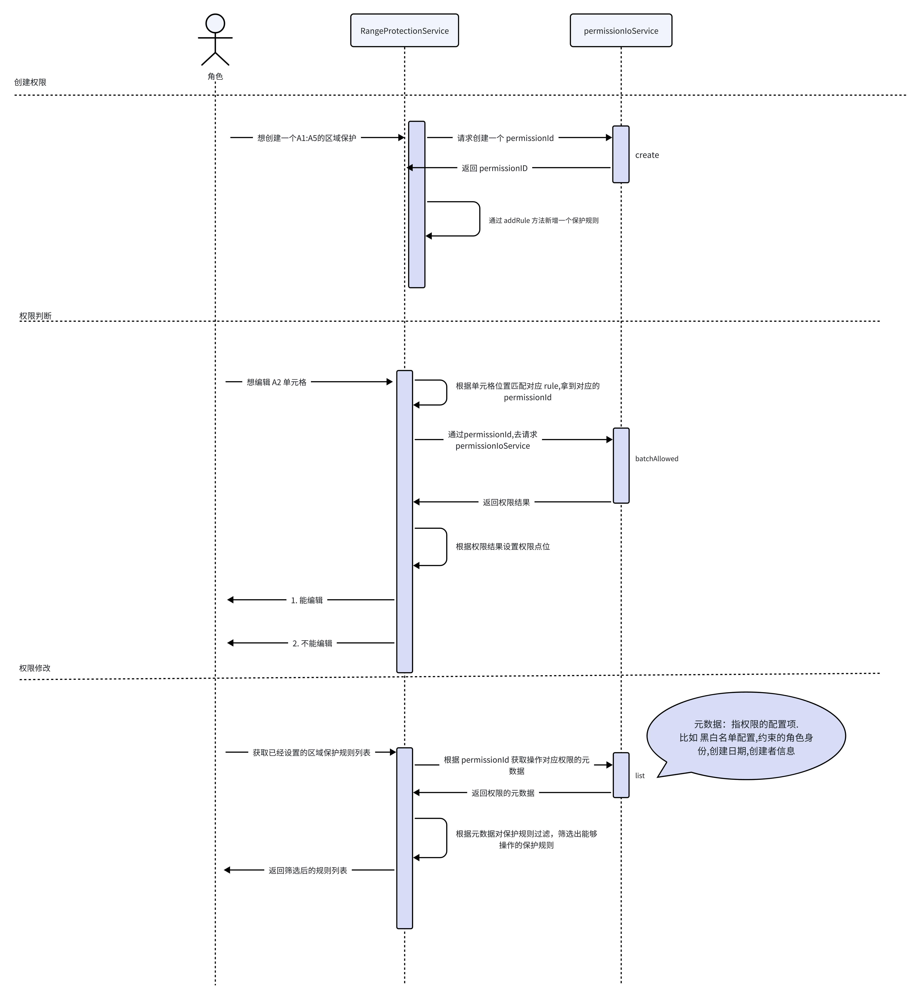

Univer 提供了权限控制的能力，通常可用于限制用户对工作簿、工作表、选区的操作。当用户进行没有权限的操作时，可终止代码执行并提示用户缺失权限。例如你可以在一片选区内设置区域保护，就可以设置其他协作者在该保护范围内是否可以使用编辑、阅读、复制、筛选等等。

**注意：Univer提供的是可拓展的基础能力，并非定制化的能力，如果有持久化或者组织架构等更丰富和更定制化的需求，需要自行实现权限规则的存储和组织架构接入，这里需要编写自定义插件来实现。**
所以会出现设置权限后去查看权限列表时权限信息为空、查看用户信息时返回为空等情况，这是因为这些信息都需要走接口请求拉取，是自定义的逻辑 需要自己额外补充，可以看下面的第三方接入。

## 基础示例

### 工作簿权限

目前工作簿的整体权限是直接通过 API 来修改权限点位，我们提供了 [Facade API](/guides/sheets/getting-started/facade)，你可以通过调用这个 API 来设置工作簿不同功能的权限。

拿编辑权限举例（其他功能只需替换权限点位即可， 具体的权限点位列举在文章最下面， 需要从 `@univerjs/sheets` 中引入），你可以通过下面的代码来设置整体工作簿不可编辑：

```typescript
import { FUniver } from '@univerjs/core/facade'

const univerAPI = FUniver.newAPI(univer)
```

然后你就可以通过调用 `univerAPI` 的方法来获取 `FPermission` 对象，从而操作具体的权限设置：

```typescript
const permission = univerAPI.getPermission()
const workbookEditablePermission = permission.permissionPointsDefinition.WorkbookEditablePermission
// unitId 是工作簿的 id, WorkbookEditablePermission 是权限点位, false 表示该权限不可使用
permission.setWorkbookPermissionPoint(unitId, workbookEditablePermission, false)
```

### 工作表权限代码示例

工作表和选区相关的权限设置可以通过 Facde API 和命令系统两种方式来实现。这里以工作表编辑权限举例，其他工作表功能只需替换权限点位即可，具体的权限点位列举在文章最下面。

<Tabs items={['使用 Facade API', '使用命令系统']}>
  <Tab>
    ```typescript
    const permission = univerAPI.getPermission()
    const worksheetEditPermission = permission.permissionPointsDefinition.WorksheetEditPermission
    // 创建工作表权限，unitId 是工作簿的 id, subUnitId 是工作表的 id，此时生成的权限是一个基础权限，它的作用是用于渲染权限区域
    const permissionId = await permission.addWorksheetBasePermission(unitId, subUnitId)

    permission.sheetRuleChangedAfterAuth$.subscribe((currentPermissionId) => {
      if (currentPermissionId === permissionId) {
        // 设置工作表为不可编辑状态
        permission.setWorksheetPermissionPoint(unitId, subUnitId, worksheetEditPermission, false)
      }
    })
    ```
  </Tab>
  <Tab>
    ```typescript
    import { ICommandService, IPermissionService, IUniverInstanceService } from '@univerjs/core'
    import { AddWorksheetProtectionMutation, getSheetCommandTarget, WorksheetEditPermission } from '@univerjs/sheets'

    const accessor = univer.__getInjector()
    const commandService = accessor.get(ICommandService)
    const univerInstanceService = accessor.get(IUniverInstanceService)

    const target = getSheetCommandTarget(univerInstanceService)
    if (!target) {
      return
    }

    const { unitId, subUnitId } = target

    commandService.executeCommand(AddWorksheetProtectionMutation.id, {
      unitId,
      subUnitId,
      rule: {
        permissionId: '2sxcza1',
        name: 'sheet',
        unitType: 2,
        unitId,
        subUnitId,
      },
    })

    const permissionService = accessor.get(IPermissionService)
    permissionService.updatePermissionPoint(new WorksheetEditPermission(unitId, subUnitId).id, false)
    ```
  </Tab>
</Tabs>

该命令中的参数：`permissionId` 需要自己生成的唯一 Id 用来存储权限，`unitType` 是工作表的类型，你可以使用仓库中的 UnitObject 枚举来替换上面的魔法数，`unitId` 是工作簿的id，`subUnitId` 是工作表的 id。

#### 删除工作表权限

<Tabs items={['使用 Facade API', '使用命令系统']}>
  <Tab>
    ```typescript
    const permission = univerAPI.getPermission()
    permission.removeWorksheetPermission(unitId, subUnitId)
    ```
  </Tab>
  <Tab>
    ```typescript
    import { DeleteWorksheetProtectionMutation } from '@univerjs/sheets' // [!code ++]

    commandService.executeCommand(DeleteWorksheetProtectionMutation.id, {
      unitId,
      subUnitId,
    })
    ```
  </Tab>
</Tabs>

### 自定义选区权限代码示例

选区的权限同样可以通过 API 和命令模式两种方式来执行，这里以选区编辑权限举例，其他选区功能只需替换权限点位即可，具体的权限点位列举在文章最下面。

<Tabs items={['使用 Facade API', '使用命令系统']}>
  <Tab>
    ```typescript
    const workbook = univerAPI.getActiveWorkbook()
    const sheet = workbook.getActiveSheet()
    const unitId = workbook.getId()
    const subUnitId = sheet.getSheetId()

    const range1 = sheet.getRange('A1:B3')
    const range2 = sheet.getRange('C4:D5')
    const ranges = [range1, range2]

    const permission = univerAPI.getPermission()
    const rangeProtectionPermissionEditPoint = permission.permissionPointsDefinition.RangeProtectionPermissionEditPoint
    const res = await permission.addRangeBaseProtection(unitId, subUnitId, ranges)
    // 这里的返回区别于工作表权限，因为一个子表中可能会有多个区域保护，所以 ruleId 是用来存储该权限规则的唯一 id，permissionId 是用来拼接权限点位的。
    const { permissionId, ruleId } = res

    permission.rangeRuleChangedAfterAuth$.subscribe((currentPermissionId) => {
      if (currentPermissionId === permissionId) {
        // 设置范围保护为不可编辑
        permission.setRangeProtectionPermissionPoint(unitId, subUnitId, permissionId, rangeProtectionPermissionEditPoint, false)
      }
    })
    ```
  </Tab>
  <Tab>
    ```typescript
    import { ICommandService, IPermissionService, IUniverInstanceService } from '@univerjs/core'
    import { AddRangeProtectionMutation, getSheetCommandTarget, RangeProtectionPermissionEditPoint } from '@univerjs/sheets'

    const accessor = univer.__getInjector()
    const commandService = accessor.get(ICommandService)
    const univerInstanceService = accessor.get(IUniverInstanceService)

    const target = getSheetCommandTarget(univerInstanceService)
    if (!target) {
      return
    }

    const { unitId, subUnitId } = target
    const ranges = [
      {
        startRow: 0,
        startColumn: 0,
        endRow: 2,
        endColumn: 1,
      },
      {
        startRow: 3,
        startColumn: 2,
        endRow: 4,
        endColumn: 3,
      },
    ]

    commandService.executeCommand(AddRangeProtectionMutation.id, {
      unitId,
      subUnitId,
      rules: [{
        permissionId: '3xtfxG1',
        name: 'sheet1',
        unitType: 3,
        unitId,
        subUnitId,
        ranges,
        id: 'rule1',
      }],
    })

    const permissionService = accessor.get(IPermissionService)
    // 这里 RangeProtectionPermissionEditPoint 的第三个参数就是上面生成的 permissionId，false 表示不可编辑
    permissionService.updatePermissionPoint(new RangeProtectionPermissionEditPoint(unitId, subUnitId, '3xtfxG1').id, false)
    ```
  </Tab>
</Tabs>

这里面的参数和上面的一样，增加了 `ranges` 参数，这个参数是你要设置权限的区域， 还有一个 `id` 参数, 这个参数是用来标识这个规则的唯一 id，用来删除这个规则。

#### 删除区域保护权限

<Tabs items={['使用 Facade API', '使用命令系统']}>
  <Tab>
    ```typescript
    const permission = univerAPI.getPermission()
    permission.removeRangeProtection(unitId, subUnitId, ruleIds)
    ```
  </Tab>
  <Tab>
    ```typescript
    import { DeleteRangeProtectionMutation } from '@univerjs/sheets' // [!code ++]

    commandService.executeCommand(DeleteRangeProtectionMutation.id, {
      unitId,
      subUnitId,
      ruleIds: ['rule1'],
    })
    ```
  </Tab>
</Tabs>

### 去除权限弹窗

```typescript
const permission = univerAPI.getPermission()
permission.setPermissionDialogVisible(false)
```

## 拓展使用

这里以`WorkbookEditablePermission`举例，在自己的插件中增加权限校验，其他点位类似

```typescript
import { IPermissionService } from '@univerjs/core'
import { WorkbookEditablePermission } from '@univerjs/sheets'

class YourService {
  constructor(@IPermissionService private _permissionService: IPermissionService) {

  }

  setWorkbookNotEditable() {
    this._permissionService.updatePermissionPoint(new WorkbookEditablePermission('unitId').id, false)
  }

  setWorkbookEditable() {
    this._permissionService.updatePermissionPoint(new WorkbookEditablePermission('unitId').id, true)
  }
}
```

你也可以拓展修改别得权限点位来实现对不同功能的权限控制，具体点位列表请参考文章底部。

### 第三方插件如何扩展权限点位

```typescript
import type { IPermissionPoint } from '@univerjs/core'
import { IPermissionService } from '@univerjs/core'

export class CustomPermissionPoint implements IPermissionPoint {
  type = UnitObject.Unkonwn // your type
  subType = UnitAction.View // your subType
  status = PermissionStatus.INIT
  value = true // 权限的初始值
  id: string
  constructor(unitId: string, subUnitId: string, customId: string) {
    // 这里自行拼凑一个 id，id 属性需要保证在整个 IPermissionService 中是唯一的凭证。
    this.id = `${unitId}.${subUnitId}.${customId}`
  }
}

class YourService {
  constructor(@IPermissionService private _permissionService: IPermissionService) {
    this._init()
  }

  _init() {
    this._permissionService.addPermissionPoint(new CustomPermissionPoint('unitId', 'subUnitId', 'my-id'))
  }
}

// 在其他地方如何使用
class ConsumeService {
  constructor(@IPermissionService private _permissionService: IPermissionService) {
  }

  doSomething() {
    const point = this._permissionService.getPermissionPoint(new CustomPermissionPoint('unitId', 'subUnitId', 'my-id').id)
    console.log(point.value)
  }

  bindEvent() {
    // 这将获得一个 Rx 对象，使得你能够监听当前权限的变化作出一些改变
    const pount$ = this._permissionService.getPermissionPoint$(new CustomPermissionPoint('unitId', 'subUnitId', 'my-id').id)
    console.log(pount$)
  }
}
```

### 第三方权限服务接入(进阶用法)

<Callout type="warning" emoji="注意事项">
  已经开始接入自定义权限，可以直接操作更细粒度的权限点位，建议不要和 Permission Facade API 混用。
</Callout>

权限的判断逻辑通常是由一个外置服务来单独处理，这部分一般会带有一个通信流程，在纯前端 sdk 实现中，我们使用 [AuthzIoLocalService](https://github.com/dream-num/univer/blob/dev/packages/core/src/services/authz-io/authz-io-local.service.ts) 来承载这部分逻辑。

在生产环境中，我们需要将这部分实现转由后端实现，前端需要基于 [IAuthzIoService](https://github.com/dream-num/univer/blob/dev/packages/core/src/services/authz-io/type.ts) 类型实现对应的请求函数，来进行运行时的替换。



下面是一个简单的示例用来展示预设 2 个角色( 所有者/阅读者) 情况下区域保护权限点位的增删.
所有者拥有保护区域的编辑/查看权限,而阅读者不能编辑也不能查看保护区域内单元格的内容.

```typescript
import type { Injector } from '@univerjs/core'
import type { IActionInfo, IAllowedRequest, IBatchAllowedResponse, ICollaborator, ICreateRequest, ICreateRequest_SelectRangeObject, IListPermPointRequest, IPermissionPoint, IPutCollaboratorsRequest, IUnitRoleKV, IUpdatePermPointRequest } from '@univerjs/protocol'
import { createDefaultUser, generateRandomId, IAuthzIoService, Inject, IResourceManagerService, isDevRole, Univer, UserManagerService } from '@univerjs/core'
import { ObjectScope, UnitAction, UnitObject, UnitRole, UniverType } from '@univerjs/protocol'

class YourAuthzService implements IAuthzIoService {
  private _permissionMap: Map<string, ICreateRequest_SelectRangeObject & { objectType: UnitObject }> = new Map([])

  constructor(
    @IResourceManagerService private _resourceManagerService: IResourceManagerService,
    @Inject(UserManagerService) private _userManagerService: UserManagerService,
  ) {
    this._initSnapshot()
    this._initDefaultUser()
  }

  private _initDefaultUser() {
    const currentUser = this._userManagerService.getCurrentUser()
    const currentUserIsValid = currentUser && currentUser.userID
    if (!currentUserIsValid) {
      this._userManagerService.setCurrentUser(createDefaultUser(UnitRole.Owner))
    }
  }

  private _getRole(type: UnitRole) {
    const user = this._userManagerService.getCurrentUser()
    if (!user) {
      return false
    }
    return isDevRole(user.userID, type)
  }

  private _initSnapshot() {
    this._resourceManagerService.registerPluginResource({
      toJson: (_unitId: string) => {
        const obj = [...this._permissionMap.keys()].reduce((r, k) => {
          const v = this._permissionMap.get(k)
          r[k] = v!
          return r
        }, {} as Record<string, ICreateRequest_SelectRangeObject & { objectType: UnitObject }>)
        return JSON.stringify(obj)
      },
      parseJson: (json: string) => {
        return JSON.parse(json)
      },
      pluginName: 'SHEET_AuthzIoMockService_PLUGIN',
      businesses: [UniverType.UNIVER_SHEET, UniverType.UNIVER_DOC, UniverType.UNIVER_SLIDE],
      onLoad: (_unitId, resource) => {
        for (const key in resource) {
          this._permissionMap.set(key, resource[key])
        }
      },
      onUnLoad: () => {
        this._permissionMap.clear()
      },
    })
  }

  async create(config: ICreateRequest): Promise<string> {
    const permissionId = generateRandomId(8)
    if (config.objectType === UnitObject.SelectRange && config.selectRangeObject) {
      this._permissionMap.set(permissionId, { ...config.selectRangeObject, objectType: config.objectType })
    }
    return permissionId
  }

  async batchAllowed(config: IAllowedRequest[]): Promise<IBatchAllowedResponse['objectActions']> {
    const selectionRangeConfig = config.filter(c => c.objectType === UnitObject.SelectRange)
    if (selectionRangeConfig.length) {
      const currentUser = this._userManagerService.getCurrentUser()
      const res = [] as IBatchAllowedResponse['objectActions']
      selectionRangeConfig.forEach((c) => {
        res.push({
          unitID: c.unitID,
          objectID: c.objectID,
          actions: c.actions.map((action) => {
            if (isDevRole(currentUser.userID, UnitRole.Owner)) {
              return { action, allowed: true }
            }
            return { action, allowed: false }
          }),
        })
      })
      return res
    }
    return Promise.resolve([])
  }

  async list(config: IListPermPointRequest): Promise<IPermissionPoint[]> {
    const result: IPermissionPoint[] = []
    config.objectIDs.forEach((objectID) => {
      const rule = this._permissionMap.get(objectID)
      if (rule) {
        const item = {
          objectID,
          unitID: config.unitID,
          objectType: rule!.objectType,
          name: rule!.name,
          shareOn: false,
          shareRole: UnitRole.Owner,
          shareScope: -1,
          scope: {
            read: ObjectScope.AllCollaborator,
            edit: ObjectScope.AllCollaborator,
          },
          creator: createDefaultUser(UnitRole.Owner),
          strategies: [
            {
              action: UnitAction.View,
              role: UnitRole.Owner,
            },
            {
              action: UnitAction.Edit,
              role: UnitRole.Owner,
            },
          ],
          actions: config.actions.map((a) => {
            return { action: a, allowed: this._getRole(UnitRole.Owner) }
          }),
        }
        result.push(item)
      }
    })
    return result
  }

  async listCollaborators(): Promise<ICollaborator[]> {
    // List the existing collaborators
    return []
  }

  async allowed(_config: IAllowedRequest): Promise<IActionInfo[]> {
    // Because this is a mockService for handling permissions, we will not write real logic in it. We will only return an empty array to ensure that the permissions originally set by the user are not modified.
    // If you want to achieve persistence of permissions, you can modify the logic here.
    return Promise.resolve([])
  }

  async listRoles(): Promise<{ roles: IUnitRoleKV[], actions: UnitAction[] }> {
    return {
      roles: [],
      actions: [],
    }
  }

  async update(config: IUpdatePermPointRequest): Promise<void> {
    // Update bit information
  }

  async updateCollaborator(): Promise<void> {
    // Update collaborator information
    return undefined
  }

  async createCollaborator(): Promise<void> {
    // Create new collaborator information
    return undefined
  }

  async deleteCollaborator(): Promise<void> {
    return undefined
  }

  async putCollaborators(config: IPutCollaboratorsRequest): Promise<void> {
    return undefined
  }
}

export class YourPlugin extends Plugin {
  override onStarting(injector: Injector): void {
    injector.add([IAuthzIoService, { useClass: YouAuthzService }])
  }
}

// 通过将 override 选项设置为 [[IAuthzIoService, null]]，可以告诉 Univer 不要注册内置的 IAuthzIoService。
// 这样，Univer 将使用你在 YourAuthzService 中提供的服务作为权限服务的实现。
const univer = new Univer({
  override: [[IAuthzIoService, null]],
})

univer.registerPlugin(YourPlugin)
```

## 权限点位列表

不同的功能权限是由不同的权限点位来控制的，修改该点位的值可以控制对应功能的权限。下面是一些常用的权限点位，具体的点位代码，请参阅[这里](https://github.com/dream-num/univer/tree/dev/packages/sheets/src/services/permission/permission-point)。

如果 `workbook` 的权限控制和 `worksheet` / `range` 有交叉，那么必须全部为 `true` 才能使用。例如一个单元格的编辑权限必须 `workbook` 和 `worksheet` 的编辑权限都为 `true` 才能编辑。

### Workbook 工作簿

| Permission | Description |
| --- | --- |
| WorkbookEditablePermission | 能否编辑 |
| WorkbookPrintPermission | 能否打印 |
| WorkbookCommentPermission | 能否评论 |
| WorkbookViewPermission | 能否查看 |
| WorkbookCopyPermission | 能否复制 |
| WorkbookExportPermission | 能否导出 |
| WorkbookManageCollaboratorPermission | 能否管理协作者 |
| WorkbookCreateSheetPermission | 能否创建工作表 |
| WorkbookDeleteSheetPermission | 能否删除工作表 |
| WorkbookRenameSheetPermission | 能否重命名工作表 |
| WorkbookHideSheetPermission | 能否隐藏工作表 |
| WorkbookDuplicateSheetPermission | 能否复制工作表 |
| WorkbookSharePermission | 能否分享 |
| WorkbookMoveSheetPermission | 能否移动工作表 |
| WorksheetViewHistoryPermission | 能否查看历史记录 |
| WorksheetRecoverHistoryPermission | 能否恢复历史记录 |

### Worksheet 工作表

| Permission | Description |
| --- | --- |
| WorksheetCopyPermission | 能否复制 |
| WorksheetDeleteColumnPermission | 能否删除列 |
| WorksheetDeleteRowPermission | 能否删除行 |
| WorksheetFilterPermission | 能否过滤 |
| WorksheetInsertColumnPermission | 能否插入列 |
| WorksheetInsertHyperlinkPermission | 能否使用超链接 |
| WorksheetInsertRowPermission | 能否插入行 |
| WorksheetPivotTablePermission | 能否使用透视表 |
| WorksheetSetCellStylePermission | 能否编辑单元格样式 |
| WorksheetSetCellValuePermission | 能否编辑单元格值 |
| WorksheetSetColumnStylePermission | 能否设置列样式 |
| WorksheetSetRowStylePermission | 能否设置行样式 |
| WorksheetSortPermission | 能否排序 |
| WorksheetViewPermission | 能否查看 |
| WorksheetEditPermission | 能否编辑 |

### Range 区域保护

| Permission | Description |
| --- | --- |
| RangeProtectionPermissionViewPoint | 能否查看保护区域的内容 |
| RangeProtectionPermissionEditPoint | 能否编辑保护区域 |

## 自定义权限 UI

### 隐藏权限背景阴影

权限相关的 UI 代码是写在 `@univerjs/sheets-ui` 插件中，我们提供了配置项来隐藏权限背景阴影，你可以通过下面的代码来隐藏权限背景阴影：

```typescript
// 在 customComponents 中添加 UNIVER_SHEET_PERMISSION_BACKGROUND，代表自定义权限背景阴影，自定义的背景组件可以自己去注册，不注册即为隐藏
import { UNIVER_SHEET_PERMISSION_BACKGROUND } from '@univerjs/sheets-ui'

univer.registerPlugin(UniverSheetsUIPlugin, { customComponents: new Set([UNIVER_SHEET_PERMISSION_BACKGROUND]) })
```

### 自定义用户组件

同隐藏权限背景阴影的方式基本一致，按照如下代码即可隐藏默认提供的的的用户组件部分。

```typescript
// 在 customComponents 中添加 UNIVER_SHEET_PERMISSION_BACKGROUND，代表自定义权限背景阴影，自定义的背景组件可以自己去注册，不注册即为隐藏
import { UNIVER_SHEET_PERMISSION_USER_PART } from '@univerjs/sheets-ui'

univer.registerPlugin(UniverSheetsUIPlugin, { customComponents: new Set([UNIVER_SHEET_PERMISSION_USER_PART]) })
```

隐藏之后需要自己写对应的插件代码去注册自定义的组件，具体的注册核心逻辑如下

```typescript
import { connectInjector } from '@univerjs/core'
// injector实例可以通过依赖注入去拿到
const uiPartsService = injector.get(IUIPartsService)
// 将这里的 `PermissionDetailUserPart` 替换为自定义的组件，自定义组件需要接受的props定义请参考 https://github.com/dream-num/univer/blob/b4d4cfa063c9e6d5a82d1fc6b05edc206a415252/packages/sheets-ui/src/views/permission/panel-detail/PermissionDetailUserPart.tsx#L30
uiPartsService.registerComponent(UNIVER_SHEET_PERMISSION_USER_PART, () => connectInjector(PermissionDetailUserPart, injector))
```

**注意：在自定义组件中，完成自定义人员的设置后，请将其同步到 `sheetPermissionUserManagerService` 服务中的 `_selectUserList`，以便后续使用。**

```typescript
import { useDependency } from '@univerjs/ui'

const sheetPermissionUserManagerService = useDependency(SheetPermissionUserManagerService)
// 具体的数据结构请参考 https://github.com/dream-num/univer/blob/b4d4cfa063c9e6d5a82d1fc6b05edc206a415252/packages/sheets-ui/src/services/permission/sheet-permission-user-list.service.ts#L57
sheetPermissionUserManagerService.setSelectUserList([])
```
