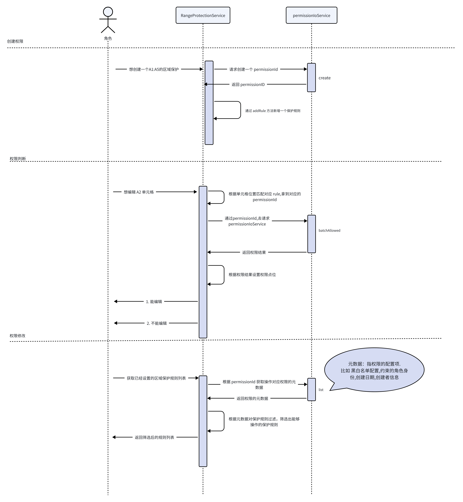

import { MigrationCell, MigrationRow, MigrationTable } from './components/migration-table'

Univer 提供权限控制能力，用于限制用户对工作簿、工作表、选区的操作。当用户执行无权限动作时，Univer 会中止执行并提示缺失权限。常见场景如：对一片选区设置保护，限制协作者的编辑/查看/复制等能力。

<Callout type="warning" title="使用前须知">
  Univer 提供的是可扩展的基础能力，而不是完整的权限系统。
  如果你需要权限持久化、组织架构、用户信息等定制能力，需要自行实现权限规则存储与组织架构接入，通常通过自定义插件来完成。
  因此出现“权限列表为空”或“用户信息为空”的情况是正常的：这些信息需要由你的接口返回。可参考下方的“第三方权限服务接入”。
</Callout>

<PlaygroundFrame lang="zh-CN" slug="sheets/permission" clickToShow />

## 核心概念

- 作用范围：权限可以作用在工作簿、工作表、选区三个层级。
- 权限点位：每个功能对应一个权限点位，修改点位即可控制功能是否可用。
- 保护规则：工作表和选区在设置权限点位前，需要先创建保护规则。

<Callout type="info" title="权限点位说明">
  本地非持久化（非协同编辑环境）权限控制可直接通过修改权限点位实现，持久化权限请参考下方的“第三方权限服务接入”。
  协同编辑场景下，更新权限点位会同步更新服务端状态：
  - false：该权限点至少需要 `owner` 角色
  - true：该权限点至少需要 `reader` 角色
</Callout>

## 基础示例

下面按工作簿、工作表、选区三个层级展示最常见的权限设置方式。

### 工作簿权限代码示例

工作簿层级权限通过 [Facade API](/guides/sheets/getting-started/facade) 直接修改权限点位即可。

以编辑权限为例（其他功能只需替换权限点位，参考[权限点位列表 - 工作簿](#workbook-point)）：

```typescript
const fWorkbook = univerAPI.getActiveWorkbook()
const workbookPermission = fWorkbook.getWorkbookPermission()

// 设置工作簿不可编辑
await workbookPermission.setPoint(univerAPI.Enum.WorkbookPermissionPoint.Edit, false)
```

要点：
- 工作簿权限点位可以直接设置，不需要创建保护规则。

### 工作表权限代码示例

工作表和选区相关的权限设置可以通过 Facade API 或命令系统实现。这里以工作表编辑权限举例，其他功能只需替换权限点位，参考[权限点位列表 - 工作表](#worksheet-point)。

```typescript
const fWorkbook = univerAPI.getActiveWorkbook()
const fWorksheet = fWorkbook.getActiveSheet()
const worksheetPermission = fWorksheet.getWorksheetPermission()

// 创建工作表保护, 允许指定用户编辑
const permissionId = await worksheetPermission.protect({
  allowedUsers: ['user1', 'user2'],
  name: 'My Worksheet Protection',
})

// 如果需要设置权限点位，必须先创建工作表保护
await worksheetPermission.setPoint(univerAPI.Enum.WorksheetPermissionPoint.Edit, false)
```

#### 删除工作表权限

```typescript
const fWorkbook = univerAPI.getActiveWorkbook()
const fWorksheet = fWorkbook.getActiveSheet()
const worksheetPermission = fWorksheet.getWorksheetPermission()

// 删除工作表保护
await worksheetPermission.unprotect()
```

### 自定义选区权限代码示例

选区的权限同样支持 API 和命令模式。这里以选区编辑权限举例，其他选区功能只需替换权限点位，参考[权限点位列表 - 选区](#range-point)。

```typescript
const fWorkbook = univerAPI.getActiveWorkbook()
const fWorksheet = fWorkbook.getActiveSheet()
const fRange = fWorksheet.getRange('A1:B2')
const rangePermission = fRange.getRangePermission()

// 设置区域保护权限，允许指定用户编辑但不允许他人查看
const rule = await rangePermission.protect({
  name: 'My protected range',
  allowViewByOthers: false,
  allowedUsers: ['user1', 'user2'],
})
console.log(rule)

// 如果需要设置权限点位，必须先创建区域保护。
await rule.setPoint(univerAPI.Enum.RangePermissionPoint.Edit, false)
await rule.setPoint(univerAPI.Enum.RangePermissionPoint.View, true)
```

#### 删除区域保护权限

```typescript
const fWorkbook = univerAPI.getActiveWorkbook()
const fWorksheet = fWorkbook.getActiveSheet()
const fRange = fWorksheet.getRange('A1:B2')
const rangePermission = fRange.getRangePermission()

// 删除范围内所有保护规则
await rangePermission.unprotect()

// 或者删除范围内指定规则
const rules = await rangePermission.listRules()
if (rules.length > 0) {
  await rules[0].remove()
}
```

## 拓展使用

当你需要在自己的插件中增加权限校验时，可以直接操作权限点位。

下面以 `WorkbookEditablePermission` 为例，其他点位类似：

```typescript
import { IPermissionService } from '@univerjs/core'
import { WorkbookEditablePermission } from '@univerjs/sheets'

class YourService {
  constructor(@IPermissionService private _permissionService: IPermissionService) {
  }

  setWorkbookNotEditable() {
    this._permissionService.updatePermissionPoint(new WorkbookEditablePermission('unitId').id, false)
  }

  setWorkbookEditable() {
    this._permissionService.updatePermissionPoint(new WorkbookEditablePermission('unitId').id, true)
  }
}
```

你也可以扩展修改别的权限点位来实现对不同功能的控制，具体点位列表请参考文章底部。

### 第三方插件如何扩展权限点位

如果你需要自定义权限点位，可以实现 `IPermissionPoint` 并注册到权限服务中：

```typescript
import type { IPermissionPoint } from '@univerjs/core'
import { IPermissionService, PermissionStatus } from '@univerjs/core'
import { UnitAction, UnitObject } from '@univerjs/protocol'

export class CustomPermissionPoint implements IPermissionPoint {
  type = UnitObject.Unkonwn // your type
  subType = UnitAction.View // your subType
  status = PermissionStatus.INIT
  value = true // 权限的初始值
  id: string
  constructor(unitId: string, subUnitId: string, customId: string) {
    // 这里自行拼凑一个 id，id 属性需要保证在整个 IPermissionService 中是唯一的凭证。
    this.id = `${unitId}.${subUnitId}.${customId}`
  }
}

class YourService {
  constructor(@IPermissionService private _permissionService: IPermissionService) {
    this._init()
  }

  _init() {
    this._permissionService.addPermissionPoint(new CustomPermissionPoint('unitId', 'subUnitId', 'my-id'))
  }
}

// 在其他地方如何使用
class ConsumeService {
  constructor(@IPermissionService private _permissionService: IPermissionService) {
  }

  doSomething() {
    const point = this._permissionService.getPermissionPoint(new CustomPermissionPoint('unitId', 'subUnitId', 'my-id').id)
    console.log(point.value)
  }

  bindEvent() {
    // 这将获得一个 Rx 对象，使得你能够监听当前权限的变化作出一些改变
    const point$ = this._permissionService.getPermissionPoint$(new CustomPermissionPoint('unitId', 'subUnitId', 'my-id').id)
    console.log(point$)
  }
}
```

### 第三方权限服务接入(进阶用法)

<Callout type="warning" title="注意事项">
  已经开始接入自定义权限，可以直接操作更细粒度的权限点位，建议不要和 Permission Facade API 混用。
</Callout>

权限的判断逻辑通常由外置服务处理，这部分一般会带有一个通信流程。在纯前端 SDK 实现中，我们使用 [AuthzIoLocalService](https://github.com/dream-num/univer/blob/dev/packages/core/src/services/authz-io/authz-io-local.service.ts) 来承载这部分逻辑。

在生产环境中，我们需要将这部分实现转由后端实现，前端需要基于 [IAuthzIoService](https://github.com/dream-num/univer/blob/dev/packages/core/src/services/authz-io/type.ts) 类型实现对应的请求函数，以便在运行时替换。



下面是一个简单示例：预设 2 个角色（所有者/阅读者）情况下区域保护权限点位的增删。所有者拥有保护区域的编辑/查看权限，而阅读者不能编辑也不能查看保护区域内单元格的内容。

```typescript
import type { Injector } from '@univerjs/core'
import type { IActionInfo, IAllowedRequest, IBatchAllowedResponse, ICollaborator, ICreateRequest, ICreateRequest_SelectRangeObject, IListPermPointRequest, IPermissionPoint, IPutCollaboratorsRequest, IUnitRoleKV, IUpdatePermPointRequest } from '@univerjs/protocol'
import { createDefaultUser, generateRandomId, IAuthzIoService, Inject, IResourceManagerService, isDevRole, Univer, UserManagerService } from '@univerjs/core'
import { ObjectScope, UnitAction, UnitObject, UnitRole, UniverType } from '@univerjs/protocol'

class YourAuthzService implements IAuthzIoService {
  private _permissionMap: Map<string, ICreateRequest_SelectRangeObject & { objectType: UnitObject }> = new Map([])

  constructor(
    @IResourceManagerService private _resourceManagerService: IResourceManagerService,
    @Inject(UserManagerService) private _userManagerService: UserManagerService,
  ) {
    this._initSnapshot()
    this._initDefaultUser()
  }

  private _initDefaultUser() {
    const currentUser = this._userManagerService.getCurrentUser()
    const currentUserIsValid = currentUser && currentUser.userID
    if (!currentUserIsValid) {
      this._userManagerService.setCurrentUser(createDefaultUser(UnitRole.Owner))
    }
  }

  private _getRole(type: UnitRole) {
    const user = this._userManagerService.getCurrentUser()
    if (!user) {
      return false
    }
    return isDevRole(user.userID, type)
  }

  private _initSnapshot() {
    this._resourceManagerService.registerPluginResource({
      toJson: (_unitId: string) => {
        const obj = [...this._permissionMap.keys()].reduce((r, k) => {
          const v = this._permissionMap.get(k)
          r[k] = v!
          return r
        }, {} as Record<string, ICreateRequest_SelectRangeObject & { objectType: UnitObject }>)
        return JSON.stringify(obj)
      },
      parseJson: (json: string) => {
        return JSON.parse(json)
      },
      pluginName: 'SHEET_AuthzIoMockService_PLUGIN',
      businesses: [UniverType.UNIVER_SHEET, UniverType.UNIVER_DOC, UniverType.UNIVER_SLIDE],
      onLoad: (_unitId, resource) => {
        for (const key in resource) {
          this._permissionMap.set(key, resource[key])
        }
      },
      onUnLoad: () => {
        this._permissionMap.clear()
      },
    })
  }

  async create(config: ICreateRequest): Promise<string> {
    const permissionId = generateRandomId(8)
    if (config.objectType === UnitObject.SelectRange && config.selectRangeObject) {
      this._permissionMap.set(permissionId, { ...config.selectRangeObject, objectType: config.objectType })
    }
    return permissionId
  }

  async batchAllowed(config: IAllowedRequest[]): Promise<IBatchAllowedResponse['objectActions']> {
    const selectionRangeConfig = config.filter(c => c.objectType === UnitObject.SelectRange)
    if (selectionRangeConfig.length) {
      const currentUser = this._userManagerService.getCurrentUser()
      const res = [] as IBatchAllowedResponse['objectActions']
      selectionRangeConfig.forEach((c) => {
        res.push({
          unitID: c.unitID,
          objectID: c.objectID,
          actions: c.actions.map((action) => {
            if (isDevRole(currentUser.userID, UnitRole.Owner)) {
              return { action, allowed: true }
            }
            return { action, allowed: false }
          }),
        })
      })
      return res
    }
    return Promise.resolve([])
  }

  async list(config: IListPermPointRequest): Promise<IPermissionPoint[]> {
    const result: IPermissionPoint[] = []
    config.objectIDs.forEach((objectID) => {
      const rule = this._permissionMap.get(objectID)
      if (rule) {
        const item = {
          objectID,
          unitID: config.unitID,
          objectType: rule!.objectType,
          name: rule!.name,
          shareOn: false,
          shareRole: UnitRole.Owner,
          shareScope: -1,
          scope: {
            read: ObjectScope.AllCollaborator,
            edit: ObjectScope.AllCollaborator,
          },
          creator: createDefaultUser(UnitRole.Owner),
          strategies: [
            {
              action: UnitAction.View,
              role: UnitRole.Owner,
            },
            {
              action: UnitAction.Edit,
              role: UnitRole.Owner,
            },
          ],
          actions: config.actions.map((a) => {
            return { action: a, allowed: this._getRole(UnitRole.Owner) }
          }),
        }
        result.push(item)
      }
    })
    return result
  }

  async listCollaborators(): Promise<ICollaborator[]> {
    // List the existing collaborators
    return []
  }

  async allowed(_config: IAllowedRequest): Promise<IActionInfo[]> {
    // Because this is a mockService for handling permissions, we will not write real logic in it. We will only return an empty array to ensure that the permissions originally set by the user are not modified.
    // If you want to achieve persistence of permissions, you can modify the logic here.
    return Promise.resolve([])
  }

  async listRoles(): Promise<{ roles: IUnitRoleKV[], actions: UnitAction[] }> {
    return {
      roles: [],
      actions: [],
    }
  }

  async update(config: IUpdatePermPointRequest): Promise<void> {
    // Update bit information
  }

  async updateCollaborator(): Promise<void> {
    // Update collaborator information
    return undefined
  }

  async createCollaborator(): Promise<void> {
    // Create new collaborator information
    return undefined
  }

  async deleteCollaborator(): Promise<void> {
    return undefined
  }

  async putCollaborators(config: IPutCollaboratorsRequest): Promise<void> {
    return undefined
  }
}

export class YourPlugin extends Plugin {
  constructor(
    _config: unknown,
    @Inject(Injector) protected override _injector: Injector,
  ) {
  }

  override onStarting(): void {
    this._injector.add([IAuthzIoService, { useClass: YourAuthzService }])
  }
}

// 通过将 override 选项设置为 [[IAuthzIoService, null]]，可以告诉 Univer 不要注册内置的 IAuthzIoService。
// 这样，Univer 将使用你在 YourAuthzService 中提供的服务作为权限服务的实现。
const univer = new Univer({
  override: [[IAuthzIoService, null]],
})

univer.registerPlugin(YourPlugin)
```

## 权限点位列表 [#point-list]

不同的功能权限由不同的权限点位控制，修改点位的值即可控制对应功能。具体点位代码请参阅[这里](https://github.com/dream-num/univer/tree/dev/packages/sheets/src/services/permission/permission-point)。

如果 `workbook` 的权限控制和 `worksheet` / `range` 有交叉，那么必须全部为 `true` 才能使用。例如一个单元格的编辑权限必须 `workbook` 和 `worksheet` 的编辑权限都为 `true` 才能编辑。

### 工作簿 [#workbook-point]

| API 枚举 | 对应权限点位类 | 描述 |
| --- | --- | --- |
| univerAPI.Enum.WorkbookPermissionPoint.Edit | WorkbookEditablePermission | 能否编辑 |
| univerAPI.Enum.WorkbookPermissionPoint.View | WorkbookViewPermission | 能否查看 |
| univerAPI.Enum.WorkbookPermissionPoint.Print | WorkbookPrintPermission | 能否打印 |
| univerAPI.Enum.WorkbookPermissionPoint.Export | WorkbookExportPermission | 能否导出 |
| univerAPI.Enum.WorkbookPermissionPoint.Share | WorkbookSharePermission | 能否分享 |
| univerAPI.Enum.WorkbookPermissionPoint.CopyContent | WorkbookCopyPermission | 能否复制 |
| univerAPI.Enum.WorkbookPermissionPoint.DuplicateFile | WorkbookDuplicatePermission | 能否复制文档 |
| univerAPI.Enum.WorkbookPermissionPoint.Comment | WorkbookCommentPermission | 能否评论 |
| univerAPI.Enum.WorkbookPermissionPoint.ManageCollaborator | WorkbookManageCollaboratorPermission | 能否管理协作者 |
| univerAPI.Enum.WorkbookPermissionPoint.CreateSheet | WorkbookCreateSheetPermission | 能否创建工作表 |
| univerAPI.Enum.WorkbookPermissionPoint.DeleteSheet | WorkbookDeleteSheetPermission | 能否删除工作表 |
| univerAPI.Enum.WorkbookPermissionPoint.RenameSheet | WorkbookRenameSheetPermission | 能否重命名工作表 |
| univerAPI.Enum.WorkbookPermissionPoint.MoveSheet | WorkbookMoveSheetPermission | 能否移动工作表 |
| univerAPI.Enum.WorkbookPermissionPoint.HideSheet | WorkbookHideSheetPermission | 能否隐藏工作表 |
| univerAPI.Enum.WorkbookPermissionPoint.CopySheet | WorkbookCopySheetPermission | 能否复制工作表 |
| univerAPI.Enum.WorkbookPermissionPoint.ViewHistory | WorkbookViewHistoryPermission | 能否查看历史记录 |
| univerAPI.Enum.WorkbookPermissionPoint.RecoverHistory | WorkbookRecoverHistoryPermission | 能否恢复历史记录 |
| univerAPI.Enum.WorkbookPermissionPoint.CreateProtection | WorkbookCreateProtectPermission | 能否创建保护 |
| univerAPI.Enum.WorkbookPermissionPoint.InsertRow | WorkbookInsertRowPermission | 能否插入行 |
| univerAPI.Enum.WorkbookPermissionPoint.InsertColumn | WorkbookInsertColumnPermission | 能否插入列 |
| univerAPI.Enum.WorkbookPermissionPoint.DeleteRow | WorkbookDeleteRowPermission | 能否删除行 |
| univerAPI.Enum.WorkbookPermissionPoint.DeleteColumn | WorkbookDeleteColumnPermission | 能否删除列 |

### 工作表 [#worksheet-point]

| API 枚举 | 对应权限点位类 | 描述 |
| --- | --- | --- |
| univerAPI.Enum.WorksheetPermissionPoint.Edit | WorksheetEditPermission | 能否编辑 |
| univerAPI.Enum.WorksheetPermissionPoint.View | WorksheetViewPermission | 能否查看 |
| univerAPI.Enum.WorksheetPermissionPoint.Copy | WorksheetCopyPermission | 能否复制 |
| univerAPI.Enum.WorksheetPermissionPoint.SetCellValue | WorksheetSetCellValuePermission | 能否编辑单元格值 |
| univerAPI.Enum.WorksheetPermissionPoint.SetCellStyle | WorksheetSetCellStylePermission | 能否编辑单元格样式 |
| univerAPI.Enum.WorksheetPermissionPoint.SetRowStyle | WorksheetSetRowStylePermission | 能否设置行样式 |
| univerAPI.Enum.WorksheetPermissionPoint.SetColumnStyle | WorksheetSetColumnStylePermission | 能否设置列样式 |
| univerAPI.Enum.WorksheetPermissionPoint.InsertRow | WorksheetInsertRowPermission | 能否插入行 |
| univerAPI.Enum.WorksheetPermissionPoint.InsertColumn | WorksheetInsertColumnPermission | 能否插入列 |
| univerAPI.Enum.WorksheetPermissionPoint.DeleteRow | WorksheetDeleteRowPermission | 能否删除行 |
| univerAPI.Enum.WorksheetPermissionPoint.DeleteColumn | WorksheetDeleteColumnPermission | 能否删除列 |
| univerAPI.Enum.WorksheetPermissionPoint.Sort | WorksheetSortPermission | 能否排序 |
| univerAPI.Enum.WorksheetPermissionPoint.Filter | WorksheetFilterPermission | 能否筛选 |
| univerAPI.Enum.WorksheetPermissionPoint.PivotTable | WorksheetPivotTablePermission | 能否使用透视表 |
| univerAPI.Enum.WorksheetPermissionPoint.InsertHyperlink | WorksheetInsertHyperlinkPermission | 能否使用超链接 |
| univerAPI.Enum.WorksheetPermissionPoint.ManageCollaborator | WorksheetManageCollaboratorPermission | 能否管理协作者 |
| univerAPI.Enum.WorksheetPermissionPoint.DeleteProtection | WorksheetDeleteProtectionPermission | 能否删除保护 |

### 区域保护 [#range-point]

| API 枚举 | 对应权限点位类 | 描述 |
| --- | --- | --- |
| univerAPI.Enum.RangePermissionPoint.Edit | RangeProtectionPermissionEditPoint | 能否编辑保护区域 |
| univerAPI.Enum.RangePermissionPoint.View | RangeProtectionPermissionViewPoint | 能否查看保护区域的内容 |
| univerAPI.Enum.RangePermissionPoint.Delete | RangeProtectionPermissionDeleteProtectionPoint | 能否删除保护区域 |

## 配置

### 权限保护范围阴影策略

权限阴影默认展示，可以通过以下方式进行隐藏：

<Tabs items={['预设模式', '插件模式']}>
  <Tab>
    ```typescript
    createUniver({
      presets: [
        UniverSheetsCorePreset({
          sheets: {
            /**
             * 权限保护范围阴影显示策略。
             * - true 或 'always'：显示所有受保护范围的阴影（默认行为）
             * - 'non-editable'：仅显示无法编辑的范围的阴影（编辑权限为 false）
             * - 'non-viewable'：仅显示无法查看的范围的阴影（查看权限为 false）
             * - false 或 'none'：从不显示受保护范围的阴影
             * @default true
             */
            protectedRangeShadow: false,
          },
        }),
      ],
    })
    ```
  </Tab>
  <Tab>
    ```typescript
    univer.registerPlugin(UniverSheetsUIPlugin, {
      /**
       * 权限保护范围阴影显示策略。
       * - true 或 'always'：显示所有受保护范围的阴影（默认行为）
       * - 'non-editable'：仅显示无法编辑的范围的阴影（编辑权限为 false）
       * - 'non-viewable'：仅显示无法查看的范围的阴影（查看权限为 false）
       * - false 或 'none'：从不显示受保护范围的阴影
       * @default true
       */
      protectedRangeShadow: false,
    })
    ```
  </Tab>
</Tabs>

也可以通过 API 动态修改：

```typescript
// 设置只显示不可编辑范围的阴影
univerAPI.setProtectedRangeShadowStrategy('non-editable')

// 获取当前的权限保护范围阴影显示策略
console.log(univerAPI.getProtectedRangeShadowStrategy())

// 监听权限保护范围阴影显示策略的变化
const subscription = univerAPI.getProtectedRangeShadowStrategy$().subscribe((strategy) => {
  console.log('Global strategy changed to:', strategy)
  // 更新 UI 或执行其他操作
})

// 稍后，取消订阅以进行清理
subscription.unsubscribe()
```

### 自定义用户组件

Univer 内置的自定义用户组件所适配的场景比较有限，如果需要更复杂的自定义组件，可以通过以下方式进行自定义。

<Callout>
  可在[《自定义组件》](/guides/sheets/ui/components)查看如何自定义组件。
</Callout>

<Tabs items={['预设模式', '插件模式']}>
  <Tab>
    ```typescript
    const { univer } = createUniver({
      presets: [
        UniverSheetsCorePreset({
          sheets: {
            protectedRangeUserSelector: {
            /**
             * custom component, should implement the `IPermissionDetailUserPartProps` interface.
             */
              component: CustomPermissionDetailUserPart,
              /**
               * The framework of the component. Must be passed correctly.
               */
              framework: 'react',
            },
          },
        }),
      ],
    })
    ```
  </Tab>
  <Tab>
    ```typescript
    univer.registerPlugin(UniverSheetsUIPlugin, {
      protectedRangeUserSelector: {
        /**
         * custom component, should implement the `IPermissionDetailUserPartProps` interface.
         */
        component: CustomPermissionDetailUserPart,
        /**
         * The framework of the component. Must be passed correctly.
         */
        framework: 'react',
      },
    })
    ```
  </Tab>
</Tabs>

完成自定义人员的设置后，请将其同步到 `sheetPermissionUserManagerService` 服务中的 `_selectUserList`，以便后续使用。

<Tabs items={['预设模式', '插件模式']}>
  <Tab>
    ```typescript
    import { SheetPermissionUserManagerService, useDependency } from '@univerjs/preset-sheets-core'

    const sheetPermissionUserManagerService = useDependency(SheetPermissionUserManagerService)
    // 具体的数据结构请参考 https://github.com/dream-num/univer/blob/b4d4cfa063c9e6d5a82d1fc6b05edc206a415252/packages/sheets-ui/src/services/permission/sheet-permission-user-list.service.ts#L57
    sheetPermissionUserManagerService.setSelectUserList([])
    ```
  </Tab>
  <Tab>
    ```typescript
    import { SheetPermissionUserManagerService } from '@univerjs/sheets-ui'
    import { useDependency } from '@univerjs/ui'

    const sheetPermissionUserManagerService = useDependency(SheetPermissionUserManagerService)
    // 具体的数据结构请参考 https://github.com/dream-num/univer/blob/b4d4cfa063c9e6d5a82d1fc6b05edc206a415252/packages/sheets-ui/src/services/permission/sheet-permission-user-list.service.ts#L57
    sheetPermissionUserManagerService.setSelectUserList([])
    ```
  </Tab>
</Tabs>

## Facade API

Facade API 为权限提供了统一入口，下面按工作簿、工作表、选区分组展示常用方法。

### 工作簿级权限

#### 获取工作簿权限实例

```typescript
const fWorkbook = univerAPI.getActiveWorkbook()
const workbookPermission = fWorkbook.getWorkbookPermission()
```

#### 设置工作簿权限点位

`WorkbookPermissionPoint` 枚举值列表请参考[权限点位列表-工作簿](#workbook-point)。

```typescript
const fWorkbook = univerAPI.getActiveWorkbook()
const workbookPermission = fWorkbook.getWorkbookPermission()

// 设置工作簿打印权限为不可用
await workbookPermission.setPoint(univerAPI.Enum.WorkbookPermissionPoint.Print, false)
```

使用预定义模式：

```typescript
const fWorkbook = univerAPI.getActiveWorkbook()
const workbookPermission = fWorkbook.getWorkbookPermission()

// 设置为所有者模式
await workbookPermission.setMode('owner')

// 设置为编辑者模式
await workbookPermission.setMode('editor')

// 设置为只读模式
await workbookPermission.setMode('viewer')

// 设置为评论者模式
await workbookPermission.setMode('commenter')
```

使用快捷方法：

- `FWorkbookPermission.setReadOnly()`：设置为只读模式，等同于 `setMode('viewer')`
- `FWorkbookPermission.setEditable()`：设置为编辑者模式，等同于 `setMode('editor')`

#### 获取工作簿权限点位状态

```typescript
const fWorkbook = univerAPI.getActiveWorkbook()
const workbookPermission = fWorkbook.getWorkbookPermission()

// 获取工作簿打印权限状态
const canPrint = workbookPermission.getPoint(univerAPI.Enum.WorkbookPermissionPoint.Print)
console.log('Can print:', canPrint)

// 获取工作簿所有权限点位状态
const snapshot = workbookPermission.getSnapshot()
console.log('Workbook permission snapshot:', snapshot)
```

使用快捷方法：

- `FWorkbookPermission.canEdit()`：检查工作簿是否可编辑

#### 协作者管理

<Callout type="warning" title="注意事项">
  协作者管理相关 API 仅在使用协同编辑功能并接入 USIP 服务时可用。
  使用自定义权限服务时，请参考上方的“第三方权限服务接入”章节自行实现协作者管理逻辑。
</Callout>

- 获取协作者列表

```typescript
const fWorkbook = univerAPI.getActiveWorkbook()
const workbookPermission = fWorkbook.getWorkbookPermission()

const collaborators = await workbookPermission.listCollaborators()
console.log(collaborators)
```

- 添加协作者

```typescript
const fWorkbook = univerAPI.getActiveWorkbook()
const workbookPermission = fWorkbook.getWorkbookPermission()

// 一次添加多个协作者
await workbookPermission.setCollaborators([
  {
    user: { userID: 'user1', name: 'John Doe', avatar: 'https://...' },
    role: univerAPI.Enum.UnitRole.Editor,
  },
  {
    user: { userID: 'user2', name: 'Jane Smith', avatar: '' },
    role: univerAPI.Enum.UnitRole.Reader,
  },
])

// 添加单个协作者
await workbookPermission.addCollaborator(
  { userID: 'user1', name: 'John Doe', avatar: 'https://...' },
  univerAPI.Enum.UnitRole.Editor,
)
```

- 更新协作者角色

```typescript
const fWorkbook = univerAPI.getActiveWorkbook()
const workbookPermission = fWorkbook.getWorkbookPermission()

await workbookPermission.updateCollaborator(
  { userID: 'user1', name: 'John Doe Updated', avatar: 'https://...' },
  univerAPI.Enum.UnitRole.Reader,
)
```

- 删除协作者

```typescript
const fWorkbook = univerAPI.getActiveWorkbook()
const workbookPermission = fWorkbook.getWorkbookPermission()

// 删除多个协作者
await workbookPermission.removeCollaborators(['user1', 'user2'])

// 删除单个协作者
await workbookPermission.removeCollaborator('user1')
```

### 工作表级权限

#### 获取工作表权限实例

```typescript
const fWorkbook = univerAPI.getActiveWorkbook()
const fWorksheet = fWorkbook.getActiveSheet()
const worksheetPermission = fWorksheet.getWorksheetPermission()
```

#### 工作表保护

```typescript
const fWorkbook = univerAPI.getActiveWorkbook()
const fWorksheet = fWorkbook.getActiveSheet()
const worksheetPermission = fWorksheet.getWorksheetPermission()

// 设置工作表保护，允许指定用户编辑
const permissionId = await worksheetPermission.protect({
  allowedUsers: ['user1', 'user2'],
  name: 'My Worksheet Protection',
})

// 检查工作表是否受保护
const isProtected = worksheetPermission.isProtected()
console.log('Is worksheet protected:', isProtected)

if (isProtected) {
  // 取消工作表保护
  await worksheetPermission.unprotect()
}
```

#### 设置工作表权限点位

`WorksheetPermissionPoint` 枚举值列表请参考[权限点位列表-工作表](#worksheet-point)。

```typescript
const fWorkbook = univerAPI.getActiveWorkbook()
const fWorksheet = fWorkbook.getActiveSheet()
const worksheetPermission = fWorksheet.getWorksheetPermission()

// 如果需要设置权限点位，必须先创建工作表保护
await worksheetPermission.protect()

// 设置工作表插入行权限为不可用
await worksheetPermission.setPoint(univerAPI.Enum.WorksheetPermissionPoint.InsertRow, false)
```

使用预定义模式：

```typescript
const fWorkbook = univerAPI.getActiveWorkbook()
const fWorksheet = fWorkbook.getActiveSheet()
const worksheetPermission = fWorksheet.getWorksheetPermission()

// 如果需要设置权限点位，必须先创建工作表保护
await worksheetPermission.protect()

// 设置为编辑模式
await worksheetPermission.setMode('editable')

// 设置为只读模式
await worksheetPermission.setMode('readOnly')

// 设置为仅筛选/排序模式
await worksheetPermission.setMode('filterOnly')

// 设置为自定义模式
await worksheetPermission.applyConfig({
  mode: 'readOnly',
  points: {
    [univerAPI.Enum.WorksheetPermissionPoint.InsertRow]: true,
    [univerAPI.Enum.WorksheetPermissionPoint.InsertColumn]: true,
  },
})
```

使用快捷方法：

- `FWorksheetPermission.setReadOnly()`：设置为只读模式，等同于 `setMode('readOnly')`
- `FWorksheetPermission.setEditable()`：设置为编辑模式，等同于 `setMode('editable')`

#### 获取工作表权限点位状态

```typescript
const fWorkbook = univerAPI.getActiveWorkbook()
const fWorksheet = fWorkbook.getActiveSheet()
const worksheetPermission = fWorksheet.getWorksheetPermission()

// 获取工作表插入行权限状态
const canInsertRow = worksheetPermission.getPoint(univerAPI.Enum.WorksheetPermissionPoint.InsertRow)

// 获取工作表所有权限点位状态
const snapshot = worksheetPermission.getSnapshot()
```

使用快捷方法：

- `FWorksheetPermission.canEdit(): boolean`：检查工作表是否可编辑
- `FWorksheetPermission.canEditCell(row: number, col: number): boolean`：检查指定单元格是否可编辑
- `FWorksheetPermission.canView(): boolean`：检查工作表是否可查看
- `FWorksheetPermission.canViewCell(row: number, col: number): boolean`：检查指定单元格是否可查看
- `FWorksheetPermission.debugCellPermission(row: number, col: number): ICellPermissionDebugInfo`：获取指定单元格的权限调试信息

### 选区级权限

#### 获取选区权限实例

```typescript
const fWorkbook = univerAPI.getActiveWorkbook()
const fWorksheet = fWorkbook.getActiveSheet()
const fRange = fWorksheet.getRange('A1:B2')
const rangePermission = fRange.getRangePermission()
```

#### 设置范围保护

- 通过工作表级权限设置范围保护：

```typescript
const fWorkbook = univerAPI.getActiveWorkbook()
const fWorksheet = fWorkbook.getActiveSheet()
const worksheetPermission = fWorksheet.getWorksheetPermission()

// 设置多个保护范围，A1:B2 不允许编辑但允许他人查看，C3:D4 允许指定用户编辑但不允许他人查看
const rules = await worksheetPermission.protectRanges([
  {
    ranges: [fWorksheet.getRange('A1:B2')],
    options: { name: 'Protected Area 1', allowViewByOthers: true },
  },
  {
    ranges: [fWorksheet.getRange('C3:D4')],
    options: { name: 'Protected Area 2', allowViewByOthers: false, allowedUsers: ['user1'] },
  },
])
console.log(rules)

// 获取当前工作表所有保护范围规则
const ruleList = await worksheetPermission.listRangeProtectionRules()
console.log(ruleList)

// 删除第一个保护范围规则
await worksheetPermission.unprotectRules([ruleList[0].id])

// 或者通过 `FRangeProtectionRule.remove()` 删除保护规则
await ruleList[0].remove()
```

- 通过选区级权限设置范围保护：

```typescript
const fWorkbook = univerAPI.getActiveWorkbook()
const fWorksheet = fWorkbook.getActiveSheet()
const fRange = fWorksheet.getRange('A1:B2')
const rangePermission = fRange.getRangePermission()

// 设置范围保护，允许指定用户编辑但不允许他人查看
const rule = await rangePermission.protect({
  name: 'My protected range',
  allowViewByOthers: false,
  allowedUsers: ['user1', 'user2'],
})
console.log(rule)

// 获取当前范围内的所有保护规则
const rules = await rangePermission.listRules()
console.log(rules)

// 删除当前范围内的所有保护规则
await rangePermission.unprotect()

// 或者通过 `FRangeProtectionRule.remove()` 删除保护规则
await rules[0].remove()
```

#### 设置区域保护权限点位

`RangePermissionPoint` 枚举值列表请参考[权限点位列表-区域保护](#range-point)。

```typescript
const fWorkbook = univerAPI.getActiveWorkbook()
const fWorksheet = fWorkbook.getActiveSheet()
const fRange = fWorksheet.getRange('A1:B2')
const rangePermission = fRange.getRangePermission()

// 如果需要设置权限点位，必须先创建区域保护
if (rangePermission.isProtected()) {
  const rules = await rangePermission.listRules()

  // 设置第一个保护规则的编辑权限为不可用，查看权限为可用
  await rules[0].setPoint(univerAPI.Enum.RangePermissionPoint.Edit, false)
  await rules[0].setPoint(univerAPI.Enum.RangePermissionPoint.View, true)
} else {
  const rule = await rangePermission.protect({
    name: 'My protected range',
    allowViewByOthers: false,
    allowedUsers: ['user1', 'user2'],
  })

  // 设置 A1:B2 选区的编辑权限为不可用，查看权限为可用
  await rule.setPoint(univerAPI.Enum.RangePermissionPoint.Edit, false)
  await rule.setPoint(univerAPI.Enum.RangePermissionPoint.View, true)
}
```

### 范围权限保护规则

以下是 `FRangeProtectionRule` 一些成员方法：

| 方法 | 描述 |
| --- | --- |
| `id: string` | 保护规则的 ID |
| `permissionId: string` | 保护规则关联的权限 ID |
| `ranges: FRange[]` | 保护规则的范围 |
| `options: IRangeProtectionOptions` | 保护规则的选项配置 |
| `updateRanges(ranges: FRange[]): Promise<boolean>` | 更新保护规则的范围 |
| `remove(): Promise<boolean>` | 删除保护规则 |
| `setPoint(point: RangePermissionPoint, value: boolean): Promise<void>` | 设置保护规则的权限点位 |
| `getPoint(point: RangePermissionPoint): boolean` | 获取保护规则的权限点位状态 |
| `canEdit(): boolean` | 检查保护规则是否允许编辑 |
| `canView(): boolean` | 检查保护规则是否允许查看 |
| `canDelete(): boolean` | 检查保护规则是否允许删除 |
| `getSnapshot(): RangePermissionSnapshot` | 获取保护规则的权限快照 |

```typescript
const fWorkbook = univerAPI.getActiveWorkbook()
const fWorksheet = fWorkbook.getActiveSheet()
const worksheetPermission = fWorksheet.getWorksheetPermission()
const rules = await worksheetPermission.listRangeProtectionRules()
const rule = rules?.[0]

// 获取第一个保护规则的 ID
const ruleId = rule?.id
console.log(ruleId)

// 获取第一个保护规则的范围
const ranges = rule?.ranges
console.log(ranges)

// 更新第一个保护规则的范围为 A1:C3
await rule?.updateRanges([fWorksheet.getRange('A1:C3')])

// 删除第一个保护规则
await rule?.remove()
```

### 去除权限弹窗

```typescript
univerAPI.setPermissionDialogVisible(false)
```

### 旧 API 迁移指南

<MigrationTable headers={['API 方法描述', '迁移指南']}>
  <MigrationRow method="获取权限实例">
    <MigrationCell className="mb-2.5">
      <strong>旧 API：</strong>
      <br />
      <code>FWorkbook.getPermission()</code>
    </MigrationCell>
    <MigrationCell>
      <strong>新 API：</strong>
      <br />
      工作簿：<code>FWorkbook.getWorkbookPermission()</code>
      <br />
      工作表：<code>FWorksheet.getWorksheetPermission()</code>
      <br />
      选区：<code>FRange.getRangePermission()</code>
    </MigrationCell>
  </MigrationRow>
  <MigrationRow method="设置工作簿权限点位">
    <MigrationCell className="mb-2.5">
      <strong>旧 API：</strong>
      <br />
      <code>FPermission.setWorkbookPermissionPoint(unitId: string, FPointClass: WorkbookPermissionPointConstructor, value: boolean)</code>
    </MigrationCell>
    <MigrationCell>
      <strong>新 API：</strong>
      <br />
      <code>FWorkbookPermission.setPoint(point: WorkbookPermissionPoint, value: boolean)</code>
    </MigrationCell>
  </MigrationRow>
  <MigrationRow method="获取工作簿权限点位状态">
    <MigrationCell className="mb-2.5">
      <strong>旧 API：</strong>
      <br />
      <code>FPermission.checkWorkbookPermissionPoint(unitId: string, FPointClass: WorkbookPermissionPointConstructor): boolean</code>
    </MigrationCell>
    <MigrationCell>
      <strong>新 API：</strong>
      <br />
      <code>FWorkbookPermission.getPoint(point: WorkbookPermissionPoint): boolean</code>
    </MigrationCell>
  </MigrationRow>
  <MigrationRow method="设置工作簿编辑权限">
    <MigrationCell className="mb-2.5">
      <strong>旧 API：</strong>
      <br />
      <code>FPermission.setWorkbookEditPermission(unitId: string, value: boolean)</code>
    </MigrationCell>
    <MigrationCell>
      <strong>新 API：</strong>
      <br />
      <code>FWorkbookPermission.setPoint(univerAPI.Enum.WorkbookPermissionPoint.Edit, value: boolean)</code>
    </MigrationCell>
  </MigrationRow>
  <MigrationRow method="添加工作表保护">
    <MigrationCell className="mb-2.5">
      <strong>旧 API：</strong>
      <br />
      <code>FPermission.addWorksheetBasePermission(unitId: string, subUnitId: string)</code>
    </MigrationCell>
    <MigrationCell>
      <strong>新 API：</strong>
      <br />
      <code>FWorksheetPermission.protect(options?: IWorksheetProtectionOptions)</code>
    </MigrationCell>
  </MigrationRow>
  <MigrationRow method="删除工作表保护">
    <MigrationCell className="mb-2.5">
      <strong>旧 API：</strong>
      <br />
      <code>FPermission.removeWorksheetPermission(unitId: string, subUnitId: string)</code>
    </MigrationCell>
    <MigrationCell>
      <strong>新 API：</strong>
      <br />
      <code>FWorksheetPermission.unprotect()</code>
    </MigrationCell>
  </MigrationRow>
  <MigrationRow method="设置工作表权限点位">
    <MigrationCell className="mb-2.5">
      <strong>旧 API：</strong>
      <br />
      <code>FPermission.setWorksheetPermissionPoint(unitId: string, subUnitId: string, FPointClass: WorkSheetPermissionPointConstructor, value: boolean)</code>
    </MigrationCell>
    <MigrationCell>
      <strong>新 API：</strong>
      <br />
      <code>FWorksheetPermission.setPoint(point: WorksheetPermissionPoint, value: boolean)</code>
    </MigrationCell>
  </MigrationRow>
  <MigrationRow method="获取工作表权限点位状态">
    <MigrationCell className="mb-2.5">
      <strong>旧 API：</strong>
      <br />
      <code>FPermission.checkWorksheetPermissionPoint(unitId: string, subUnitId: string, FPointClass: WorkSheetPermissionPointConstructor): boolean</code>
    </MigrationCell>
    <MigrationCell>
      <strong>新 API：</strong>
      <br />
      <code>FWorksheetPermission.getPoint(point: WorksheetPermissionPoint): boolean</code>
    </MigrationCell>
  </MigrationRow>
  <MigrationRow method="获取指定单元格权限信息">
    <MigrationCell className="mb-2.5">
      <strong>旧 API：</strong>
      <br />
      <code>FPermission.getPermissionInfoWithCell(unitId: string, subUnitId: string, row: number, column: number)</code>
    </MigrationCell>
    <MigrationCell>
      <strong>新 API：</strong>
      <br />
      <code>FWorksheetPermission.debugCellPermission(row: number, col: number): ICellPermissionDebugInfo</code>
    </MigrationCell>
  </MigrationRow>
  <MigrationRow method="设置范围保护权限">
    <MigrationCell className="mb-2.5">
      <strong>旧 API：</strong>
      <br />
      <code>FPermission.addRangeBaseProtection(unitId: string, subUnitId: string, ranges: FRange[])</code>
    </MigrationCell>
    <MigrationCell>
      <strong>新 API：</strong>
      <br />
      工作表：<code>FWorksheetPermission.protectRanges(configs)</code>
      <br />
      选区：<code>FRangePermission.protect(options?: IRangeProtectionOptions)</code>
    </MigrationCell>
  </MigrationRow>
  <MigrationRow method="删除范围保护权限">
    <MigrationCell className="mb-2.5">
      <strong>旧 API：</strong>
      <br />
      <code>FPermission.removeRangeProtection(unitId: string, subUnitId: string, ruleIds: string[])</code>
    </MigrationCell>
    <MigrationCell>
      <strong>新 API：</strong>
      <br />
      工作表：<code>FWorksheetPermission.unprotectRules(ruleIds: string[])</code>
      <br />
      选区：<code>FRangePermission.unprotect()</code>
      <br />
      范围保护规则：<code>FRangeProtectionRule.remove()</code>
    </MigrationCell>
  </MigrationRow>
  <MigrationRow method="设置范围保护权限点位">
    <MigrationCell className="mb-2.5">
      <strong>旧 API：</strong>
      <br />
      <code>FPermission.setRangeProtectionPermissionPoint(unitId: string, subUnitId: string, permissionId: string, FPointClass: RangePermissionPointConstructor, value: boolean)</code>
    </MigrationCell>
    <MigrationCell>
      <strong>新 API：</strong>
      <br />
      <code>FRangeProtectionRule.setPoint(point: RangePermissionPoint, value: boolean)</code>
    </MigrationCell>
  </MigrationRow>
  <MigrationRow method="更新范围保护权限范围">
    <MigrationCell className="mb-2.5">
      <strong>旧 API：</strong>
      <br />
      <code>FPermission.setRangeProtectionRanges(unitId: string, subUnitId: string, ruleId: string, ranges: FRange[])</code>
    </MigrationCell>
    <MigrationCell>
      <strong>新 API：</strong>
      <br />
      <code>FRangeProtectionRule.updateRanges(ranges: FRange[])</code>
    </MigrationCell>
  </MigrationRow>
  <MigrationRow method="去除权限弹窗">
    <MigrationCell className="mb-2.5">
      <strong>旧 API：</strong>
      <br />
      <code>FPermission.setPermissionDialogVisible(false)</code>
    </MigrationCell>
    <MigrationCell>
      <strong>新 API：</strong>
      <br />
      <code>univerAPI.setPermissionDialogVisible(false)</code>
    </MigrationCell>
  </MigrationRow>
</MigrationTable>
