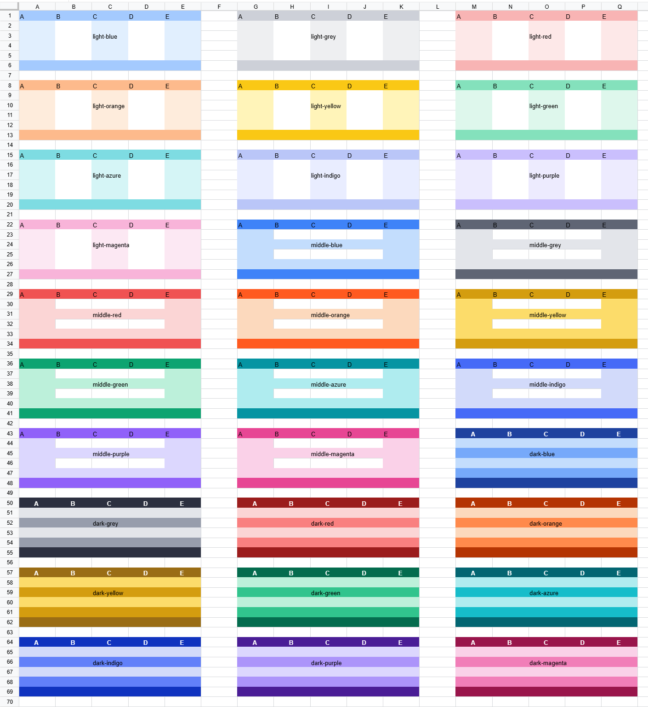

表の表示効果を豊かにするため、Univer では複数のプリセット範囲テーマを提供するとともに、ユーザーによるカスタムテーマ定義機能も開放しています。

## 組み込みテーマ

`Excel Table` の既定スタイルに類似した `default` という名称のテーマをデフォルトテーマとして提供しており、`theme` 属性で設定できます。さらに一連のカラーテーマも用意しており、現在サポートされているテーマ一覧は次の Facade API で取得できます。

```typescript
const fWorkbook = univerAPI.getActiveWorkbook()
const themes = fWorkbook.getRegisteredRangeThemes()
console.log(themes) // ['default', 'light-blue', 'light-grey', 'light-red', 'light-orange', 'light-yellow', 'light-green', 'light-azure', 'light-indigo', 'light-purple', 'light-magenta', 'middle-blue', 'middle-grey', 'middle-red', 'middle-orange', 'middle-yellow', 'middle-green', 'middle-azure', 'middle-indigo', 'middle-purple', 'middle-magenta', 'dark-blue', 'dark-grey', 'dark-red', 'dark-orange', 'dark-yellow', 'dark-green', 'dark-azure', 'dark-indigo', 'dark-purple', 'dark-magenta']
```



## テーマの設定

Univer では次の 2 つの方法でテーマを設定できます。
- スナップショット設定によるテーマ適用
- Facade API を介したテーマ適用

### スナップショットによるテーマ設定

Univer のテーマはスナップショット内リソースのキー `SHEET_RANGE_THEME_MODEL_PLUGIN` に保存されます。データ構造は以下の通りです。

```typescript
interface IRangeThemeRangeInfo {
  range: IRange
  unitId: string
  subUnitId: string
}

interface IRangeThemeStyleRule {
  rangeInfo: IRangeThemeRangeInfo
  themeName: string
}

interface ISheetRangeThemeModelJSON {
  // テーマ設定対象の範囲とテーマ情報を保持する JSON。キーは ID（重複禁止）、値は対応する範囲情報とテンプレート名。
  rangeThemeStyleRuleMap: Record<string, IRangeThemeStyleRule>
  // テーマ本体を保持する JSON。キーはテーマ名、値はテーマのシリアライズ済み JSON。
  rangeThemeStyleMapJson: Record<string, IRangeThemeStyleJSON>
}
```

### Facade API によるテーマ設定

テーマ設定には Facade API の使用を推奨し、その後 Univer が提供するシリアライズ／デシリアライズ手段でテーマ情報を保存してください。

以下はテーマ関連 API の例です。

```typescript
// 現在サポートされるテーマ一覧を取得
const fWorkbook = univerAPI.getActiveWorkbook()
const fWorksheet = fWorkbook.getActiveSheet()
const themes = fWorkbook.getRegisteredRangeThemes()

// A1:E20 に既定テーマを適用
const fRange = fWorksheet.getRange('A1:E20')
fRange.useThemeStyle('default') // 既定テーマを使用

// 現在使用中のテーマを取得
const currentTheme = fRange.getUsedThemeStyle()

// テーマスタイルをクリア
fRange.useThemeStyle(undefined)
fRange.removeThemeStyle(currentTheme)
```

## カスタムテーマ

組み込みテーマに加えて、Univer はカスタムテーマ作成機能も提供します。以下の API でテーマを定義できます。

```typescript
// カスタムテーマを作成
const fWorkbook = univerAPI.getActiveWorkbook()
const rangeThemeStyle = fWorkbook.createRangeThemeStyle('MyTheme', {
  secondRowStyle: {
    bg: {
      rgb: 'rgb(214,231,241)',
    },
  },
})
fWorkbook.registerRangeTheme(rangeThemeStyle)

// A1:E20 にカスタムテーマを適用
const fWorksheet = fWorkbook.getActiveSheet()
const fRange = fWorksheet.getRange('A1:E20')
// テーマが登録済みであることを確認。未登録の場合はエラーになります。
fRange.useThemeStyle('MyTheme')
```

登録済みテーマを削除する API も提供されています。

```typescript
const fWorkbook = univerAPI.getActiveWorkbook()
fWorkbook.unregisterRangeTheme('MyTheme')
```

### RangeThemeStyle クラス

Univer テーマのコアクラスである [`RangeThemeStyle`](https://github.com/dream-num/univer/blob/dev/packages/sheets/src/model/range-theme-util.ts#L110) は、テーマをカスタマイズするために以下のプロパティを提供します。

- `name`: テーマ名
- `wholeStyle`: 範囲全体のスタイル
- `firstRowStyle`: 第 1 行のスタイル
- `secondRowStyle`: 第 2 行のスタイル
- `headerRowStyle`: 見出し行のスタイル
- `lastRowStyle`: 最終行のスタイル
- `firstColumnStyle`: 第 1 列のスタイル
- `secondColumnStyle`: 第 2 列のスタイル
- `headerColumnStyle`: 見出し列のスタイル
- `lastColumnStyle`: 最終列のスタイル

`RangeThemeStyle` クラスの `getXXX`／`setXXX` メソッドで各スタイルを取得／設定できます。例：

```typescript
const rangeThemeStyle = new RangeThemeStyle('MyTheme')
rangeThemeStyle.setSecondRowStyle({
  bg: {
    rgb: 'rgb(214,231,241)',
  },
})
```

また、インスタンス生成時にオプションパラメータを渡して直接作成することもできます。

```typescript
/**
 * @constructor
 * @param {string} name 範囲テーマスタイルの名称（識別子として使用）
 * @param {IRangeThemeStyleJSON} [options] 初期化オプション
 */
class RangeThemeStyle {};

// 例：
const rangeThemeStyle = new RangeThemeStyle('MyTheme', {
  secondRowStyle: {
    bg: {
      rgb: 'rgb(214,231,241)',
    },
  },
})
```

複数のスタイルを定義した場合、適用優先順位は次の通りです。

`lastRowStyle` > `headerRowStyle` > `lastColumnStyle` > `headerColumnStyle` > `secondRowStyle` > `firstRowStyle` > `secondColumnStyle` > `firstColumnStyle` > `wholeStyle`

セル個別に定義されたスタイルと範囲テーマ内のスタイルが競合する場合（同一スタイル属性が両方で定義される場合）、セル側のスタイルが優先されます。例えばセルスタイルで背景色を `red`、範囲テーマで `blue` と定義した場合、最終的な背景色は `red` になります。
