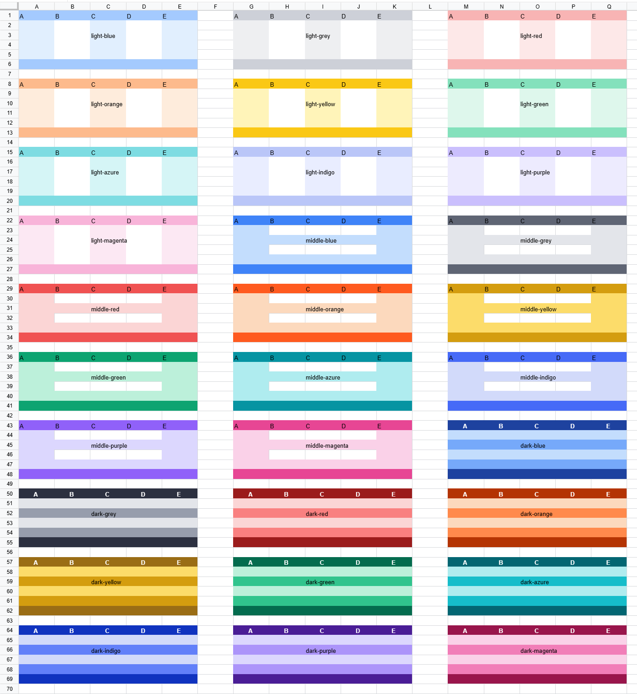

Чтобы сделать оформление таблиц более выразительным, Univer предлагает несколько готовых тем диапазонов, а также возможность создавать собственные темы.

## Встроенные темы

В качестве темы по умолчанию используется тема, похожая на `Excel Table default style`, с именем `default`. Её можно задать с помощью атрибута `theme`. Также доступен набор цветовых тем. Получить список поддерживаемых тем можно через следующий Facade API.

```typescript
const fWorkbook = univerAPI.getActiveWorkbook()
const themes = fWorkbook.getRegisteredRangeThemes()
console.log(themes) // ['default', 'light-blue', 'light-grey', 'light-red', 'light-orange', 'light-yellow', 'light-green', 'light-azure', 'light-indigo', 'light-purple', 'light-magenta', 'middle-blue', 'middle-grey', 'middle-red', 'middle-orange', 'middle-yellow', 'middle-green', 'middle-azure', 'middle-indigo', 'middle-purple', 'middle-magenta', 'dark-blue', 'dark-grey', 'dark-red', 'dark-orange', 'dark-yellow', 'dark-green', 'dark-azure', 'dark-indigo', 'dark-purple', 'dark-magenta']
```



## Настройка тем

В Univer тему можно задать двумя способами:
- через снимки состояния
- через Facade API

### Настройка тем через снимки состояния

Темы Univer хранятся в ресурсе снимка состояния с ключом `SHEET_RANGE_THEME_MODEL_PLUGIN`. Данные имеют следующую структуру:

```typescript
interface IRangeThemeRangeInfo {
  range: IRange
  unitId: string
  subUnitId: string
}

interface IRangeThemeStyleRule {
  rangeInfo: IRangeThemeRangeInfo
  themeName: string
}

interface ISheetRangeThemeModelJSON {
  // JSON storing the range and theme information for setting themes, the key is the id, please ensure it is not repeated, the value is the corresponding range information and template name.
  rangeThemeStyleRuleMap: Record<string, IRangeThemeStyleRule>
  // JSON storing the themes, the key is the theme name, and the value is the serialized JSON of the theme.
  rangeThemeStyleMapJson: Record<string, IRangeThemeStyleJSON>
}
```

### Настройка тем через Facade API

Рекомендуется настраивать темы через Facade API, а сведения о них сохранять с помощью предоставляемых Univer методов сериализации и десериализации.

Ниже приведены основные API для работы с темами:

```typescript
// Get the currently supported themes
const fWorkbook = univerAPI.getActiveWorkbook()
const fWorksheet = fWorkbook.getActiveSheet()
const themes = fWorkbook.getRegisteredRangeThemes()

// Set the default theme for A1:E20
const fRange = fWorksheet.getRange('A1:E20')
fRange.useThemeStyle('default') // 使用默认主题

// Get the currently used theme
const currentTheme = fRange.getUsedThemeStyle()

// Clear the theme style
fRange.useThemeStyle(undefined)
fRange.removeThemeStyle(currentTheme)
```

## Пользовательские темы

Помимо встроенных тем, Univer позволяет создавать пользовательские темы с помощью следующего API:

```typescript
// Create a custom theme
const fWorkbook = univerAPI.getActiveWorkbook()
const rangeThemeStyle = fWorkbook.createRangeThemeStyle('MyTheme', {
  secondRowStyle: {
    bg: {
      rgb: 'rgb(214,231,241)',
    },
  },
})
fWorkbook.registerRangeTheme(rangeThemeStyle)

// Use the custom theme for A1:E20
const fWorksheet = fWorkbook.getActiveSheet()
const fRange = fWorksheet.getRange('A1:E20')
// Make sure the theme is registered, otherwise it will throw an error.
fRange.useThemeStyle('MyTheme')
```

Также Univer предоставляет API для удаления зарегистрированных тем:

```typescript
const fWorkbook = univerAPI.getActiveWorkbook()
fWorkbook.unregisterRangeTheme('MyTheme')
```

### Класс `RangeThemeStyle`

Основной класс тем Univer, [`RangeThemeStyle`](https://github.com/dream-num/univer/blob/dev/packages/sheets/src/models/range-theme-util.ts#L110), предоставляет следующие свойства для настройки темы:

- `name`: название темы
- `wholeStyle`: стиль всего диапазона
- `firstRowStyle`: стиль первой строки
- `secondRowStyle`: стиль второй строки
- `headerRowStyle`: стиль строки заголовка
- `lastRowStyle`: стиль последней строки
- `firstColumnStyle`: стиль первого столбца
- `secondColumnStyle`: стиль второго столбца
- `headerColumnStyle`: стиль столбца заголовка
- `lastColumnStyle`: стиль последнего столбца

Для получения и задания стилей можно использовать методы `getXXX/setXXX` класса `RangeThemeStyle`, например:

```typescript
const rangeThemeStyle = new RangeThemeStyle('MyTheme')
rangeThemeStyle.setSecondRowStyle({
  bg: {
    rgb: 'rgb(214,231,241)',
  },
})
```

Кроме того, объект можно создать сразу с необязательными параметрами при инициализации:

```typescript
/**
 * @constructor
 * @param {string} name The name of the range theme style, it used to identify the range theme style.
 * @param {IRangeThemeStyleJSON} [options] The options to initialize the range theme style.
 */
class RangeThemeStyle {};

// For example:
const rangeThemeStyle = new RangeThemeStyle('MyTheme', {
  secondRowStyle: {
    bg: {
      rgb: 'rgb(214,231,241)',
    },
  },
})
```

Если определено несколько стилей, они применяются в следующем порядке приоритета:

`lastRowStyle` > `headerRowStyle` > `lastColumnStyle` > `headerColumnStyle` > `secondRowStyle` > `firstRowStyle` > `secondColumnStyle` > `firstColumnStyle` > `wholeStyle`

Если стиль ячейки конфликтует со стилем `range theme`, приоритет имеет стиль ячейки. Конфликт возникает, когда одно и то же свойство задано и в данных стиля ячейки, и в `range theme`. Например, если для фона ячейки указан цвет `red`, а в `range theme` — `blue`, фон ячейки будет иметь цвет `red`.
