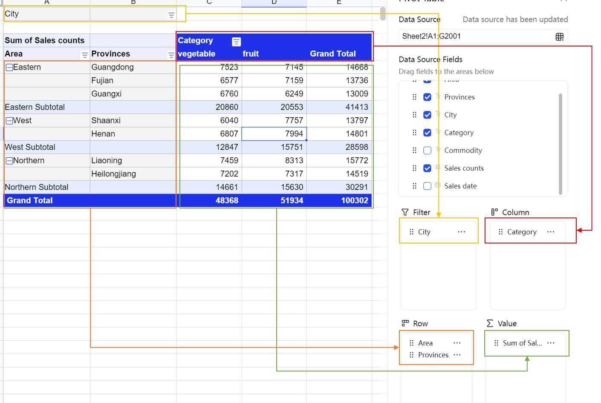

<MetaData
  lang="en-US"
  isPro
  meta={{
    preset: [{
      client: '@univerjs/preset-sheets-advanced',
      locale: '@univerjs/preset-sheets-advanced/locales/en-US',
      style: '@univerjs/preset-sheets-advanced/lib/index.css',
    }],
    plugins: [{
      client: '@univerjs-pro/sheets-pivot',
      facade: '@univerjs-pro/sheets-pivot/facade',
      locale: '@univerjs-pro/sheets-pivot/locale/en-US',
    }, {
      client: '@univerjs-pro/sheets-pivot-ui',
      locale: '@univerjs-pro/sheets-pivot-ui/locale/en-US',
      style: '@univerjs-pro/sheets-pivot-ui/lib/index.css',
    }],
    server: 'No',
  }}
/>

Pivot tables are a powerful data analysis tool that allows users to quickly summarize, analyze, and visualize large amounts of data. It supports various data operations and formatting options to help users better understand their data.

## Introduction

Data pivot tables are typically used in the following scenarios:

- Summarizing data: Pivot tables can help you quickly summarize data to better understand the overall situation.
- Analyzing data: Pivot tables can help you analyze data to identify patterns and relationships.
- Exploring data: Pivot tables can help you explore data to discover rules and trends.
- Visualizing data: Pivot tables can help you visualize data for better understanding.

A pivot table typically includes the following elements:

- Row labels: Row labels in a pivot table are used to group data.
- Column labels: Column labels in a pivot table are used to group data.
- Values: Values in a pivot table are used to summarize data.

In a pivot table, you can adjust row labels, column labels, and values as needed to better analyze data.



### Data Source

### Filtering

Data pivot tables support filtering on row labels and column labels, and also provide a filter field that does not participate in the main data classification and summary layout of the pivot table but can be used to filter data.

Data pivot tables support two filtering methods:
- Label filtering: Label filtering directly applies to the items of the current label dimension. For example, in the province dimension, we can filter out certain provinces.
- Value filtering: Value filtering requires specifying a value dimension, and then filters the summary results of the value field. For example, we can filter out data with sales less than 1000.

### Sorting

Data pivot table sorting only takes effect on row/column fields, and supports ascending and descending order. The sorting method uses the `localCompare` method. In the future, we will support more sorting methods, such as pinyin sorting.

Data pivot tables support two sorting methods:
- Label sorting: Label sorting directly applies to the items of the current label dimension. For example, in the province dimension, we can sort by province name.
- Value sorting: Value sorting requires specifying a value dimension, and then sorts the summary results of the value field. For example, we can sort by sales amount.

### Aggregation

Data pivot tables support 11 aggregation methods supported by Excel, including: sum, count, data count, average, maximum, minimum, factorial, standard deviation, variance, population standard deviation, and population variance.

Data pivot tables support multiple value dimensions and allow customization of the value dimension area (value position) and position (value index).

This is a complex layout logic, so we only support table view for now. In the future, we will support more views based on demand.

### Drill Down

Drill down refers to the ability for users to double-click on a cell in the value area of a pivot table to view detailed data corresponding to that cell. For example, users can click on a cell in the pivot table to see the detailed data behind it, allowing for better tracing of the original data.

### Grouping

Data pivot tables support grouping functionality, which is not yet supported in Univer Sheets.

Grouping can be done in the following ways:
- Date grouping: This involves grouping date data by year, month, day, etc.
- Numeric grouping: This involves grouping numeric data into specified ranges.
- Element grouping: This involves grouping element data according to specific rules.

## Preset Mode

The pivot table feature is included in the `@univerjs/preset-sheets-advanced` preset, which also includes other advanced features such as drawing and watermark.

### Installation

<Callout>
  The `UniverSheetsAdvancedPreset` preset from `@univerjs/preset-sheets-advanced` depends on the `UniverSheetsDrawingPreset` preset at runtime. Please install `@univerjs/preset-sheets-drawing` first.
</Callout>

```package-install
npm install @univerjs/preset-sheets-drawing @univerjs/preset-sheets-advanced
```

### Usage

```typescript
import { UniverSheetsAdvancedPreset } from '@univerjs/preset-sheets-advanced' // [!code ++]
import UniverPresetSheetsAdvancedEnUS from '@univerjs/preset-sheets-advanced/locales/en-US' // [!code ++]
import { UniverSheetsCorePreset } from '@univerjs/preset-sheets-core'
import UniverPresetSheetsCoreEnUS from '@univerjs/preset-sheets-core/locales/en-US'
import { UniverSheetsDrawingPreset } from '@univerjs/preset-sheets-drawing' // [!code ++]
import UniverPresetSheetsDrawingEnUS from '@univerjs/preset-sheets-drawing/locales/en-US' // [!code ++]
import { createUniver, LocaleType, mergeLocales } from '@univerjs/presets'

import '@univerjs/preset-sheets-core/lib/index.css'
import '@univerjs/preset-sheets-drawing/lib/index.css' // [!code ++]
import '@univerjs/preset-sheets-advanced/lib/index.css' // [!code ++]

const { univerAPI } = createUniver({
  locale: LocaleType.En_US,
  locales: {
    [LocaleType.En_US]: mergeLocales(
      UniverPresetSheetsCoreEnUS,
      UniverPresetSheetsDrawingEnUS, // [!code ++]
      UniverPresetSheetsAdvancedEnUS, // [!code ++]
    ),
  },
  presets: [
    UniverSheetsCorePreset(),
    UniverSheetsDrawingPreset(), // [!code ++]
    UniverSheetsAdvancedPreset(), // [!code ++]
  ],
})
```

If you have a commercial license for Univer, please refer to [Using License in Client](/guides/pro/license#in-preset-mode) for configuration.

{/* ### Presets and Configuration */}

## Plugin Mode

### Installation

```package-install
npm install @univerjs-pro/sheets-pivot @univerjs-pro/sheets-pivot-ui
```

### Usage

```typescript
import { UniverSheetsPivotTablePlugin } from '@univerjs-pro/sheets-pivot' // [!code ++]
import { UniverSheetsPivotTableUIPlugin } from '@univerjs-pro/sheets-pivot-ui' // [!code ++]
import SheetsPivotTableUIEnUS from '@univerjs-pro/sheets-pivot-ui/locale/en-US' // [!code ++]
import SheetsPivotTableEnUS from '@univerjs-pro/sheets-pivot/locale/en-US' // [!code ++]
import { LocaleType, mergeLocales, Univer } from '@univerjs/core'

import '@univerjs-pro/sheets-pivot-ui/lib/index.css' // [!code ++]

import '@univerjs-pro/sheets-pivot/facade' // [!code

const univer = new Univer({
  locale: LocaleType.En_US,
  locales: {
    [LocaleType.En_US]: mergeLocales(
      SheetsPivotTableEnUS, // [!code ++]
      SheetsPivotTableUIEnUS, // [!code ++]
    ),
  },
})
```

### Registering Plugins

The pivot table plugin supports flexible registration for different usage scenarios, providing two modes to adapt to various computational needs.

**Registering in the Main Process Only**

The pivot table plugin can be registered in the main process only. This mode is suitable for lightweight tasks, simple operations, and does not require additional configuration of the plugin config. Developers only need to import `UniverSheetsPivotTablePlugin`.

```typescript
univer.registerPlugin(UniverSheetsPivotTablePlugin)
univer.registerPlugin(UniverSheetsPivotTableUIPlugin)
```

**Registering in Both Main and Worker Processes**

For scenarios requiring high performance, the pivot table plugin supports registration in both the main and worker processes. This mode allows the plugin to leverage a multi-threaded architecture for efficient data distribution and computation processing, significantly reducing the computational burden on the main process and enhancing overall performance.

In this mode, the main process is primarily responsible for data distribution, synchronization, and rendering, while the worker process focuses on complex computational tasks. To implement this mode, fine-tuning configuration is required during registration through the config.

```typescript
// main process file
// Setting notExecuteFormula to true indicates that the main process does not perform calculations. It is only responsible for data distribution, synchronization, and rendering.
univer.registerPlugin(UniverSheetsPivotTablePlugin, { notExecuteFormula: true })
univer.registerPlugin(UniverSheetsPivotTableUIPlugin)

// web worker process file
// Setting notExecuteFormula to false indicates that the worker process performs the calculations.
univer.registerPlugin(UniverSheetsPivotTablePlugin, { notExecuteFormula: false })
```

If you have a commercial license for Univer, please refer to [Using License in Client](/guides/pro/license#in-plugin-mode) for configuration.

{/* ### Plugins and Configuration */}

## Facade API

Complete Facade API type definitions can be found in the [FacadeAPI](https://reference.univer.ai/en-US).

### Add a Pivot Table

[`FWorkbook.addPivotTable`](https://reference.univer.ai/en-US/classes/FWorkbook#addpivottable) method is used to add a pivot table, and it will return the `FPivotTable` instance if successful.

```typescript
// should ensure the sheet range A1:G9 is not empty
const fWorkbook = univerAPI.getActiveWorkbook()
const unitId = fWorkbook.getId()
const fSheet = fWorkbook.getActiveSheet()
const subUnitId = fSheet.getSheetId()
const sheetName = fSheet.getSheetName()
const sourceInfo = {
  unitId,
  subUnitId,
  sheetName,
  range: {
    startRow: 0,
    startColumn: 0,
    endRow: 8,
    endColumn: 6,
  },
}
const anchorCellInfo = {
  unitId,
  subUnitId,
  row: 20,
  col: 8,
}
const fPivotTable = await fWorkbook.addPivotTable(sourceInfo, univerAPI.Enum.PositionTypeEnum.Existing, anchorCellInfo)
const pivotTableId = fPivotTable.getPivotTableId()
// add flag to avoid add pivot fields multiple times
let hasAdded = false
// the addPivotTable is async, you can add pivot fields after the pivot table is added
univerAPI.addEvent(univerAPI.Event.PivotTableRendered, (params) => {
  if (!hasAdded && params.pivotTableId === pivotTableId) {
    fPivotTable.addField(1, univerAPI.Enum.PivotTableFiledAreaEnum.Row, 0)
    fPivotTable.addField(1, univerAPI.Enum.PivotTableFiledAreaEnum.Value, 0)
    hasAdded = true
  }
})
```

### Get a Pivot Table

[`FWorkbook.getPivotTableByCell`](https://reference.univer.ai/en-US/classes/FWorkbook#getpivottablebycell) method is used to get a pivot table instance by the anchor cell, and it will return the `FPivotTable` instance if the target cell is in a pivot table.

```typescript
const fWorkbook = univerAPI.getActiveWorkbook()
const unitId = fWorkbook.getId()
const fSheet = fWorkbook.getActiveSheet()
const subUnitId = fSheet.getSheetId()

// get pivot table by the cell in FWorkbook.
const fPivotTable = fWorkbook.getPivotTableByCell(unitId, subUnitId, 0, 8)

// get pivot table by the cell in FWorksheet.
const pivotTable2 = fSheet.getPivotTableByCell(0, 8)
```

There are some methods in the [`FPivotTable`](https://reference.univer.ai/en-US/classes/FPivotTable) instance, which can be used to operate the pivot table.

| Method                                                                                                                         | Description                                                                       |
| ------------------------------------------------------------------------------------------------------------------------------ | --------------------------------------------------------------------------------- |
| [remove](https://reference.univer.ai/@univerjs-pro/sheets-pivot/facade/classes/FPivotTable#remove)                             | remove the pivot table from instance                                              |
| [getConfig](https://reference.univer.ai/@univerjs-pro/sheets-pivot/facade/classes/FPivotTable#getconfig)                       | return the pivot table config, the source range info, anchor cell info and config |
| [addField](https://reference.univer.ai/@univerjs-pro/sheets-pivot/facade/classes/FPivotTable#addfield)                         | add a field to pivot table                                                        |
| [removeField](https://reference.univer.ai/@univerjs-pro/sheets-pivot/facade/classes/FPivotTable#removefield)                   | remove a field from pivot table                                                   |
| [updateFieldPosition](https://reference.univer.ai/@univerjs-pro/sheets-pivot/facade/classes/FPivotTable#updatefieldposition)   | update the field position in pivot table                                          |
| [updateValuePosition](https://reference.univer.ai/@univerjs-pro/sheets-pivot/facade/classes/FPivotTable#updatevalueposition)   | control the ∑Value position                                                       |
| [setSubtotalType](https://reference.univer.ai/@univerjs-pro/sheets-pivot/facade/classes/FPivotTable#setsubtotaltype)           | set the subtotal type of the field                                                |
| [setLabelSort](https://reference.univer.ai/@univerjs-pro/sheets-pivot/facade/classes/FPivotTable#setlabelsort)                 | set the label sort of the field                                                   |
| [setLabelManualFilter](https://reference.univer.ai/@univerjs-pro/sheets-pivot/facade/classes/FPivotTable#setlabelmanualfilter) | set the label filter of the field                                                 |
| [renameField](https://reference.univer.ai/@univerjs-pro/sheets-pivot/facade/classes/FPivotTable#renamefield)                   | rename the field                                                                  |
| [setValueFilter](https://reference.univer.ai/@univerjs-pro/sheets-pivot/facade/classes/FPivotTable#setValueFilter)             | set value filter                                                                  |
| [reset](https://reference.univer.ai/@univerjs-pro/sheets-pivot/facade/classes/FPivotTable#reset)                               | reset the pivot table fields                                                      |
| [setFieldsConfig](https://reference.univer.ai/@univerjs-pro/sheets-pivot/facade/classes/FPivotTable#setfieldsconfig)           | set the pivot table fields config                                                 |
| [getValueFilters](https://reference.univer.ai/@univerjs-pro/sheets-pivot/facade/classes/FPivotTable#getvaluefilters)           | get all value filters of the pivot table                                          |

```typescript
class FPivotTable {
/**
 * @description Get the pivot table config by the pivot table id.
 * @typedef PivotTableConfig
 * @property {TargetInfo} targetCellInfo  The target cell info of the pivot table.
 * @property {SourceInfo} sourceRangeInfo The source data range info of the pivot table.
 * @property {boolean} isEmpty The pivot table is empty or not.
 * @property {object} fieldsConfig The snapshot of the pivot table fields config.
 * @returns {PivotTableConfig|undefined} The pivot table config or undefined.
 */
  getConfig(): IPivotTableConfig
  /**
   * @description Remove a pivot table from the workbook by pivot table id
   */
  async remove(): void
  /**
   *@description Add a pivot field to the pivot table.
   * @param {string|number} dataFieldIdOrIndex The data field id.
   * @param {PivotTableFiledAreaEnum} fieldArea The area of the field.
   * @param {number} index The index of the field in the target area.
   * @returns {boolean} Whether the pivot field is added successfully.
   */
  async addField(dataFieldIdOrIndex: string | number, fieldArea: PivotTableFiledAreaEnum, index: number): Promise<boolean>
  /**
   * @description Remove a pivot field from the pivot table
   * @param {string[]} fieldIds The deleted field ids.
   * @returns {boolean} Whether the pivot field is removed successfully.
   */
  async removeField(fieldIds: string[]): Promise<boolean>
  /**
   * @description Update the pivot table field position.
   * @param {string} fieldId - The moved field id.
   * @param {PivotTableFiledAreaEnum} area - The target area of the field.
   * @param {number} index - The target index of the field, if the index is bigger than the field count in the target area, the field will be moved to the last, if the index is smaller than 0, the field will be moved to the first.
   * @returns {boolean} Whether the pivot field is moved successfully.
   */
  async updateFieldPosition(fieldId: string, area: PivotTableFiledAreaEnum, index: number): Promise<boolean>
  /**
   * @description If there are multiple value fields in the pivot table, you can update the position of the value field, which only can be position in row or column.
   * @param {PivotTableValuePositionEnum} position - The position of the value field.
   * @param {number} index - The index of the value field.
   * @returns {boolean} Whether the pivot value field is moved successfully.
   */
  async updateValuePosition(position: PivotTableValuePositionEnum, index: number): Promise<boolean>
  /**
   * @description Set the pivot table subtotal type for value field, it only works for the value field.
   * @param {string} fieldId - The field id.
   * @param {PivotSubtotalTypeEnum} subtotalType - The subtotal type of the field.
   * @returns {boolean} Whether the pivot table subtotal type is set successfully.
   */
  async setSubtotalType(fieldId: string, subtotalType: PivotSubtotalTypeEnum): Promise<boolean>
  /**
   * @description Set the pivot table sort info.
   * @param {string} tableFieldId - The field id of the sort.
   * @param {PivotTableSortInfo} info - The sort info.
   * @typedef PivotTableSortInfo
   * @property {PivotDataFieldSortOperatorEnum} type The sort operator of the field items.
   * @returns {boolean} Whether the pivot table sort info is set successfully.
   */
  async setLabelSort(tableFieldId: string, info: IPivotTableSortInfo): Promise<boolean>
  /**
   * @description Set the pivot table filter.
   * @param {string} tableFieldId - The field id of the filter.
   * @param {string[]} items - The items of the filter.
   * @returns {boolean} Whether the pivot table filter is set successfully.
   */
  async setLabelFilter(tableFieldId: string, items: string[], isAll?: boolean): Promise<boolean>
  /**
   * @description Rename the pivot table field.
   * @param {string} fieldId - The field id.
   * @param {string} name - The new name of the field.
   * @returns {boolean} Whether the pivot table field is renamed successfully.
   */
  async renameField(fieldId: string, name: string): Promise<boolean>
  /**
   * @description Set the pivot table value filter. A value filter is used to filter the data based on the value of a field.
   * @param {string} fieldId - The field id of the filter. Only one value filer can be set for a field.
   * @param {Omit<IPivotTableValueFilter, 'type'>} filterInfo - The filter info. The undefined value will be removed from the old filter.
   * @typedef filterInfo
   * @property {valueGreaterThan} operator - The filter operator is used to compare the value of the field with the expected value.Currently, The following operators are supported: valueBetween, valueEqual, valueGreaterThan, valueGreaterThanOrEqual, valueLessThan, valueLessThanOrEqual,valueNotBetween,valueNotEqual.
   * @property {number} expected - The expected value.
   * @property {string} valueFieldId - The value field id.
   * @returns {boolean} Whether the pivot table value filter is set successfully.
   */
  async setValueFilter(fieldId: string, filterInfo: Omit<IPivotTableValueFilter, 'type'>): Promise<boolean>
  /**
   * @description Clear the fields by provided field area or clear all fields.
   * @param {PivotTableFiledAreaEnum} [resetArea] The area of the field to reset or undefined to reset all fields.
   * @returns {Promise<boolean>} Whether the pivot table fields are reset successfully.
   */
  reset(resetArea?: PivotTableFiledAreaEnum): Promise<boolean>
  /**
   * @description Set the pivot table fields config.It will add fields to the pivot table from provided config.Before setting the fields config, you should ensure the pivot table is empty to avoid the conflict.
   * @param {IPivotTableConfig['fieldsConfig']} config The pivot table fields config.
   * @returns {Promise<boolean>} Whether the pivot table fields config is set successfully.
   */
  setFieldsConfig(config: IPivotTableConfig['fieldsConfig']): Promise<boolean>
  /**
   * Get all value filters of the pivot table. In pivot table, the value filter must be applied in order.So the order of the value filter is important.
   * @returns {IValueFilterInfoItem[]} The value filter info list.
   */
  getValueFilters(): IValueFilterInfoItem[]
}
```

### Event Listeners

Complete event type definitions can be found in the [Events](https://reference.univer.ai/en-US/classes/FEventName).

`univerAPI.Event.BeforePivotTableAdd` event is triggered before adding a pivot table.

```typescript
const disposable = univerAPI.addEvent(univerAPI.Event.BeforePivotTableAdd, (params) => {
  const { positionType, targetCellInfo } = params
  if (positionType === univerAPI.Enum.PositionTypeEnum.Existing && targetCellInfo.sheetName === 'Sheet 1') {
    // Cancel the pivot table adding operation
    params.cancel = true
    console.log(`The pivot table can't be added to the sheet ${targetCellInfo.sheetName}`)
  }
})

// Remove the event listener, use `disposable.dispose()`
```

`univerAPI.Event.PivotTableAdded` event is triggered after adding a pivot table.

```typescript
const disposable = univerAPI.addEvent(univerAPI.Event.PivotTableAdded, (params) => {
  const { positionType, targetCellInfo } = params
  if (positionType === univerAPI.Enum.PositionTypeEnum.Existing) {
    console.log('A pivot table created in an existing sheet')
    console.log(`
      The target sheet name is ${targetCellInfo.sheetName},
      the target row is ${targetCellInfo.row}, the target column is ${targetCellInfo.column}
    `)
  } else {
    console.log('A pivot table created in a new sheet')
  }
})

// Remove the event listener, use `disposable.dispose()`
```

`univerAPI.Event.BeforePivotTableMove` event is triggered before moving a pivot table.

```typescript
const disposable = univerAPI.addEvent(univerAPI.Event.BeforePivotTableMove, (params) => {
  const { pivotTableId, targetCellInfo } = params
  if (pivotTableId === 'pivotTable1' && targetCellInfo.sheetName === 'Sheet 1') {
    // Cancel the move pivot table operation
    params.cancel = true
    console.log(`The pivot table can't be moved to the sheet ${targetCellInfo.sheetName}`)
  }
})

// Remove the event listener, use `disposable.dispose()`
```

`univerAPI.Event.PivotTableMoved` event is triggered after moving a pivot table.

```typescript
const disposable = univerAPI.addEvent(univerAPI.Event.PivotTableMoved, (params) => {
  const { pivotTableId, targetCellInfo, originTargetInfo } = params
  if (pivotTableId === 'pivotTable1') {
    console.log(`
      The pivot table moved from row: ${originTargetInfo.row} & column: ${originTargetInfo.column}
      to the sheet ${targetCellInfo.sheetName} row: ${targetCellInfo.row} & column: ${targetCellInfo.column}
    `)
  }
})

// Remove the event listener, use `disposable.dispose()`
```

`univerAPI.Event.PivotTableRendered` event is triggered after rendering a pivot table.

```typescript
// import { unionPivotViewRange } from '@univerjs-pro/sheets-pivot';
const disposable = univerAPI.addEvent(univerAPI.Event.PivotTableRendered, (params) => {
  const { pivotTableId, rangeInfo } = params
  console.log(`The pivot table ${pivotTableId} has been rendered`)
  if (rangeInfo) {
    console.log(unionPivotViewRange(rangeInfo))
  }
})

// Remove the event listener, use `disposable.dispose()`
```

`univerAPI.Event.PivotTableRemoved` event is triggered after removing a pivot table.

```typescript
const disposable = univerAPI.addEvent(univerAPI.Event.PivotTableRemoved, (params) => {
  const { pivotTableId } = params
  console.log(`The pivot table ${pivotTableId} has been removed`)
})

// Remove the event listener, use `disposable.dispose()`
```

`univerAPI.Event.PivotTableFieldAdded` event is triggered after adding a field to a pivot table.

```typescript
const fWorkbook = univerAPI.getActiveWorkbook()
const disposable = univerAPI.addEvent(univerAPI.Event.PivotTableFieldAdded, (params) => {
  const { pivotTableId, fieldId, fieldArea, fieldIndex } = params
  const pivotTable = fWorkbook.getPivotTableById(pivotTableId)
  const fieldSetting = pivotTable.getFieldSetting('fieldId')
  console.log(fieldSetting)
})

// Remove the event listener, use `disposable.dispose()`
```

`univerAPI.Event.PivotTableFieldRemoved` event is triggered after removing a field from a pivot table.

```typescript
const fWorkbook = univerAPI.getActiveWorkbook()
const disposable = univerAPI.addEvent(univerAPI.Event.PivotTableFieldRemoved, (params) => {
  const { pivotTableId, fieldId } = params
  const pivotTable = fWorkbook.getPivotTableById(pivotTableId)
  const fieldSetting = pivotTable.getFieldSetting(fieldId)
  console.log(fieldSetting)
})

// Remove the event listener, use `disposable.dispose()`
```

`univerAPI.Event.PivotTableFieldMoved` event is triggered after moving a field in a pivot table.

```typescript
const fWorkbook = univerAPI.getActiveWorkbook()
const disposable = univerAPI.addEvent(univerAPI.Event.PivotTableFieldMoved, (params) => {
  const { pivotTableId, fieldId, fieldArea, fieldIndex } = params
  const pivotTable = fWorkbook.getPivotTableById(pivotTableId)
  const fieldSetting = pivotTable.getFieldSetting(fieldId)
  console.log(`The source name ${fieldSetting.sourceName} the display name ${fieldSetting.displayName}`)
})

// Remove the event listener, use `disposable.dispose()`
```

`univerAPI.Event.PivotTableFieldCollapseChanged` event is triggered after expanding/collapsing a dimension in a pivot table.

```typescript
const fWorkbook = univerAPI.getActiveWorkbook()
const disposable = univerAPI.addEvent(univerAPI.Event.PivotTableFieldCollapseChanged, (params) => {
  const { pivotTableId, fieldId, isCollapsed } = params
  const pivotTable = fWorkbook.getPivotTableById(pivotTableId)
  const fieldSetting = pivotTable.getFieldSetting(fieldId)
  console.log(`The source name ${fieldSetting.sourceName} the display name ${fieldSetting.displayName}`)
})

// Remove the event listener, use `disposable.dispose()`
```

`univerAPI.Event.PivotTableFieldFilterChanged` event is triggered after filtering a dimension in a pivot table.

```typescript
const fWorkbook = univerAPI.getActiveWorkbook()
const disposable = univerAPI.addEvent(univerAPI.Event.PivotTableFieldFilterChanged, (params) => {
  const { pivotTableId, fieldId, filter } = params
  const pivotTable = fWorkbook.getPivotTableById(pivotTableId)
  const fieldSetting = pivotTable.getFieldSetting(fieldId)
  console.log(`The Checklist filter value is ${fieldSetting.filterInfo.checklist}`)
})

// Remove the event listener, use `disposable.dispose()`
```

`univerAPI.Event.PivotTableFieldSortChanged` event is triggered after sorting a dimension in a pivot table.

```typescript
const fWorkbook = univerAPI.getActiveWorkbook()
const disposable = univerAPI.addEvent(univerAPI.Event.PivotTableFieldSortChanged, (params) => {
  const { pivotTableId, fieldId, sort } = params
  const pivotTable = fWorkbook.getPivotTableById(pivotTableId)
  const fieldSetting = pivotTable.getFieldSetting(fieldId)
  console.log(`The sort info is ${fieldSetting.sortInfo}`)
})

// Remove the event listener, use `disposable.dispose()`
```

`univerAPI.Event.PivotTableFieldSettingChanged` event is triggered after changing the setting of a dimension in a pivot table.

```typescript
const fWorkbook = univerAPI.getActiveWorkbook()
const disposable = univerAPI.addEvent(univerAPI.Event.PivotTableFieldSettingChanged, (params) => {
  const { pivotTableId, fieldId, setting } = params
  const pivotTable = fWorkbook.getPivotTableById(pivotTableId)
  const fieldSetting = pivotTable.getFieldSetting(fieldId)
  console.log(`The source name ${fieldSetting.sourceName} the display name ${fieldSetting.displayName}`)
})

// Remove the event listener, use `disposable.dispose()`
```

`univerAPI.Event.PivotTableValuePositionChanged` event is triggered after changing the position of a value in a pivot table.

```typescript
const fWorkbook = univerAPI.getActiveWorkbook()
const disposable = univerAPI.addEvent(univerAPI.Event.PivotTableValuePositionChanged, (params) => {
  const { pivotTableId, valueId, position } = params
  const pivotTable = fWorkbook.getPivotTableById(pivotTableId)
  const valueSetting = pivotTable.getValueSetting(valueId)
  console.log(`The source name ${valueSetting.sourceName} the display name ${valueSetting.displayName}`)
})

// Remove the event listener, use `disposable.dispose()`
```
